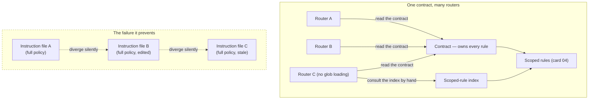

# One Contract, Many Routers

> Write the rules once, in one file that owns them; every other agent-instruction file is a thin adapter that points at it and adds only what its own vendor needs.

## What this pattern is

A repository worked on by more than one agent accumulates one instruction file per
vendor. Each vendor looks for its own filename and ignores the others. The naive
response is to write the rules in each file, which produces three or four copies of
the same policy that drift apart within a month.

The pattern separates two things that look alike:

- **The contract** — one file that owns every rule, convention, schema and
  procedure. It is the only place a rule is ever stated.
- **The routers** — one small file per vendor. A router says *where the contract
  is*, *how to invoke procedures in this particular tool*, and nothing else. It
  restates no policy.

The test is mechanical: delete any router and no rule is lost. Delete the contract
and the repository has no rules at all.

## Why it exists

Duplicated instructions do not stay duplicated — they diverge. One file gets a new
convention, the others do not, and the agents now disagree about the standard. The
disagreement is invisible because no human reads four instruction files side by
side, and each agent behaves consistently with the file it read.

The failure is worse than an ordinary stale document, because instructions are
executed rather than consulted. A stale rule does not sit inert; it actively
produces work in the wrong shape, confidently, until someone notices the output is
inconsistent between tools.

**Without it:** two agents follow contradictory conventions in the same repository,
each correctly following the file it was given, and the inconsistency surfaces as
review churn nobody can attribute.

## Where it belongs

```
          ┌──────────────────────────────┐
          │  THE CONTRACT                │  ← owns every rule
          │  schema, conventions,        │
          │  procedures, prohibitions    │
          └───────▲──────▲──────▲────────┘
                  │      │      │  "read that file"
          ┌───────┴┐ ┌───┴───┐ ┌┴────────┐
          │router A│ │router B│ │router C│  ← vendor adapters, no policy
          └────────┘ └───────┘ └─────────┘
                  │      │      │
              scoped rules loaded on demand (card 04)
```

## How it works

1. **Name the owner.** One file is declared canonical. Every other instruction file
   opens by naming it and instructing the agent to read it as the source of truth.

2. **Give routers exactly three jobs.** A router states where the contract is, how
   this vendor invokes procedures (slash commands, explicit file reads, chat
   directives — they differ), and which mechanics are unique to it. Everything else
   is a pointer.

3. **Use stubs for namespace compatibility.** Where a tool requires a file at a
   specific path that duplicates something already owned elsewhere, write a stub
   that names the canonical source and says outright that it must not be
   maintained. The source system's command directory does exactly this: two command
   files contain nothing but a pointer and the sentence *"this stub exists only for
   namespace compatibility — do not maintain content here."*

4. **Account for routers that cannot load rules dynamically.** Some agents support
   glob-triggered rule loading (card 04) and some do not. For the ones that do not,
   the router must point at an index of the scoped rules and instruct the agent to
   read the matching one by hand. This makes the index load-bearing rather than
   decorative: a rule missing from the index is invisible to every agent that lacks
   automatic loading.

5. **State the size limits that differ per vendor.** Routers face different context
   budgets and different truncation behavior. The limit belongs in the router,
   because it is a property of the vendor, not of the repository.

6. **Make the duplication check part of the routine.** Because the failure is
   silent, something has to grep for restated policy across routers. In the source
   system this was never automated, which is why this card is `partial`.

## What it depends on

| Dependency | Why it is needed | What happens if absent |
| --- | --- | --- |
| A single declared canonical file | Without an owner, every file is equally authoritative | Four files, four opinions, no tiebreaker |
| Routers written as adapters, not summaries | A summary is a copy, and copies drift | The pattern degrades into the duplication it was meant to prevent |
| An index of scoped rules | Agents without glob loading need a manual path to them | Rules load for one agent and silently never load for the others |
| A consistency check | The failure mode is invisible by construction | Drift is discovered by accident, months later (card 05) |

## How it interacts with other patterns

| Pattern | Relationship |
| --- | --- |
| [04 Path-Scoped Rule Loading](04-path-scoped-rule-loading.md) | The contract holds what is always true; scoped rules hold what is true only for certain files. Together they are a two-tier instruction system |
| [05 Instruction Provenance and Drift](05-instruction-provenance-and-drift.md) | The failure this card prevents, observed in a system that did not apply it |
| [07 Capability Taxonomy](07-capability-taxonomy.md) | Procedures named by routers are commands; the taxonomy decides what becomes one |
| [20 Repository Projection Pipeline](20-repository-projection-pipeline.md) | Generates the reference documents the contract points at |

## Constraints and trade-offs

- **Indirection costs a read.** An agent must load the router, then the contract,
  before doing anything. On a small repository the duplication would have been
  cheaper and no worse.
- **The contract becomes a bottleneck.** Every rule lands in one file, so it grows
  monotonically — which is precisely the pressure that produces card 04. The two
  patterns are not independent; adopting this one commits you to the other.
- **Routers tempt authors.** A router is the natural place to write "and by the way,
  always do X", because it is the file open at the time. Resisting that is a
  discipline nothing enforces.
- **Vendor mechanics genuinely do differ**, so routers cannot be identical
  boilerplate, and a reader cannot verify correctness by diffing them.

## Failure modes

| Failure | Symptom | Root cause |
| --- | --- | --- |
| Policy restated in a router | Two files state the same rule in different words; changing one leaves the other | An author edited the file that happened to be open |
| Orphaned router | A vendor's instruction file describes a project structure that no longer exists | The contract moved; routers were not updated because nothing links them |
| Index omission | A rule exists and loads for one agent but never for another | The scoped-rule index was not updated when the rule was added |
| Stub maintained | A namespace stub accumulates real content and quietly becomes a second source | The "do not maintain" instruction was a comment, not a check |
| Contract sprawl | The canonical file grows past what any agent reliably attends to | No scoped-rule tier to offload into (card 04) |

## Diagram



## How to validate an implementation

- [ ] Exactly one file is declared canonical, and every other instruction file names it in its opening lines.
- [ ] Deleting any router loses no rule. Check by grepping each router for imperative policy language.
- [ ] No rule text appears in two files. A grep for a distinctive phrase from the contract returns one hit.
- [ ] Every namespace stub says it is a stub, names its canonical source, and forbids maintenance.
- [ ] The scoped-rule index lists every scoped rule that exists on disk, and every glob in it matches at least one real file.
- [ ] Each router states its own vendor's invocation mechanics and context limit, and nothing else.

## How it evolves

**At one agent**, the pattern is unnecessary — there is one file and it owns
everything. **At two**, it starts paying immediately, and the cost of retrofitting
is already higher than adopting it up front. **At four**, the index becomes the
most important file in the instruction layer, because it is the only mechanism
reaching agents without automatic rule loading.

The pattern strains when vendors diverge enough that routers carry substantial
unique behavior rather than pointers. At that point the honest move is to admit the
routers are not adapters but separate integrations, and to give each one an owner.

## Skeleton

Minimal prototype in [`../skeletons/01-one-contract-many-routers/`](../skeletons/01-one-contract-many-routers/):
a contract, three routers including one without glob loading, a namespace stub, and
a stdlib checker that greps routers for restated policy.

## Provenance

Partially instanced in the source system. The memory subsystem had a clean
contract: a single schema document owned the categories, the article format, the
index format and the compilation rules, and the compiler read that file into its
prompt at run time rather than restating it — the strongest possible form of the
pattern, where the contract is executed rather than merely referenced. The command
layer used namespace stubs correctly, each naming its canonical source and
forbidding local maintenance.

**Abandoned at the top level, precisely:** the kit had no root contract at all.
Instructions lived in a vendor-specific directory with no canonical file above
them, and the rules directory that should have held shared conventions instead
held five files imported from an unrelated project. There was no index of scoped
rules, no consistency check, and consequently no mechanism that could have
detected either problem. That outcome is card 05.
