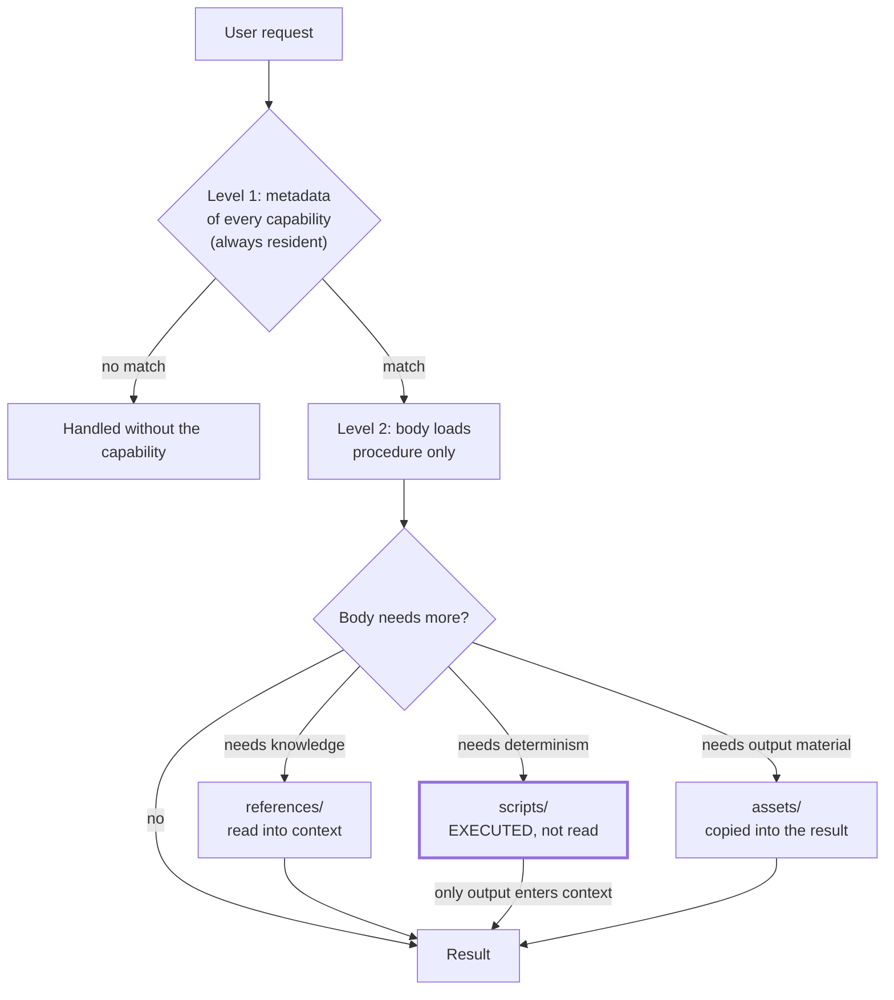

# Progressive Disclosure

> Split a capability into three loading levels so that context cost scales with what is actually relevant, not with how much you have installed.

## What this pattern is

An agent's context window is a shared resource. Everything installed competes for
it with the system prompt, the conversation, and the user's actual request. A
capability that loads entirely whenever it exists makes every other capability more
expensive, whether or not it is used.

Progressive disclosure structures each capability into three levels with different
loading rules:

| Level | What it holds | When it loads | Budget |
| --- | --- | --- | --- |
| 1. Metadata | Name and routing description | Always resident | ~100 words |
| 2. Body | Procedural instructions | Only when the capability triggers | under ~5k words |
| 3. Resources | References, scripts, assets | Only when the body calls for them | effectively unbounded |

Level 3 is unbounded for a reason worth stating: a script can be *executed* without
being read into context at all. Its cost is its output, not its source.

## Why it exists

The naive alternative is one large instruction file holding everything. It fails in
two distinct ways, and the second is worse than the first.

The obvious failure is cost: loading database conventions while editing a
stylesheet wastes tokens on every request. The subtler failure is attentional. Past
a certain length, a model stops reliably honoring instructions buried in the middle
of a long document — a rule can be present, correct, and ignored. The author then
adds emphasis, which lengthens the document, which worsens the problem.

**Without it:** instructions are present but not obeyed, and the natural corrective
instinct — write more, emphasize harder — makes it worse.

## Where it belongs

```
   ALWAYS RESIDENT   ┌───────────────────────────┐
                     │ L1: name + description    │  card 03 governs its content
                     └────────────┬──────────────┘
                          triggers │
   ON TRIGGER        ┌────────────▼──────────────┐
                     │ L2: SKILL body            │
                     └────────────┬──────────────┘
                     calls for    │
   ON DEMAND         ┌────────────▼──────────────┐
                     │ L3: references/ scripts/  │
                     │     assets/               │
                     └───────────────────────────┘
```

## How it works

1. **Put routing information in level 1 and nothing else.** The metadata's only job
   is to let the model decide whether to load level 2. Card 03 governs what that
   requires.

2. **Keep the body to procedural instruction.** Workflow, phases, decision points,
   validation gates. Reference material does not belong here: schemas, catalogs,
   long tables and background all move to level 3.

3. **Split level 3 by how the file is used, not by topic.** The source system's
   convention distinguishes three kinds:
   - `references/` — documents meant to be *read into context* when relevant.
   - `scripts/` — code meant to be *executed*, usually without being read.
   - `assets/` — files that appear *in the output*: templates, boilerplate, fonts.

   The distinction is operational. It tells the agent what to do with the file, not
   what the file is about.

4. **Forbid duplication across levels.** A fact lives at exactly one level. The
   source system's guidance is explicit: prefer the reference file unless the
   information is truly core, because duplication means the body carries weight it
   does not need and the two copies drift.

5. **Add grep hints for large references.** When a reference is long, the body
   names the search patterns that find the relevant section rather than instructing
   a full read. This keeps a 700-line reference cheap to consult.

6. **Prefer execution to reading.** The largest efficiency in the pattern is a
   script that runs without entering context. A deterministic check implemented as
   fifty lines of Python costs its output; the same check written as prose costs its
   full length on every trigger.

## What it depends on

| Dependency | Why it is needed | What happens if absent |
| --- | --- | --- |
| A routing contract at level 1 | Level 2 loads only if level 1 routed correctly | Perfect internal structure that never triggers (card 03) |
| A runtime that can execute level 3 without reading it | The unbounded budget depends on it | Level 3 collapses into level 2's cost |
| Discipline about what is "procedural" | The body/reference boundary is a judgment call | Bodies grow until they are the monolith the pattern replaced |
| A body size limit that is checked | Limits that are not measured are not limits | Gradual drift back to one big file |

## How it interacts with other patterns

| Pattern | Relationship |
| --- | --- |
| [03 Description-as-Router](03-description-as-router.md) | Governs what level 1 must contain; this card explains why level 1 exists at all |
| [04 Path-Scoped Rule Loading](04-path-scoped-rule-loading.md) | The same principle applied to rules, triggered by file path instead of by request |
| [06 Calibrated Degrees of Freedom](06-calibrated-degrees-of-freedom.md) | Decides whether a given piece of level 3 should be prose, pseudocode, or a script |
| [09 Scaffold, Validate, Package](09-scaffold-validate-package.md) | The validator enforces the level boundaries mechanically |
| [07 Capability Taxonomy](07-capability-taxonomy.md) | Applies this three-level structure to all three containers; only skills pay the always-resident cost |
| [14 Index-Guided Retrieval](14-index-guided-retrieval.md) | The same load-what-is-needed principle, applied to a knowledge corpus |

## Constraints and trade-offs

- **Level 1 is a standing tax.** Every installed capability's metadata is resident
  in every session forever. The pattern reduces the marginal cost of a capability
  but does not make it free, and at high counts level 1 alone becomes significant.
- **Three levels means three places to look.** A reader tracing behavior must
  follow the body into references and scripts. This is harder to review than one
  file, and the source system's largest skill spans a 700-line body plus five
  references plus three scripts.
- **The split is a guess made early.** Deciding what is procedural before the
  capability has been used is guesswork, and moving content between levels later is
  a real edit, not a refactor.
- **Scripts hide their logic.** A script that executes without being read is cheap
  and opaque. When it behaves unexpectedly, the agent must read it after all, and
  the saving is reversed at exactly the worst moment.

## Failure modes

| Failure | Symptom | Root cause |
| --- | --- | --- |
| Body bloat | Level 2 grows past the limit; instructions in its middle stop being honored | Reference material added to the body because it was convenient |
| Duplication across levels | A rule stated in both body and reference; the two disagree | No single-location discipline |
| Dead references | A reference file exists that no body path ever loads | Written speculatively, never wired in |
| Premature reference | Body defers something essential to a reference that the agent never loads | The body failed to state *when* to load it |
| Opaque script failure | Script produces wrong output; agent proceeds on it | Scripts execute without review and their failure modes are not documented in the body |
| Level-1 bloat | Metadata grows into a summary of the body | Author treating the description as documentation (card 03) |

## Diagram



## How to validate an implementation

- [ ] Level 1 contains routing information only, within its length budget.
- [ ] Level 2 is under the body limit, and the limit is checked mechanically rather than by eye.
- [ ] No fact appears at two levels; a grep for a distinctive phrase from any reference returns one hit.
- [ ] Every reference file is loaded by at least one path through the body. Unreferenced files are dead weight.
- [ ] The body says *when* to load each reference, not merely that it exists.
- [ ] Large references carry grep patterns in the body instead of instructions to read them whole.
- [ ] Scripts are executable as committed and their failure behavior is documented where the body calls them.

## How it evolves

**At one capability**, three levels is overhead and a single file is correct. **At
ten**, the pattern is what keeps the system usable, and the discipline holds
naturally because each capability is still small. **At forty**, level 1 is the
binding constraint: the resident metadata of everything installed is a fixed cost
on every request, and the next move is grouping — a capability that owns a domain
and dispatches within it, so the top-level routing table stays short.

The pattern stops paying for itself when bodies become so small that the indirection
outweighs the saving. That is a signal the capability should be merged into a
neighbour, not that the pattern is wrong.

## Skeleton

Minimal prototype in [`../skeletons/02-progressive-disclosure/`](../skeletons/02-progressive-disclosure/):
one capability at all three levels, a deliberately bloated variant for comparison,
and a stdlib checker reporting level sizes and unreferenced files.

## Provenance

Instanced throughout the source system's skill layer, which documented the
three-level model explicitly and followed it in every multi-file capability. The
largest skills carried 300–700 line bodies with four to six references and three to
nine scripts each; the scripts were genuinely executed rather than read, which is
where most of the saving came from.

The pattern is not original to the source system — it is documented in the skill
authoring guidance the kit vendored, and the kit's contribution was applying it
consistently and building a validator that enforced the body limit mechanically
(card 09). The observed weakness was the reverse of the usual one: several
capabilities had references so thorough that the body became a table of contents,
which is cheap but makes the capability hard to follow end to end.
