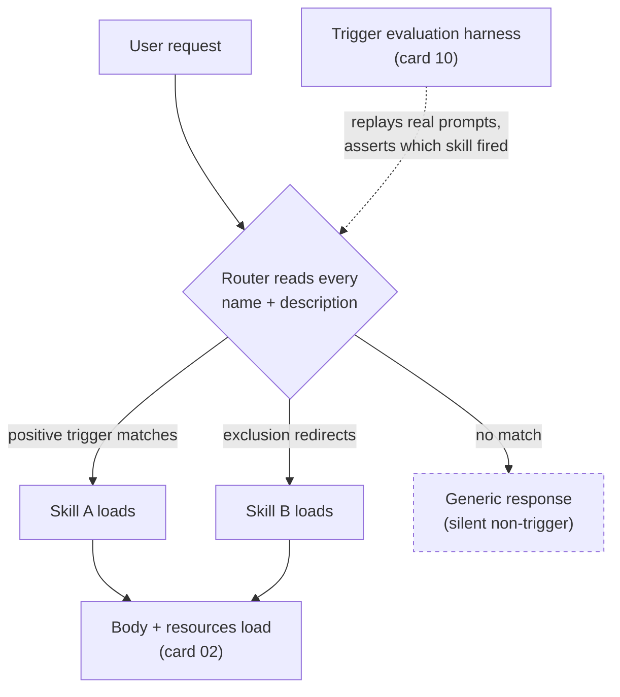

# Description-as-Router

> In a skill-based agent system, the `description` field is not documentation — it is the routing table, and it is the only part of the skill the model sees before deciding whether to load it.

## What this pattern is

Every skill carries two things at all times: a `name` and a `description`. The body,
the scripts, and the references are invisible until the skill fires. The model's
decision to load a skill is therefore made entirely from the description, against a
context containing every other skill's description at the same time.

The pattern treats that field as a **routing contract with three obligatory parts**:
a capability statement, a positive trigger list, and an explicit exclusion list that
names the sibling skill to use instead. A description written as marketing copy
("helps you work with Kubernetes") routes badly. A description written as a contract
routes correctly and — more importantly — *declines* correctly.

## Why it exists

Once a system has more than about five skills, their descriptions begin to overlap.
Two skills that both mention "Kubernetes troubleshooting" compete for the same
requests, and the model picks between them on wording accidents. The author cannot
see this happening: the skill that should have fired simply doesn't, and the session
proceeds with a generic answer that looks plausible.

The exclusion list is what makes the boundary machine-readable. When one skill says
*"Do NOT use for: tracing-backend-specific symptoms (use the tracing-backend doctor)"*,
it is not being polite — it is handing the router a disambiguation rule it could not
otherwise infer.

**Without it:** the wrong skill fires on ambiguous phrasing, or no skill fires at all,
and neither failure announces itself. The author discovers it weeks later when the
agent gives a generic answer to a question a skill was built for.

## Where it belongs

```
        user request
             │
  ┌──────────▼───────────┐
  │  ROUTING LAYER       │  ← name + description of every installed skill
  │  (this card)         │     always in context; ~100 words each
  └──────────┬───────────┘
             │ selects at most one
  ┌──────────▼───────────┐
  │  SKILL BODY          │  ← loaded only after selection (card 02)
  └──────────┬───────────┘
  ┌──────────▼───────────┐
  │  BUNDLED RESOURCES   │  ← loaded or executed on demand
  └──────────────────────┘
```

## How it works

1. **State the capability first, in the third person.** One or two sentences naming
   what the skill does and what it produces. The verb matters: *investigates*,
   *orchestrates*, *generates*, *diagnoses* — each implies a different output shape.

2. **Enumerate positive triggers as real user phrasings.** Not keywords — sentences
   a person would actually type. The observed convention is a literal `Triggers on:`
   list of five to eight quoted phrases, harvested from how the author actually asks.

3. **Enumerate exclusions, each naming the alternative.** A literal
   `Do NOT use for:` list. Every entry either names a sibling skill or states a
   category the skill must not claim. The most valuable exclusions are the
   near-misses — the neighbouring skill, not the obviously unrelated task.

4. **Disambiguate homonyms explicitly.** One skill in the source system diagnoses a
   distributed-tracing backend whose name is also a common word for a time-tracking
   application; its description says so outright. Homonym collisions are invisible
   until a user asks about the other meaning.

5. **Declare autonomy and invocation mode in the same field.** Descriptions in the
   source system state whether the skill runs autonomously, whether it is
   explicit-invocation-only, and whether it executes commands or only plans. That
   declaration sets the user's expectation *before* the skill loads.

6. **Test the routing empirically.** Because the contract is a prediction about model
   behavior, it is verified by running real prompts against the installed set and
   checking which skill fires — see card 10.

## What it depends on

| Dependency | Why it is needed | What happens if absent |
|---|---|---|
| A description budget (~1024 chars) | Forces the contract to be dense; every clause competes for space | Long prose descriptions dilute the trigger signal and read as boilerplate |
| Knowledge of sibling skills | Exclusions must name real alternatives | Exclusions become vague disclaimers that route nothing |
| A validator that checks the field mechanically | Length, person, and presence of the two lists | Contracts drift into prose as the set grows |
| A behavioral test harness (card 10) | Routing is a claim about model behavior, not a property of the text | Collisions are discovered by accident, in production |

## How it interacts with other patterns

| Pattern | Relationship |
|---|---|
| [02 Progressive Disclosure](02-progressive-disclosure.md) | Description-as-router is level 1 of the three-level loading system; this card explains what that level must contain |
| [07 Capability Taxonomy](07-capability-taxonomy.md) | A skill routes by description; a command routes by explicit name. Choosing between them is choosing which routing mechanism you want |
| [10 Behavioral Evaluation Harness](10-behavioral-evaluation-harness.md) | Provides the only real verification that a description routes as intended |
| [05 Instruction Provenance](05-instruction-provenance-and-drift.md) | A skill copied in from elsewhere arrives with a description written against *its* sibling set; its exclusions name skills you do not have |

## Constraints and trade-offs

- **The field is always resident.** Every installed skill's description occupies
  context in every session, whether or not it is relevant. Twenty skills is a
  permanent tax paid on every request. This is the direct cost of the routing table.
- **Density over readability.** The contract is optimized for a model's selection
  decision, not for a human browsing a catalog. It reads as a wall of clauses, and
  that is correct. Human-facing explanation belongs in the card, not the field.
- **Exclusions couple skills to each other.** Naming a sibling means renaming or
  removing that sibling silently invalidates the exclusion. The routing table has
  referential integrity that nothing enforces.
- **Trigger phrases encode one person's idiom.** Harvesting them from the author's
  own phrasing makes them accurate for that author and weaker for everyone else.

## Failure modes

| Failure | Symptom | Root cause |
|---|---|---|
| Trigger collision | Two skills claim the same request; selection looks arbitrary between sessions | Overlapping positive triggers with no mutual exclusion clause |
| Silent non-trigger | The agent answers generically; the user never learns a skill existed | Triggers written as keywords rather than as phrasings a user would type |
| Homonym capture | Skill fires on an unrelated domain that shares a product name | No negative clause for the other meaning |
| Stale exclusion | Exclusion points at a skill that was renamed or deleted | No referential check between descriptions |
| Imported contract | A skill brought in from another system excludes skills that do not exist here and fails to exclude the ones that do | Description was written against a different sibling set (card 05) |
| Scope creep in the field | Description grows to summarize the body | Author treats it as documentation rather than as a routing contract |

## Diagram



## How to validate an implementation

- [ ] Every description contains an explicit positive trigger list and an explicit exclusion list.
- [ ] Every exclusion entry names a real, currently installed alternative, or a category the skill must not claim.
- [ ] No two skills share a trigger phrase; if they overlap in domain, each names the other in its exclusions.
- [ ] Description is third person and within the length budget; a mechanical validator enforces both.
- [ ] Any product name in the description that is also a common word carries a negative clause for the other meaning.
- [ ] A trigger-accuracy run exists, with recorded pass rates per skill, and is re-run after any description edit.
- [ ] Deleting or renaming a skill triggers a grep for its name across all other descriptions.

## How it evolves

**At five skills**, descriptions can be written casually; collisions are rare and
obvious. **At fifteen**, the exclusion list becomes the load-bearing half of the
field, and adding a skill means editing its neighbours' descriptions too — the cost
of a new skill is no longer local. **At forty**, the always-resident routing table is
a significant standing context cost, and the flat namespace stops scaling: the system
needs either grouping (a router skill that owns a domain and dispatches within it) or
a retrieval step that loads candidate descriptions rather than all of them.

The signal that the pattern has stopped paying for itself: you can no longer write a
new skill's exclusion list without re-reading every existing description.

## Skeleton

Minimal prototype in [`../skeletons/03-description-as-router/`](../skeletons/03-description-as-router/):
two deliberately colliding skill stubs, the corrected pair, and a trigger-case file.

## Provenance

Instanced by roughly a dozen skills in the source system, all following the same
`Triggers on:` / `Do NOT use for:` shape, plus a trigger-evaluation script that
replays recorded prompts through the CLI and asserts which skill fired. The strongest
single instance is an infrastructure investigation skill whose exclusion list names
three sibling skills and two categories, and a tracing-backend skill that explicitly
excludes the unrelated application sharing its name. The pattern is not universal in
the source system: skills vendored from third parties carry descriptions in a
different shape, which is itself the evidence for card 05.
