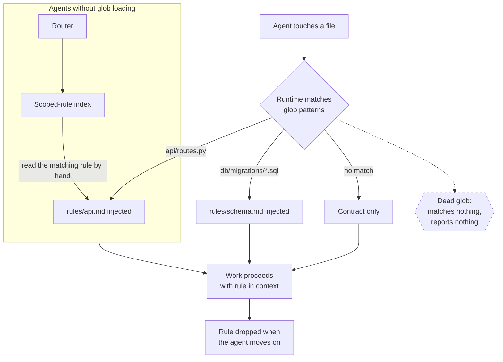

# Path-Scoped Rule Loading

> Attach each convention to the file globs it governs, so the agent receives the database rules only while touching the database and never while touching a stylesheet.

## What this pattern is

Progressive disclosure (card 02) loads capabilities based on the *request*. This
pattern applies the same idea to conventions, triggered by the *files being
touched*.

Each rule file declares, in its own frontmatter, the path globs it governs. When
the agent reads or modifies a matching file, that rule's content is injected for
the duration of the work and dropped afterwards. The always-on contract (card 01)
then holds only what is true everywhere, and everything domain-specific moves into
a scoped tier that costs nothing until it applies.

The result is a two-tier instruction system: **tier 1** is small and always
present; **tier 2** is large in aggregate and never present in aggregate.

## Why it exists

A single instruction file grows monotonically because every new convention has
exactly one place to go. Growth produces three distinct problems.

**Context bloat** is the cheapest of them: paying for migration conventions while
editing CSS. **Instruction ignorance** is worse — past a certain length a model
stops reliably prioritizing rules buried mid-document, so a rule can be present,
correct, and disobeyed. **Poor separation of concerns** is the human cost: a file
mixing frontend, backend and infrastructure guidance is one nobody maintains,
because no single person owns all of it.

The scoped tier fixes all three at once, and the mechanism is the same one that
makes it dangerous: the rule is invisible until its glob matches.

**Without it:** the contract grows until the agent honors its beginning and its end
and treats its middle as decoration.

## Where it belongs

```
   TIER 1  ┌────────────────────────────────────┐
           │ The contract — always loaded       │   card 01
           │ true everywhere, deliberately small│
           └─────────────────┬──────────────────┘
                             │
   TIER 2  ┌─────────────────▼──────────────────┐
           │ Scoped rules — loaded on glob match│   this card
           │  rules/api.md      paths: api/**   │
           │  rules/schema.md   paths: db/**    │
           └─────────────────┬──────────────────┘
                             │
           ┌─────────────────▼──────────────────┐
           │ The index — the manual path in     │   load-bearing
           │ for agents without glob loading    │
           └────────────────────────────────────┘
```

## How it works

1. **Declare the scope inside the rule.** Each rule file carries its own glob list
   in frontmatter. Co-locating the trigger with the content means moving the rule
   moves its scope, and there is no separate registry to fall out of sync.

2. **Keep each rule atomic.** One concern per file. Mixing test conventions with
   styling conventions in one file means both load whenever either applies, which
   reintroduces the problem at smaller scale. The source doctrine gives a working
   limit of 50–100 lines and treats exceeding it as a signal that the globs need to
   be more granular, not that the file needs to be longer.

3. **Write in declarative, unambiguous language.** MUST, NEVER, ALWAYS. A rule that
   loads for a few tool calls has no room for hedging — it needs to be actionable on
   first read, without context the agent may not have.

4. **Maintain an index of every scoped rule.** A table listing each file, the globs
   that trigger it, and what it covers. This exists for agents whose runtime has no
   glob-based loading: their router tells them to consult the index and read the
   matching rule by hand. That makes the index load-bearing — a rule missing from it
   is invisible to every agent lacking automatic loading, which is usually most of
   them.

5. **Verify every glob against the real tree.** A glob matching nothing is a rule
   that never loads and cannot announce its own uselessness. This check is the
   single highest-value maintenance action in the pattern, and its absence is how
   card 05 happens.

6. **Test for overlap.** Two globs matching the same file inject both rules
   simultaneously. That is fine when the rules are complementary and a real problem
   when they conflict, so overlapping scopes need their interaction stated
   deliberately.

## What it depends on

| Dependency | Why it is needed | What happens if absent |
| --- | --- | --- |
| A runtime that matches globs and injects on match | The whole trigger mechanism | Rules become documentation nobody reads |
| An index for agents without that runtime | Their only access path | Rules apply for one agent and silently not for others |
| Globs that match the real tree | A rule that never fires is worse than absent — it looks like coverage | Silent non-coverage, indistinguishable from compliance |
| Atomic rules | Loading is all-or-nothing per file | Irrelevant conventions ride along with relevant ones |
| A drift check | Repositories are restructured; globs are not | Card 05 |

## How it interacts with other patterns

| Pattern | Relationship |
| --- | --- |
| [01 One Contract, Many Routers](01-one-contract-many-routers.md) | This is tier 2 of that card's instruction system; the contract holds what is universally true |
| [02 Progressive Disclosure](02-progressive-disclosure.md) | Same principle, different trigger: request-triggered there, path-triggered here |
| [05 Instruction Provenance and Drift](05-instruction-provenance-and-drift.md) | The failure mode of this pattern, at full scale |
| [15 Structural Lint](15-structural-lint.md) | The kind of mechanical check that would catch dead globs |

## Constraints and trade-offs

- **Invisibility cuts both ways.** The benefit is that irrelevant rules stay out of
  context; the cost is that a broken rule produces no error. Nothing distinguishes
  "this rule correctly did not apply" from "this rule is dead."
- **The index duplicates the frontmatter.** Globs are stated in the rule *and* in
  the index, and the two can disagree. This is accepted duplication — it is the only
  way to serve agents without glob loading — but it is duplication, and card 01's
  no-restatement principle is being knowingly violated here.
- **Rules load without their surrounding context.** A rule arrives mid-task with no
  guarantee the agent has read anything else, so each must stand alone. That forces
  a terse, imperative style that reads badly to humans.
- **Granular globs multiply files.** Pushed to its conclusion the pattern yields
  many small files, and finding which one governs a given concern becomes its own
  navigation problem — solved, again, by the index.

## Failure modes

| Failure | Symptom | Root cause |
| --- | --- | --- |
| Dead glob | Rule never loads; the agent violates a documented convention with no warning | Repository restructured, or the rule was imported from a different tree (card 05) |
| Index omission | Rule loads for one agent, never for another | Index not updated when the rule was added; nothing checks |
| Conflicting overlap | Two rules match one file and contradict each other | Overlapping globs with no stated precedence |
| Rule bloat | A scoped rule grows to contract size and is always loaded in practice | Globs too broad; the file became a second contract |
| Fictional scope | Globs describe an idealized structure rather than the real one | Rule written from a template or another project |
| Unverifiable compliance | Nobody can say whether a rule is being followed | Rules are injected but no gate checks the output against them |

## Diagram



## How to validate an implementation

- [ ] Every rule file declares its globs in its own frontmatter.
- [ ] Every glob matches at least one file that exists right now. Automate this; it is the check that matters most.
- [ ] Every rule on disk appears in the index, and every index row points at a rule that exists.
- [ ] No rule exceeds the size limit; oversized rules are split by making their globs more granular.
- [ ] Overlapping globs are deliberate, and the interaction between the overlapping rules is stated.
- [ ] Rules are written imperatively and stand alone without assuming other context.
- [ ] Restructuring the repository triggers a glob re-verification as part of the same change.

## How it evolves

**At three rules**, the index is a courtesy and the globs are obviously correct.
**At eight**, the index is the primary interface and glob verification needs to be
mechanical, because nobody re-checks by hand. **At twenty**, the flat rule directory
needs grouping, and precedence between overlapping scopes has to be stated
explicitly rather than left to injection order.

The pattern degrades silently rather than loudly, so its real evolution requirement
is not scale but *change*: every repository restructuring invalidates some globs,
and without a check in that same change, the rule set decays into card 05 within a
few months.

## Skeleton

Minimal prototype in [`../skeletons/04-path-scoped-rule-loading/`](../skeletons/04-path-scoped-rule-loading/):
three scoped rules, an index, a deliberately dead glob, and a stdlib checker that
resolves every glob against the tree and reports non-matching ones.

## Provenance

The doctrine is instanced in the source system as a reference document in its
knowledge base, which states the problem (bloat, mid-document instruction
ignorance, separation of concerns), the mechanism, and the authoring guidance
quoted above — atomic rules, declarative language, a 50–100 line limit, and
explicit glob-overlap testing.

**Partially implemented, precisely:** the kit understood the pattern thoroughly and
did not apply it to itself. Its own rule directory held five files with no glob
frontmatter at all, governing a project the kit was not. There was no index, no
glob verification, and therefore no possibility of noticing. The pattern was
documented as knowledge and never became infrastructure — which is exactly the gap
card 05 describes, seen from the other side.
