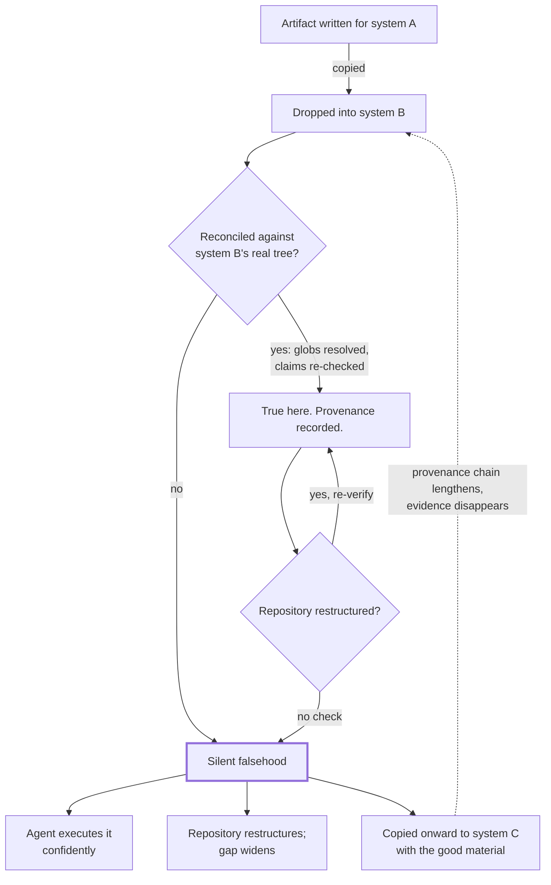

# Instruction Provenance and Drift

> Instructions copied from another repository describe a system you do not have, and because agents execute instructions rather than consult them, nothing about the failure looks like a failure.

## What this pattern is

This card documents a pattern the source system **failed to hold**. It is included
because the failure is more instructive than the success would have been, and
because it is the most common defect in agent-instruction layers that were
assembled rather than written.

Agent configurations spread by copying. A skill, a rule set, a subagent roster or a
review checklist that worked elsewhere gets dropped into a new repository, and
because it is plausible and well-written, it is never reconciled against the
repository it now governs. Over a few months the instruction layer accumulates
sediment: files that are internally coherent, externally false, and completely
silent about the difference.

The pattern, stated positively, is that **every instruction artifact must have
traceable provenance and a reconciliation step** — an answer to "where did this come
from, and what in it is true *here*."

## Why it exists

Ordinary documentation drift is annoying: a stale README wastes a reader's time and
is discovered the moment someone follows it. Instruction drift is different in kind
because of who the reader is.

An agent does not evaluate whether its instructions describe reality. It applies
them. A rule demanding that new modules carry test files under a directory that does
not exist does not raise an error — it produces work in the wrong shape, with
justification, indefinitely. A subagent roster describing nineteen specialists that
the repository never invokes does not announce its irrelevance; it sits in the
routing layer competing for selection.

The failure is silent by construction, and the artifacts that cause it are usually
the *best-written* files present, because they were authored by someone for a
system where they were true.

**Without it:** the instruction layer becomes archaeology — strata of imported
guidance, each plausible, none verified, all executed.

## Where it belongs

```
   SOURCE OF ARTIFACT          RECONCILIATION            RESULT
   ─────────────────           ──────────────            ──────
   written here          →     n/a                  →    true
   imported, reconciled  →     globs re-verified,    →    true
                               claims re-checked
   imported, unreconciled →    none                  →    SILENT FALSEHOOD
   generated, not re-run  →    none                  →    decays to the above
```

## How it works

The mechanism of the failure, step by step — this is what to watch for:

1. **An artifact is copied in** because it is good and adjacent. A rule set from a
   previous project, a vendored subagent roster, a review checklist.

2. **It is not reconciled**, because reconciling is tedious and the artifact reads
   as authoritative. Nothing forces the question "which of these globs match?"

3. **It becomes load-bearing by position.** Being in the rules directory *is* the
   claim of applicability. No further endorsement is required or recorded.

4. **It decays asymmetrically.** The artifact does not change. The repository does.
   Every restructure widens the gap, and the gap is only visible to someone
   comparing the artifact against the tree — which no routine does.

5. **It is inherited again.** The next repository copies the directory wholesale,
   including the foreign material, and the provenance chain lengthens while the
   evidence for it disappears.

The corrective, applied positively:

6. **Record provenance at import time.** Where it came from, what it governed
   there, and what was checked here. One line in the file itself.

7. **Reconcile mechanically, not by reading.** Resolve every path, glob and command
   the artifact names against the current tree. Unresolvable references are the
   measurement; reading the file for plausibility is not, because plausibility is
   what got it accepted in the first place.

8. **Re-run reconciliation on restructure**, in the same change that restructures.

## What it depends on

| Dependency | Why it is needed | What happens if absent |
| --- | --- | --- |
| A provenance note per artifact | Distinguishes "written here" from "arrived here" | Every file looks equally endorsed |
| Mechanical path resolution | Plausibility cannot be assessed by reading | Drift is found by accident, if ever |
| A trigger tied to restructuring | The gap widens on repository change, not on time | Checks run once at import and never again |
| Willingness to delete | The correct action for foreign material is usually removal | Unreconciled artifacts are kept "just in case" and remain authoritative |

## How it interacts with other patterns

| Pattern | Relationship |
| --- | --- |
| [01 One Contract, Many Routers](01-one-contract-many-routers.md) | The absence of a canonical contract is what let foreign rules occupy the vacancy |
| [04 Path-Scoped Rule Loading](04-path-scoped-rule-loading.md) | Provides the mechanical check — glob resolution — that detects this failure |
| [15 Structural Lint](15-structural-lint.md) | The same class of cheap mechanical validation, applied to a knowledge base |
| [10 Behavioral Evaluation Harness](10-behavioral-evaluation-harness.md) | Imported skills arrive with routing contracts written against a different sibling set; only behavioral testing catches it |
| [20 Repository Projection Pipeline](20-repository-projection-pipeline.md) | Its third stage exists to prevent the failure this card documents |

## Constraints and trade-offs

- **Copying is genuinely good.** This pattern must not be read as an argument
  against reuse — reuse is how a kit becomes capable quickly. The cost is a
  reconciliation step, and the mistake is skipping it, not the copying.
- **Reconciliation is unrewarding work.** It produces no new capability, and its
  success is invisible. It therefore never happens unless it is mechanical and
  attached to something that does happen anyway.
- **Provenance notes age too.** A note saying "reconciled at import" is itself a
  claim with a date, and it is worth less every month after that date.
- **Deletion feels lossy.** Removing a well-written imported rule set looks like
  discarding value, which is why the material persists. The value was in the other
  repository, and did not travel.

## Failure modes

| Failure | Symptom | Root cause |
| --- | --- | --- |
| Foreign rule set | Rules govern module names, test layouts and vision documents that do not exist here | Imported wholesale; position mistaken for endorsement |
| Foreign review artifact | Review reports on a system unrelated to the repository sit among its own | Copied as examples, never marked as examples |
| Vendored roster | A large set of uniform subagent definitions, none ever invoked | Bulk import; no per-item justification |
| Dead glob | A scoped rule silently never loads | Globs describe the tree of origin (card 04) |
| Second-order inheritance | A successor repository inherits the foreign material along with the good material | Directory copied wholesale; provenance never recorded |
| Fictional CI | A pipeline runs commands for a stack the repository does not use | Workflow imported with the instruction layer |

## Diagram



## How to validate an implementation

- [ ] Every instruction artifact states where it came from and what was checked when it arrived.
- [ ] Every path, glob, filename and command named in an instruction file resolves against the current tree. Automate this and report a percentage.
- [ ] Every rule in the rules directory governs something this repository actually contains.
- [ ] Every subagent, skill and command has a reason to exist here, stated per item and not per directory.
- [ ] Example artifacts from other systems live in an `examples/` directory and are labelled as examples, never in the authoritative location.
- [ ] Repository restructuring triggers re-verification in the same change.
- [ ] CI runs commands appropriate to this repository's actual stack.

## How it evolves

This pattern does not scale up; it accumulates. A kit that copies in one rule set
per project reaches the point where most of its instruction layer is inherited
within a year, and the proportion that is true declines monotonically because
nothing in the system pushes back.

There is no gradual fix. The realistic intervention is periodic and destructive:
resolve everything mechanically, delete what does not resolve, and rewrite what
remains for the repository it actually governs. That is what the successor to the
source system did — an audit found eight inherited rule files carrying 36 dead globs
between them, with roughly three quarters of all cited paths unresolvable, and the
entire set was rebuilt from scratch rather than repaired.

## Skeleton

Minimal prototype in [`../skeletons/05-instruction-provenance-and-drift/`](../skeletons/05-instruction-provenance-and-drift/):
a small rule set containing genuine and imported files, and a stdlib auditor that
resolves every cited path and glob and reports a per-file truth percentage.

## Provenance

**This card documents an abandonment, and the evidence is the source kit itself.**

Its rules directory held five files, all governing a Python command-line tool for
distributing editor configurations — module scopes, a package directory, a testing
framework, and a product-vision document that existed in that project and not in
this one. Its reviews directory held three substantial reports assessing an
unrelated service. Its subagent directory held nineteen uniform role definitions,
around 285 lines each, evidently vendored as a set; nothing in the kit invoked any
of them. None of this material was marked as imported, and there was no contract
above it (card 01) to contradict it.

The kit was not careless — it contained a well-written internal document explaining
path-scoped rules and the reason they matter (card 04), and it built mechanical
validators for its own skills (cards 09 and 10). It understood the principle and
never turned it on the instruction layer, because nothing made that layer's
correctness measurable.

The successor repository inherited the same directory and the same problem, and the
audit quantified it before the set was rebuilt. That audit is the only reason this
card can state numbers rather than impressions, and it is the argument for making
reconciliation mechanical: the failure was three months old and entirely invisible
until something resolved the paths.
