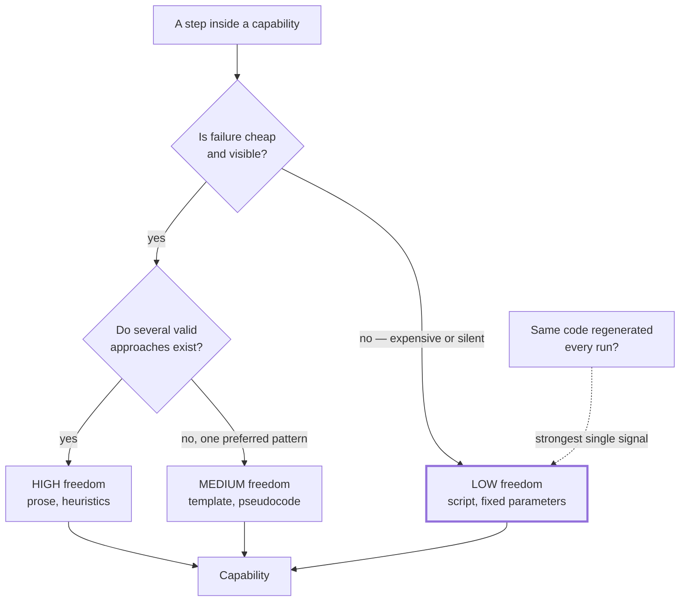

# Calibrated Degrees of Freedom

> Match how specifically you instruct to how fragile the task is: prose where many routes are valid, a script where one wrong step is expensive.

## What this pattern is

Every instruction to an agent sits somewhere on a spectrum of constraint.

| Freedom | Form | Use when |
| --- | --- | --- |
| **High** | Prose guidance, heuristics, principles | Several approaches are valid; the right one depends on context the author cannot predict |
| **Medium** | Pseudocode, parameterized procedures, templates | A preferred pattern exists but variation is acceptable |
| **Low** | A specific script with few parameters | The operation is fragile, consistency matters more than adaptability, or the sequence must not vary |

The pattern is the deliberate *choice* of position, made per task rather than per
skill. The source guidance frames it as terrain: an open field admits many routes,
a narrow bridge over a drop needs guardrails. Most real capabilities contain both
kinds of terrain and should therefore mix all three levels internally.

## Why it exists

Both extremes fail, and they fail in ways that look like the opposite problem.

Over-constrain a task that needs judgment and the agent follows the script off a
cliff: the procedure does not fit, but it is what the instructions said, so it is
executed anyway and the mismatch is reported as success. Under-constrain a fragile
task and the agent improvises a plausible variant each time — usually fine, and
occasionally catastrophic in a way that only shows up in production.

The second failure is the dangerous one in operational contexts, because the
variance is invisible until it isn't. An agent that constructs a slightly different
command each time works until the day it constructs one that is destructive.

**Without it:** fragile steps drift between runs and flexible steps are executed
rigidly, and both look correct from inside the session.

## Where it belongs

```
   within a single capability
   ───────────────────────────────────────────────
   phase 1  scope and intake        HIGH   prose
   phase 2  analysis                HIGH   heuristics + reference
   phase 3  transformation          MEDIUM template + parameters
   phase 4  validation              LOW    script, fixed flags
   phase 5  packaging               LOW    script, refuses on failure
   ───────────────────────────────────────────────
   freedom decreases as consequence increases
```

## How it works

1. **Judge the task, not the skill.** A single capability usually spans the whole
   range. Intake and interpretation want prose; validation and packaging want
   scripts. Assigning one freedom level to an entire skill is the most common
   version of getting this wrong.

2. **Ask what a wrong variant costs.** Cheap and visible failure tolerates high
   freedom, because the feedback loop corrects it. Expensive or silent failure
   demands low freedom. This is the same calculus as blast radius (card 17), applied
   to instruction design.

3. **Write a script when the same code keeps being regenerated.** Repeated
   regeneration is the clearest signal available: if the agent writes the same
   twenty lines every run, those lines should be a file. The benefit is threefold —
   deterministic behavior, no tokens spent re-deriving it, and no tokens spent
   reading it, since a script can be executed without entering context (card 02).

4. **Use templates for the middle.** A template fixes structure while leaving
   content free. It is the right level for output the reader will compare across
   runs: reports, briefs, plans, contracts.

5. **Leave high-freedom instructions genuinely high.** Prose guidance padded with
   prescriptive detail becomes an unenforceable low-freedom procedure — the worst
   of both, since it constrains without guaranteeing.

6. **State the freedom level where it is not obvious.** When a step deliberately
   admits several approaches, say so. Otherwise an agent optimizing for compliance
   will invent a rigidity the author never intended.

## What it depends on

| Dependency | Why it is needed | What happens if absent |
| --- | --- | --- |
| Honest assessment of failure cost | The whole calibration rests on it | Uniform freedom across a capability; wrong in both directions |
| A runtime that executes scripts | Low freedom is only cheap if scripts run without being read | Scripts become long prose blocks, losing determinism and costing context |
| Willingness to write code inside a capability | Low freedom means real scripts with real error handling | Fragile steps stay as prose because prose is faster to write |
| Feedback from real runs | Calibration is empirical | The level set on day one persists regardless of observed behavior |

## How it interacts with other patterns

| Pattern | Relationship |
| --- | --- |
| [02 Progressive Disclosure](02-progressive-disclosure.md) | Decides what level 3 material should be: a reference (high freedom) or a script (low) |
| [09 Scaffold, Validate, Package](09-scaffold-validate-package.md) | The clearest instance: creation is medium, validation and packaging are low and scripted |
| [17 Blast-Radius Gating](17-blast-radius-gating.md) | The same cost-of-failure reasoning applied to infrastructure changes |
| [11 Adversarial Role Separation](11-adversarial-role-separation.md) | Evaluation is deliberately low-freedom — a fixed rubric — precisely because judgment there is unreliable |
| [08 Interview Before Generation](08-interview-before-generation.md) | One workflow at two settings: the interview is high-freedom, its completeness check is a script |

## Constraints and trade-offs

- **Scripts are code, with everything that implies.** They need error handling,
  they break when the environment changes, and they must be read when they
  misbehave — reversing their context saving at the worst moment.
- **Low freedom cannot adapt.** A script encountering a situation its author did
  not anticipate fails or, worse, succeeds incorrectly. The rigidity that prevents
  drift also prevents recovery.
- **Calibration is guesswork before the first run.** The level is chosen when the
  capability is written, which is when the least is known about how it behaves.
- **Mixed-freedom capabilities are harder to read.** A reviewer must track which
  parts are binding and which are advisory, and nothing in the file format marks
  the difference.

## Failure modes

| Failure | Symptom | Root cause |
| --- | --- | --- |
| Script off a cliff | Procedure executed in a situation it does not fit; reported as success | Low freedom applied to a task requiring judgment |
| Silent variance | A fragile operation is performed slightly differently each run | High freedom applied to a fragile task |
| Prescriptive prose | Long instructions that constrain without guaranteeing, and are partially ignored | Author wanted low freedom but wrote it as text |
| Regenerated boilerplate | The same code appears in transcript after transcript | The signal for "write a script" was present and not acted on |
| Rigid intake | The capability refuses inputs that a human would accept | Low freedom applied at the entry point, where variation is the norm |
| Unmaintained script | Script fails against a changed environment; capability blocked | Code inside a capability is easy to write and easy to forget |

## Diagram



## How to validate an implementation

- [ ] Freedom level is assigned per step, not per capability; at least one capability visibly mixes levels.
- [ ] Every destructive or irreversible step is low freedom and scripted.
- [ ] No code is regenerated across runs; anything repeated is a file.
- [ ] Scripts run as committed, handle their own error cases, and report failure in a way the calling procedure can act on.
- [ ] High-freedom steps are genuinely open — no prescriptive detail that constrains without enforcing.
- [ ] Deliberately open steps say so, so compliance-seeking does not invent rigidity.
- [ ] Levels have been revised at least once based on observed behavior rather than left at their initial guess.

## How it evolves

**Early**, everything is prose, because prose is what writing a capability feels
like. **After a few real runs**, the repeated regeneration becomes obvious and the
first scripts appear — this is the single highest-value refactor in a young
capability. **At maturity**, the capability has a stable spine of low-freedom
scripts with high-freedom judgment between them, and new work mostly extends the
prose.

The pattern degrades when scripts accumulate beyond what anyone maintains. A
capability with nine scripts has a software project inside it, and at that point the
scripts need the same treatment as any other code: tests, an owner, and a reason
each one still exists.

## Skeleton

Minimal prototype in [`../skeletons/06-calibrated-degrees-of-freedom/`](../skeletons/06-calibrated-degrees-of-freedom/):
one capability implementing the same task at all three freedom levels, with a
README comparing what each guarantees and what each costs.

## Provenance

Documented explicitly in the skill-authoring guidance the source system vendored,
including the open-field-versus-narrow-bridge framing, and applied consistently
across the kit's own capabilities. The clearest instance is its skill-building
pipeline: creation from a template (medium), validation against rules (a script
with fixed checks), and packaging (a script that refuses to run on a failed
validation) — freedom decreasing exactly as the cost of a wrong result rises.

The operational skills show the same gradient for a different reason: investigation
phases are prose because symptoms vary, while anything touching a live cluster is a
fixed command with fixed flags, because that is where a variant is expensive.

The pattern is inherited rather than invented — the source system adopted published
authoring guidance. Its contribution was applying the calculus to infrastructure
work, where the cost of a wrong variant is measured in outages rather than in
retries.
