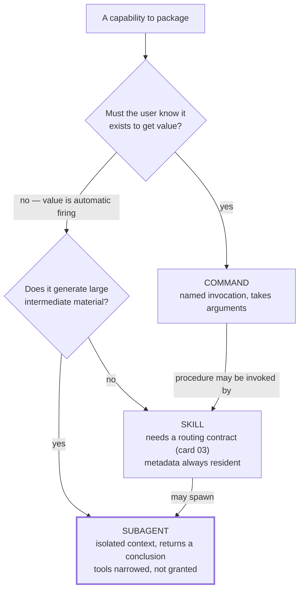

# Capability Taxonomy — Skill, Command, Subagent

> Skills, commands and subagents are not three words for the same thing: they differ in who decides to run them and whose context they consume, and those two axes determine which one a capability should be.

## What this pattern is

Agent runtimes offer several containers for packaged behavior. They look
interchangeable — each is a markdown file with instructions — and choosing between
them by feel produces a kit where capabilities are in the wrong containers and
nobody can say why.

Two axes separate them cleanly:

| | Who invokes it | Whose context it runs in |
| --- | --- | --- |
| **Skill** | The model, from a description | The main session |
| **Command** | The user, by name | The main session |
| **Subagent** | The model, by delegation | A fresh, isolated context |

From those two axes everything else follows. A skill needs a routing contract
because the model must decide; a command does not, because the user already
decided. A subagent can read a hundred files without cost to the main session, but
cannot see what the main session has learned unless it is told.

## Why it exists

Choosing by feel produces three specific defects.

Behavior that should be user-triggered is written as a skill, so it fires when
nobody asked — often mid-task, derailing the work. Behavior that should be
model-triggered is written as a command, so it never runs, because the user does not
remember it exists. And work that should be delegated runs inline, filling the main
session's context with intermediate material nobody needs afterwards.

The third is the expensive one. An investigation that reads forty files to answer
one question leaves thirty-nine files' worth of residue in the context that has to
carry the rest of the session.

**Without it:** capabilities fire at the wrong times, never fire, or fire correctly
while poisoning the context they run in.

## Where it belongs

```
                       user types a name
                              │
                              ▼
                        ┌──────────┐
                        │ COMMAND  │──┐
                        └──────────┘  │
   request ──► routing ─┐             ├──► main session context
                        ▼             │
                  ┌──────────┐        │
                  │  SKILL   │────────┘
                  └────┬─────┘
                       │ delegates
                       ▼
                 ┌───────────┐
                 │ SUBAGENT  │──► isolated context, returns a summary
                 └───────────┘
```

## How it works

1. **Ask who should decide.** If the user must know the capability exists to get
   value from it, it is a command. If the value comes from firing automatically at
   the right moment, it is a skill and needs a routing contract (card 03).

2. **Ask what the work costs the context.** Work that generates large intermediate
   material — reading many files, sweeping a codebase, replaying logs — belongs in a
   subagent, which returns a conclusion instead of the evidence.

3. **Give commands explicit arguments.** A command is invoked deliberately, so it
   can demand a parameter. The source system's commands take a plan path, a feature
   description, a repository path. Skills cannot rely on this: they receive whatever
   the user happened to say.

4. **Narrow a subagent's tools rather than widening them.** A subagent's tool list
   is a constraint, not a capability grant: an analysis subagent restricted to read
   and search tools *cannot* write, which is a stronger guarantee than instructing
   it not to.

5. **Give each subagent a role distinct enough to route to.** Several subagents
   with overlapping purposes have the same collision problem as skills (card 03),
   with the added difficulty that the choice is made by another agent mid-task.

6. **Let one capability use another.** The containers compose: a skill can invoke a
   command's procedure, and a skill can spawn subagents. The source system's
   adversarial workflow is a skill that spawns three role-specific subagents
   (card 11), which is the composition working as intended.

## What it depends on

| Dependency | Why it is needed | What happens if absent |
| --- | --- | --- |
| A routing mechanism for skills | Model-selected capabilities need a contract | Skills that never fire or fire wrongly |
| User awareness for commands | Commands are worthless unless remembered | Well-built procedures nobody invokes |
| Real context isolation for subagents | The entire benefit is the residue not returning | Delegation costs more than doing the work inline |
| A tool-narrowing mechanism | Subagent safety comes from capability, not instruction | "Do not write" as a request rather than a guarantee |

## How it interacts with other patterns

| Pattern | Relationship |
| --- | --- |
| [03 Description-as-Router](03-description-as-router.md) | Only skills need it; choosing a skill means accepting the cost of maintaining one |
| [02 Progressive Disclosure](02-progressive-disclosure.md) | All three containers use the three-level structure; only skills pay the always-resident cost |
| [11 Adversarial Role Separation](11-adversarial-role-separation.md) | The strongest use of subagents: isolation is what makes the evaluator independent |
| [19 Scope Lock](19-scope-lock-and-checkpoint-delivery.md) | Commands are the natural home for procedures with a defined start and end |
| [16 The Permission Ladder](16-the-permission-ladder.md) | Tool narrowing is the same idea at a different granularity: it limits capability, not instruction |

## Constraints and trade-offs

- **Every skill taxes every session.** Its metadata is resident whether or not it
  is used (card 02). Commands and subagents cost nothing until invoked. This alone
  argues for making a capability a command unless automatic firing is the point.
- **Subagent isolation cuts both ways.** A subagent knows nothing the main session
  learned, so its prompt must carry everything it needs. Poorly briefed subagents
  re-derive context and return confidently wrong conclusions.
- **Commands depend on human memory.** A kit with thirteen commands has twelve the
  user has forgotten. Discoverability is the unsolved half of this container.
- **Delegation has fixed overhead.** Spawning a subagent costs a prompt, a summary
  and a round trip. For small work the residue it avoids is cheaper than the
  ceremony it adds.

## Failure modes

| Failure | Symptom | Root cause |
| --- | --- | --- |
| Unwanted autofire | A capability activates mid-task when nobody asked | Written as a skill when the user should have decided |
| Forgotten command | A good procedure is never used | Written as a command with no discovery path |
| Context poisoning | The session slows and loses the thread after a large investigation | Work that should have been delegated ran inline |
| Blind subagent | Delegated work returns a confident answer that ignores established context | Prompt assumed shared context that does not exist |
| Overlapping roles | Two subagents could handle a task; the choice looks arbitrary | Roles not distinct enough to route between |
| Tool over-grant | A read-only analysis subagent can write | Tool list treated as a convenience rather than a constraint |

## Diagram



## How to validate an implementation

- [ ] Every capability's container is justified by the two axes, and the justification is written down.
- [ ] No skill exists whose value depends on the user knowing it exists.
- [ ] No command exists that should fire automatically.
- [ ] Every subagent's tool list is a narrowing; read-only roles cannot write.
- [ ] Subagent prompts are self-contained and assume no inherited context.
- [ ] Subagent roles are distinct enough that a reader can predict which handles a given task.
- [ ] Commands take explicit arguments where they operate on a target.
- [ ] Commands are discoverable somewhere a user will actually look.

## How it evolves

**Early**, everything is a skill, because skills are what the documentation
describes first. **In the middle**, commands appear as procedures stabilize and the
user learns to ask for them by name, and the skill count stops growing. **At
maturity**, subagents carry the heavy reading and the main session stays clear
enough to hold the whole task.

The taxonomy strains when a kit grows beyond what one person can remember: commands
become undiscoverable and skills become a crowded routing table. The next move is
grouping — a dispatcher owning a domain — which trades one routing decision for two
and only pays once the flat set is genuinely unmanageable.

## Skeleton

Minimal prototype in [`../skeletons/07-capability-taxonomy/`](../skeletons/07-capability-taxonomy/):
the same underlying task packaged three ways, with a README comparing what each
costs, what each guarantees, and when each fires.

## Provenance

Instanced across the source system's three directories: seventeen skills with
routing contracts, thirteen commands taking explicit arguments — a plan path, a
feature description, a repository path — and subagent definitions with deliberately
narrowed tool lists.

The most instructive instance is the adversarial development workflow, which is a
skill that spawns three subagents with distinct roles and separate references,
because the isolation between them is the mechanism that makes the evaluation
independent rather than a matter of instruction (card 11).

The clearest counter-example in the same kit is its top-level subagent directory:
nineteen uniform role definitions, vendored as a set and never invoked by anything.
They were in the right container for what they claimed to be, but no capability
routed to them and no per-role justification existed — a taxonomy applied to
material that had not earned a place (card 05).
