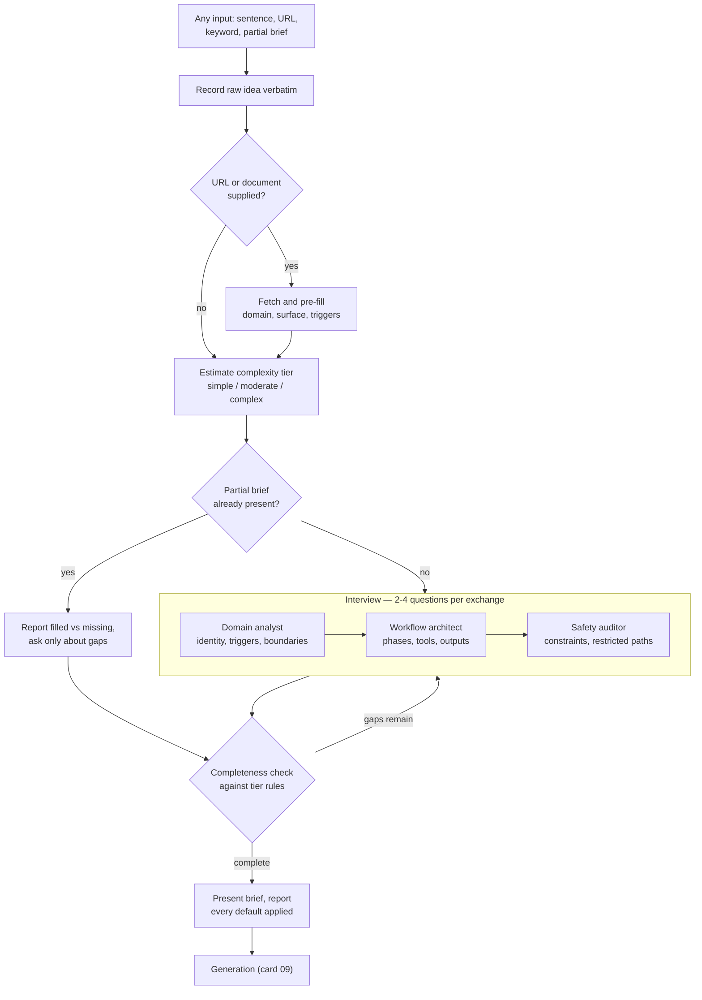

# Interview Before Generation

> Do not generate from a one-line request. Elicit the specification first, through a structured interview that knows which questions are mandatory at this level of complexity and which can be defaulted.

## What this pattern is

A request to build something arrives underspecified — always, and not through any
fault of the requester. The person knows what they want the thing to *do*; they have
not thought about its failure modes, its boundaries, or what it must refuse.

Generating directly from that request produces something plausible and wrong, and
the wrongness is discovered only after it exists, when revising costs more than
specifying would have. The pattern inserts a deliberate elicitation phase between
request and generation, with four properties that distinguish it from simply asking
some questions:

- **A fixed section model.** The specification has named sections, so completeness
  is a checkable property rather than a feeling.
- **Role-based questioning.** The interviewer adopts distinct personas for
  different sections, because the questions a workflow designer asks are not the
  questions a safety reviewer asks.
- **Complexity tiering.** Which sections are mandatory depends on how complex the
  artifact is; a simple thing should not be interrogated like a complex one.
- **Explicit defaulting.** Unanswered fields get tier-appropriate defaults, and the
  user is *told* which defaults were applied rather than having them silently
  chosen.

## Why it exists

Generation is cheap and revision is not. A generated artifact carries an authority
its specification never had: once it exists as a file, subsequent work edits it
rather than questioning whether it should have been built that way.

The specific gap this closes is that requesters do not volunteer constraints. Nobody
opens with "and it must never run against production" — that requirement exists,
fully formed, and surfaces only when asked. The safety section of an intake
interview exists to ask, because the information is available and will not arrive on
its own.

**Without it:** the first generated version defines the design, its unstated
constraints are discovered by violation, and each revision costs more than the
interview would have.

## Where it belongs

```
   raw request  ──►  INTERVIEW  ──►  brief  ──►  GENERATION  ──►  artifact
                     (this card)      │          (card 09)
                                      │
                            completeness gate:
                            required sections filled
                            for the estimated tier
```

## How it works

1. **Accept any input shape.** A sentence, a URL, a keyword, a vague idea, or a
   partially filled brief. Rejecting malformed input at the entry point defeats the
   purpose — the entry point is exactly where variation is expected (card 06).

2. **Record the raw idea verbatim before interpreting it.** Paraphrasing at intake
   loses the requester's framing, and the framing often carries the real
   requirement.

3. **Pre-fill from any source provided.** When the input includes a URL or a
   document, fetch and extract what can be extracted — the domain, the surface, the
   moving parts, and candidate trigger phrasings taken from the source's own
   language. Every pre-filled field is one fewer question.

4. **Estimate a complexity tier from signals, not from asking.** Single tool and
   linear steps is simple; multiple phases with validation gates is moderate;
   loop-back, cross-referencing, state and a safety model is complex. The tier then
   determines which sections are required, which are optional, and which get
   defaults.

5. **Switch persona by section.** A domain analyst handles identity, boundaries and
   trigger phrasing. A workflow architect handles phases, transitions, tooling and
   outputs. A safety auditor handles constraints, restricted paths and data
   sensitivity. The personas are not decoration: each carries a different notion of
   what a sufficient answer looks like.

6. **Ask two to four questions per exchange, each with a reason.** Dumping twenty
   questions produces abandonment or perfunctory answers. Stating why a question
   matters produces better answers to it.

7. **Support a fast path.** When the input is already a partial brief, parse it,
   report exactly which fields are filled and which are missing, and ask only about
   the gaps. Re-asking answered questions is the fastest way to lose a user's
   engagement.

8. **Validate mechanically, then present for approval.** A script checks the brief
   against the tier's requirements and reports what is missing; the user approves
   the assembled brief before anything is generated from it.

## What it depends on

| Dependency | Why it is needed | What happens if absent |
| --- | --- | --- |
| A fixed section model | Makes completeness checkable | "Enough information" becomes a judgment, made optimistically |
| Tier rules | Prevents interrogating simple things | Uniform questioning; users abandon the interview |
| A completeness validator | Human judgment about completeness is unreliable | Briefs pass with critical sections empty |
| Explicit default reporting | Silent defaults are indistinguishable from decisions | Users discover assumptions after generation |
| A downstream generator that consumes the brief | The brief is an input format, not a document | An elaborate interview producing a file nobody reads |

## How it interacts with other patterns

| Pattern | Relationship |
| --- | --- |
| [09 Scaffold, Validate, Package](09-scaffold-validate-package.md) | Consumes the brief; this card is that pipeline's front end |
| [19 Scope Lock](19-scope-lock-and-checkpoint-delivery.md) | The same move applied to execution: freeze the definition before the work |
| [06 Calibrated Degrees of Freedom](06-calibrated-degrees-of-freedom.md) | The interview is high-freedom; the completeness check is a script |
| [11 Adversarial Role Separation](11-adversarial-role-separation.md) | Both use role separation, but here the roles are sequential personas rather than independent agents |

## Constraints and trade-offs

- **The interview costs real time up front**, and its benefit is invisible: the
  bad artifact that was never generated leaves no trace. Users under time pressure
  perceive it as friction and route around it.
- **Personas can become theater.** If all three ask similar questions in different
  voices, the structure adds ceremony without adding coverage.
- **Tier estimation happens when the least is known.** A misjudged tier either
  over-questions a simple artifact or lets a complex one through with defaults where
  real answers were needed.
- **Defaults are decisions.** Tier-appropriate defaults are still choices made by
  the system rather than the user, and announcing them does not mean they were read.
- **The brief is a second artifact to maintain.** When the generated thing changes,
  its brief is stale immediately, and nothing keeps them in sync.

## Failure modes

| Failure | Symptom | Root cause |
| --- | --- | --- |
| Interview fatigue | User abandons midway or answers perfunctorily | Too many questions per exchange; no reason given for each |
| Re-asking | User re-answers what they already supplied | No fast path for partial briefs |
| Tier misjudgment | A complex artifact passes with defaults in its safety section | Complexity estimated from a one-line request |
| Theatrical personas | Three voices, one kind of question | Roles not given genuinely different notions of sufficiency |
| Orphan brief | Brief produced, generation done by hand anyway | Downstream pipeline not actually wired to consume it |
| Silent defaulting | User surprised by a behavior nobody chose | Defaults applied without being surfaced |

## Diagram



## How to validate an implementation

- [ ] The interview accepts unstructured input without rejecting it.
- [ ] The raw request is stored verbatim before any interpretation.
- [ ] A complexity tier is estimated and stated, and it determines which sections are required.
- [ ] A script — not a judgment — decides whether the brief is complete.
- [ ] A partial brief triggers the fast path, and the system reports which fields it found.
- [ ] Every applied default is named to the user before generation.
- [ ] The safety section is mandatory at the highest tier and asks about restricted paths and destructive operations explicitly.
- [ ] The generator actually consumes the brief format the interview emits.

## How it evolves

**Early**, the interview is the whole value — the requester has never specified an
artifact of this kind and the questions teach them what specification means.
**Later**, the same person answers the same sections quickly and the fast path
becomes the main path, with the interview reduced to gap-filling. **At maturity**,
most briefs arrive mostly complete because the requester has internalized the
section model, and the interview's remaining job is the safety section, which
nobody internalizes.

The pattern stops paying for itself when the artifacts being generated are small
enough that generating and discarding is cheaper than specifying. At that point the
interview should shrink to the two or three questions whose answers cannot be
guessed.

## Skeleton

Minimal prototype in [`../skeletons/08-interview-before-generation/`](../skeletons/08-interview-before-generation/):
a section model, tier rules, a stdlib completeness validator, and a worked partial
brief that exercises the fast path.

## Provenance

Instanced in the source system as a dedicated intake skill: eight brief sections,
three interviewer personas mapped to specific sections, a three-tier complexity
model with a per-tier table of required, optional and defaulted sections, a fast
path that parses partial briefs and announces which fields it found, and a
validation script gating the handoff to the generator.

The tier table is the load-bearing part. It states for each section and tier whether
the field is required, optional, defaulted or recommended, and defines each term
precisely — "default" meaning auto-populated with the user informed, "required"
meaning a non-default answer from the user or an inference explicitly marked as
inferred. That precision is what lets a script decide completeness instead of a
person.

The kit shows the pattern working end to end: one of its largest operational skills
has a preserved intake brief in the interviewer's output directory, showing the
specification that produced it.
