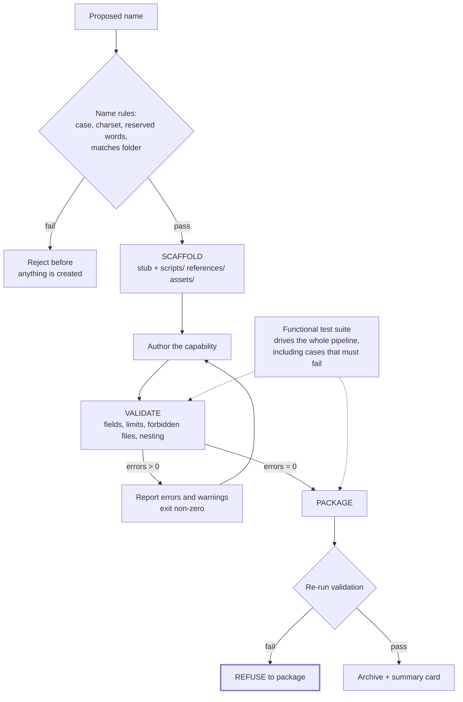

# Scaffold, Validate, Package

> Give capabilities a build pipeline: create from a template, check against the rules mechanically, and refuse to package anything that fails the check.

## What this pattern is

Capabilities are software, and software without a build pipeline degrades. The
pattern gives them the three stages any build has, with the third gated on the
second:

1. **Scaffold** — create the directory structure and a stub from a validated name.
   Nothing is authored freehand, so nothing starts malformed.
2. **Validate** — check the artifact against every mechanical rule the format
   has: required fields, naming, length limits, structural constraints. Exit
   non-zero on failure.
3. **Package** — produce the distributable artifact, and **refuse to run if
   validation fails**.

The gate in stage three is what makes the pattern more than three scripts. A
validator that can be skipped is advice; a validator whose failure blocks packaging
is a rule.

## Why it exists

The rules governing a capability's format are numerous, individually trivial, and
individually silent when broken. A name that is not lowercase, a description over
the length limit, a body past the size cap, a README where the format forbids one,
a nested reference one level too deep — each is a small defect, none produces an
error message, and their combined effect is a capability that loads badly or does
not load at all.

Checking them by reading is unreliable. Nobody counts lines by eye, and the author
who wrote the file is the worst-placed person to notice that its description drifted
past a limit.

**Without it:** capabilities are malformed in small ways, discovered by strange
behavior rather than by an error, and the format's rules become folklore.

## Where it belongs

```
   brief (card 08)
        │
        ▼
   ┌──────────┐   name rules   ┌───────────┐   format rules  ┌──────────┐
   │ SCAFFOLD │ ─────────────► │  AUTHOR   │ ──────────────► │ VALIDATE │
   └──────────┘                └───────────┘                 └─────┬────┘
                                      ▲                            │
                                      │ fix and re-run        pass │ fail
                                      └────────────────────────────┤
                                                                   ▼
                                                            ┌──────────┐
                                                            │ PACKAGE  │
                                                            └──────────┘
                                                      refuses on failed validation
```

## How it works

1. **Validate the name before creating anything.** Length, character set, leading
   character, no consecutive or trailing separators, no reserved words, and
   agreement with the directory name. A bad name is cheapest to reject before a
   directory exists.

2. **Scaffold the full structure, including empty conventional directories.** The
   empty directories are instructional: their presence tells the author where
   scripts, references and assets are meant to go, which is the progressive
   disclosure model (card 02) expressed as a filesystem.

3. **Emit a stub with the required fields present and marked incomplete.** A stub
   whose description field says what it must contain is better than an empty file,
   because the requirement is visible where the work happens.

4. **Make the validator check only mechanical properties.** Required fields exist,
   the name matches the folder, the description is within limits and in the right
   grammatical person, the body is under the line cap, forbidden files are absent,
   nesting is within depth. These are decidable. Whether the capability is *good* is
   not, and a validator that attempts it produces noise that trains people to ignore
   it.

5. **Separate errors from warnings, and let only errors block.** A validator where
   everything is fatal gets bypassed. One where nothing is fatal gets ignored. The
   split is what keeps it usable.

6. **Gate packaging on validation.** The packager re-runs the validator and refuses
   on failure. This is the entire enforcement mechanism: it converts the format
   rules from documentation into a build error.

7. **Emit a human-readable summary alongside the package.** The packager produces
   both the artifact and a summary card describing what was built, which is what a
   reviewer reads instead of unpacking the archive.

8. **Test the pipeline itself.** The pipeline is code, so it has its own functional
   test suite driving scaffold → validate → package over crafted cases, asserting
   exit codes, file existence and archive contents — including cases designed to
   fail validation, verifying that packaging actually refuses.

## What it depends on

| Dependency | Why it is needed | What happens if absent |
| --- | --- | --- |
| A format with mechanical rules | Only decidable properties can be validated | Validator drifts into subjective review and gets ignored |
| Non-zero exit on failure | Everything downstream keys off it | The gate silently passes |
| The packager re-running validation | Enforcement lives here, not in habit | Validation becomes optional and therefore skipped |
| A functional test suite for the pipeline | The enforcement mechanism is itself code that can break | A silently broken gate is worse than no gate |
| Errors and warnings distinguished | Usability determines adoption | The check is bypassed or ignored |

## How it interacts with other patterns

| Pattern | Relationship |
| --- | --- |
| [08 Interview Before Generation](08-interview-before-generation.md) | Produces the brief that scaffolding consumes; this card is the back end of that pipeline |
| [10 Behavioral Evaluation Harness](10-behavioral-evaluation-harness.md) | Validates structure; card 10 validates behavior. Both are needed and neither substitutes |
| [02 Progressive Disclosure](02-progressive-disclosure.md) | The rules being enforced — body limits, directory conventions — are that card's structure made checkable |
| [06 Calibrated Degrees of Freedom](06-calibrated-degrees-of-freedom.md) | A textbook gradient: authoring is high freedom, validation and packaging are scripted |

## Constraints and trade-offs

- **Only mechanical properties are covered.** A capability can pass every check and
  be useless. The validator's guarantee is "well-formed", never "good", and treating
  a green check as quality approval is the most likely misuse.
- **Gating creates pressure to weaken the gate.** When a legitimate capability
  fails a rule, the path of least resistance is to relax the rule rather than fix
  the artifact. Each relaxation is invisible individually.
- **The pipeline is code that must be maintained.** Six hundred-plus lines across
  three scripts, plus tests. When the format changes, the pipeline is stale until
  updated, and a stale validator enforces last year's rules.
- **Scaffolding encodes today's structure.** Every capability created from it
  inherits that shape, including its mistakes, and the mistakes are then everywhere.

## Failure modes

| Failure | Symptom | Root cause |
| --- | --- | --- |
| Skippable validation | Malformed capabilities in distribution | Packager does not re-run the validator |
| Rule erosion | Limits relaxed one exception at a time until they bind nothing | No record of why each rule exists |
| Subjective drift | Validator emits style opinions; people stop reading the output | Checks added that are not mechanically decidable |
| Stale validator | New format rules unenforced; old ones enforced wrongly | Format changed, pipeline did not |
| Silent gate failure | Everything passes, including known-bad input | Pipeline broke and nothing tests the pipeline |
| Template calcification | Every capability shares a structural flaw | Scaffold never revised after the structure was understood better |

## Diagram



## How to validate an implementation

- [ ] Scaffolding rejects an invalid name before creating any files.
- [ ] The validator exits non-zero on error and distinguishes errors from warnings.
- [ ] Every check the validator performs is mechanically decidable; none is a matter of taste.
- [ ] The packager re-runs validation and refuses on failure — verified by feeding it a known-bad artifact.
- [ ] A functional test suite exercises the full pipeline, including failure cases, and is run when the format changes.
- [ ] The packager emits a human-readable summary alongside the artifact.
- [ ] Every enforced rule has a recorded reason, so relaxing it is a decision rather than a shortcut.
- [ ] The scaffold template has been revised at least once since the format was first understood.

## How it evolves

**Early**, the validator encodes a handful of rules and catches real mistakes
immediately — this is the highest return-per-line code in a young kit. **In the
middle**, the rule set stabilizes and the interesting work moves to behavioral
testing (card 10), because structural correctness stops being the binding
constraint. **At maturity**, the pipeline's main value is preventing regression as
the format evolves, and its own test suite matters more than the validator.

The pattern strains when the format acquires rules that are not mechanically
decidable. The correct response is to leave them out and enforce them another way —
review, or a behavioral test — rather than to make the validator opinionated.

## Skeleton

Minimal prototype in [`../skeletons/09-scaffold-validate-package/`](../skeletons/09-scaffold-validate-package/):
the three scripts at minimum viable size, a deliberately malformed artifact, and a
test that asserts packaging refuses it.

## Provenance

Instanced in the source system as three standalone scripts — roughly 140, 200 and
200 lines — plus a functional test harness of about 280 lines driving them over
crafted cases from a JSON case file.

The details worth keeping: the validator implements frontmatter parsing without a
third-party YAML dependency, so the pipeline runs anywhere; its documented checks
include name case and format, reserved words, folder agreement, description length
and grammatical person, a body line cap, a prohibition on README files inside a
capability, and a limit on reference nesting depth. The packager's module docstring
states outright that it refuses to package a capability that fails validation, and
it emits a summary card next to the archive.

A fourth script complements these by analyzing existing reference capabilities
across roughly thirty structural axes — section counts, conditional logic, gates,
loop-back, safety constraints — and scoring complexity on a one-to-ten scale, which
is what fed the tier model in card 08. The pipeline was not just a gate; it was also
the measuring instrument that told the author what a complex capability looks like.
