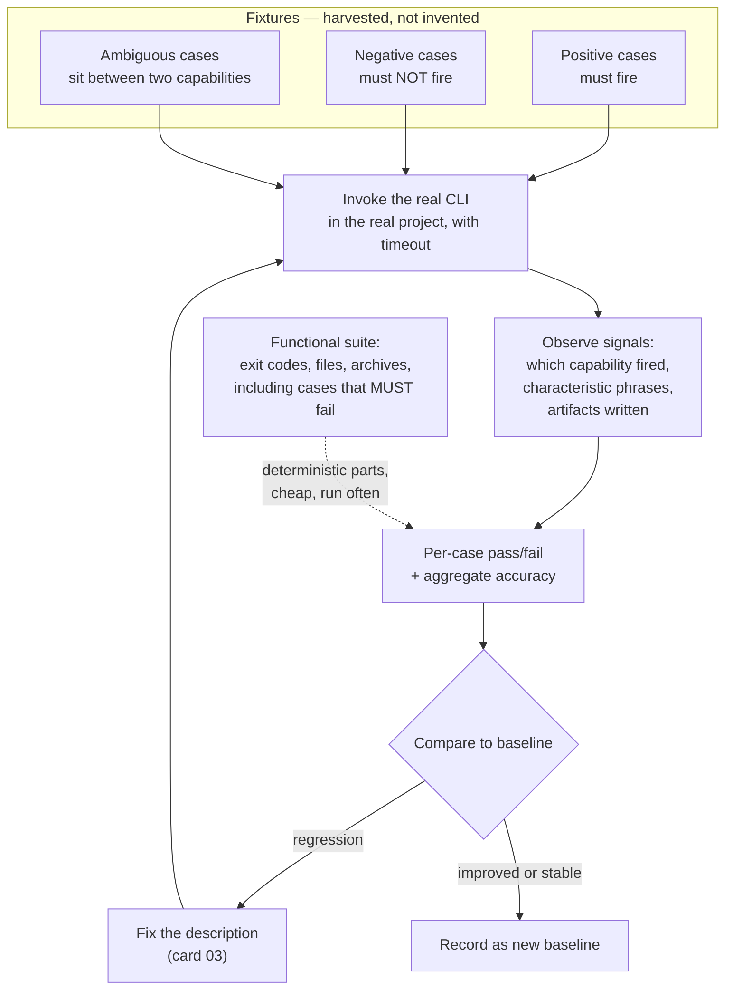

# Behavioral Evaluation Harness

> Whether a capability fires on the right request is a claim about model behavior, not a property of your files — so test it the only way such a claim can be tested, by replaying real prompts and checking what actually happened.

## What this pattern is

Structural validation (card 09) proves a capability is well-formed. It says nothing
about the thing most likely to be wrong: whether the capability activates when it
should, declines when it should not, and produces output with the expected shape.

Those are behavioral properties of a system containing a model, and they can only be
established empirically. The harness does it by:

1. Keeping a fixture file of **real prompts** paired with the expected outcome.
2. Running each prompt against the system as a user would.
3. Asserting on **observable signals** in the output — which capability fired, which
   phrases appear, which artifacts were written.
4. Reporting per-case pass or fail and an **aggregate accuracy**, so a change can be
   compared against a baseline.

The second half of the pattern is a functional harness for the deterministic parts:
the scripts and pipelines a capability contains, tested by exit code and file
existence rather than by inspection.

## Why it exists

Routing failures are silent (card 03). A capability that never fires produces no
error — the agent simply answers generically, and the author, who knows the
capability exists, reads the generic answer as a reasonable response rather than as
a miss.

Nothing in the file catches this. The description can be well-written, within
limits, and still lose to a sibling. The only observation that settles it is running
the prompt and seeing which capability engaged.

The same applies to changes. Editing one description to fix its routing can break a
neighbour's, and without a baseline the regression is invisible.

**Without it:** routing is maintained by impression, the effect of every description
edit is unknown, and capabilities silently stop firing as the set grows.

## Where it belongs

```
   STRUCTURE            BEHAVIOR
   ─────────            ────────
   validator      ┌──► trigger accuracy  ─► "does it fire on the right prompt?"
   (card 09)      │
   well-formed?   ├──► functional tests  ─► "do its scripts work end to end?"
                  │
                  └──► output shape      ─► "does the result look like it should?"

   Both gate the same artifact. Neither substitutes for the other.
```

## How it works

1. **Harvest prompts, do not invent them.** Cases come from how the capability is
   actually requested. Invented prompts test the author's idea of the phrasing,
   which is the thing already encoded in the description — so the test passes and
   proves nothing.

2. **Record the expected signals, not the expected text.** Model output varies. The
   assertion is on stable observables: which capability activated, whether a
   characteristic phrase appears, whether the expected file was written. Asserting
   on exact prose produces a suite that fails constantly and gets disabled.

3. **Include negative cases.** Prompts that must *not* fire the capability are as
   important as those that must, because over-triggering is the more annoying
   failure in daily use. Exclusion clauses are untested until something tests them.

4. **Include the ambiguous cases deliberately.** The prompts that sit between two
   capabilities are where the routing contract earns its keep, and they are the
   cases worth re-running after any description edit.

5. **Run through the real invocation path.** The harness shells out to the actual
   CLI in the actual project directory, with a timeout. Testing a mock of the router
   tests the mock.

6. **Report an aggregate, and keep it.** A single accuracy number across the suite
   is what makes a change comparable: a description edit that improves one case and
   breaks two is visible only against a baseline.

7. **Support a dry run.** Printing the commands without executing them makes the
   suite inspectable and cheap to review, since a full run costs real invocations.

8. **Test the deterministic parts separately and cheaply.** Scripts and pipelines
   get a conventional functional suite driven from a case file, asserting exit codes,
   created files and archive contents — including cases that must fail, to prove the
   gates actually gate.

## What it depends on

| Dependency | Why it is needed | What happens if absent |
| --- | --- | --- |
| A scriptable invocation path | The harness must run prompts as a user does | Only mocks can be tested, which proves nothing about routing |
| Observable outcome signals | Assertions need something stable to key on | Tests assert on prose and fail constantly |
| Real harvested prompts | Invented phrasings re-test the description | A suite that always passes |
| A recorded baseline | Change is only meaningful relative to something | Per-case results with no way to spot regression |
| Tolerance for cost and time | Each case is a real invocation | The suite is written, run once, and abandoned |

## How it interacts with other patterns

| Pattern | Relationship |
| --- | --- |
| [03 Description-as-Router](03-description-as-router.md) | Provides the only verification that a routing contract works; that card's failure modes are this card's test cases |
| [09 Scaffold, Validate, Package](09-scaffold-validate-package.md) | Structural gate; this is the behavioral gate. Complementary, not overlapping |
| [15 Structural Lint](15-structural-lint.md) | The same philosophy — cheap mechanical checks — applied to a knowledge base instead of a capability |
| [11 Adversarial Role Separation](11-adversarial-role-separation.md) | Both refuse to let the producer assess its own work |

## Constraints and trade-offs

- **Every case costs a real invocation.** Time and money scale with suite size, so
  the suite stays small, which limits coverage to the cases someone judged
  important — and the dangerous ones are the cases nobody thought of.
- **Behavioral tests are non-deterministic.** The same prompt can route differently
  between runs. A single failure may be signal or noise, and distinguishing them
  requires repetition, which multiplies the cost.
- **The suite encodes today's model.** A model update can shift routing behavior
  globally, invalidating the baseline without any change to the repository.
- **Signal-based assertions are loose.** Checking for a phrase in the output is a
  proxy for "the right thing happened", and proxies can pass for the wrong reason.

## Failure modes

| Failure | Symptom | Root cause |
| --- | --- | --- |
| Self-confirming suite | Everything passes; real routing failures continue | Prompts invented from the description rather than harvested from use |
| No negative cases | Capability over-triggers in daily use while the suite is green | Only positive triggers tested |
| Brittle assertions | Suite fails on harmless wording changes, then gets disabled | Asserting on exact output text |
| Written once | Suite exists, was run at build time, never again | No trigger tying it to description edits |
| Untested gates | A validation gate silently stops gating | Functional tests omit the cases that must fail |
| Baseline rot | Results exist but mean nothing | No recorded aggregate to compare against |

## Diagram



## How to validate an implementation

- [ ] Test prompts were harvested from real use, not written from the description.
- [ ] The suite contains negative cases, and at least one ambiguous case per pair of neighbouring capabilities.
- [ ] Assertions key on stable signals, never on exact model prose.
- [ ] The harness invokes the real entry point, with a timeout and a clear error when the entry point is missing.
- [ ] A dry-run mode prints what would run without running it.
- [ ] An aggregate accuracy is recorded and compared across runs.
- [ ] The suite is re-run whenever a routing description changes — and something enforces that, rather than someone remembering.
- [ ] The functional suite includes cases that must fail, proving the gates gate.

## How it evolves

**Early**, a handful of cases covering the capabilities most likely to collide is
enough, and it finds real problems immediately. **In the middle**, the suite's value
shifts from discovery to regression: its job is to tell you that fixing one
description broke another. **At scale**, per-case cost forces selection — run the
ambiguous cases on every change and the full suite rarely — and the aggregate
becomes a tracked metric rather than a pass/fail gate.

The pattern's real fragility is not scale but neglect. A behavioral suite that is
not wired to something that happens anyway will be run at build time and never
again, which is exactly what happened in the source system.

## Skeleton

Minimal prototype in [`../skeletons/10-behavioral-evaluation-harness/`](../skeletons/10-behavioral-evaluation-harness/):
a case file with positive, negative and ambiguous prompts, a stdlib runner with a
dry-run mode and a stubbed invocation, and a baseline file showing aggregate drift.

## Provenance

Instanced in the source system as two harnesses. A trigger harness of roughly 200
lines reads prompt cases from a JSON fixture, shells out to the real CLI in the
project directory with a configurable timeout, checks the output for
case-insensitive positive signals, and reports per-case results plus aggregate
accuracy; it has a dry-run mode and fails clearly when the CLI is absent. A
functional harness of roughly 280 lines drives the capability build pipeline over
crafted cases in a temporary directory, asserting exit codes, file existence and
archive contents, with a flag to retain output for inspection.

**Partially implemented, precisely:** the harnesses exist and are well built, and
nothing in the kit ran them routinely. No recorded baseline survives, no case file
was retained alongside the harnesses that read them, and nothing tied a run to the
event that should trigger one — editing a routing description. Seventeen
capabilities accumulated with overlapping domains and no behavioral evidence that
any of them routed correctly.

The lesson is not that the harness was wrong. It is that a test suite with no
trigger is a tool, not a gate, and tools that require remembering do not get used.
