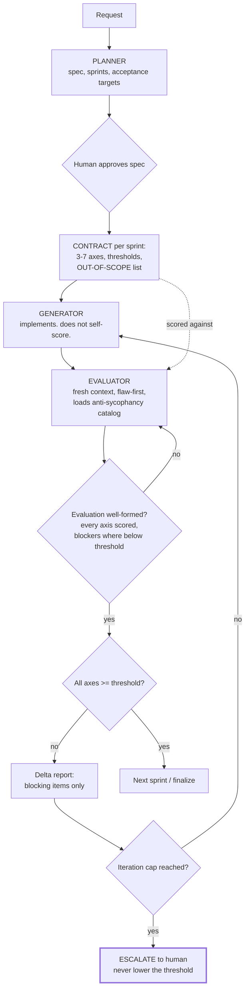

# Adversarial Role Separation

> The agent that produced the work cannot be the agent that grades it — and the rubric it is graded against must be fixed before the work starts, or it will be negotiated afterwards.

## What this pattern is

Ask a model to build something and then assess its own output, and it will report
success. Not through dishonesty — through the same mechanism that makes it helpful:
it is completing a document in which its own work is the subject, and the completion
that fits is a favourable one.

The pattern breaks the loop with three separations:

- **Role separation.** A planner decomposes, a generator implements, an evaluator
  critiques. Each runs as a separate agent with its own instructions, and no agent
  performs two roles.
- **Context separation.** The evaluator runs in a fresh context (card 07). It did
  not watch the work happen, so it cannot inherit the generator's reasoning about
  why a shortcut was acceptable.
- **Temporal separation.** The evaluation contract — the axes, the thresholds, the
  out-of-scope list — is written *before* implementation. A rubric agreed after the
  fact is a rubric shaped by the result.

A decision gate then compares scores against thresholds, loops failures back with a
delta report, and escalates to the human after repeated failure rather than
lowering the bar.

## Why it exists

Self-assessment fails in a specific, catalogable way. The source system documented
the patterns explicitly, and naming them is most of the defence:

**Score inflation** — "handles most cases well, 4/5", where "most" hides that
specified cases are unhandled. **Hedge-as-pass** — "might need some attention, but
the approach is sound", which is a blocker disguised as a suggestion. **Praise
sandwich** — a critical flaw framed between two positives, so the reader's attention
anchors on the praise.

Each converts a failure into a passing grade while remaining literally accurate.
None is caught by asking the model to be more critical, because the instruction and
the behavior live at different levels.

**Without it:** every sprint passes, quality drifts downward invisibly, and the
first real signal is a defect in production that the evaluation "approved".

## Where it belongs

```
   user request
        │
        ▼
   ┌─────────┐   spec + sprints    ┌──────────┐
   │ PLANNER │ ──────────────────► │ CONTRACT │  axes, thresholds, out-of-scope
   └─────────┘                     └────┬─────┘  ← written BEFORE implementation
                                        │
        ┌───────────────────────────────┤
        ▼                               ▼
   ┌───────────┐  code           ┌────────────┐
   │ GENERATOR │ ──────────────► │ EVALUATOR  │  fresh context, flaw-first
   └─────▲─────┘                 └──────┬─────┘
         │                              │
         │   delta report          ┌────▼────┐
         └───────────────────────  │  GATE   │ ──► pass: next sprint
                    fail           └─────────┘     repeated fail: escalate
```

## How it works

1. **Decompose before building.** The planner expands the request into a
   specification with success criteria, an ordered sprint breakdown, acceptance
   targets per sprint, and a file scope. It does not implement and does not
   evaluate. The specification is approved by the human before anything is built.

2. **Negotiate the contract per sprint, in advance.** Three to seven evaluation
   axes — correctness, coverage, interface design, security, whatever the sprint is
   about — each with a pass threshold on a fixed scale. Crucially, the contract also
   lists what is **out of scope**, which is what stops the evaluator from expanding
   the target after seeing the work.

3. **Generate without self-scoring.** The generator implements against the
   specification and reports what it did. It does not assess quality and does not
   pre-empt the evaluation. Removing the self-assessment step removes the
   opportunity for the failure.

4. **Evaluate flaw-first, in a fresh context.** The evaluator loads the
   anti-sycophancy catalog before every evaluation, scores each axis against the
   contract, and states blocking issues plainly with a location. The instruction is
   not "be harsh" but "report the gap, not the intention" — "3 of 5 specified error
   branches are tested; 2 have no coverage" rather than "good coverage overall".

5. **Gate mechanically.** Scores below threshold fail. The gate is arithmetic, not
   judgment, which is what prevents the failure from being argued away.

6. **Loop with a delta report.** A failure returns a structured list of blocking
   items, not the full evaluation. The generator fixes those and resubmits.

7. **Cap the iterations and escalate.** After a fixed number of failed cycles the
   workflow stops and escalates to the human. Without a cap, the loop either runs
   forever or the thresholds get quietly relaxed.

8. **Validate the evaluation itself.** A script checks the evaluator's output
   against the contract's structure — every axis scored, blocking issues present
   where scores are below threshold — so a malformed or evasive evaluation is
   detected rather than accepted.

## What it depends on

| Dependency | Why it is needed | What happens if absent |
| --- | --- | --- |
| Real context isolation | An evaluator that watched the work inherits its rationalizations | Separation in name only |
| A contract fixed before implementation | Post-hoc rubrics are shaped by the result | The bar moves to where the work landed |
| An explicit out-of-scope list | Prevents both scope creep and evaluation creep | Evaluator invents criteria; generator gold-plates |
| A named failure catalog | Sycophancy is specific and must be recognizable | "Be critical" produces politeness with harsher adjectives |
| An iteration cap with escalation | Loops do not terminate on their own | Infinite retry or silent threshold erosion |
| Multi-file work of real size | The ceremony must be worth the overhead | Process cost exceeds the work |

## How it interacts with other patterns

| Pattern | Relationship |
| --- | --- |
| [07 Capability Taxonomy](07-capability-taxonomy.md) | This is the strongest case for subagents: isolation is the mechanism, not a convenience |
| [19 Scope Lock](19-scope-lock-and-checkpoint-delivery.md) | Same principle in the operational domain — freeze the definition before the work |
| [10 Behavioral Evaluation Harness](10-behavioral-evaluation-harness.md) | Both refuse self-assessment; that card tests behavior mechanically, this one judges work against a rubric |
| [06 Calibrated Degrees of Freedom](06-calibrated-degrees-of-freedom.md) | Evaluation is deliberately low-freedom — a fixed rubric — because judgment is the unreliable part |

## Constraints and trade-offs

- **The overhead is substantial**: a planning pass, a contract per sprint, and an
  evaluation pass per iteration, each a separate invocation. For a small change this
  costs more than the change.
- **The evaluator can overcorrect.** An agent told to be flaw-first will find flaws,
  including ones that do not matter, and a suite of trivial blocking issues wastes
  as much time as a rubber stamp. The out-of-scope list is the only real control.
- **Thresholds are arbitrary at first.** A pass bar chosen before any work exists
  is a guess, and the first few sprints mostly calibrate it.
- **Roles can collapse under pressure.** When the loop stalls, the tempting fix is
  to let the generator "just address the feedback directly", which quietly restores
  self-assessment.
- **It assumes the contract captures what matters.** Anything unmeasured is
  unprotected, and an evaluator scoring five axes is blind to the sixth.

## Failure modes

| Failure | Symptom | Root cause |
| --- | --- | --- |
| Score inflation | Passing scores alongside acknowledged unmet requirements | "Most cases" treated as sufficient; intention scored instead of outcome |
| Hedge-as-pass | Blocking issues phrased as suggestions | Evaluator softening to preserve a cooperative tone |
| Praise sandwich | Critical flaw buried between positives | Report structured for comfort rather than signal |
| Contract negotiation after the fact | Thresholds adjusted once scores are known | Contract not frozen before implementation |
| Role collapse | Generator responds to its own critique | Loop stalled; separation abandoned for speed |
| Evaluation creep | Generator penalized for work the contract excluded | Out-of-scope list missing or ignored |
| Infinite loop | Sprint cycles without converging | No iteration cap, no escalation path |

## Diagram



## How to validate an implementation

- [ ] No agent both produces and grades the same work.
- [ ] The evaluator runs in a context that did not observe the implementation.
- [ ] The contract — axes, thresholds, out-of-scope — is written and frozen before implementation begins.
- [ ] The evaluator loads a named catalog of self-assessment failure patterns before each evaluation.
- [ ] Evaluations cite specific locations and state blocking issues as blocking, not as suggestions.
- [ ] The gate is arithmetic; nothing passes by narrative.
- [ ] A script validates the evaluation's structure against the contract.
- [ ] An iteration cap exists and escalates to a human; there is no path that lowers a threshold to pass.

## How it evolves

**Early**, the pattern is worth it only for substantial multi-file work, and the
thresholds are guesses being calibrated. **In the middle**, the contract template
stabilizes and the axes become reusable across sprints, which cuts most of the
setup cost. **At maturity**, the interesting artifact is the accumulated evaluation
history: it shows which axes repeatedly fail, which is information about the
generator's systematic weaknesses rather than about any one sprint.

The pattern stops paying for itself on small, reversible changes where review is
cheaper than ceremony. It becomes more valuable, not less, as the work gets harder
to reverse — which is the same calculus as card 17.

## Skeleton

Minimal prototype in [`../skeletons/11-adversarial-role-separation/`](../skeletons/11-adversarial-role-separation/):
three role prompts, a contract template, an evaluation-structure validator, and a
worked example where an inflated evaluation is caught by the validator.

## Provenance

Instanced in the source system as a skill that orchestrates three subagents with
separate role definitions and references, four supporting scripts — a harness
enforcing phase order and iteration caps, a contract writer, an evaluation validator,
and a state tracker persisting iteration history — and four output templates for
contracts, rubrics, delta reports and final reports.

The most transferable artifact is the anti-sycophancy reference: a catalog of named
failure patterns with a "what it looks like / why it fails / correct behavior"
structure for each, and an instruction to read it before every evaluation. It opens
by stating that evaluator sycophancy is the single largest threat to the workflow's
integrity, which is the correct assessment — every other part of the machinery
exists to make that one failure detectable.

The pattern is not original to this kit; generator-evaluator separation is
established practice. The kit's contribution is the operational detail: the
out-of-scope list as a control on evaluation creep, the structural validation of the
evaluation itself, and the hard iteration cap with escalation instead of threshold
relaxation.
