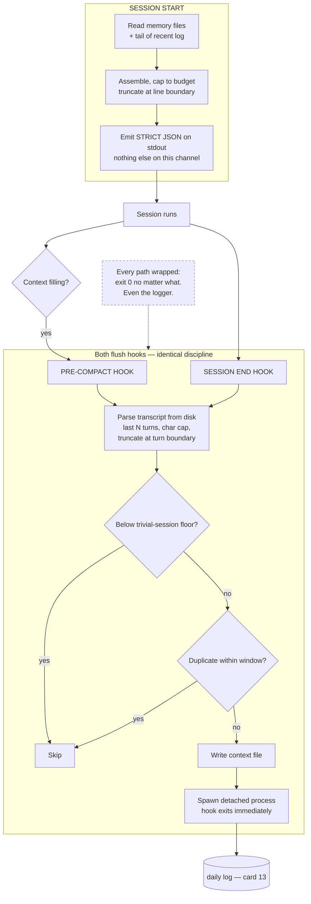

# Lifecycle Hooks as Capture Points

> Hook the session's boundaries to inject context in and flush context out — and make every hook fast, dumb and fail-open, because a hook that breaks breaks the session it was meant to help.

## What this pattern is

An agent session has boundaries: it starts, it ends, and — when the context fills —
it compacts, discarding history to make room. Each boundary is an opportunity and,
untreated, a loss.

The pattern places three hooks at those boundaries:

- **Session start** — read the small curated memory files and inject them as
  context, so the session begins knowing who it is working for and what is in
  flight.
- **Session end** — extract the conversation and hand it to a background process
  that appends it to the day's log.
- **Pre-compaction** — the same extraction, triggered by the thing that is about to
  destroy the material.

The third is the one people miss. Compaction is a *silent* loss: the session
continues, apparently intact, with its early reasoning gone. Hooking it is what
makes long sessions survivable.

All three obey the same three rules: **no API calls**, **bounded execution time**,
and **never fail the session**.

## Why it exists

The alternative to hooks is discipline — remembering to save context at the end of
a session. It does not happen. The end of a session is when attention is lowest and
the perceived value of writing things down is smallest.

Hooks move the trigger from human intention to a system event. Nobody decides to
flush; flushing is what session-end *means*.

The inverse applies at the start. A session begins with no knowledge of the
operator, the active work, or yesterday's conclusions. Re-establishing that by
conversation costs turns and produces a worse reconstruction than a file would.

**Without it:** every session starts from zero and ends by discarding what it
learned, and the two losses compound daily.

## Where it belongs

```
   ┌──────────────── SESSION LIFECYCLE ────────────────┐
   │                                                   │
   start ──► [HOOK: inject context]                    │
   │           reads memory/ + recent log tail         │
   │                                                   │
   work ...                                            │
   │                                                   │
   context fills ──► [HOOK: pre-compact flush] ──┐     │
   │                                              │    │
   work continues ...                             ├──► daily log (card 13)
   │                                              │    │
   end ──────────► [HOOK: session-end flush] ────┘     │
   └───────────────────────────────────────────────────┘
```

## How it works

1. **Read the transcript from disk, not from the model.** The runtime hands the
   hook a path to the session transcript. Parsing a file is deterministic, costs
   nothing, and cannot fail in the interesting ways a model call can.

2. **Bound the extraction on both axes.** Take the last N turns *and* cap total
   characters, truncating at a turn boundary so the output is never a fragment
   mid-sentence. The source system used thirty turns and fifteen thousand
   characters.

3. **Do no intelligent work in the hook.** The hook extracts and writes. Deciding
   what is worth keeping is deferred to compilation (card 13), which runs later,
   explicitly, and can be expensive because it is not blocking anything.

4. **Spawn the actual work as a detached background process.** The hook writes a
   context file, spawns a process to consume it, and exits. The session never waits.

5. **Skip trivial sessions.** A floor — the source system used five turns — keeps
   the log free of sessions that contain nothing.

6. **Deduplicate.** Two hooks can fire for one logical session end. A short window
   keyed on the context file prevents the same material being appended twice.

7. **Bound the injected context and state the budget.** The start hook caps what it
   injects — twenty thousand characters, documented in the source as roughly 2.5% of
   the window. Naming the budget as a share of the total is what keeps injection
   from growing until it crowds out the work.

8. **Emit strictly valid output on the channel the runtime parses.** The injection
   hook writes JSON to stdout and *nothing else*. A stray print corrupts the
   protocol. Diagnostics go to a log file or stderr.

9. **Fail open, always.** Every hook wraps its work in exception handling and exits
   zero regardless. Logging is itself wrapped in a bare try/except, because a hook
   that fails while recording its own failure is the worst case. The principle: a
   memory system that breaks sessions is worse than no memory system.

## What it depends on

| Dependency | Why it is needed | What happens if absent |
| --- | --- | --- |
| Runtime hook points with transcript access | The entire trigger mechanism | Capture reverts to discipline, which fails |
| A strict output contract for injection | The runtime parses it | Corrupt output breaks session start |
| Background process spawning | Keeps the boundary fast | The session blocks on memory work |
| Fail-open discipline everywhere | Hooks run on the critical path | An unhandled error takes down a working session |
| A downstream consumer | The flush is input to something | An append-only log nobody compiles |
| A redaction stage (card 18) | Transcripts contain whatever the session contained | Credentials written verbatim to durable storage |

## How it interacts with other patterns

| Pattern | Relationship |
| --- | --- |
| [13 Log-as-Source Compilation](13-log-as-source-compilation.md) | Consumes what these hooks produce; the flush script also owns the compile trigger |
| [16 The Permission Ladder](16-the-permission-ladder.md) | Hooks run automatically, outside the permission prompts — a genuine bypass worth understanding |
| [18 The Redaction Boundary](18-the-redaction-boundary.md) | Should sit between extraction and the write; in the source system it did not |
| [19 Scope Lock](19-scope-lock-and-checkpoint-delivery.md) | Session handoffs are the manual counterpart to the automatic end-of-session flush |

## Constraints and trade-offs

- **Hooks run with the user's privileges and no prompt.** They are configuration
  that executes automatically — a real expansion of what the system does without
  asking. The source system kept them in a personal settings file rather than a
  shared one, which limits the blast radius of a bad hook to one machine.
- **Fail-open means silent failure.** A hook that stops working produces no symptom
  except an empty log, and empty is indistinguishable from quiet. This is the
  correct trade — the alternative breaks sessions — but it needs a periodic check
  that the log is still growing.
- **Raw capture keeps everything, including secrets.** Deferring intelligence makes
  the hook reliable and makes its output unpublishable.
- **Injection is a standing cost.** Every session pays the injected context whether
  or not it is relevant, and the budget only holds if someone keeps the memory files
  small.
- **Background spawning obscures errors.** Output goes to a devnull or a log the
  operator does not watch; a consistently failing flush can go unnoticed for weeks.

## Failure modes

| Failure | Symptom | Root cause |
| --- | --- | --- |
| Protocol corruption | Session start fails or injects garbage | Stray output on the channel the runtime parses |
| Double append | The same session appears twice in the log | Two hooks fired; no dedup window |
| Silent stop | Log stops growing; nobody notices for weeks | Fail-open with no liveness check |
| Blocking boundary | Session end hangs | Work done inline instead of spawned |
| Injection bloat | Sessions start with a large, mostly irrelevant preamble | Memory files grew; budget not enforced |
| Secret capture | Credentials in the transcript land in durable storage | No redaction between extraction and write |
| Truncation mid-thought | Log entries begin mid-sentence | Character cap applied without seeking a turn boundary |

## Diagram



## How to validate an implementation

- [ ] Every hook exits zero on every path, including when its own logging fails.
- [ ] No hook makes a network or model call; each completes in single-digit seconds.
- [ ] The injection hook emits only the runtime's expected format on the parsed channel; diagnostics go elsewhere.
- [ ] Extraction is bounded by both turn count and character count, and truncates at a turn boundary.
- [ ] A trivial-session floor exists.
- [ ] A dedup window prevents double-appending when two hooks fire for one session.
- [ ] Injected context has a stated budget as a share of the window, and it is enforced.
- [ ] Something checks that the log is still growing — fail-open needs a liveness check.
- [ ] A redaction stage sits between extraction and the durable write.

## How it evolves

**Early**, the hooks are the whole memory system and raw capture is exactly right —
intelligence at this layer would be premature and expensive. **In the middle**, the
injection side needs attention: memory files grow, the budget slips, and sessions
start heavier than they should. **At maturity**, capture is solved and the pressure
moves entirely downstream to compilation and retrieval.

The one thing that should not evolve is the fail-open discipline. Every
sophistication added to a hook is a new way to break a session, which is why the
intelligent work belongs in the background process and not at the boundary.

## Skeleton

Minimal prototype in [`../skeletons/12-lifecycle-hooks-as-capture-points/`](../skeletons/12-lifecycle-hooks-as-capture-points/):
three stdlib hooks with bounded extraction, dedup, a trivial-session floor, and a
fail-open logger — plus a fault-injection script proving each hook still exits zero
when its filesystem calls fail.

## Provenance

Instanced in the source system as three hooks of roughly 150 to 190 lines each,
registered in a personal settings file rather than a shared one. Two of them — the
session-end and pre-compaction flushes — are near-identical by design, differing
only in the trivial-session floor, and both state in their module docstrings that
they perform no API calls and must complete in under ten seconds.

The details worth transferring: extraction parses the transcript from disk and
handles both nested and flat message shapes; truncation seeks the next turn boundary
rather than cutting mid-sentence; the injection hook documents its character budget
as a percentage of the context window and carries a comment marking the stdout
channel as strictly JSON-only; the shared logging helper swallows every exception
with an explicit comment that hooks must never fail on logging.

The kit also demonstrated the pattern's main risk. Because capture is raw and
deliberately unintelligent, sixteen unredacted transcripts accumulated — including
one containing credential-shaped lines — which is why card 18 exists and why the
redaction gap is named in card 13 rather than left implicit.
