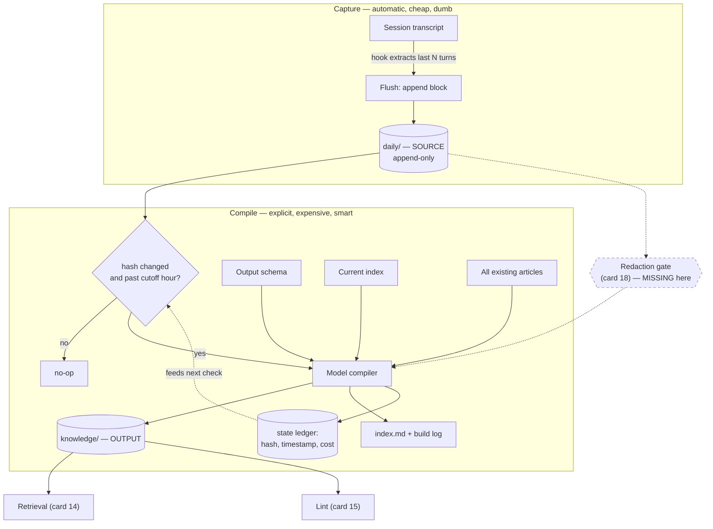

# Log-as-Source Knowledge Compilation

> Treat raw session transcripts as immutable source code, the model as a compiler, and the curated knowledge base as build output — then make the build incremental with a content hash.

## What this pattern is

Sessions produce transcripts. Transcripts are verbose, redundant, and full of dead
ends, so they are useless as a knowledge base — but they are the only complete record
of what was actually learned. This pattern refuses to choose between the two by
declaring an explicit compilation pipeline:

```
daily/      = source     (raw session dumps — append-only, never edited)
model       = compiler   (extracts and organizes)
knowledge/  = output     (structured, categorized, cross-linked articles)
memory/     = context    (small, hand-maintained, injected every session)
```

The critical move is that the four directories have **different mutability rules**.
Source is never edited, output is never hand-authored, and context is never generated.
Each stage is derived from the one before it by a named process, and a state ledger
records which source produced which output.

## Why it exists

An engineer solves a hard problem on a Tuesday — a certificate trust chain that breaks
a secret-injection operator, which silently breaks two dozen workloads on their next
restart. Three weeks later the same symptom appears in a different namespace. The
knowledge exists only in a transcript nobody will re-read.

Hand-writing the article at the time is the obvious fix, and it does not happen: at the
moment of resolution the engineer is tired, the incident is closed, and writing the
article costs more than the perceived future value. Any design that depends on
discipline at that moment fails.

So the capture is made automatic and dumb (card 12), and the *curation* is deferred to
a separate, explicit, expensive step that runs when the engineer is not in the middle
of anything.

**Without it:** operational knowledge decays to zero within weeks. Every recurrence is
re-debugged from scratch, and the second debugging session is not noticeably faster
than the first.

## Where it belongs

```
   session transcripts
          │  (hooks — card 12)
          ▼
   daily/  ── SOURCE ──────── append-only, immutable
          │  (compiler — this card)
          ▼
   knowledge/ ── OUTPUT ───── categorized articles + index + build log
          │  (retrieval — card 14, lint — card 15)
          ▼
   memory/ ── CONTEXT ─────── small, hand-curated, injected at session start
```

## How it works

1. **Append, never merge.** Each flush appends a timestamped session block to today's
   log file. The file is created with a fixed header on first write. Nothing ever
   rewrites an existing block — the source is append-only by construction.

2. **Define the output schema before compiling anything.** A schema document specifies
   the categories, the required frontmatter fields, the article section order, the
   cross-reference syntax, and the index row format. This document is read into the
   compiler prompt at every run, so the schema *is* the compiler's specification.

3. **Categorize by operational intent, not by topic.** The source system's seven
   categories are: *runbooks* (procedures), *incidents* (root causes), *decisions*
   (choices with rationale), *tool-patterns* (reusable configuration idioms),
   *debugging* (diagnostic techniques), *connections* (cross-cutting links between two
   or more other articles), and *filed answers* (questions asked of the base and
   answered). Topic-based categories would have collapsed into one bucket, because
   every article is about the same platform.

4. **Compile one source file at a time, with the whole existing base in context.** The
   compiler prompt carries the schema, the current index, and the full text of every
   existing article. This is what makes "prefer updating an existing article over
   creating a near-duplicate" an instruction the model can actually follow — it can see
   the duplicates.

5. **Bound the extraction.** The instruction is to extract three to seven distinct
   knowledge items per source file. Without a bound the compiler either summarizes the
   day (useless) or explodes it into dozens of fragments (unmaintainable).

6. **Require cross-links, and make one category exist only for them.** Articles link to
   each other with a wiki-style reference, and a dedicated *connections* category holds
   insights that belong to no single article — the blast-radius chains that only become
   visible across several incidents.

7. **Record the build.** Every compilation appends to a build log: which source was
   compiled, which articles were created, which were updated, and — valuably — when the
   run had to fall back to a manual method and why.

8. **Make it incremental with a content hash.** A state ledger stores, per source file,
   a truncated content hash, a compile timestamp, and the run's cost. A file is
   recompiled only if its hash differs from the recorded one. Without this, an
   auto-trigger would recompile the entire history on every invocation.

9. **Trigger on a time boundary, not on every write.** Compilation is attempted only
   after a configured cutoff hour, on the theory that a day's log is worth compiling
   once the day is effectively over. Combined with the hash check, most triggers are
   no-ops.

## What it depends on

| Dependency | Why it is needed | What happens if absent |
|---|---|---|
| Automatic capture (card 12) | Source must accumulate without discipline | Empty source; the pipeline compiles nothing |
| A written output schema | Serves as the compiler specification | Every run invents a different article shape; the base stops being queryable |
| Full-base context at compile time | Enables update-over-create | Near-duplicate articles multiply; the index becomes a list of synonyms |
| A content-hash ledger | Makes the build incremental | Every trigger recompiles everything, at full cost |
| Elevated write permissions for a headless run | The compiler writes files unattended | Runs complete, report success, and write nothing (observed — see failure modes) |
| A redaction boundary (card 18) | Source is a raw transcript and contains whatever the session contained | Credentials and identifiers get compiled into durable, cross-linked artifacts |

## How it interacts with other patterns

| Pattern | Relationship |
|---|---|
| [12 Lifecycle Hooks](12-lifecycle-hooks-as-capture-points.md) | Produces the source this card consumes; the flush script also owns the compile trigger |
| [14 Index-Guided Retrieval](14-index-guided-retrieval.md) | Consumes the output; the index this card maintains is what makes retrieval work without embeddings |
| [15 Structural Lint](15-structural-lint.md) | Validates the output: broken cross-links, orphans, size outliers |
| [18 The Redaction Boundary](18-the-redaction-boundary.md) | Must sit between capture and compilation; in the source system it does not, which is this card's most serious gap |
| [16 The Permission Ladder](16-the-permission-ladder.md) | The headless compiler needs a permission posture the interactive agent must never have |
| [20 Repository Projection Pipeline](20-repository-projection-pipeline.md) | Same source-compiler-output shape, with the repository as source instead of transcripts |

## Constraints and trade-offs

- **Compilation is the expensive step, and recompilation is the expensive mistake.**
  Per-source runs in the source system ranged from roughly $0.40 to $4.70, averaging
  about $1.90, with cost scaling on *both* the source size and the size of the existing
  base carried in context. The ledger records about $28 of current entries against a
  cumulative counter above $100 — the difference is recompiles. Growth is quadratic:
  each new article makes every future compilation slightly more expensive.
- **Deferred curation means the model, not the engineer, decides what mattered.** The
  engineer's judgment at the moment of insight is exactly what is being traded away for
  reliability of capture. Some of it does not survive the compiler.
- **Append-only source grows without bound.** Three weeks of use produced sixteen files
  totalling ~1.4 MB. There is no rotation, no archival, and no summarization of old
  source.
- **Manual invocation was chosen over automation.** Despite the auto-trigger existing,
  the recorded decision is to compile manually — because an automatic run that silently
  spends money and writes to a knowledge base is worse than one that does not run.
- **The categories are a guess that hardened.** The distribution came out badly skewed:
  of 64 articles, 25 landed in *debugging* and 14 in *incidents*, while *connections*
  holds exactly one and *filed answers* is empty. The taxonomy was never revised.

## Failure modes

| Failure | Symptom | Root cause |
|---|---|---|
| Silent headless write failure | Run completes and reports cost; no files appear | The unattended compiler lacked write permission; the failure surfaced only as a note in the build log, written manually after the fact |
| Runaway recompilation | Unexpected spend; articles churn | Hash check skipped, or source edited in place, breaking the append-only rule |
| Near-duplicate articles | Two articles on one subject, each linked from the index | Existing-base context omitted or truncated at compile time |
| Category collapse | One category holds most articles | Taxonomy chosen before the corpus existed and never revised against the real distribution |
| Secret promotion | A credential in a transcript becomes a durable article | No redaction stage between source and output (card 18) |
| Dead output stages | A category stays empty; a lint never re-runs | Stages that require a human to invoke them get invoked once, at build time, and never again |

## Diagram



## How to validate an implementation

- [ ] Source files are append-only: no process rewrites an existing block.
- [ ] A schema document exists and is read into the compiler prompt at run time, not merely documented for humans.
- [ ] The compiler receives the current index and existing articles, and the prompt instructs update-over-create.
- [ ] A state ledger records a content hash per source file, and a re-run with no source change performs no work and costs nothing.
- [ ] Per-run cost is recorded, and a cumulative total is visible to whoever authorized the pipeline.
- [ ] A dry-run mode lists what would be compiled without compiling it.
- [ ] The unattended compiler's write permissions have been verified by a real headless run producing real files — not by a run that merely exited zero.
- [ ] A redaction stage sits between source and output, and its output is inspected before the first compile.
- [ ] Category distribution has been reviewed against the actual corpus at least once after the first fifty articles.

## How it evolves

**At one week**, the base is small enough that the compiler sees everything and
update-over-create works well. **At fifty articles**, full-base context is the dominant
cost of every run and the first candidate for change — replace "all articles" with
"index plus the articles the index says are relevant", which is card 14 applied to the
compiler itself. **At two hundred**, the flat category scheme stops discriminating and
either splits by subsystem or grows a second axis (category × component). At that point
the append-only source also needs rotation: compile-then-archive, keeping hashes so the
ledger stays meaningful.

The pattern stops paying for itself when the compilation cost of a day exceeds what the
engineer would have spent writing the two articles that day actually produced.

## Skeleton

Minimal prototype in [`../skeletons/13-log-as-source-compilation/`](../skeletons/13-log-as-source-compilation/):
schema document, append-only flush, hash-ledger compiler with `--dry-run`, and a
three-article example base.

## Provenance

Instanced in the source system by a knowledge-base schema document, an append-only
daily log directory, a flush script that also owns the post-cutoff compile trigger, a
compiler script driving an agent SDK with elevated write permissions, and a JSON state
ledger. Over roughly three weeks of daily use it compiled 15 source files into 64
articles across 7 categories, with a build log recording every run.

**Partially implemented, precisely:** the *filed answers* category is empty and the
retrieval query counter stands at zero — the read path was built but never used. The
structural lint recorded exactly one run, on the first day, and never ran again. The
redaction stage exists elsewhere in the source system (card 18) but was never wired
into this pipeline, so the raw source retains whatever the sessions contained. The
first compilation run is recorded in the build log as having fallen back to manual
execution because the headless writes were blocked.
