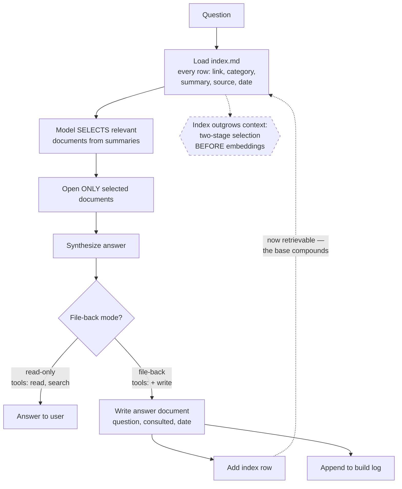

# Index-Guided Retrieval

> Skip the vector store. Give the model a well-maintained index of summaries, let it choose which documents to open, and let the answer it produces become a new document.

## What this pattern is

The reflex when a knowledge base needs querying is to reach for embeddings: chunk,
vectorize, store, retrieve by similarity. That machinery is appropriate at a scale
most personal knowledge bases never reach.

The alternative exploits something the compilation step (card 13) already produced:
a curated index where every document has a one-line summary, a category and a date.
That index is small enough to read entirely. So the retrieval step becomes:

1. Put the **index** in front of the model, not the corpus.
2. Let it **select** the handful of documents that bear on the question.
3. Let it **open** those and synthesize an answer.
4. Optionally, **file the answer back** as a new document, with its own index row.

Selection is done by a model reading summaries — which is what the summaries were
written for — rather than by cosine distance over chunks that were never written to
be retrieved in isolation.

## Why it exists

Embedding-based retrieval has costs that are easy to underestimate for a corpus of
a few dozen documents: an embedding model, a store to maintain, a chunking strategy
that interacts badly with structured documents, a re-indexing step on every write,
and a failure mode — retrieving a chunk that is semantically near and practically
irrelevant — that is hard to debug because there is no readable intermediate.

Index-guided retrieval has none of those. It has no dependencies beyond files, its
selection step is fully inspectable (you can read which documents it chose and
why), and it stays correct when documents are edited, because there is no derived
state to invalidate.

The fourth step is the one that compounds. An answered question that is filed back
becomes retrievable, so the base gets better at the questions it has already been
asked — a knowledge base that learns from being used.

**Without it:** either a vector pipeline disproportionate to the corpus, or no
retrieval at all and a base that is written but never read.

## Where it belongs

```
   knowledge/ (card 13 output)
        │
        ├── index.md  ────────────┐  small, curated, entirely readable
        │                         ▼
   question ───────────────► [ SELECT ]  model reads index, picks documents
                                  │
                                  ▼
                            [ OPEN ]  only the selected documents
                                  │
                                  ▼
                            [ SYNTHESIZE ]
                                  │
                        ┌─────────┴─────────┐
                        ▼                   ▼
                     answer          filed back as a
                                     new document + index row
```

## How it works

1. **Treat the index as the retrieval surface.** Every row carries a link, a
   category, a one-line summary, its source, and a date. The summary is written to
   support exactly this decision, which is why it must be a real summary and not a
   restatement of the title.

2. **Give the model the index and the question, and ask it to choose.** Selection
   is a reading-comprehension task over a small table. It is the step embeddings
   approximate; here it is done directly.

3. **Open only what was selected.** The cost of an answer is the index plus a few
   documents, not the corpus. This is progressive disclosure (card 02) applied to
   knowledge rather than to instructions.

4. **Constrain the tools by intent.** A read-only query gets read and search tools.
   A query that files its answer back additionally gets write tools. The capability
   grant is the difference between the two modes, not an instruction.

5. **File answers back into their own category.** A filed answer records the
   question, the documents consulted, the answer, and the date. It is kept separate
   from compiled documents because its provenance is different — synthesized, not
   extracted.

6. **Update the index and the build log on file-back.** An answer that is not
   indexed is not retrievable, which makes it a document that exists and cannot be
   found — strictly worse than not writing it.

7. **Let the corpus size decide the strategy.** While the index fits comfortably in
   context, this works. When it does not, the fix is a two-stage selection — choose
   a category, then choose within it — before reaching for embeddings.

## What it depends on

| Dependency | Why it is needed | What happens if absent |
| --- | --- | --- |
| A maintained index with real summaries | It is the entire retrieval surface | Selection degrades to guessing from titles |
| Index rows that stay in sync with documents | A stale row points at something that has moved or changed | Selection picks documents that do not answer the question |
| A corpus small enough for the index to fit | The premise of the approach | Silent truncation of the index; documents become invisible |
| Write access for file-back | The compounding step needs it | Answers are produced and lost |
| Structural lint (card 15) | Broken links and orphans degrade selection quality | Retrieval failures that look like knowledge gaps |

## How it interacts with other patterns

| Pattern | Relationship |
| --- | --- |
| [13 Log-as-Source Compilation](13-log-as-source-compilation.md) | Produces the index this card consumes; filed answers become input to future compilations |
| [15 Structural Lint](15-structural-lint.md) | Keeps the retrieval surface honest — orphans and broken links are retrieval bugs |
| [02 Progressive Disclosure](02-progressive-disclosure.md) | The same load-what-is-needed principle, applied to a knowledge corpus |
| [20 Repository Projection Pipeline](20-repository-projection-pipeline.md) | Produces a comparable index for a codebase, queried the same way |

## Constraints and trade-offs

- **It scales with the index, not with the corpus** — but the index grows with the
  corpus, so the ceiling is real. A few hundred rows is the practical limit before
  the index crowds the context.
- **Selection quality is bounded by summary quality.** A lazy one-line summary
  makes its document effectively unreachable. The retrieval system's accuracy is
  determined at write time, by the compiler, not at read time.
- **No semantic matching.** A question phrased in vocabulary the summaries do not
  use may miss a relevant document that embeddings would have found. The trade is
  inspectability for recall.
- **Every query costs a model call**, and the full-index prompt makes it a
  non-trivial one. This is not a cheap lookup; it is a small research task.
- **File-back inflates the corpus with synthesized content.** Answers are less
  reliable than extracted knowledge, and once filed they look the same in the index.

## Failure modes

| Failure | Symptom | Root cause |
| --- | --- | --- |
| Weak summaries | Relevant documents never selected | Index rows restate titles instead of summarizing content |
| Index drift | Selection picks documents that do not contain what the row promised | Documents edited without updating their row |
| Silent index truncation | Recently added documents are never chosen | Index outgrew the context; truncation is invisible |
| Vocabulary miss | A known-good answer exists and is not found | Question phrased outside the summaries' vocabulary |
| Unindexed file-back | Answers accumulate and are never retrieved | Index update step skipped |
| Synthesized contamination | Retrieval returns a previous answer's speculation as fact | Filed answers not distinguished from extracted knowledge |
| Never used | The read path works and nobody uses it | Querying requires remembering a command (card 07) |

## Diagram



## How to validate an implementation

- [ ] Every document has an index row, and every row points at a document that exists.
- [ ] Summaries describe content, not titles — spot-check by trying to select from summaries alone.
- [ ] The full index fits in context with room for the selected documents; the margin is known, not assumed.
- [ ] Read-only queries are granted read-only tools; write access is the file-back mode's distinguishing feature.
- [ ] Filed answers land in their own category and are distinguishable from extracted knowledge.
- [ ] File-back updates both the index and the build log in the same operation.
- [ ] A query counter or log exists, so "nobody uses this" is detectable.

## How it evolves

**At a few dozen documents**, this is straightforwardly the right design and the
vector store would be overhead. **At a few hundred**, the index becomes the
dominant prompt cost and two-stage selection — category first, then documents —
buys another order of magnitude. **Beyond that**, embeddings start to earn their
keep, and the index remains useful as a human-facing table of contents.

The honest evolution signal is not corpus size but miss rate: when questions that
should have been answerable are regularly missed, the selection step has become the
bottleneck. Until then, added retrieval machinery is cost without benefit.

## Skeleton

Minimal prototype in [`../skeletons/14-index-guided-retrieval/`](../skeletons/14-index-guided-retrieval/):
a small indexed corpus, a stdlib query runner with the selection step stubbed and
inspectable, and a file-back mode that writes an answer and its index row.

## Provenance

Instanced in the source system as a query script of roughly 120 lines whose module
docstring states the design directly — no retrieval-augmented generation, no
embeddings; the model reads the structured index, picks the relevant documents, and
synthesizes. Tool grants differ by mode: read and search for a plain query, with
write added only when the answer is to be filed back. File-back writes a document
into a dedicated category, adds an index row, and appends a build-log entry naming
which documents were consulted.

**Partially implemented, precisely:** the read path was built and never used. The
filed-answers category is empty and the persisted query counter stands at zero
across the kit's entire recorded lifetime, while the write path — capture and
compilation — ran daily for weeks and produced 64 documents.

That asymmetry is the most useful thing this card has to offer. The base was
carefully built and never consulted, because writing was automatic (card 12) and
reading required remembering that a command existed (card 07). A retrieval system
whose invocation depends on human recall competes with asking the model directly,
and loses, because the model is already in the conversation and the command is not.
