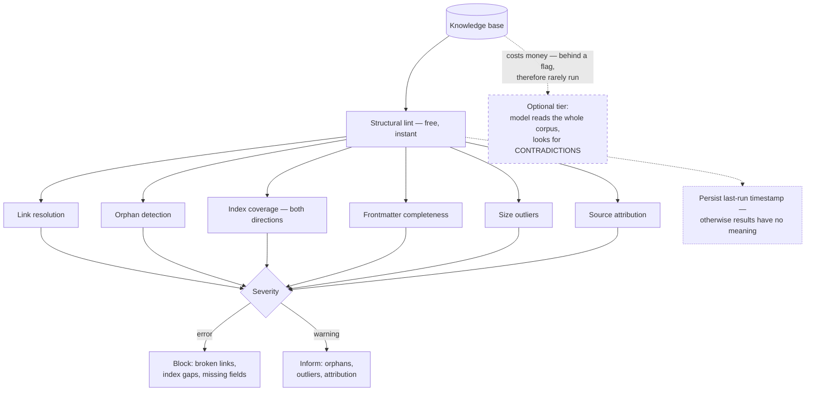

# Structural Lint for Knowledge Bases

> A knowledge base has mechanical properties that are cheap to check and expensive to lose — run the checks that need no model, and keep the ones that do behind a flag.

## What this pattern is

A generated knowledge base decays in ways that are invisible to anyone reading a
single document. Links point at documents that were renamed. Documents accumulate
that nothing links to. Entries grow far beyond or shrink far below the size their
format implies. The index drifts out of agreement with the directory.

None of these show up while reading, because reading is local and the defects are
relational. All of them degrade retrieval (card 14), because retrieval is exactly
the operation that traverses relationships.

Structural lint is a set of cheap, deterministic checks over those relationships:

| Check | Severity | What it catches |
| --- | --- | --- |
| Link resolution | error | References to documents that do not exist |
| Orphan detection | warning | Documents nothing links to |
| Index coverage | error | Documents missing from the index, rows pointing nowhere |
| Frontmatter completeness | error | Missing required fields |
| Size outliers | warning | Documents far outside the expected range |
| Source attribution | warning | Documents that do not link back to their origin |

Everything above is decidable with file I/O and regular expressions. A separate,
optional tier uses a model to look for *contradictions* between documents — real
value, real cost, and correctly kept behind a flag.

## Why it exists

The corpus is produced automatically (card 13), which means defects are produced
automatically too. A compiler that renames a document and does not update the two
references to it has silently broken retrieval for both, and nothing in the
pipeline notices.

The economics are what make this worth building: the structural checks cost
milliseconds and no money, and they catch the failures that would otherwise be
discovered as "the knowledge base does not seem to have anything about that" — a
symptom that looks like a knowledge gap and is actually a broken link.

The deeper argument is the one from card 05: a generated artifact that is never
mechanically verified drifts from reality, and the drift is silent. Lint is the
cheapest available form of that verification.

**Without it:** the base degrades relationally while every individual document
still reads correctly, and retrieval quality declines with no attributable cause.

## Where it belongs

```
   compile (card 13) ──► knowledge base ──► retrieval (card 14)
                              │   ▲
                              ▼   │
                         ┌─────────────┐
                         │ STRUCTURAL  │  free, instant, deterministic
                         │    LINT     │  ─────────────────────────────
                         └──────┬──────┘  optional: model-based
                                │          contradiction check (costs money)
                         errors block
                         warnings inform
```

## How it works

1. **Separate errors from warnings and mean it.** A broken link is an error: it is
   unambiguously wrong. An orphan is a warning: it may be a genuine entry point. A
   linter where everything is fatal gets bypassed; one where nothing is gets ignored.

2. **Resolve every link against the filesystem.** Parse the cross-reference syntax,
   skip references to the source layer (those point outside the corpus by design),
   and check the rest resolve to real files.

3. **Count inbound links to find orphans.** For each document, count how many others
   reference it, excluding itself. Zero inbound links means nothing will ever lead a
   reader — or a retrieval step — to it.

4. **Check the index both ways.** Every document has a row; every row has a
   document. One-directional checking misses half the drift.

5. **Validate frontmatter presence, not content.** Required fields exist and parse.
   Whether the category is the *right* category is a judgment, and judgments belong
   in the optional tier.

6. **Flag size outliers rather than enforcing a range.** A document an order of
   magnitude larger than its peers is usually an unsplit compilation; one that is
   tiny is usually a stub. Both are worth a look and neither is automatically wrong.

7. **Keep the expensive check optional and explicit.** Contradiction detection
   across a corpus is genuinely useful and requires a model to read everything. It
   belongs behind a flag, with the structural tier as the default.

8. **Record when the lint last ran.** A linter's output is only meaningful with a
   date attached. Persisting the last-run timestamp is what makes "this has not been
   checked in four months" visible.

## What it depends on

| Dependency | Why it is needed | What happens if absent |
| --- | --- | --- |
| A machine-readable cross-reference syntax | Links must be extractable | Relationships cannot be checked at all |
| A canonical index | Coverage checking needs a reference | Only half the drift is detectable |
| Consistent frontmatter | The completeness check has to know what is required | Checks become guesses |
| A trigger | Lint that must be remembered will not be run | Runs once at build time; card 10's failure |
| Severity discipline | Determines whether the output is read | Linter ignored or bypassed |

## How it interacts with other patterns

| Pattern | Relationship |
| --- | --- |
| [13 Log-as-Source Compilation](13-log-as-source-compilation.md) | Produces the corpus and its defects; lint is the natural post-compile step |
| [14 Index-Guided Retrieval](14-index-guided-retrieval.md) | Depends on exactly what lint protects — index accuracy and link integrity |
| [05 Instruction Provenance and Drift](05-instruction-provenance-and-drift.md) | Same philosophy applied to instructions: mechanical resolution beats reading for plausibility |
| [09 Scaffold, Validate, Package](09-scaffold-validate-package.md) | The same error/warning split and the same insistence on decidable checks |

## Constraints and trade-offs

- **Structure is not quality.** A base can pass every check and be full of
  duplicated, shallow or wrong documents. Lint says the graph is intact; it says
  nothing about whether the nodes are worth having.
- **Orphan warnings are noisy.** Legitimate entry points have no inbound links, so
  the warning fires on correct documents and trains people to skim past it.
- **The contradiction check is the valuable one and the one that will not be run.**
  It costs money per invocation, so in practice it runs rarely or never — the
  structural tier is what actually protects the base.
- **Lint has no authority.** Unlike a packaging gate (card 09) it blocks nothing. It
  reports, and reports can be ignored indefinitely.

## Failure modes

| Failure | Symptom | Root cause |
| --- | --- | --- |
| Never re-run | Base degrades for months; lint output is from the first week | No trigger tied to compilation |
| Warning blindness | Real issues scroll past unread | Orphan warnings fire on legitimate entry points |
| One-directional index check | Documents exist that the index never lists | Only rows checked, not files |
| Passes while broken | Green lint over a base full of near-duplicates | Structural checks mistaken for quality assurance |
| Unrun expensive tier | Contradictions accumulate between documents | Model-based check behind a flag nobody sets |
| No authority | Errors reported, corpus published anyway | Lint not wired to anything that can refuse |

## Diagram



## How to validate an implementation

- [ ] Every check is deterministic and needs no model; the model-based tier is separate and optional.
- [ ] Errors and warnings are distinguished, and the split is defensible per check.
- [ ] Link resolution skips references that intentionally point outside the corpus.
- [ ] Index coverage is checked in both directions.
- [ ] The last-run timestamp is persisted and surfaced.
- [ ] The lint runs automatically after compilation, not on request.
- [ ] Something acts on errors — a gate, a refusal, or at minimum a visible report that a human sees.
- [ ] The linter has been run against a deliberately broken corpus to confirm it fails.

## How it evolves

**Early**, the checks are trivial and catch almost nothing, because the corpus is
small and freshly written. **In the middle**, they start earning their cost —
renames and restructures accumulate, and link resolution becomes the check that
matters. **At scale**, orphan detection turns into a genuine curation signal:
consistently unlinked documents are usually documents that should not have been
written.

The pattern's ceiling is that it never becomes quality assurance. Growing it in
that direction means the contradiction tier, which costs money and therefore needs
a trigger and a budget, not just a flag.

## Skeleton

Minimal prototype in [`../skeletons/15-structural-lint/`](../skeletons/15-structural-lint/):
a stdlib linter implementing the six structural checks with the error/warning split,
run against a deliberately broken corpus so the failure output is visible.

## Provenance

Instanced in the source system as a linter of roughly 215 lines, documented as six
structural checks that are free and instant, with an optional model-based
contradiction check. The implementation skips references pointing into the source
layer when resolving links, counts inbound references to detect orphans, and
excludes frontmatter when measuring document size. State is persisted, including the
timestamp of the last run.

**Partially implemented, precisely:** the persisted state shows exactly one lint
run, dated the first day of the kit's recorded life. Over the following weeks the
corpus grew to 64 documents across seven categories and the linter never ran again.
By the end, one category held a single document and another held none, and the
distribution across the rest was heavily skewed — precisely the curation signal
orphan and coverage checks are meant to surface.

The gap has the same shape as cards 10 and 14: the tool was built competently and
was not wired to anything. Compilation ran automatically because a hook triggered
it; lint required a person to decide to run it, and after the first day nobody did.
The transferable lesson is that in a single-operator system, *automatic* and
*never* are the only two stable frequencies.
