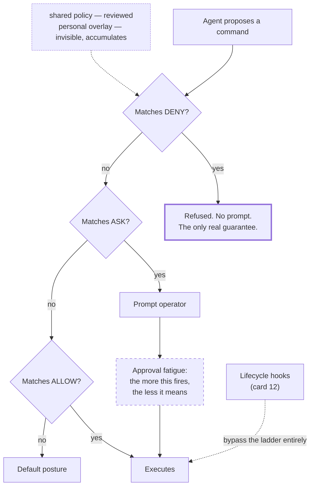

# The Permission Ladder

> Three rungs — allow, ask, deny — and only the bottom one is a guarantee. Everything else is a convenience that a tired operator will click through.

## What this pattern is

An agent with shell access needs a policy about what it may run. The pattern
structures that policy as three rungs, distinguished by *who decides and when*:

| Rung | Meaning | Decided by |
| --- | --- | --- |
| **allow** | Runs without interruption | Author, in advance |
| **ask** | Prompts before running | Operator, in the moment |
| **deny** | Never runs, no prompt offered | Author, in advance, unconditionally |

The design insight is that the middle rung is the weakest, not the safest. A prompt
transfers the decision to a human who is mid-task, has approved eleven similar
prompts already, and is optimizing for momentum. Approval fatigue is not a
hypothetical: it is the normal outcome of any prompt that fires often.

So the ladder is used deliberately. **Allow** covers the verbs that make the agent
useful — read-only inspection, linting, planning. **Deny** covers the verbs whose
consequences are irreversible, and it is the only rung that actually guarantees
anything. **Ask** is reserved for the narrow band where the consequence depends on
context the author could not evaluate in advance.

## Why it exists

Without a policy there are two failure modes, and teams oscillate between them.

Approve everything, and the agent eventually runs a destructive command — not
maliciously, but because it was the plausible next step and nothing stopped it.
Prompt for everything, and the operator approves reflexively within a day, which
produces the illusion of control and the reality of blanket approval, plus
friction.

The ladder resolves this by moving decisions off the critical path in both
directions: the safe verbs stop asking, the dangerous verbs stop asking too — in
the other sense.

**Without it:** either an agent that can destroy things, or an operator who has been
trained by their own tooling to click approve without reading.

## Where it belongs

```
   agent proposes a command
             │
             ▼
   ┌──────────────────────┐
   │  DENY  — matched?    │──► refused. no prompt. no override.
   └──────────┬───────────┘
              │ no
   ┌──────────▼───────────┐
   │  ASK   — matched?    │──► prompt the operator (weakest rung)
   └──────────┬───────────┘
              │ no
   ┌──────────▼───────────┐
   │  ALLOW — matched?    │──► runs silently
   └──────────┬───────────┘
              │ no
         default posture
```

## How it works

1. **Allow the read-only surface generously.** Inspection, status, diff, log,
   linting, syntax checking, dry runs. These are what make an agent worth having,
   and prompting on them trains the operator to stop reading prompts.

2. **Deny by verb, not by target.** The destructive operations in the source
   system's denylist are deletion, uninstallation and rollback — the verbs whose
   consequences are not reversible by re-running the deployment. A denylist keyed on
   *what the command does* survives; one keyed on which resource it touches does
   not.

3. **Reserve ask for genuine context-dependence.** The source system used exactly
   one: pushing to a remote. The consequence depends on the branch, the remote and
   what else is in flight — all things the operator knows and the author could not.

4. **Separate shared policy from personal policy.** A checked-in file carries the
   policy every operator gets; a local, uncommitted file carries individual
   exceptions and machine-specific grants. This keeps one person's convenience from
   silently becoming everyone's baseline.

5. **Keep hook registration in the personal layer.** Hooks execute automatically on
   lifecycle events, outside the prompting mechanism entirely (card 12). That is a
   real bypass, and scoping it per-machine bounds the damage a bad hook can do.

6. **Watch the local file for scope creep.** Personal allowlists accumulate
   single-use grants — a specific URL fetched once, a one-off command. Each is
   harmless and the aggregate is an unreviewed policy. The source system's local
   file had accumulated nine such entries, including several one-time API fetches
   that never needed to persist.

7. **Understand that the ladder does not reason.** It matches patterns. It cannot
   tell a safe deletion from a catastrophic one, which is why the dangerous verbs
   are denied outright rather than evaluated — and why the reasoning-based control
   is a separate pattern (card 17).

## What it depends on

| Dependency | Why it is needed | What happens if absent |
| --- | --- | --- |
| Pattern matching over proposed commands | The enforcement mechanism | Policy becomes instruction, which is advice |
| Deny evaluated before allow | Otherwise a broad allow shadows a specific deny | The denylist is bypassable by construction |
| A shared/personal split | Prevents individual exceptions becoming defaults | Convenience grants propagate silently |
| Honest verb classification | The denylist is only as good as its list of destructive verbs | Irreversible operations outside the policy |
| Periodic review of the local layer | Accumulation is invisible | An unreviewed policy larger than the reviewed one |

## How it interacts with other patterns

| Pattern | Relationship |
| --- | --- |
| [17 Blast-Radius Gating](17-blast-radius-gating.md) | The reasoning layer above this one. The ladder is syntactic; blast-radius gating is semantic, and neither substitutes for the other |
| [12 Lifecycle Hooks](12-lifecycle-hooks-as-capture-points.md) | Hooks run outside the ladder entirely — the most important exception to understand |
| [07 Capability Taxonomy](07-capability-taxonomy.md) | Subagent tool narrowing is the same idea at a different granularity: capability, not instruction |
| [18 The Redaction Boundary](18-the-redaction-boundary.md) | Controls what leaves the system, as the ladder controls what executes inside it |

## Constraints and trade-offs

- **Pattern matching is shallow.** The ladder sees command text. A destructive
  operation reached by an unusual path, a script, or an alias is not matched, and
  the policy provides no defence in depth.
- **Denying verbs blocks legitimate work.** There are times a deletion is the
  correct action, and the policy makes those moments manual. That friction is the
  point, and it is still friction.
- **Ask is a decision-quality problem, not a security control.** Every prompt is
  answered by a human under time pressure. Designing as though prompts are a real
  barrier is the most common misuse of the ladder.
- **The personal layer is invisible to review.** By design it is uncommitted, so
  nobody sees what has accumulated there — including its owner.
- **Denylists enumerate known dangers.** They protect against the destructive verbs
  someone thought of, and no others.

## Failure modes

| Failure | Symptom | Root cause |
| --- | --- | --- |
| Approval fatigue | Operator approves without reading; prompts stop functioning | Too many entries on the ask rung |
| Shadowed deny | A destructive command runs despite being denied | Broad allow evaluated before the specific deny |
| Local creep | The personal allowlist grows past what anyone has reviewed | One-off grants persisted instead of being temporary |
| Bypass by indirection | Denied verb executed inside a script or alias | Matching is textual and shallow |
| Hook blind spot | Automatic code runs with no policy applied at all | Hooks execute outside the ladder |
| False confidence | The ladder is treated as a safety guarantee | Syntactic matching mistaken for semantic understanding |
| Unreviewed inheritance | A permission set copied from another project grants unexpected access | Same provenance problem as card 05 |

## Diagram



## How to validate an implementation

- [ ] Deny is evaluated before allow; verify with a command matching both.
- [ ] The denylist is keyed on destructive verbs, not on specific targets.
- [ ] The ask rung has few entries — count them, and justify each.
- [ ] Shared and personal policy are separate files, and the personal one is not committed.
- [ ] The personal layer has been reviewed recently; one-off grants have been removed.
- [ ] Hook registration is scoped per machine, and it is understood that hooks bypass the ladder.
- [ ] Any inherited permission set has been reconciled against what this project actually needs.
- [ ] Someone can state what the ladder does *not* protect against without consulting the file.

## How it evolves

**Early**, the ladder is small and every entry is deliberate. **In the middle**, the
personal layer accumulates — this is where most drift happens, and where periodic
pruning has the highest value. **At maturity**, the interesting question is no
longer which commands are allowed but which *reasoning* precedes a dangerous one,
and that is card 17.

The ladder does not scale into a security boundary and should not be pushed there.
Its job is to keep routine work frictionless and irreversible work manual. Attempts
to make it smarter usually mean the real control belongs at a different layer:
capability narrowing (card 07), semantic gating (card 17), or simply not giving the
agent the credential.

## Skeleton

Minimal prototype in [`../skeletons/16-the-permission-ladder/`](../skeletons/16-the-permission-ladder/):
a shared policy, a personal overlay with deliberate accumulation, and a stdlib
matcher demonstrating precedence, a shadowed-deny case, and a bypass-by-script case.

## Provenance

Instanced in the source system as a two-file policy. The shared file allowed the
read-and-plan surface — configuration management commands including linting,
dependency installation and encrypted-vault operations, cluster inspection, package
management, and read-only version-control verbs — denied exactly three destructive
operations, and asked on exactly one: pushing to a remote.

The proportions are the lesson: nine allow entries, three deny, one ask. The author
understood that the ask rung is expensive and used it once, for the single operation
whose consequence genuinely depends on context the policy could not evaluate.

The personal overlay shows the predicted drift. It had accumulated nine additional
grants, several of them specific one-time API fetches from a debugging session,
retained long after the session ended. It also carried the lifecycle hook
registrations — correctly scoped to one machine, and a reminder that the most
powerful automatic execution in the system sat outside the ladder entirely.
