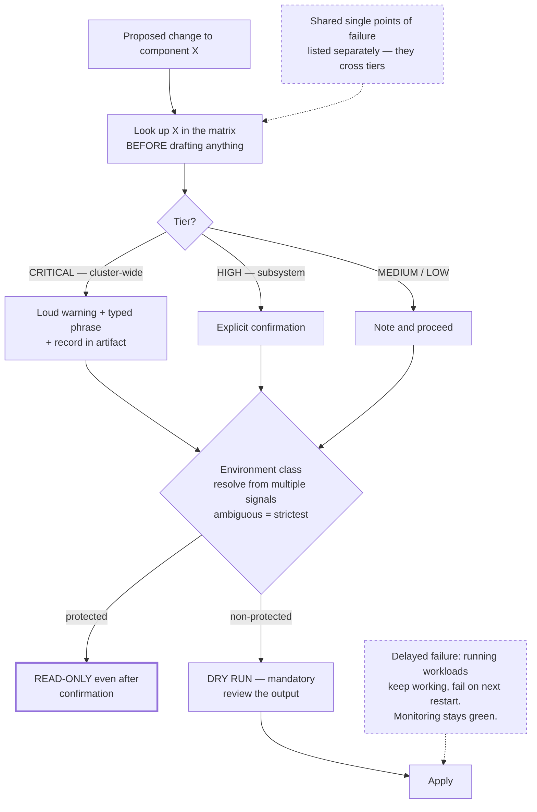

# Blast-Radius Gating

> Classify every component by how many things break when it breaks, look that up *before* proposing a change, and make the highest tier require a human sentence that cannot be produced by momentum.

## What this pattern is

The permission ladder (card 16) matches command text. It cannot distinguish a
restart of an isolated cache from a restart of the component every other component
depends on — the commands look identical.

Blast-radius gating supplies the missing semantics. It consists of four parts:

1. **A classification**, written in advance, ranking components by *dependent
   count* rather than by importance or by how much attention they get.
2. **A lookup step** that runs before a change is proposed, not after it is
   drafted.
3. **A confirmation requirement** proportional to the tier, where the top tier
   demands an explicit typed phrase rather than a yes.
4. **A mandatory dry run** before every apply, with its output reviewed.

The unit of risk is dependents, not severity. This matters because the components
with the largest blast radius are usually the boring infrastructural ones —
networking, storage, certificate issuance — while the components people worry about
are the user-visible ones, which are often isolated.

## Why it exists

An agent proposing an infrastructure change has no inherent sense of consequence. It
can reason about correctness — will this command do what I intend — but not about
scope, because scope is a property of the system's topology and is not visible in
the command.

Worse, consequence is frequently **delayed**. A change that breaks credential
distribution does not take anything down immediately: running workloads keep what
they already hold and fail on their next restart, hours or days later, detached from
the cause. Monitoring stays green throughout. Nothing about the moment of the change
signals its severity.

**Without it:** changes are evaluated on whether the command is correct rather than
on what depends on the thing being changed, and the delayed failures are the ones
that produce incidents.

## Where it belongs

```
   proposed change
         │
         ▼
   ┌──────────────────┐
   │ 1. CLASSIFY      │  look up component in the matrix
   └────────┬─────────┘
            ▼
   ┌──────────────────┐
   │ 2. ENVIRONMENT   │  which class of environment is this?
   └────────┬─────────┘
            ▼
   ┌──────────────────┐
   │ 3. CONFIRM       │  proportional to tier; top tier = typed phrase
   └────────┬─────────┘
            ▼
   ┌──────────────────┐
   │ 4. DRY RUN       │  mandatory, output reviewed, no exceptions
   └────────┬─────────┘
            ▼
         apply
```

## How it works

1. **Write the matrix before you need it.** Each component gets a tier, a stated
   impact, and — the field that does the work — an explicit list of dependents. The
   source system's tiers were: cluster-wide failure, major subsystem failure,
   service degradation, isolated impact.

2. **Classify by dependents, and let the result be counter-intuitive.** In the
   source matrix, the networking layer, the storage layer and certificate issuance
   occupied the top tier, while the API gateway and the container registry sat at
   the bottom — the registry because cached images keep working, the gateway because
   services remain reachable directly. Neither ranking is obvious from the
   component's prominence.

3. **List the shared single points of failure separately.** Components that many
   subsystems depend on — a shared object store backing every telemetry backend and
   every backup, a directory service, DNS — deserve their own section, because
   their failure crosses tier boundaries and is easy to miss when reasoning
   component by component.

4. **Run the check first, as a distinct step.** The source system's sprint skill
   makes this explicit: the blast-radius check is step one of every workstream,
   before analysis, before implementation. Running it after drafting a change
   invites rationalization.

5. **Resolve the environment class defensively.** Determine which environment is
   being targeted from multiple signals, prefer the stricter interpretation when
   they disagree, and treat an unqualified or ambiguous target as the most
   protected class. Getting this backwards is the highest-cost error available.

6. **Make the top-tier confirmation unfakeable by momentum.** Not a yes/no prompt —
   a specific typed phrase, plus a loud restatement of what was resolved and why it
   matters. This defeats the approval reflex the ask rung suffers from (card 16).
   Record the confirmation in the artifact.

7. **Keep the highest guard read-only even after confirmation.** In the source
   system, confirming work against the protected environment grants inspection, not
   mutation. The confirmation unlocks looking, never touching.

8. **Dry-run every apply and review the output.** Stated in the source as "no
   exceptions, no shortcuts". The dry run is what converts a reasoned intention into
   observed behavior before it is real.

## What it depends on

| Dependency | Why it is needed | What happens if absent |
| --- | --- | --- |
| An accurate dependency map | The classification is only as good as the topology it encodes | Confident gating on wrong tiers |
| A dry-run capability in the tooling | The final gate assumes changes can be simulated | The last check before reality is missing |
| Environment resolution from real signals | Everything keys off which environment this is | The strictest protections apply to the wrong place |
| A confirmation that resists reflex | Top-tier protection is the whole point | Degrades to the ask rung and its fatigue |
| Maintenance of the matrix | Topologies change | Silently stale classifications, which are worse than none |

## How it interacts with other patterns

| Pattern | Relationship |
| --- | --- |
| [16 The Permission Ladder](16-the-permission-ladder.md) | Syntactic layer beneath this one; the ladder blocks verbs, this gates by consequence |
| [19 Scope Lock](19-scope-lock-and-checkpoint-delivery.md) | Both freeze a judgment before work starts, so it cannot be renegotiated mid-task |
| [06 Calibrated Degrees of Freedom](06-calibrated-degrees-of-freedom.md) | Same cost-of-failure calculus, applied to instruction design instead of infrastructure |
| [11 Adversarial Role Separation](11-adversarial-role-separation.md) | Both refuse to let the party doing the work also decide whether it is acceptable |

## Constraints and trade-offs

- **The matrix is a maintained artifact and will go stale.** Dependencies change
  with every architectural decision, and a stale matrix produces confident,
  wrong classifications — arguably worse than having none, because it is trusted.
- **Classification is coarse.** Four tiers cannot express that a component is
  critical for one operation and isolated for another. Real risk varies by change,
  not only by component.
- **Gating slows legitimate work.** Top-tier components are often exactly the ones
  needing attention, and the friction lands hardest where the work is most needed.
- **It assumes the topology is knowable.** In systems where dependencies are
  discovered rather than documented, writing the matrix is itself a significant
  project.
- **Confirmation theater is a real risk.** Any confirmation used often enough
  becomes automatic, including a typed phrase. The protection decays with use.

## Failure modes

| Failure | Symptom | Root cause |
| --- | --- | --- |
| Stale matrix | A component classified isolated takes down three others | Topology changed; matrix did not |
| Check after drafting | The change exists, then the risk is assessed and rationalized | Gate not placed first in the sequence |
| Environment misresolution | Protections applied to the wrong environment | Ambiguous target resolved permissively instead of strictly |
| Delayed-failure blindness | Change looks successful; failure arrives on the next restart | Validation checked liveness rather than the dependency itself |
| Skipped dry run | An apply surprises its author | Dry run treated as optional when time is short |
| Missed shared dependency | Several subsystems fail from one change | Reasoning component-by-component missed a shared backend |
| Confirmation erosion | Typed phrase produced reflexively | The same gate fired too often |

## Diagram



## How to validate an implementation

- [ ] A written matrix exists, ranking components by dependent count with dependents listed explicitly.
- [ ] Shared single points of failure are enumerated separately from the per-component tiers.
- [ ] The blast-radius lookup is the first step of a change, before any draft exists.
- [ ] Environment class is resolved from multiple signals, and ambiguity resolves to the strictest class.
- [ ] Top-tier changes require a typed phrase, not a yes, and the confirmation is recorded.
- [ ] Work against the most protected environment remains read-only after confirmation.
- [ ] Every apply is preceded by a dry run whose output is reviewed.
- [ ] Validation checks the dependency directly rather than the liveness of its consumers.
- [ ] The matrix has been reviewed since the last architectural change.

## How it evolves

**Early**, writing the matrix is the valuable part — the act of enumerating
dependents teaches the topology, often revealing chains nobody had stated. **In the
middle**, the matrix becomes a shared reference used outside the agent context, by
humans, during incidents. **At maturity**, the maintenance burden dominates, and the
question becomes whether the classification can be derived from the system rather
than asserted about it.

Derived classification is the real evolution: dependency data extracted from live
configuration is never stale, and a matrix that regenerates is worth more than one
that is carefully written once. That is the same projection idea as card 20.

## Skeleton

Minimal prototype in [`../skeletons/17-blast-radius-gating/`](../skeletons/17-blast-radius-gating/):
a matrix in a data file, a stdlib checker that resolves tier and dependents,
environment resolution with ambiguity defaulting strict, and a confirmation step
that rejects anything but the exact phrase.

## Provenance

Instanced in the source system as a reference matrix classifying components into
four tiers with explicit dependent lists and a separate section for shared single
points of failure, plus a checker script invoked as the first step of each
workstream in its hardening skill. That skill's workflow makes the ordering explicit
— the blast-radius check runs before analysis, and a top-tier result requires
explicit user confirmation before the work continues.

A second instance appears in the kit's investigation skill: an environment guard
that resolves the target from multiple signals, prefers the stricter reading when
they conflict, treats an unqualified target as the most protected class, prints a
loud warning with the resolved name, requires a specific typed phrase, and — after
confirmation — permits only read operations, recording the confirmation in the
resulting artifact.

The delayed-failure problem is documented in the kit's own compiled knowledge: a
trust-chain change that left roughly two dozen workloads holding stale credentials
without any alert firing, because running workloads keep what they already have and
fail only on restart. That incident is why validation in this pattern checks the
dependency directly rather than the health of its consumers.
