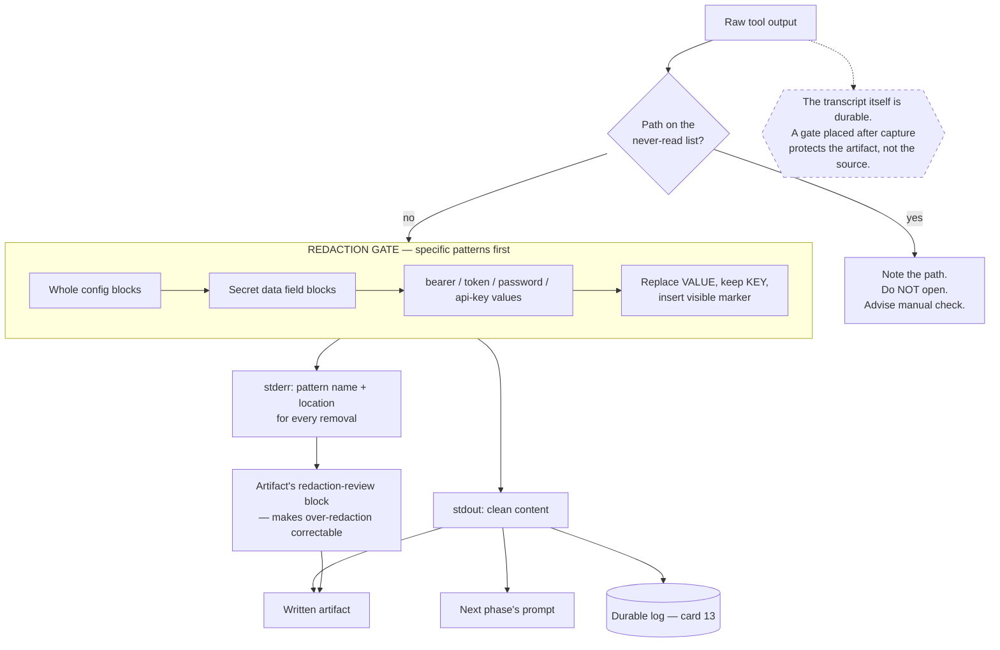

# The Redaction Boundary

> Put one scrubbing gate between raw tool output and anything durable, bias it toward over-redaction, and make it report what it removed so a human can audit the loss.

## What this pattern is

An agent working on real infrastructure reads output containing credentials — token
values, password fields, encoded secret payloads, whole cluster configuration
blocks. That output then travels: into the agent's context, into prompts for later
phases, into written artifacts, into logs, and eventually into anything those
artifacts feed.

The pattern establishes a single boundary that this material must cross, with four
properties:

- **Mandatory placement.** Every path from raw output to anything persistent goes
  through it. A gate with a bypass is decoration.
- **Conservative bias.** When uncertain, redact. Over-redaction costs a question;
  under-redaction is irreversible once the artifact exists.
- **Auditability.** Each removal is reported — what pattern matched, and where — so
  a human can verify nothing important was lost.
- **Prevention as well as scrubbing.** A list of paths that must never be read at
  all, because the cheapest secret to redact is the one never loaded.

## Why it exists

The failure is one-way. Once a credential is written into a durable artifact, it is
in the file, in the history, in whatever was derived from it, and in any backup.
Rotation becomes the only remedy, and rotation requires noticing — which is the
part that does not happen, because nothing about a compiled document announces that
one of its lines is a live secret.

The exposure is also structurally likely rather than exceptional. Inspecting a
secret is a normal diagnostic step. The agent is not doing anything wrong when it
reads that output; the mistake is the absence of a gate between reading it and
keeping it.

**Without it:** credentials accumulate in durable artifacts, silently, and each one
is discovered — if at all — by an audit long after the fact.

## Where it belongs

```
   raw tool output (kubectl, logs, config dumps)
             │
   ┌─────────▼──────────┐
   │ RESTRICTED PATHS   │  never read at all — cheapest redaction
   └─────────┬──────────┘
   ┌─────────▼──────────┐
   │ REDACTION GATE     │  conservative; reports every removal
   └─────────┬──────────┘
             ├──────────► next phase's prompt
             ├──────────► written artifact  ──► + "what was redacted" block
             └──────────► durable log (card 13)
```

## How it works

1. **Order patterns from specific to general.** Structured blocks first — a whole
   cluster-configuration document, the value block under a secrets field — then
   field-level patterns for tokens, passwords, bearer values and API keys. Matching
   the structured form first prevents a general pattern from partially mangling a
   block it should have removed wholesale.

2. **Replace, do not delete.** Substituting a visible marker preserves the shape of
   the output so the surrounding structure stays readable and the reader can see
   that something was removed rather than wondering what is missing.

3. **Redact the value, not the key.** Keeping the field name preserves the
   diagnostic information — that a credential exists here, of this kind — while
   removing the secret. This is what makes redacted output still useful.

4. **Report every hit on a separate channel.** Clean content on one stream, a log of
   pattern-name and location on another. The separation lets the gate be used in a
   pipeline while still producing an audit trail.

5. **Require a redaction-review section in every artifact.** The artifact states
   what was stripped so the operator can confirm nothing important was lost. This is
   what makes conservative bias tolerable: over-redaction is visible and
   correctable, rather than silently degrading the artifact.

6. **Maintain a never-read list.** Encrypted variable files, environment files,
   secrets directories, credential stores, the version-control internals. When a
   search matches something on this list, note the path, do not open it, and record
   an advisory telling the operator to check it manually.

7. **Accept false positives as the design point.** A conservative redactor will
   remove things that were not secrets. That is the correct trade, and the review
   block is where it gets corrected.

## What it depends on

| Dependency | Why it is needed | What happens if absent |
| --- | --- | --- |
| A single chokepoint | Multiple paths mean one of them bypasses the gate | Redaction becomes advisory |
| Pattern coverage for the real formats | Secrets appear in known shapes | Novel shapes pass through unredacted |
| A separate reporting channel | Auditing requires knowing what was removed | Silent redaction is unverifiable |
| A review section in artifacts | Makes conservative bias safe to adopt | Over-redaction silently degrades output |
| A restricted-path list | Prevention beats scrubbing | Secrets enter the pipeline needing to be caught |
| Wiring into every durable path | The gate only protects what routes through it | Protected in one subsystem, absent in another |

## How it interacts with other patterns

| Pattern | Relationship |
| --- | --- |
| [12 Lifecycle Hooks](12-lifecycle-hooks-as-capture-points.md) | Capture is raw and automatic; the gate belongs between extraction and the durable write, and in the source system it was absent there |
| [13 Log-as-Source Compilation](13-log-as-source-compilation.md) | The compiler turns raw source into durable, cross-linked artifacts — the exact promotion this gate is meant to prevent |
| [16 The Permission Ladder](16-the-permission-ladder.md) | The ladder controls what executes; this controls what escapes. Complementary halves of the same concern |
| [05 Instruction Provenance](05-instruction-provenance-and-drift.md) | Both are about verifying mechanically rather than trusting that something is fine |

## Constraints and trade-offs

- **Pattern matching cannot recognize a secret it has no pattern for.** An
  unusually formatted credential, a value with no revealing key name, or a secret in
  a novel encoding passes straight through.
- **Over-redaction hides diagnostic information.** The conservative bias sometimes
  removes exactly the value that would have identified the problem, and the operator
  has to go get it manually.
- **The gate must be wired everywhere, and wiring is invisible work.** Its presence
  in one subsystem says nothing about the others, which is precisely how the source
  system ended up protected in one place and exposed in another.
- **Restricted paths block legitimate reads.** Sometimes the answer genuinely is in
  the file that must not be opened, and the pattern converts that into manual work.
- **It protects the artifact, not the context.** The agent still read the secret. It
  is in the session transcript, which is itself a durable artifact if anything
  captures it — and something does (card 12).

## Failure modes

| Failure | Symptom | Root cause |
| --- | --- | --- |
| Unwired path | Secrets in a durable artifact despite the gate existing | One subsystem writes without routing through it |
| Novel format | A credential passes through untouched | No pattern matched its shape |
| Silent over-redaction | Artifact missing information nobody can identify | No review block; removals unreported |
| Partial mangling | A structured block half-redacted, leaving fragments | General pattern matched before the structured one |
| Transcript exposure | Artifact is clean; the raw transcript that produced it is not | Gate placed after capture rather than before |
| Restricted-path leak | A grep result quotes a line from a never-read file | Search results not filtered through the path list |
| Rotation never triggered | Exposure found and nothing follows | No procedure attached to a positive finding |

## Diagram



## How to validate an implementation

- [ ] Every path from raw output to a durable artifact routes through the gate — enumerate them and check each.
- [ ] Specific structured patterns are ordered before general field patterns.
- [ ] Redaction replaces values and preserves keys and surrounding structure.
- [ ] Removals are reported on a channel separate from the content.
- [ ] Every generated artifact contains a section listing what was redacted.
- [ ] A restricted-path list exists, and search results are filtered through it, not just direct reads.
- [ ] The gate has been tested against real output shapes, including a whole configuration block.
- [ ] Session capture is redacted, not only written artifacts.
- [ ] A positive finding has a procedure attached: what gets rotated, by whom, and when.

## How it evolves

**Early**, a handful of patterns covering the common credential shapes catches
nearly everything, and the restricted-path list is short and obvious. **In the
middle**, the work is wiring — every new subsystem that writes something durable is
a new path that must route through the gate, and this is where coverage silently
diverges from intent. **At maturity**, the question shifts from pattern matching to
provenance: which artifacts derive from raw output at all, and can that set be kept
small deliberately?

The pattern does not become a security control. It reduces accidental persistence.
An agent with a credential in its context has that credential, and the only
structural answers are narrower capability grants (card 07) and not issuing the
credential in the first place.

## Skeleton

Minimal prototype in [`../skeletons/18-the-redaction-boundary/`](../skeletons/18-the-redaction-boundary/):
a stdlib redactor with ordered patterns and dual-channel output, a restricted-path
checker, a sample containing several credential shapes, and an artifact template
with a redaction-review block.

## Provenance

Instanced in the source system as a redaction script inside its investigation skill:
standard library only, patterns ordered specific-to-general, values replaced while
keys are preserved, clean content to one stream and one report line per removal to
another. Its module docstring states that it is intentionally conservative and
prefers over-redaction, and names the artifact's redaction-review section as the
place where the operator audits what was stripped.

The accompanying safety rules require that all command, version-control and log
output embedded in an artifact — or carried between phases in a prompt — pass
through it first, and add a restricted-path list covering encrypted variable files,
environment files, secrets directories, version-control internals and credential
stores, with the instruction to note a matching path, not open it, and advise a
manual check.

**Partially implemented, precisely:** the gate protected one skill's artifacts and
was never wired into the memory pipeline. Session capture (card 12) is raw by
design, so sixteen unredacted transcripts accumulated — one of them containing
credential-shaped lines — and the compiler (card 13) read that source directly. The
kit had the right mechanism, correctly built, installed on one of the two paths that
needed it. That is the most common shape of this failure: not a missing control, but
a control that was never carried across to the subsystem built later.
