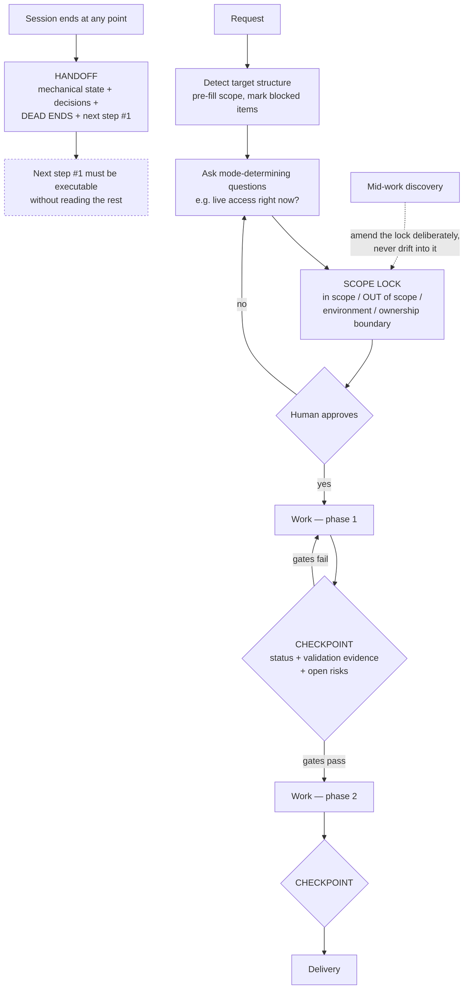

# Scope Lock and Checkpoint Delivery

> Freeze the boundary in a file before work starts, deliver at named checkpoints rather than at completion, and write the handoff while the reasoning is still in the room.

## What this pattern is

Long agent-driven work fails at its edges rather than in its middle. The work
itself proceeds competently; what goes wrong is that the boundary moves, the
progress is invisible until the end, and the reasoning evaporates when the session
does.

The pattern addresses all three with artifacts written at specific moments:

- **Scope lock** — before any work, a file recording what is in scope, what is
  explicitly out, which environment is targeted, what the ownership boundary is, and
  what is already blocked. Approved by the human, then treated as fixed.
- **Checkpoints** — named delivery points partway through, each producing a report
  of status, evidence and open risks. Progress becomes observable before it is
  complete.
- **Handoff** — at session end, a document the next session reads to resume:
  state, decisions with rationale, dead ends, and a first next step specific enough
  to execute without reading the rest.

The shared principle is that judgment is recorded *at the moment it is cheapest and
most accurate*, rather than reconstructed later when it is neither.

## Why it exists

Three distinct losses, each invisible while it happens.

**Scope creeps** because every adjacent improvement is individually reasonable. An
agent asked to fix one thing notices three related things, and the work expands
without anyone deciding it should. By the end, nobody can say whether the original
task was done.

**Progress is invisible** because agent work produces no intermediate signal.
Without checkpoints there is no moment before the end at which a human can say "this
is going the wrong way."

**Reasoning evaporates** at session end. The dead ends are the most valuable part —
the next session will otherwise walk straight into them — and they are exactly what
nobody writes down, because a dead end feels like wasted time rather than a finding.

**Without it:** work of uncertain scope arrives all at once, and the next session
repeats the previous one's mistakes.

## Where it belongs

```
   intake ──► SCOPE LOCK ──► work ──► CHECKPOINT ──► work ──► CHECKPOINT ──► done
                  │                       │                       │
              approved,               status,                 status,
              then fixed              evidence,               evidence,
                                      open risks              open risks
                                                                   │
                            session ends at any point ──► HANDOFF ─┘
```

## How it works

1. **Detect the situation mechanically before asking about it.** A script inspects
   the target — which structures exist, which expected inputs are present, which are
   missing — and pre-fills the scope document, marking blocked items where a
   prerequisite is absent. Starting from detected facts produces a better
   conversation than starting from a blank form.

2. **Ask the questions that determine mode, not preference.** Chief among them:
   does the operator have live access right now? The answer changes the whole
   workflow — with access, the skill generates commands for a human to run; without
   it, the work is analysis only and cluster-dependent items are flagged rather than
   guessed.

3. **Record what is out of scope as explicitly as what is in.** The exclusion list
   is the part that does the work, exactly as in an evaluation contract (card 11).
   The source system's sprint locks the protected environment out of scope
   permanently, as a property of the plan rather than a decision to be made later.

4. **State the ownership boundary.** Which components may be modified and which are
   third-party and off-limits. Without this, an agent fixing a policy violation will
   correctly identify that the violation is inside a vendored component and
   incorrectly conclude that it should edit it.

5. **Get explicit approval, then treat the lock as fixed.** Changing scope
   afterwards is allowed — but as a deliberate amendment, not as drift.

6. **Deliver at checkpoints with evidence, not assertions.** Each checkpoint report
   carries workstream status, the validation output that supports it, and the open
   risks. "Lint clean, syntax check clean, dry run reviewed" is a status; "done" is
   not.

7. **Gate progression on the checkpoint.** A checkpoint that does not block is a
   progress bar. The source system requires its validation gates to pass before the
   next phase begins.

8. **Write the handoff from ground truth plus judgment.** Mechanical state —
   changed files, recent commits, current branch — comes from the tooling; decisions,
   rationale, dead ends and open questions come from the session. Neither half is
   sufficient.

9. **Enforce quality on the first next step.** The rule worth transferring: *next
   step one must be specific enough to execute without reading anything else in the
   handoff*. It is the only part that is guaranteed to be read.

10. **Know when not to write one.** No progress, fully committed self-explanatory
    work, or a finished single task with nothing following — a blank handoff is
    worse than none. The source system's rule of thumb: write one when the next
    session would otherwise waste more than five minutes finding its place.

## What it depends on

| Dependency | Why it is needed | What happens if absent |
| --- | --- | --- |
| A detectable target structure | Pre-filling beats interrogating | Scope built from assumptions |
| Human approval of the lock | The lock's authority comes from agreement | A document the agent wrote to itself |
| Real validation output | Checkpoints deliver evidence, not claims | Checkpoints become status theater |
| Mechanical state capture | The factual half of a handoff | Handoffs become narrative and drift from reality |
| A quality rule for the first next step | It is the part that gets read | Handoffs that require full reading to be useful |

## How it interacts with other patterns

| Pattern | Relationship |
| --- | --- |
| [17 Blast-Radius Gating](17-blast-radius-gating.md) | The lock records the environment and boundary that gating then enforces per change |
| [11 Adversarial Role Separation](11-adversarial-role-separation.md) | Same freeze-before-work move; there for evaluation criteria, here for scope |
| [08 Interview Before Generation](08-interview-before-generation.md) | The intake counterpart — specify before building, as this is specify before executing |
| [12 Lifecycle Hooks](12-lifecycle-hooks-as-capture-points.md) | Automatic capture at session end; the handoff is its deliberate, curated counterpart |

## Constraints and trade-offs

- **Scope locks resist good ideas.** Discoveries mid-work are often genuinely
  valuable, and the lock's job is to convert them into a decision rather than let
  them in silently. That is friction applied precisely where motivation is highest.
- **Checkpoints cost real time.** Assembling evidence is work that produces no
  progress on the task, and on short work the overhead dominates.
- **Handoffs are written when attention is lowest.** The end of a session is when
  the author most wants to stop, which is why the automatic capture (card 12) exists
  and why the handoff must be short enough to actually write.
- **A stale lock is worse than none.** If the plan is amended informally and the
  file is not updated, the artifact is now lying about the boundary.
- **Detection encodes assumptions.** A script that pre-fills scope by looking for
  expected structures will mis-detect an unusual target and produce a confidently
  wrong starting point.

## Failure modes

| Failure | Symptom | Root cause |
| --- | --- | --- |
| Silent creep | Final delivery includes work nobody requested | No exclusion list, or one nobody re-read |
| Boundary violation | Agent modifies third-party components | Ownership boundary never stated |
| Checkpoint theater | Reports say "in progress" with no evidence | Checkpoint not tied to validation output |
| Non-blocking gate | Work proceeds past a failed checkpoint | Checkpoint reports rather than gates |
| Vague handoff | Next session spends its first ten minutes orienting | First next step written as a topic, not an action |
| Handoff for nothing | A document recording that nothing happened | No rule for when to skip |
| Stale lock | The file describes a scope that stopped being true | Amendments made informally |

## Diagram



## How to validate an implementation

- [ ] A scope document exists before work starts and is approved by a human.
- [ ] It states what is out of scope as explicitly as what is in.
- [ ] It names the target environment and the ownership boundary.
- [ ] Mode-determining questions are asked at intake, not assumed.
- [ ] Checkpoint reports carry validation output, not assertions of completion.
- [ ] At least one checkpoint blocks progression on failure.
- [ ] Handoffs combine mechanically gathered state with session judgment, and include dead ends.
- [ ] The first next step in every handoff is executable without reading the rest of the document.
- [ ] A rule exists for when not to write a handoff, and it is followed.

## How it evolves

**Early**, the scope lock is the highest-value artifact, because early work is where
boundaries are least clear. **In the middle**, checkpoints matter more — the work is
longer and the risk shifts from "wrong scope" to "wrong direction, discovered late."
**At maturity**, handoffs become the binding constraint, because the work spans more
sessions than any single context can hold, and their quality determines whether
multi-session work converges.

The pattern scales down badly and should be skipped for short work. Its ceremony is
justified by duration and irreversibility, and applying it to a ten-minute task
produces three documents about a change that needed none.

## Skeleton

Minimal prototype in [`../skeletons/19-scope-lock-and-checkpoint-delivery/`](../skeletons/19-scope-lock-and-checkpoint-delivery/):
a scope-lock schema with an exclusion list, a stdlib detector that pre-fills it and
marks blocked items, a checkpoint report template requiring evidence, and a handoff
template with a next-step-one validator.

## Provenance

Instanced in the source system across two skills. Its hardening sprint opens with a
scope-lock phase: a detector script inspects the target repository for expected
structures, scan reports and stub files, pre-fills a plan document and marks
workstreams blocked where prerequisites are missing; the operator is asked whether
they have live access, which selects between a hybrid mode that generates commands
for manual execution and an offline analysis mode; the protected environment is
excluded permanently; a separate scanner establishes the ownership boundary for
remediation work. The locked plan is presented for confirmation before anything
proceeds, and three named checkpoints deliver status with validation evidence, each
behind a gate requiring lint and syntax checks to pass.

The handoff skill supplies the session-boundary half: mechanical state gathered from
version control, layered with decisions, dead ends and open questions from the
conversation, and a stated quality gate — the first next step must be specific
enough to execute without reading anything else. It also documents when to skip
entirely, with the five-minute rule of thumb.

The kit's own memory shows the pattern working in the small: a short record of
active projects and key decisions, including deliberate choices to work directly on
a branch and to compile knowledge manually rather than automatically. Those are
scope decisions recorded where the next session would read them.
