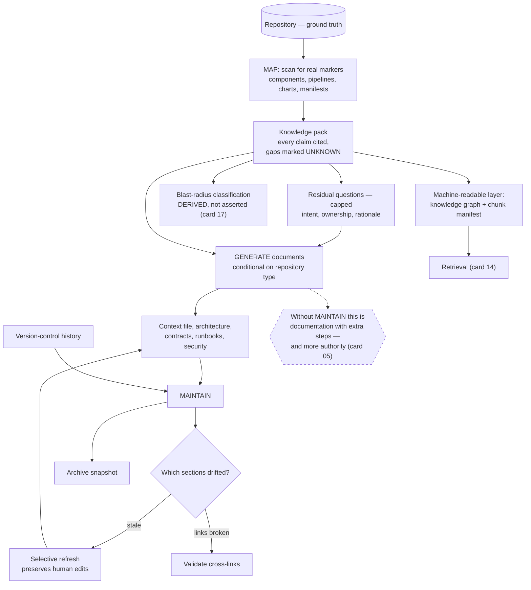

# Repository Projection Pipeline

> Treat documentation as a projection of the codebase rather than a parallel artifact: generate it from evidence, emit it in a shape retrieval can consume, and build the staleness detector in the same breath.

## What this pattern is

An agent entering an unfamiliar codebase spends its first and most expensive turns
rediscovering structure that is stable and knowable. The obvious fix — write
documentation — produces a second artifact that drifts from the first, which is a
familiar failure with a familiar outcome.

The pattern makes documentation a *derived* artifact with three stages:

1. **Map** — analyze the repository from the filesystem and emit a structured
   knowledge pack: component inventory, build and deployment topology, runtime
   architecture, dependency graph and blast radius, end-to-end flows, risks, plus a
   machine-readable graph and a chunking manifest for retrieval.
2. **Generate** — produce the human- and agent-facing documents from that pack:
   the context file an agent reads on entry, architecture, contracts, runbooks,
   security, and whatever the repository type warrants.
3. **Maintain** — detect drift against version-control history, refresh sections
   selectively, validate cross-links, and archive snapshots.

The defining constraint is **evidence**: every claim in the pack cites a file path
or line reference, and anything uncertain is marked unknown rather than inferred.

## Why it exists

Two failures meet here. Hand-written architecture documentation goes stale because
nothing connects it to the code. Agent-rediscovered structure is expensive, repeated
every session, and inconsistent between sessions.

Projection addresses both, but only if the third stage exists. A generated pack
without drift detection is a hand-written document with extra steps — it goes stale
identically, and the generation history makes it *more* authoritative and therefore
more dangerous. This is exactly the mechanism of card 05: an artifact that was true
when written, never re-verified, and executed rather than consulted.

The citation requirement is what makes the pack checkable. A claim with a path can
be re-tested mechanically; a claim without one can only be read for plausibility,
which is how bad documentation survives.

**Without it:** either agents re-derive the repository every session, or they trust
a document that describes what it looked like months ago.

## Where it belongs

```
   repository (ground truth)
        │
        ▼
   ┌──────────┐   evidence-cited pack        ┌────────────┐
   │   MAP    │ ───────────────────────────► │  GENERATE  │
   └──────────┘   inventory, graph,          └─────┬──────┘
        ▲         flows, chunk manifest            │
        │                                          ▼
        │                                   context files,
        │                                   architecture, runbooks
        │                                          │
   ┌────┴──────┐  drift vs. history               │
   │ MAINTAIN  │ ◄────────────────────────────────┘
   └───────────┘  refresh, validate links, archive
```

## How it works

1. **Analyze from the filesystem, not from assumptions.** Discover components by
   scanning for real markers — manifests, container definitions, pipeline
   configurations, chart files — rather than by expecting a layout.

2. **Cite everything, and mark the gaps.** Each claim carries a path or line
   reference; anything that cannot be established is explicitly labelled unknown.
   The labelled gaps are as valuable as the findings, because they tell the next
   reader where the map is thin.

3. **Emit a machine-readable layer alongside the prose.** A knowledge graph of
   components and relationships, and a chunking manifest describing how the pack
   should be segmented for retrieval. The pack is built to be queried (card 14), not
   only read.

4. **Compute blast radius as part of the map.** Dependency data is already being
   extracted, so the classification that card 17 otherwise maintains by hand comes
   out of the projection — derived rather than asserted, and therefore not stale.

5. **Generate documents conditionally on repository type.** Infrastructure
   repositories need workload and service-level documents; pipeline repositories
   need a contract document. Generating a fixed set produces empty sections that
   teach readers to skim.

6. **Ask only the residual questions.** After the map, a bounded number of
   questions — the source system caps it at eight — covers what the filesystem
   cannot answer: intent, ownership, and the reasons behind choices.

7. **Detect drift against version-control history.** Compare what changed in the
   repository against what the pack claims, and report which sections are stale.
   This is the stage that distinguishes projection from documentation.

8. **Refresh selectively and archive snapshots.** Regenerating everything discards
   human edits and burns cost; refreshing the drifted sections preserves both.
   Snapshots make the pack's own history inspectable.

## What it depends on

| Dependency | Why it is needed | What happens if absent |
| --- | --- | --- |
| A repository with discoverable markers | Detection is structural | The map is guesswork with citations |
| Version-control history | Drift detection compares against it | Staleness undetectable; the pattern collapses to documentation |
| The citation discipline | Makes claims re-checkable | A confident document nobody can verify |
| A retrieval consumer | The chunking manifest and graph exist for something | Machine-readable layers that nothing reads |
| A trigger for the maintain stage | Drift accrues continuously | Generated once, trusted indefinitely |

## How it interacts with other patterns

| Pattern | Relationship |
| --- | --- |
| [13 Log-as-Source Compilation](13-log-as-source-compilation.md) | Same source-compiler-output shape, with the repository as source instead of transcripts |
| [14 Index-Guided Retrieval](14-index-guided-retrieval.md) | The pack's index and chunk manifest are built for exactly that retrieval strategy |
| [05 Instruction Provenance and Drift](05-instruction-provenance-and-drift.md) | The failure this pattern's third stage exists to prevent |
| [17 Blast-Radius Gating](17-blast-radius-gating.md) | Consumes the dependency map; projection is how that matrix stops being hand-maintained |

## Constraints and trade-offs

- **Generation is expensive and repeated.** A full map of a substantial repository
  is a large model run, and the maintain stage exists largely to avoid repeating it.
- **The pack is only as good as what is discoverable.** Intent, ownership and
  rationale are not in the filesystem, which is what the residual questions are for
  — and they are the part a future regeneration cannot reproduce.
- **Human edits and regeneration conflict.** Someone will improve a generated
  document by hand, and the next full regeneration will discard it unless selective
  refresh is genuinely selective.
- **A stale pack is more dangerous than no pack**, because its structure and
  citations signal authority that its content no longer earns.
- **Projection encodes a moment.** Architectural decisions made after the map are
  invisible until the next run, so the pack is always describing a slightly past
  version of the system.

## Failure modes

| Failure | Symptom | Root cause |
| --- | --- | --- |
| Generated once | Pack describes a structure that no longer exists | Maintain stage never triggered |
| Uncited inference | Confident claims that cannot be traced to anything | Citation discipline relaxed during generation |
| Empty sections | Documents full of "not applicable" | Fixed document set generated regardless of repository type |
| Lost human edits | Improvements disappear after a refresh | Full regeneration instead of selective |
| Unconsumed machine layer | Graph and chunk manifest exist; nothing queries them | Retrieval side never built or never used |
| Drift in the index | Cross-links inside the pack break as sections move | No link validation in the maintain stage |
| Authoritative staleness | An agent acts on the pack and is wrong | Generated artifacts inherit trust their age does not support |

## Diagram



## How to validate an implementation

- [ ] Components are discovered by scanning for real markers, not by assuming a layout.
- [ ] Every claim in the pack cites a path; unestablished facts are labelled unknown rather than inferred.
- [ ] A machine-readable layer is emitted, and something actually consumes it.
- [ ] Document generation is conditional on repository type; no document is generated empty.
- [ ] Residual questions are bounded and cover only what the filesystem cannot answer.
- [ ] Drift detection runs against version-control history and names the stale sections.
- [ ] Refresh is selective and demonstrably preserves human edits.
- [ ] Cross-links inside the pack are validated after every refresh.
- [ ] The maintain stage has a trigger that is not a person remembering.

## How it evolves

**At first generation**, the pack's value is onboarding — it compresses days of
exploration into a readable artifact. **After the first significant refactor**, its
value is entirely in the maintain stage, and a pipeline without that stage has
already become a liability. **At maturity**, the interesting artifact is the
machine-readable layer: the graph and the blast-radius classification derived from
it are worth more than the prose, because they feed other patterns automatically
instead of being read.

The honest ceiling is that projection cannot capture intent. The residual questions
are a patch over that gap, and their answers are the one part of the pack that a
regeneration destroys — which argues for keeping them in a separate, hand-owned file
that generation never touches.

## Skeleton

Minimal prototype in [`../skeletons/20-repository-projection-pipeline/`](../skeletons/20-repository-projection-pipeline/):
a stdlib mapper over a toy repository emitting a cited pack and a knowledge graph, a
generator stub, and a drift detector comparing the pack against commit history.

## Provenance

Instanced in the source system as three chained skills. A mapper performs
evidence-based analysis of a workspace and produces a structured pack — component
inventory, build and deployment maps, runtime architecture, end-to-end flows,
per-service stubs, interface catalogs, a knowledge graph and a chunking manifest for
downstream ingestion. A generator consumes that pack, asks up to eight residual
questions, and writes the agent context file plus an architecture, contracts,
runbooks, security, rules, domain-model and development-guide set, conditionally
adding infrastructure or pipeline documents by repository type. A maintainer
performs drift detection against version-control history, selective section refresh,
cross-link validation, health checks and snapshot archiving.

The pack this kit produced for its own platform repository is the best evidence the
pattern works: twelve documents covering roughly 39 components, with a dependency
graph, an explicit blast-radius analysis, six end-to-end flows and a risk register,
each claim carrying a file reference and uncertainties marked unknown.

**Partially implemented, precisely:** the pack was generated once and the maintain
stage never ran against it. Its own header records a generation date, and by the
time the kit was archived the underlying repository had moved on — the pack still
described component versions and a topology that had changed. The drift detector
existed, was never triggered, and the most carefully evidenced artifact in the kit
quietly became the thing card 05 warns about.
