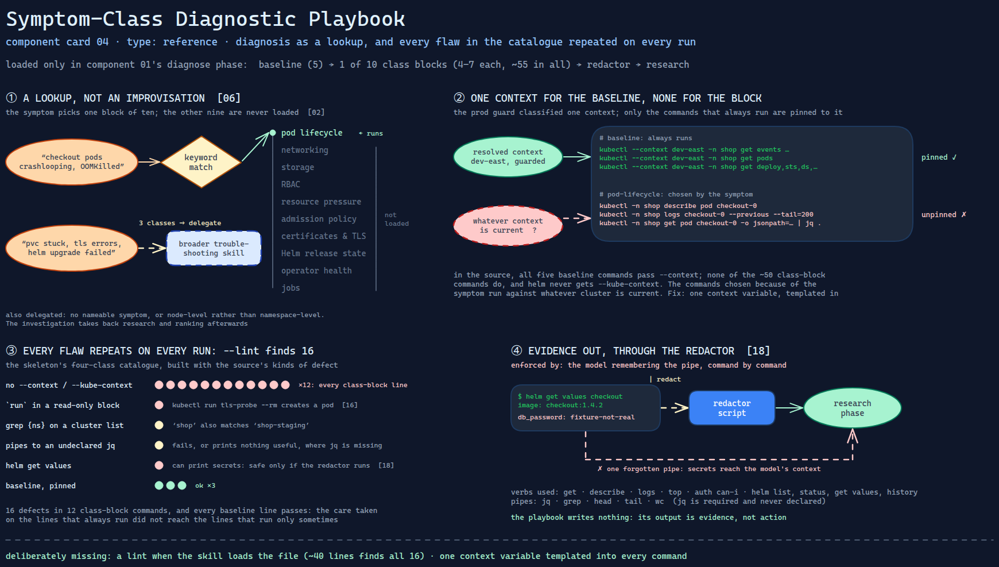

# Symptom-Class Diagnostic Playbook

> A catalogue of exact read-only commands, one block per kind of cluster symptom — so
> diagnosis is a lookup, not an improvisation, and every flaw in the catalogue is
> repeated on every run.

Source: [`04-symptom-diagnostic-playbook.excalidraw`](04-symptom-diagnostic-playbook.excalidraw).

## What it is

A reference file loaded by the investigator skill
([component 01](../skill/01-infrastructure-issue-investigator.md)) in its diagnose
phase. It maps a symptom class to the Kubernetes and Helm commands that gather
evidence for it: a five-command baseline that always runs, then ten class blocks of
four to seven commands each, about fifty-five in all. A closing section says when
diagnosis should be handed to a broader troubleshooting skill instead.

## Trigger and routing

Loaded by the investigator skill at the start of its diagnose phase; the skill's
reference table names it for that phase only. Inside the file, routing is the
symptom class: the model matches the user's symptom to one of the ten classes and
runs that block after the baseline. If the symptom spans three or more classes, has
no nameable symptom at all, or looks node-level rather than namespace-level, the
playbook sends diagnosis to a broader skill and takes the investigation back for
research and ranking.

## Inputs

| Input | Required | Where it comes from |
|---|---|---|
| Resolved context and namespace | yes | the intake phase, as shell variables |
| Symptom | yes, for a class block | the user; otherwise the baseline alone |
| Workload, service, claim, release or job name | per class | the user or the baseline's output |

## Procedure

1. Run the baseline against the resolved context: recent events, pods, workload
   controllers, a count of config maps and secrets, and the namespace's labels.
2. Match the symptom to a class — pod lifecycle, networking, storage, RBAC,
   resource pressure, admission policy, certificates and TLS, Helm release state,
   operator health, or jobs — and run that block. Several blocks reach into shared
   namespaces for their controllers: DNS, the network plugin, the storage system,
   the policy engine, the certificate manager.
3. Pipe every output through the redaction script before it is carried into
   research or the plan.
4. If the symptom spans three or more classes, is unnamed, or points at nodes,
   delegate diagnosis and return for the remaining phases.

## Tools and permissions

| Tool or verb | Allowed | Enforced by |
|---|---|---|
| `kubectl get` / `describe` / `logs` / `top` / `auth can-i` | yes | the playbook lists only these — with one exception |
| `kubectl run` (in the certificates block) | used | nothing: it is not on the skill's deny list ([component 03](03-investigation-safety-rules.md)) |
| `helm list` / `status` / `get values` / `history` | yes | the playbook |
| `jq`, `grep`, `head`, `tail`, `wc` | used in pipes | nothing: `jq` is required and never declared |

## Outputs

Command output, redacted, carried into the research phase as evidence. The playbook
writes nothing.

## Failure modes

| Failure | Symptom | Root cause |
|---|---|---|
| Class blocks ignore the resolved context | A symptom-specific command runs against a different cluster than the one the prod guard classified | All five baseline commands pass `--context`; none of the roughly fifty class-block commands do, and the Helm commands never pass `--kube-context`. They run against whatever context is current. Observed in the file |
| A write in the read-only catalogue | Diagnosing a certificate problem creates a pod | The TLS block tests reachability with `kubectl run … --rm`. Nothing checks the catalogue against a read-verb list. Observed — the source of the gap in components [01](../skill/01-infrastructure-issue-investigator.md) and [03](03-investigation-safety-rules.md) |
| Substring filters cross namespaces | Evidence from a neighbouring namespace appears in the investigation of another | Cluster-scoped lists are filtered with `grep` on the namespace name, which matches any namespace containing it. Structurally inevitable for a substring match |
| An undeclared dependency | A block fails, or silently prints nothing useful, on a machine without `jq` | Several commands pipe to `jq`; neither the playbook nor the skill lists it. Observed |
| Secrets in diagnostic output | Release values or secret data reach the model's context | `helm get values` and similar commands can print credentials; the only protection is the instruction to pipe through the redactor, which the model has to remember for every command. Structural |

## Patterns it instances

| Card | Where it shows up in this component |
|---|---|
| [02 Progressive Disclosure](../../cards/02-progressive-disclosure.md) | Loaded only in the diagnose phase, and only one class block of ten is needed per symptom |
| [06 Calibrated Degrees of Freedom](../../cards/06-calibrated-degrees-of-freedom.md) | Exact commands instead of "look at the pods": diagnosis is the most repeatable part of the skill because it is the least free |
| [16 The Permission Ladder](../../cards/16-the-permission-ladder.md) | A read-only promise made entry by entry, with no allow-list check behind it — and one entry that breaks it |
| [18 The Redaction Boundary](../../cards/18-the-redaction-boundary.md) | Every output is to pass the redactor before it goes anywhere, including commands known to print secrets |

## Provenance

Instanced in the source system by one reference file of about 140 lines inside the
investigator skill: a baseline, ten symptom-class blocks and a delegation section.
The commands are standard kubectl and Helm against public components; nothing in the
file is specific to one installation except which components it expects to find.

## Prototype

Minimal runnable prototype in
[`../../skeletons/components/04-symptom-diagnostic-playbook/`](../../skeletons/components/04-symptom-diagnostic-playbook/).
Standard library, offline, prints commands and never runs them. It classifies a
symptom, renders the baseline and one block, delegates when three classes match, and
with `--lint` checks a fabricated catalogue built with the source's kinds of defect.

## What is deliberately missing

**A lint of its own.** Every failure above is mechanical and could be caught when the
skill loads the file: a missing context flag, a verb outside the read list, a pipe to
an undeclared tool, a substring filter. The source checked none of them; the
prototype's `--lint` is about forty lines.

**One context variable.** Templating the resolved context into every command from a
single place would remove the largest failure outright. The baseline does it by hand;
the blocks forgot.

**In the prototype:** four classes instead of ten, keyword matching instead of a model
choosing the class, and no execution.
