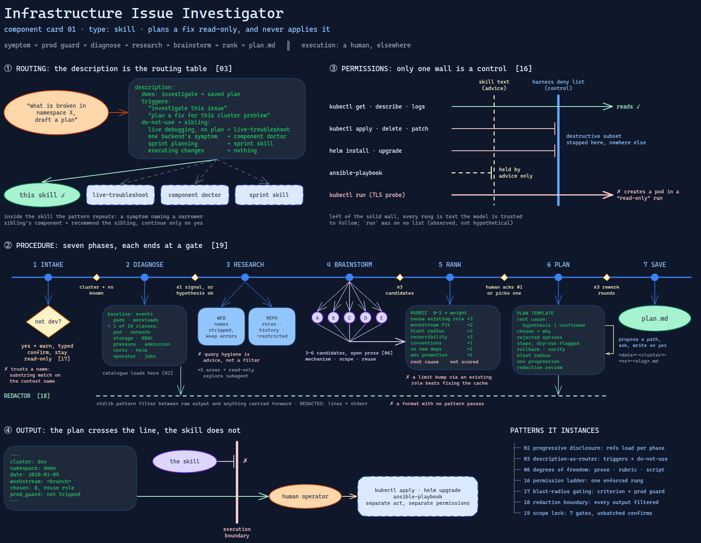

# Infrastructure Issue Investigator

> A skill that investigates a cluster problem read-only, ranks the possible fixes against
> the team's own repository, and writes a plan — and never applies any of it.

Source: [`01-infrastructure-issue-investigator.excalidraw`](01-infrastructure-issue-investigator.excalidraw).

## What it is

A model-invoked skill for infrastructure incidents on Kubernetes. Given a cluster, a
namespace and a symptom, it gathers read-only diagnostics, researches the web and the
team's infrastructure-as-code (Ansible) repository in parallel, brainstorms candidate
fixes, scores them on a fixed weighted rubric, and renders the winner into a
remediation plan. It is a planner: its only durable output is a document a human
executes somewhere else.

Seven of the twenty pattern cards meet in this one artifact, which is why it is
the first component card.

## Trigger and routing

The description is the routing table ([card 03](../../cards/03-description-as-router.md)).
It carries three things:

- **What it does**, in one sentence that names the output: a saved plan.
- **Trigger phrases** users actually type — "investigate this issue", "plan a fix
  for this cluster problem", "what is broken in namespace X, draft a plan".
- **A do-not-use list, each entry naming the sibling that fits better:** live
  debugging with no plan wanted (a broader live-troubleshooting skill),
  symptoms specific to one backend (a component-specific doctor skill),
  multi-workstream sprint planning (a sprint skill), and executing changes
  (nothing — this skill only plans).

Inside the skill, a second routing step repeats the pattern: if the symptom names
the component a narrower sibling owns, the skill recommends the sibling and
continues only on confirmation.

## Inputs

| Input | Required | Where it comes from |
|---|---|---|
| Cluster | yes | the user, at intake; resolved to a kubeconfig context |
| Namespace | yes | the user, at intake |
| Workload | no | the user; narrows the diagnostic commands |
| Symptom | no | one sentence; selects the symptom class |
| The infrastructure repository | yes | a local checkout: roles, playbooks, inventories, git history |
| The current branch | implicit | read from the repository; feeds the workstream criterion |

## Procedure

Seven phases, each ending at a gate ([card 19](../../cards/19-scope-lock-and-checkpoint-delivery.md)).

1. **Intake.** Ask for cluster and namespace. Resolve the context; if it is not the
   development cluster, trip the **prod guard** — warn, require an explicit typed
   confirmation, stay read-only regardless. *Gate: cluster and namespace known.*
2. **Diagnose** ([component 04](../reference/04-symptom-diagnostic-playbook.md)). Run a fixed baseline (events, pods, workloads), then the command
   block for the symptom class — one of ten: pod lifecycle, networking, storage,
   RBAC, resource pressure, admission policy, certificates, Helm release state,
   operator health, jobs. Pipe every output through the redactor. *Gate: at least
   one signal, or the user says to proceed on a hypothesis.*
3. **Research, in parallel.** Web: search with every installation-specific name
   stripped — keep versions, error strings and upstream component names. Repo:
   narrow by symptom keyword to likely role paths, read recent history for prior
   fixes, never open restricted files — record the path, advise a manual check.
4. **Brainstorm** three to six distinct candidates, each with mechanism, scope,
   reversibility and the repo artifact it would reuse. *Gate: at least three.*
5. **Rank** with a separate rubric file ([component 02](../reference/02-remediation-ranking-rubric.md)): seven criteria scored 0–2 and weighted: reuse of an existing role
   ×3, fit with the current workstream ×2, blast radius ×2, reversibility ×2,
   conventions ×1, no new dependencies ×1, clean promotion up the environment
   ladder ×1. Ties break in that order. Render one fixed table shape. *Gate: the
   user acknowledges #1 or picks another.*
6. **Plan.** Fill a fixed template: root cause marked **hypothesis or confirmed**,
   chosen option and why, rejected options, ordered steps with dry-run steps
   flagged, rollback, verification, blast radius, per-environment progression, and
   a **redaction review** block. Up to three rework rounds, then force-save with
   the open concerns listed.
7. **Save.** Propose a path, ask, write only on yes.

Confirmations are never batched: each is its own yes/no.

## Tools and permissions

| Tool or verb | Allowed | Enforced by |
|---|---|---|
| `kubectl get` / `describe` / `logs` / `top` / `auth can-i` | yes | the skill's instructions |
| `kubectl delete` / `apply` / `patch` / `edit` / `replace` / `scale` / `drain` / `cordon` | no | a deny list in the skill; the destructive subset also by the harness |
| `helm install` / `upgrade` / `uninstall` / `rollback` | no | the same split |
| `ansible-playbook`, `ansible` | no | the skill's instructions only |
| Web search and fetch | yes, sanitized queries only | the skill's instructions only |
| Repo read | yes, minus a restricted-path list (vault files, secrets directories, env files, `.git/`) | the skill's instructions only |
| Delegating a wide repo scan | to a read-only exploration subagent, above five candidate areas | the skill's instructions |
| Writing the plan | yes, after confirmation | the skill's instructions |

The column that matters is the last one. Only the harness row is a control; every
other row is advice the model is trusted to follow ([card 16](../../cards/16-the-permission-ladder.md)).
The rules themselves live in a separate reference file,
[component 03](../reference/03-investigation-safety-rules.md).

## Outputs

One Markdown plan with frontmatter (cluster, namespace, date, workstream, chosen
option, prod-guard status), named `<date>-<cluster>-<namespace>-<slug>.md`, written
only after the user confirms the location. Before that: a ranked table on screen, and
`REDACTED:` audit lines on stderr from every redaction pass.

## Failure modes

| Failure | Symptom | Root cause |
|---|---|---|
| A write passes as a diagnostic | The certificate playbook's TLS probe runs a throwaway pod — an object created in a "read-only" investigation | Read-only was a deny list of write verbs someone remembered; `run` was not on it. Observed in the component's own command catalogue |
| The ranking prefers the repo over the root cause | A limit increase through an existing role outranks fixing the cache that overflows the limit | Reuse carries the highest weight and root cause is not a criterion. Structural — the rank gate is the only defence, and it asks a human who has just been shown a winner |
| Machine-bound | The skill works for one operator and fails for anyone else who installs it | The repository location, the save paths and the dev kubeconfig were absolute paths in the skill text. Observed |
| The prod guard trusts a name | A context whose name or kubeconfig path contains the development marker is treated as development, whatever it points at | Classification is a substring match on names. Structurally inevitable — unqualified names fall to the strictest class, but a misleading name falls to the most lenient |
| Query hygiene is advisory | An installation name can reach a web search | Stripping names from queries is an instruction, not a filter between the model and the tool |
| The redactor misses a format | A credential shape with no pattern passes into the plan | Pattern matching; see [card 18](../../cards/18-the-redaction-boundary.md), where this is observed |

## Patterns it instances

| Card | Where it shows up in this component |
|---|---|
| [02 Progressive Disclosure](../../cards/02-progressive-disclosure.md) | Four reference files and a template, each loaded only by the phase that needs it — the diagnostic catalogue in phase 2, the rubric in phase 5 |
| [03 Description-as-Router](../../cards/03-description-as-router.md) | Trigger phrases plus a do-not-use list naming each sibling; repeated inside the skill as a symptom-based redirect |
| [06 Calibrated Degrees of Freedom](../../cards/06-calibrated-degrees-of-freedom.md) | Brainstorming is open prose; ranking is a fixed rubric with a mandated table shape; redaction is a deterministic script |
| [16 The Permission Ladder](../../cards/16-the-permission-ladder.md) | Read-only by deny list, with the harness deny list as the only enforced rung — and the `run` gap as the proof |
| [17 Blast-Radius Gating](../../cards/17-blast-radius-gating.md) | Blast radius is a weighted ranking criterion, and the prod guard escalates confirmation by environment |
| [18 The Redaction Boundary](../../cards/18-the-redaction-boundary.md) | Every output passes a conservative stdlib redactor before it is carried forward, and the plan carries a review block |
| [19 Scope Lock and Checkpoint Delivery](../../cards/19-scope-lock-and-checkpoint-delivery.md) | Seven gated phases, unbatched confirmations, a three-round cap on rework, confirm-before-write |

## Provenance

Instanced in the source system by one skill of roughly a thousand lines: a
265-line entry file, four reference files (diagnostic catalogue, ranking rubric,
repository search patterns, safety rules), a plan template, and a 150-line
standard-library redaction script. Its brainstorm-then-rank structure was borrowed
from an adversarial build-and-grade skill in the same kit
([card 11](../../cards/11-adversarial-role-separation.md)).

The component records its design, not its history: nothing in it says how often it
ran or what its plans led to, and this card claims neither.

## Prototype

Minimal runnable prototype in
[`../../skeletons/components/01-infrastructure-issue-investigator/`](../../skeletons/components/01-infrastructure-issue-investigator/).
Standard library, offline, fixture data only. It runs all seven phases on a
fabricated crash-looping workload, trips the prod guard, and reproduces the
deny-list gap.

## What is deliberately missing

**Execution, by design.** The component plans; applying the plan is a separate act
under a separate permission set. That split is the component's main idea, not a gap.

**Enforcement.** Most of the safety rows above are instructions. A mechanical version
would run diagnostics through an allow list of read verbs, filter web queries
through the same name list the redactor uses, and apply the restricted-path list to
search results before the model sees them. The source had none of these.

**Root cause as a ranking criterion.** The rubric scores how well a fix fits the
repository, not whether it addresses the evidence. The prototype makes the cost
visible with a tie the rubric resolves the wrong way.

**In the prototype:** no cluster, no web, no model — fixtures and named stubs; the
rank gate is auto-acknowledged; there is no rework loop.
