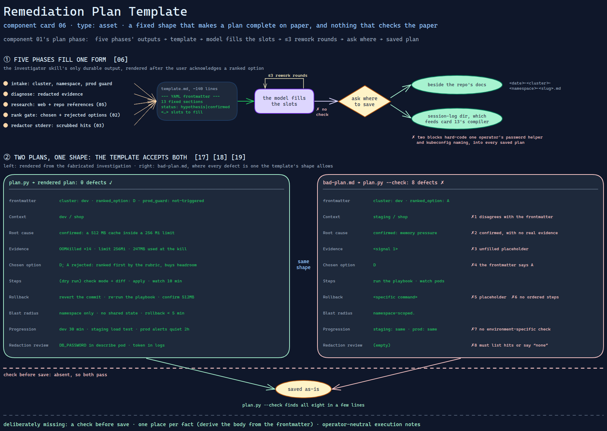

# Remediation Plan Template

> The one artifact the investigator skill produces: a fixed shape that makes a plan
> complete on paper — and nothing that checks the paper.

Source: [`06-remediation-plan-template.excalidraw`](06-remediation-plan-template.excalidraw).

## What it is

A Markdown template with YAML frontmatter, rendered by the investigator skill
([component 01](../01-infrastructure-issue-investigator.md)) in its plan phase.
It turns the chosen fix into a document a person can execute somewhere else: context,
root cause with a hypothesis-or-confirmed status, the chosen and rejected options,
ordered steps, rollback, verification, blast radius, per-environment progression, a
redaction review, references and open questions. About 140 lines of fill-in form.

## Trigger and routing

Loaded by the investigator skill in its plan phase, after the user has acknowledged
a ranked option; the skill's asset table names it as the template for that phase.
It is rendered once, revised in up to three rework rounds, and saved only after the
user confirms the location.

## Inputs

| Input | Required | Where it comes from |
|---|---|---|
| Cluster, namespace, prod-guard status | yes | intake |
| Redacted evidence | yes | diagnose |
| Web and repository references | yes | research ([component 05](../references/05-keyword-narrowed-repo-search.md)) |
| Chosen option and the rejected ones | yes | the rank gate ([component 02](../references/02-remediation-ranking-rubric.md)) |
| Redaction hits | yes | the redactor's stderr ([component 03](../references/03-investigation-safety-rules.md)) |

## Procedure

1. **Frontmatter:** title, cluster, namespace, date, workstream branch, tags, related
   runbooks, the ranked option, and the prod-guard status.
2. **Context:** the reported symptom, verbatim where possible; target; workload;
   branch; kubeconfig; prod-guard confirmation with its time.
3. **Root cause:** a status of *hypothesis* or *confirmed*, two to four sentences, and
   — for a hypothesis — what evidence would confirm it; then the evidence, web
   references and repository references.
4. **Chosen option:** what it changes and why it won — reuse, blast radius,
   reversibility, workstream fit — then one line per rejected option.
5. **Steps:** ordered commands with the expected observable result for each;
   destructive steps and dry-runnable steps each carry a marker.
6. **Rollback** in order, with a recovery point; **verification** as a checklist;
   **blast radius** as direct and indirect impact, shared state, and a rollback-time
   estimate.
7. **Environment progression:** one row per environment with prerequisite, apply,
   verify and owner.
8. **Redaction review:** every scrubbed value by pattern and location, or "none
   detected"; then references, and open questions if the rework rounds ran out.

## Tools and permissions

None. The template is text; the skill writes the rendered plan only after asking where.
Two blocks inside it describe how the *reader* will run the steps — how to supply the
vault password and how to run locally — and both name the operator's own setup.

## Outputs

One Markdown file named `<date>-<cluster>-<namespace>-<slug>.md`, saved either
beside the infrastructure repository's documentation or into the session-log
directory that feeds the knowledge-compilation pipeline
([card 13](../../../../cards/13-log-as-source-compilation.md)).

## Failure modes

| Failure | Symptom | Root cause |
|---|---|---|
| Unfilled placeholders are saved | A plan goes to disk with `<specific command>` where its rollback should be | The template is `<…>` slots and nothing checks that all were filled before saving. Structural |
| One fact, two values | Frontmatter says one cluster or option, the body another | Cluster, namespace, prod-guard status and chosen option are each asked for twice, and nothing compares the copies. Structural |
| "Confirmed" is a word | A root cause marked confirmed with nothing under Evidence | The template asks what would promote a hypothesis, but ties no evidence to the confirmed status. Structural |
| The progression table invites "same" | Every environment after the first repeats the first's apply and verify steps | The table's own pre-filled rows say "same" for later environments with one fixed soak time; copying is the path of least effort. Observed |
| Operator specifics in every plan | Each saved plan names one operator's password helper and kubeconfig naming | The template hard-codes both blocks, and plans are written next to a shared repository. Observed |

## Patterns it instances

| Card | Where it shows up in this component |
|---|---|
| [06 Calibrated Degrees of Freedom](../../../../cards/06-calibrated-degrees-of-freedom.md) | A fixed document shape with a closed status vocabulary — the lowest-freedom output of the skill, and the only durable one |
| [17 Blast-Radius Gating](../../../../cards/17-blast-radius-gating.md) | A blast-radius section with a rollback-time estimate, and per-environment prerequisites before each promotion |
| [18 The Redaction Boundary](../../../../cards/18-the-redaction-boundary.md) | A mandatory review block listing what was scrubbed, so over-redaction is visible and reversible |
| [19 Scope Lock and Checkpoint Delivery](../../../../cards/19-scope-lock-and-checkpoint-delivery.md) | One option, fixed in writing, delivered through named environment checkpoints |

## Provenance

Instanced in the source system by one asset file of about 140 lines in the
investigator skill's assets directory: YAML frontmatter and thirteen sections. Two of
its blocks are specific to the operator's machine and are described here rather than
reproduced. Nothing in the component records how many plans it produced or whether
they were executed as written.

## Prototype

Minimal runnable prototype in
[`../../../../skeletons/components/06-remediation-plan-template/`](../../../../skeletons/components/06-remediation-plan-template/).
Standard library, offline. It renders a shortened template from a fabricated
investigation, checks the result, and with `--check` finds eight planted defects in a
plan the template's shape allows.

## What is deliberately missing

**A check before save.** Every failure above except the last is detectable in a few
lines — leftover placeholders, disagreeing duplicates, confirmed-without-evidence,
copied progression rows, empty rollback. The source saved whatever the model filled
in.

**One place per fact.** Deriving the body's context lines from the frontmatter, or the
reverse, would remove a class of disagreement outright.

**Operator-neutral execution notes.** How to supply credentials belongs in the
reader's environment, not in every plan.

**In the prototype:** no references, open questions, rework loop or save step; the
operator blocks are left out rather than fabricated.
