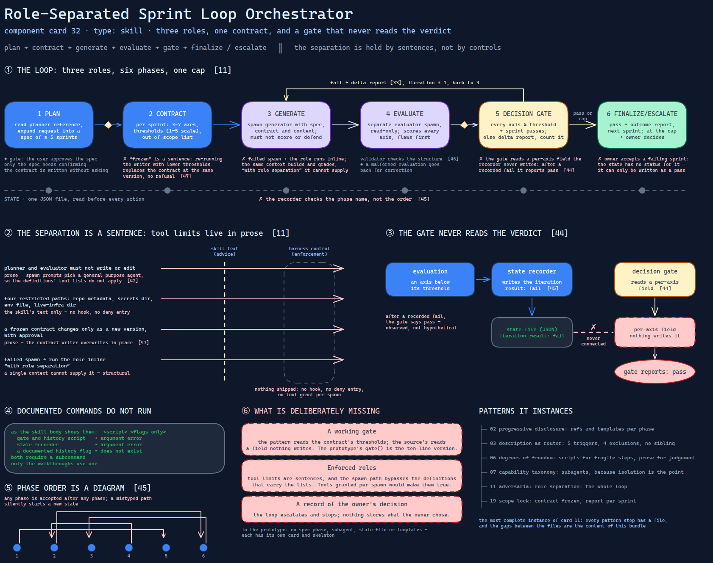

# Role-Separated Sprint Loop Orchestrator

> A skill that splits planning, building and grading into three roles behind a contract
> fixed in advance — and holds that separation with sentences, a gate that never reads the
> verdict, and commands that do not run as documented.

Source: [`32-role-separated-sprint-loop-orchestrator.excalidraw`](../../../diagrams/component-cards/role-separated-sprint-loop-orchestrator/32-role-separated-sprint-loop-orchestrator.excalidraw).

## What it is

A skill of about three hundred lines that drives a six-phase loop for multi-file work: plan,
negotiate a contract per sprint, generate, evaluate, gate, and finalize or escalate. It owns
four scripts, four templates, seven references and three subagent definitions, listed in the
parts below. It is the most complete instance of
[card 11](../../../cards/11-adversarial-role-separation.md): every pattern step has a file
here, and the gaps between the files are the content of this bundle.

## Trigger and routing

The description states the job — separate planning, building and grading into distinct roles
with pre-agreed contracts and rubric-based gates — and lists five kinds of phrasing that fire it:
asking for a build with an independent review, for a generator-evaluator loop, for a workflow that
guards against flattering grades, for review-and-iterate, or for a three-role harness by name. Four
exclusions follow: single-file quick fixes, tiny single-iteration edits, simple fact lookup, and
explaining code.
None of the four names a better-fitting sibling, so a refused request has nowhere to go
([card 03](../../../cards/03-description-as-router.md)). Inside the skill, each phase begins
with an instruction to read named references first — the loading half of
[card 02](../../../cards/02-progressive-disclosure.md).

## Inputs

| Input | Required | Where it comes from |
|---|---|---|
| The request | yes | the user |
| Repository context | yes | the working directory |
| Approval of the spec | yes, before any building | the user, in phase 1 |
| Axes, thresholds and out-of-scope list per sprint | yes | negotiated in phase 2; thresholds on a 1–5 scale |
| Iteration cap | no, default three | a flag on the gate-and-history script |
| `uv` and Python 3.10 or later | yes | the machine; the skill's dependency section |

## Procedure

1. **Plan.** Read the planner reference, expand the request into a spec of at most five
   sprints, and present it. *Gate:* the user approves.
2. **Contract.** For each sprint write three to seven axes with thresholds and an
   out-of-scope list ([component 47](scripts/47-sprint-contract-writer.md)). The text says it is
   frozen once building starts; changes need a new version and the user's approval.
3. **Generate.** Spawn the generator with the spec, contract and context. It must not score or
   defend its work.
4. **Evaluate.** Spawn the evaluator separately, read-only. It scores every axis, flaws first,
   and the validator checks the result's structure
   ([component 46](scripts/46-evaluation-structure-validator.md)). *Gate:* a malformed
   evaluation goes back for correction.
5. **Decision gate.** Every axis at or above its threshold passes the sprint. Otherwise write a
   delta report ([component 33](assets/33-blocking-items-return-template.md)), count the
   iteration, and loop to phase 3 — or, at the cap, go to phase 6.
6. **Finalize or escalate.** On a pass, write the outcome report
   ([component 35](assets/35-run-outcome-report-template.md)) and start the next sprint. At the
   cap, pause and offer the owner three options: accept the current state, give guidance and
   restart the sprint, or abort.

State lives in one JSON file, which the text says to read before every action.

## Tools and permissions

| Tool or verb | Allowed | Enforced by |
|---|---|---|
| Subagent spawns for generator and evaluator | yes, per phase | the skill's text; a failed spawn falls back to running the role inline |
| Writing or editing by the planner and the evaluator | no | prose — the spawn prompts select a general-purpose agent, so the tool lists in the definitions do not apply ([component 42](references/42-role-spawn-prompt-set.md)) |
| Reading, writing or running anything in four restricted paths — repository metadata, a secrets directory, an environment file, a directory of live infrastructure | no | the skill's text; the skill ships no hook and no deny entry |
| Changing a frozen contract | only as a new version with approval | prose; the contract writer overwrites in place |
| Scripts through `uv` | yes | the skill declares no tool grant of its own; the harness's ordinary permissions apply |

## Outputs

A run directory holding the state file and, per sprint, a contract, an evaluation and a delta
report, plus a spec and a final report. Only the spec needs confirmation before it is acted
on; the contract is written without asking, and escalation stops for the owner.

## Failure modes

| Failure | Symptom | Root cause |
|---|---|---|
| Documented commands do not run | The gate-and-history script and the state recorder, called as the skill's body shows them, exit with an argument error; a documented history flag does not exist | The body shows flag-only calls; both scripts require a subcommand, which only the walkthroughs use. Observed |
| The gate never reads the verdict | After a recorded fail, the gate reports pass | The gate reads a per-axis field that the recorder never writes ([component 44](scripts/44-loop-gate-and-history-harness.md)). Observed |
| Phase order is a diagram | A state file accepts any phase after any phase, including on a mistyped path, which silently starts a new state | The recorder checks the phase name, not the transition ([component 45](scripts/45-loop-state-recorder.md)). Observed |
| The frozen contract is a sentence | Re-running the writer with lower thresholds replaces the contract at the same version | No refusal, no superseded copy ([component 47](scripts/47-sprint-contract-writer.md)). Observed |
| Fallback removes the separation | After a failed spawn the same context builds and grades | The failure table says to run the role inline "with role separation", which a single context cannot supply. Structural |
| The owner's override has no record | Accepting a failing sprint can only be written as a pass | The state has no status for it, and the sprint's iteration result takes `pass` or `fail`. Observed |

## Patterns it instances

| Card | Where it shows up in this component |
|---|---|
| [02 Progressive Disclosure](../../../cards/02-progressive-disclosure.md) | Seven references and four templates, each loaded by the phase that needs it |
| [03 Description-as-Router](../../../cards/03-description-as-router.md) | Five trigger phrasings and four exclusions, with no sibling named |
| [06 Calibrated Degrees of Freedom](../../../cards/06-calibrated-degrees-of-freedom.md) | Scripts for the fragile steps (contract, validation, state), prose for judgement — and the seams where the two disagree |
| [07 Capability Taxonomy](../../../cards/07-capability-taxonomy.md) | Generator and evaluator as subagents, because isolation is the point |
| [11 Adversarial Role Separation](../../../cards/11-adversarial-role-separation.md) | The whole loop: three roles, a pre-agreed contract, a gate, a delta, a cap |
| [19 Scope Lock and Checkpoint Delivery](../../../cards/19-scope-lock-and-checkpoint-delivery.md) | The contract frozen before work, and a report at the end of each sprint |

## Provenance

Instanced in the source system by one skill directory of twenty files and about 2,900 lines.
The entry file is about 310 lines. Around it sit four scripts of 200–250 lines each, four
templates of 40–65 lines, seven references of 115–200 lines, three subagent definitions of
50–60 lines, and a file of eight diagrams. Its design inherits generator-evaluator separation
from published practice, as the pattern card says. The source does not record how often the
loop ran or what it produced, and this card claims neither.

## Prototype

Minimal runnable prototype in
[`../../../skeletons/components/32-role-separated-sprint-loop-orchestrator/`](../../../skeletons/components/32-role-separated-sprint-loop-orchestrator/).
Standard library, offline. It runs a fabricated sprint through build, grade and an
arithmetic gate with a stubbed model, then audits the documented commands, the tool grants,
the inline fallback and the missing override status.

## What is deliberately missing

**A working gate.** The pattern calls for one that reads the contract's thresholds; the
source's reads a field nothing writes. The prototype's `gate()` is the ten-line version.

**Enforced roles.** The tool limits the roles are given are sentences, and the spawn path
bypasses the definitions that carry the lists. A harness that grants tools per spawn would make
them true.

**A record of the owner's decision.** The loop escalates and stops; nothing stores what the
owner chose.

**In the prototype:** no spec phase, no subagent, no state file and no templates — each has its
own card and skeleton.
