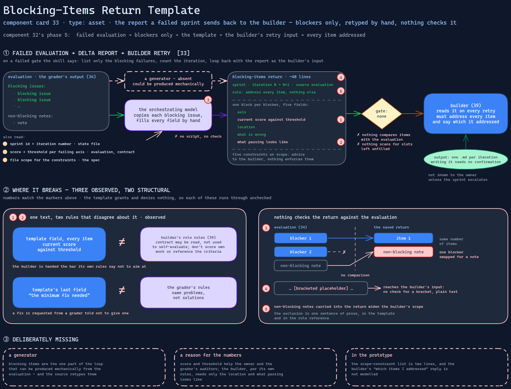

# Blocking-Items Return Template

> The report a failed sprint sends back to the builder — blockers only, each with its score
> and threshold — which hands the builder the numbers its own rules say not to aim at, and
> which nothing generates or checks.

Source: [`33-blocking-items-return-template.excalidraw`](../../../../diagrams/component-cards/role-separated-sprint-loop-orchestrator/33-blocking-items-return-template.excalidraw).

## What it is

A Markdown template of about forty lines that the sprint-loop skill
([component 32](../32-role-separated-sprint-loop-orchestrator.md)) fills when an evaluation
fails. It has a header (sprint, iteration `N` to `N+1`, its source evaluation), a rule that
every item must be addressed and nothing else, one block per blocking item with five fields —
axis, current score against threshold, location, what is wrong, what passing looks like — and
five constraints on scope. It is how [card 11](../../../../cards/11-adversarial-role-separation.md)'s
"delta, not the full evaluation" is made concrete.

## Trigger and routing

Named in the skill's template table and used in phase 5: on a failed gate the text says to
generate a delta report listing only blocking failures, count the iteration, and loop back with
the report as the builder's input. It is read by the builder
([component 39](../references/39-generator-role-reference.md)) on every retry. No script
produces it; the orchestrating model fills it from the evaluation by hand.

## Inputs

| Input | Required | Where it comes from |
|---|---|---|
| The evaluation's blocking-issues list | yes | the grader's output ([component 34](34-axis-scored-evaluation-template.md)) |
| Score and threshold for each failing axis | yes | the evaluation and the sprint contract |
| Sprint id and iteration number | yes | the state file |
| The sprint's file scope | for the constraints | the spec |

## Procedure

1. Copy each blocking issue from the evaluation's summary into a numbered item.
2. Fill the axis, the current score against its threshold, the location, and the two
   descriptions.
3. Leave out non-blocking notes.
4. Hand the document to the builder as its retry input; the builder must address every item and
   say which it addressed.

*Gate:* none. Nothing compares the items with the evaluation, and nothing looks for slots left
unfilled.

## Tools and permissions

| Tool or verb | Allowed | Enforced by |
|---|---|---|
| Writing the report | the orchestrating model | nothing — no script, no validator |
| Only blocking items included | required | the template's own sentence — prose |
| Builder confined to the sprint's file scope | required | a constraint line in the report — prose |

The template grants and denies nothing; its constraints are advice to the builder.

## Outputs

One Markdown file per iteration, passed to the builder as input. It is not shown to the owner
unless the sprint escalates, and writing it needs no confirmation.

## Failure modes

| Failure | Symptom | Root cause |
|---|---|---|
| The builder is handed the bar | Every item states the current score and the threshold, while the builder's rules forbid scoring its own work and referencing the criteria | The template puts the numbers in the builder's input; the role reference says the contract may be read but not used to self-evaluate. Observed |
| A fix is requested from a grader told not to give one | The last field is "the minimum fix needed", filled from a grader whose rules say to name problems, not solutions | One template field and one role rule describe the same text differently. Observed |
| Blockers can be swapped | A saved return has the right number of items, with one blocker replaced by a note the evaluation marked non-blocking | The return is retyped by hand and nothing compares it with the evaluation. Observed |
| Slots saved unfilled | A bracketed placeholder survives into the builder's input | No check for a bracket; the template is plain text. Structural |
| "Only blockers" rests on one sentence | Non-blocking notes carried into the return widen the builder's scope | The exclusion is prose in the template and in the role reference. Structural |

## Patterns it instances

| Card | Where it shows up in this component |
|---|---|
| [11 Adversarial Role Separation](../../../../cards/11-adversarial-role-separation.md) | The loop's return path: blockers only, so the builder is never given the full critique |
| [19 Scope Lock and Checkpoint Delivery](../../../../cards/19-scope-lock-and-checkpoint-delivery.md) | A scope constraint repeated on every retry, so the fix cannot widen the sprint |

## Provenance

Instanced in the source system by one plain-text template of about forty lines, in the skill's
assets directory beside three others. It has a header, a rule line, a repeating item block and a
constraints list. The skill's entry file describes when it is used; nothing in the component
records how many returns were written or what became of them. This card claims neither.

## Prototype

Minimal runnable prototype in
[`../../../../skeletons/components/33-blocking-items-return-template/`](../../../../skeletons/components/33-blocking-items-return-template/).
Standard library, offline. It fills a shortened template from a fabricated evaluation and then
checks a hand-saved return against that evaluation.

## What is deliberately missing

**A generator.** Blocking items are the one part of the loop that can be produced mechanically
from the evaluation, and the source retypes them.

**A reason for the numbers.** The score and threshold help the owner and the grader's auditors.
The builder, per its own rules, needs only the location and what passing looks like.

**In the prototype:** the scope-constraint list is two lines, and the builder's "which items I
addressed" reply is not modelled.
