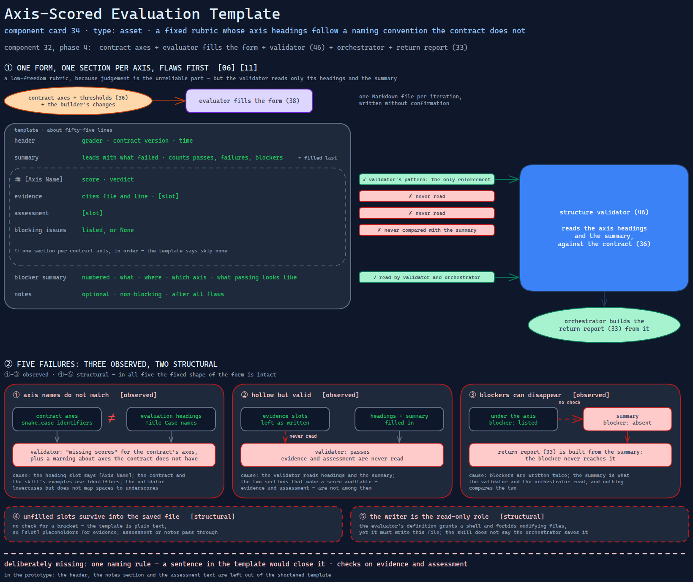

# Axis-Scored Evaluation Template

> The form a grader fills in — one section per contract axis, flaws first, blockers listed
> again at the end — whose axis headings follow a naming convention the contract does not.

Source: [`34-axis-scored-evaluation-template.excalidraw`](../../../../diagrams/component-cards/role-separated-sprint-loop-orchestrator/34-axis-scored-evaluation-template.excalidraw).

## What it is

A Markdown template of about fifty-five lines that the sprint-loop skill
([component 32](../32-role-separated-sprint-loop-orchestrator.md)) gives the evaluator. It has
a header (grader, contract version, time), a summary told to lead with what failed, one section
per axis — heading with score and verdict, then evidence, assessment and blocking issues — a
numbered blocking-issues summary whose items carry what, where, which axis and what passing
looks like, and an optional notes section. It is the fixed rubric of
[card 11](../../../../cards/11-adversarial-role-separation.md) in file form, and a low-freedom
artifact in the sense of [card 06](../../../../cards/06-calibrated-degrees-of-freedom.md).

## Trigger and routing

Named in the skill's template table and in phase 4; the evaluator's definition and its spawn
prompt both tell it to use the template's structure exactly
([component 38](../references/38-evaluator-role-reference.md)). The structure validator
([component 46](../scripts/46-evaluation-structure-validator.md)) reads the result against the
contract ([component 36](36-sprint-contract-template.md)).

## Inputs

| Input | Required | Where it comes from |
|---|---|---|
| Contract axes and thresholds | yes | the sprint contract |
| The builder's changes and notes | yes | the working tree and the builder's hand-off |
| Contract version | for the header | the contract |
| The grader's scores, evidence and blockers | yes | the grader, per axis |

## Procedure

1. Fill the header, then the summary — last, since it counts passes, failures and blockers.
2. For each contract axis, in order, write the heading with score and verdict, then evidence
   citing file and line, assessment, and blocking issues or "None". The template says not to
   skip any axis.
3. List every blocker again in the numbered summary, with its location, its axis and what
   passing would look like.
4. Add non-blocking notes, if any, after all flaws.

*Gate:* the validator's run, in the skill's phase 4, not the template's.

## Tools and permissions

| Tool or verb | Allowed | Enforced by |
|---|---|---|
| Filling the template | the evaluator | nothing in the file; the evaluator's definition says it must not modify repository files, and it is also the role that must write this one |
| Axis headings in the heading shape | required | the validator's pattern — the only enforcement |
| Evidence citing file and line | required | the template's text — prose |
| Flaws first | required | the template's text — prose |

## Outputs

One Markdown file per iteration, which the validator reads and the orchestrator turns into a
return report ([component 33](33-blocking-items-return-template.md)). It is written without
confirmation.

## Failure modes

| Failure | Symptom | Root cause |
|---|---|---|
| Axis names do not match | An evaluation using Title Case names fails validation with "missing scores" for the contract's `snake_case` axes, plus a warning about axes the contract does not have | The heading slot says `[Axis Name]`; the contract and the skill's own examples use identifiers; the validator lowercases but does not map spaces to underscores. Observed |
| Hollow but valid | An evaluation with every evidence slot left as written passes validation | Evidence and assessment are never read; the validator reads headings and the summary. Observed |
| Blockers can disappear | A blocker listed under an axis but absent from the summary reaches the return report without it | Blockers are written twice; the summary is what the validator and the orchestrator read, and nothing compares the two. Observed |
| Unfilled slots | Placeholders for evidence, assessment or notes survive into the saved file | No check for a bracket; the template is plain text. Structural |
| Writer and read-only in one role | The role that must not modify repository files has to write this file | The skill says the evaluator produces the file and does not say the orchestrator saves it on the evaluator's behalf; the evaluator's definition grants a shell and forbids modifying files. Structural |

## Patterns it instances

| Card | Where it shows up in this component |
|---|---|
| [06 Calibrated Degrees of Freedom](../../../../cards/06-calibrated-degrees-of-freedom.md) | A rubric with fixed headings and slots, because judgement is the unreliable part — and a fixed shape only as strong as what reads it |
| [11 Adversarial Role Separation](../../../../cards/11-adversarial-role-separation.md) | The grader's side of the loop: scores per axis, flaws first, blockers stated with a location |

## Provenance

Instanced in the source system by one plain-text template of about fifty-five lines in the
skill's assets directory. It has a header, a summary, a repeating axis section, a numbered
summary and a notes section, and is referred to by the evaluator's definition, its prompt and
the skill's entry file. Nothing in the component records how many evaluations were written from
it. This card claims none.

## Prototype

Minimal runnable prototype in
[`../../../../skeletons/components/34-axis-scored-evaluation-template/`](../../../../skeletons/components/34-axis-scored-evaluation-template/).
Standard library, offline. It fills a shortened template three ways and runs each through a
small structure check, so the naming mismatch and the hollow-but-valid case are both visible.

## What is deliberately missing

**One naming rule.** The contract, the validator and the walkthroughs use identifiers; the
template's slot reads as a title. A sentence in the template would close it.

**Checks on the sections that carry the reasoning.** Evidence and assessment are what make a
score auditable, and they are the two the validator does not read.

**In the prototype:** the header, the notes section and the assessment text are left out of the
shortened template.
