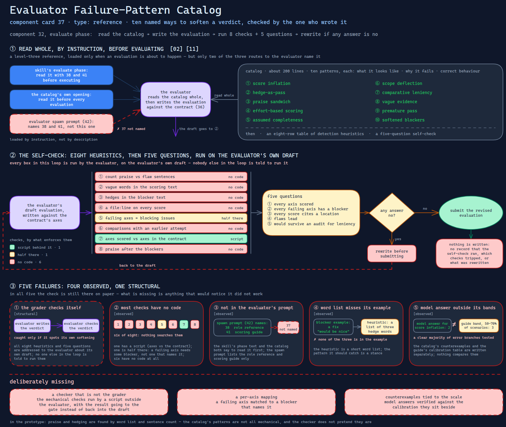

# Evaluator Failure-Pattern Catalog

> Ten named ways an evaluator softens a verdict, with a self-check to run before
> submitting — handed to the one reader whose bias it describes, to check by eye.

Source: [`37-evaluator-failure-pattern-catalog.excalidraw`](../../../../diagrams/component-cards/role-separated-sprint-loop-orchestrator/37-evaluator-failure-pattern-catalog.excalidraw).

## What it is

A reference of about 200 lines in the sprint-loop skill's references directory
([component 32](../32-role-separated-sprint-loop-orchestrator.md)). It opens by saying that
evaluator sycophancy is the largest threat to the loop, then names ten patterns — score
inflation, hedge-as-pass, praise sandwich, effort-based scoring, assumed completeness,
scope deflection, comparative leniency, vague evidence, premature pass, softened blockers —
each with the same three parts: what it looks like, why it fails, what correct behaviour
is. It closes with an eight-row table of detection heuristics and a five-question
self-check. It is [card 11](../../../../cards/11-adversarial-role-separation.md)'s
"named failure catalog", and the reference [card 02](../../../../cards/02-progressive-disclosure.md)
would load only when an evaluation is about to happen.

## Trigger and routing

Loaded by instruction, not by description. The skill's reference table lists it as a
catalog of sycophantic patterns with detection heuristics and counterexamples, and its
evaluate phase says to read it, with the evaluator role reference
([component 38](38-evaluator-role-reference.md)) and the scoring guide
([component 41](41-axis-scoring-guide.md)), before executing. The catalog's own opening says
to read it before every evaluation. The evaluator's spawn prompt
([component 42](42-role-spawn-prompt-set.md)) names the other two and not this one.

## Inputs

| Input | Required | Where it comes from |
|---|---|---|
| The catalog itself | yes | read whole before an evaluation starts |
| The evaluator's draft evaluation | for the self-check | the evaluator's own output |
| The contract's axes | for one heuristic | the sprint contract ([component 36](../assets/36-sprint-contract-template.md)) |

## Procedure

1. Read the catalog before evaluating.
2. Write the evaluation against the contract.
3. Run the eight heuristics against the draft: count praise against flaw sentences; search
   scoring text for vague words, and blocker text for hedges; check each score for a
   `file:line`; match failing axes to blocking issues; search for comparisons with an earlier
   attempt; compare axes scored with axes in the contract; look for praise after blockers.
4. Answer the five questions: every axis scored, every failing axis has a blocker, every
   score cites a location, flaws lead, and the result would survive an audit for leniency.
5. If any answer is no, rewrite before submitting.

## Tools and permissions

None of its own. The checks are searches and counts over the evaluator's draft, so they use
whatever the evaluation subagent holds ([component 50](../../../subagents/50-evaluation-subagent-definition.md)).

| Step | Allowed | Enforced by |
|---|---|---|
| Read the catalog first | required | the skill's phase text and the catalog's opening; not the spawn prompt |
| Run the eight checks | required | the catalog's instruction only |
| "Stop and rewrite" on a hit | required | the evaluator's own compliance |

## Outputs

Nothing is written. The result is a revised evaluation, and nothing records that the
self-check ran, which checks tripped, or what was rewritten.

## Failure modes

| Failure | Symptom | Root cause |
|---|---|---|
| The grader checks itself | A softened verdict is caught only if the same model, writing the same verdict, spots it | All eight heuristics and the five questions are addressed to the evaluator about its own draft; no one else in the loop is told to run them. Structural |
| Most checks have no code | Praise counts, vague words, hedges, comparisons and praise after blockers are never searched by anything | Of the eight heuristics, one has a script behind it (axes scored against contract axes); one is half there (a failing axis needs *some* blocking issue, not one that names it); six have none. Observed |
| Not in the evaluator's prompt | An evaluation is produced without the catalog having been read | The skill's phase text and the catalog both say to read it first, and the evaluator spawn prompt lists the role reference and scoring guide only ([component 42](42-role-spawn-prompt-set.md)). Observed |
| A word list that misses its own example | The catalog's softened-blocker example, which says a fix "would be nice", contains none of the three hedge words the heuristic searches for | The heuristic is a short word list; the pattern it should catch is a stance. Observed |
| A model answer outside its own bands | The model answer for score inflation gives 2 to a sprint where a clear majority of the specified error branches are tested; the scoring guide's band for 50–70% of scenarios is 3 | The catalog's counterexamples and the guide's calibration table are written separately and nothing compares them. Observed |

## Patterns it instances

| Card | Where it shows up in this component |
|---|---|
| [02 Progressive Disclosure](../../../../cards/02-progressive-disclosure.md) | A level-three reference read only when an evaluation is about to be written, not carried by every phase |
| [11 Adversarial Role Separation](../../../../cards/11-adversarial-role-separation.md) | The named failure catalog the pattern depends on — and its limit: the detector is the party being detected |

## Provenance

Instanced in the source system by one Markdown file of about 200 lines in the sprint-loop
skill's references directory: a rationale paragraph, ten patterns in a fixed three-part
form, an eight-row heuristics table and a five-question self-check. Its opening says the
patterns come from observed failures in AI-generated code review; the file records no
counts, sources or incidents, and this card claims none. Nothing in the component records how
often the self-check ran or what it caught.

## Prototype

Minimal runnable prototype in
[`../../../../skeletons/components/37-evaluator-failure-pattern-catalog/`](../../../../skeletons/components/37-evaluator-failure-pattern-catalog/).
Standard library, offline, fabricated fixtures. It runs the eight checks as code over an
evaluation written to trip them, shows a structure-only view that finds none, and checks a
model answer against a calibration table with gaps.

## What is deliberately missing

**A checker that is not the grader.** The mechanical checks run by a script outside the
evaluator, with the result going to the gate instead of back into the draft.

**A per-axis mapping.** A failing axis matched to a blocker that names it.

**Counterexamples tied to the scale.** Model answers verified against the calibration they
sit beside.

**In the prototype:** praise and hedging are found by word list and sentence count. The
catalog's patterns are not all mechanical, and the checker does not pretend they are.
