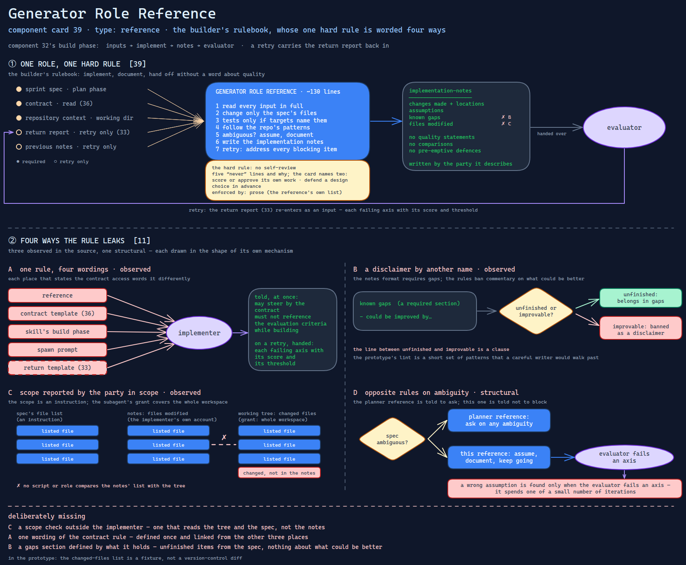

# Generator Role Reference

> The builder's rulebook — implement, document, hand off without a word about quality — whose
> one hard rule is worded four ways, and whose required notes include a section the rule
> bans in another form.

Source: [`39-generator-role-reference.excalidraw`](../../../../diagrams/component-cards/role-separated-sprint-loop-orchestrator/39-generator-role-reference.excalidraw).

## What it is

A reference of about 130 lines in the sprint-loop skill's references directory
([component 32](../32-role-separated-sprint-loop-orchestrator.md)). It defines the
implementer role: a no-self-review rule with five "never" lines and the reason behind them;
the inputs the role receives; five implementation behaviours (stay in scope, write tests
only when specified, match the repository's patterns, make atomic changes, document
assumptions); the implementation-notes format; the rules for acting on a return report in a
later iteration; and a six-row anti-pattern table. It is the building half of
[card 11](../../../../cards/11-adversarial-role-separation.md)'s separation: the role that is
denied the step that would let it grade itself.

## Trigger and routing

Loaded by instruction in the skill's build phase, which says to read it before executing. The
spawn prompts for the first attempt and for a retry
([component 42](42-role-spawn-prompt-set.md)) both tell the subagent to read it, and the
implementation subagent definition ([component 49](../../../subagents/49-implementation-subagent-definition.md))
restates the rule in a shorter form. No description routes to it.

## Inputs

| Input | Required | Where it comes from |
|---|---|---|
| Sprint spec | yes | the plan phase |
| Contract | yes, to read | the contract phase ([component 36](../assets/36-sprint-contract-template.md)) |
| Repository context | yes | the working directory |
| Return report | on a retry | the previous evaluation, as the return template ([component 33](../assets/33-blocking-items-return-template.md)) shapes it |
| Previous implementation notes | on a retry | the retry prompt |

## Procedure

1. Read every input in full.
2. Create or change only the files the sprint spec lists; record any other file that seems
   to need a change instead of changing it.
3. Write tests only if the acceptance targets name them.
4. Follow the repository's existing patterns; make each change serve the sprint's scope.
5. Where the spec is ambiguous, assume, document the assumption, and keep going.
6. Write the implementation notes: changes with locations, assumptions, known gaps, files
   modified. No quality statements, no comparisons, no pre-emptive defences.
7. On a retry, address every blocking item, do not rebuild from scratch, and say which items
   were addressed and how.

## Tools and permissions

None of its own; the role is the one that writes.

| Verb | Allowed | Enforced by |
|---|---|---|
| Create or change files | in the sprint's file list | the reference's instruction — the subagent grant covers the whole workspace |
| Score or approve its own work | no | the reference's "never" list — prose |
| Defend a design choice in advance | no | the same list — prose |
| Block on an ambiguous spec | no | the reference's instruction |
| Read the contract | yes | the reference; the skill and prompts word it differently |

## Outputs

One implementation-notes document handed to the evaluator, with four sections: changes made
with locations, assumptions, known gaps, and files modified. It is written by the party it
describes.

## Failure modes

| Failure | Symptom | Root cause |
|---|---|---|
| One rule, four wordings | The implementer is told it may steer by the contract, and also that it must not reference the evaluation criteria while building; on a retry it is then handed each failing axis with its score and threshold | The reference, the contract template, the skill's build phase and the spawn prompt each state the access to the contract differently, and the return template carries scores and thresholds into the next attempt. Observed |
| A disclaimer by another name | A "known gaps" entry reads "could be improved by…", which the same document bans as a disclaimer | The notes format requires a section of gaps while the rules ban commentary on what could be better; the line between unfinished and improvable is a clause. Observed |
| Scope reported by the party in scope | A changed file outside the sprint's list appears in the working tree and not in the notes, and nothing flags it | The file scope is an instruction, the subagent's grant covers the workspace, and the files-modified list is the implementer's own account; no script or role compares it with the tree. Observed |
| Opposite rules on ambiguity | A wrong assumption is found only when the evaluator fails an axis, spending one of a small number of iterations | The planner reference tells its role to ask on any ambiguity; this one says not to block and to let the evaluator flag. Structural |

## Patterns it instances

| Card | Where it shows up in this component |
|---|---|
| [11 Adversarial Role Separation](../../../../cards/11-adversarial-role-separation.md) | The role with no grading step, and the notes format built so the hand-off carries no verdict — and the limits of that when the notes are self-reported |

## Provenance

Instanced in the source system by one Markdown file of about 130 lines in the sprint-loop
skill's references directory, with a table of contents, beside one reference each for the
planner and the evaluator. The rule it calls the most important in the workflow is repeated
in the subagent definition and both spawn prompts. Nothing in the component records how many
implementations it governed or how many notes broke it.

## Prototype

Minimal runnable prototype in
[`../../../../skeletons/components/39-generator-role-reference/`](../../../../skeletons/components/39-generator-role-reference/).
Standard library, offline, fabricated fixtures. It lints a set of implementation notes for
the banned wording and the required sections, compares the spec's file list, the notes' list
and the changed-files list, and sets four statements of the contract rule side by side.

## What is deliberately missing

**A scope check outside the implementer.** One that reads the tree and the spec, not the
notes.

**One wording of the contract rule.** Defined once and linked from the other three places.

**A gaps section defined by what it holds.** Unfinished items from the spec, and nothing
about what could be better.

**In the prototype:** the changed-files list is a fixture, not a version-control diff, and
the banned-wording lint is a short set of patterns that a careful writer would walk past.
