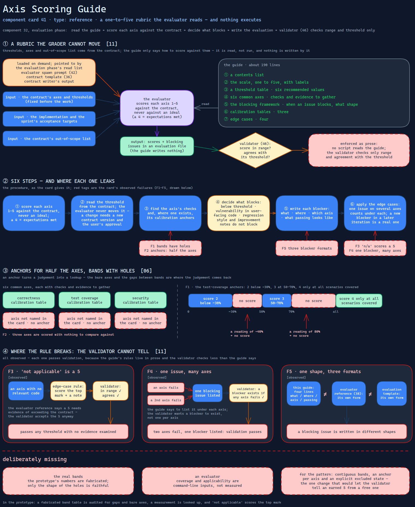

# Axis Scoring Guide

> A one-to-five scale with recommended thresholds, six common axes, a blocking-issue
> test and calibration tables — anchors for three of the six axes, bands with holes, and
> a rule that scores an axis that does not apply as the top mark.

Source: [`41-axis-scoring-guide.excalidraw`](../../../../diagrams/component-cards/role-separated-sprint-loop-orchestrator/41-axis-scoring-guide.excalidraw).

## What it is

A reference file loaded during the evaluation phase of the sprint-loop orchestrator
([component 32](../32-role-separated-sprint-loop-orchestrator.md)). It defines the scale
and its labels, tells the reader how to interpret a threshold, describes six common axes
with checks and evidence to gather, sets out when an issue blocks and in what shape to
write it, gives calibration anchors, and settles four edge cases. About 190 lines. It
turns "is this a 3 or a 4" from a feeling into a comparison — as far as its anchors go.

## Trigger and routing

Loaded on demand. The evaluation phase lists it among the files to read before grading,
the evaluator's spawn prompt ([component 42](42-role-spawn-prompt-set.md)) names it, and
the contract template ([component 36](../assets/36-sprint-contract-template.md)) and the
contract writer's output both point a reader to it for calibration. It has no triggers of
its own.

## Inputs

| Input | Required | Where it comes from |
|---|---|---|
| The contract's axes and thresholds | yes | the sprint's contract file, fixed before the work |
| The implementation and the sprint's acceptance targets | yes | the generator's output and the spec |
| The contract's out-of-scope list | yes | the contract file |

## Procedure

1. Score each axis from one to five against the contract, never against an ideal; a 4
   means the contract's expectations are met.
2. Read the threshold from the contract. The evaluator never raises or lowers it; a change
   needs a new contract version and the user's approval.
3. Find the axis's checks and, where one exists, its calibration anchors.
4. Decide what blocks: below threshold, a vulnerability in user-facing code, a regression.
   Style and improvement notes do not block.
5. Write each blocker with what, where, which axis and what passing looks like.
6. Apply the edge cases: an issue affecting several axes counts under each; a new blocker
   in a later iteration is a real blocker.

## Tools and permissions

None named, none granted. The guide is read, not run. Its rules are enforced as prose: no
script reads it, and the evaluation validator ([component 46](../scripts/46-evaluation-structure-validator.md))
checks only that a score is in range and agrees with its threshold.

## Outputs

Nothing is written. It shapes the scores and blocking issues in an evaluation file.

## Failure modes

| Failure | Symptom | Root cause |
|---|---|---|
| Bands with holes | A test-coverage measurement of roughly forty percent, or of eighty, has no score | The anchors give score 2 below about 30%, score 3 at 50–70%, and score 4 only at all scenarios covered; the ranges between are unassigned. Observed |
| Anchors for half the axes | Three axes with checks and evidence lists are scored with nothing to compare against | Calibration tables exist for correctness, test coverage and security only. Observed |
| "Not applicable" is a 5 | An axis with no relevant code passes any threshold with no evidence examined | The edge-case rule scores it as the top mark with a note; the evaluator reference says a 5 needs evidence of exceeding the contract, and the validator accepts the 5. Observed |
| One issue, many axes | Two axes fail and one blocking issue is listed; validation passes | The guide says to list it under each axis; the validator checks that some blocker exists when any axis fails, not one per axis. Observed |
| One shape, three formats | A blocking issue is written four ways | This guide's four-line what / where / axis / passing-looks-like form differs from the evaluator reference's and the evaluation template's. Observed |

## Patterns it instances

| Card | Where it shows up in this component |
|---|---|
| [06 Calibrated Degrees of Freedom](../../../../cards/06-calibrated-degrees-of-freedom.md) | Anchors reduce a judgement to a lookup — and the holes and bare axes are where the freedom comes back |
| [11 Adversarial Role Separation](../../../../cards/11-adversarial-role-separation.md) | A fixed rubric the evaluator cannot move: thresholds belong to the contract, not to the grader |

## Provenance

Instanced in the source system by one Markdown reference of about 190 lines in a skill's
references directory: a contents list, the scale, a threshold table of six recommended
values, six axis descriptions, the blocking framework, three calibration tables and four
edge cases. The source does not record whether its anchors were checked against real
evaluations, or how often an axis was marked not applicable. This card claims neither.

## Prototype

Minimal runnable prototype in
[`../../../../skeletons/components/41-axis-scoring-guide/`](../../../../skeletons/components/41-axis-scoring-guide/).
Standard library, offline. It audits a fabricated band table for gaps and bare axes,
looks a measurement up, and shows "not applicable" scored as the top mark against the same
axis left out of the gate.

## What is deliberately missing

**The real bands.** The prototype's numbers are fabricated; only the shape of the holes is
faithful. They are not the guide's.

**An evaluator.** Coverage and applicability are command-line inputs, not measured.

**For the pattern:** contiguous bands, an anchor per axis and an explicit excluded state —
the one change that would let the validator tell an earned 5 from a free one.
