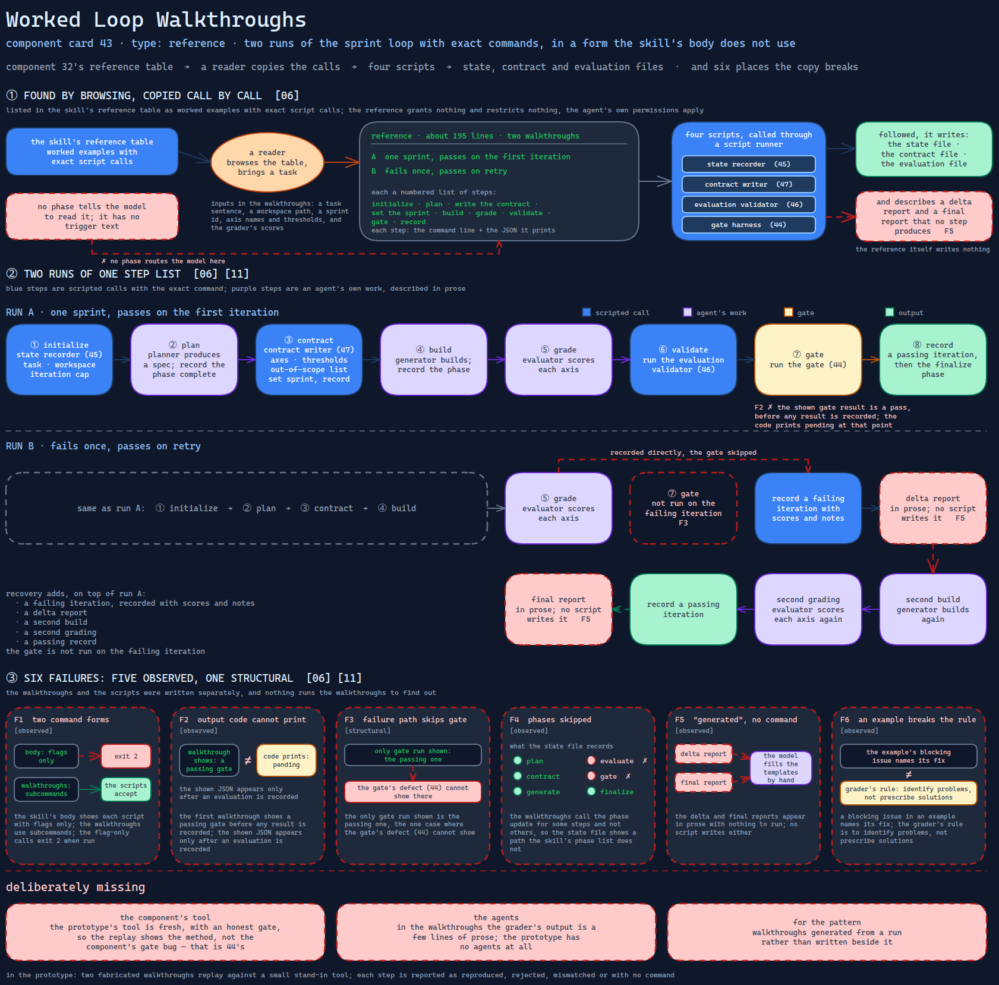

# Worked Loop Walkthroughs

> Two step-by-step runs of the sprint loop with exact commands and printed output — in a
> command form the skill's own body does not use, with a gate output the code cannot print
> and a failure path that never reaches the gate.

Source: [`43-worked-loop-walkthroughs.excalidraw`](../../../../diagrams/component-cards/role-separated-sprint-loop-orchestrator/43-worked-loop-walkthroughs.excalidraw).

## What it is

A reference file of about 195 lines holding two walkthroughs: a one-sprint run that passes
on the first iteration, and one that fails once and passes on retry. Each is a numbered
list of steps — initialize, plan, write the contract, set the sprint, build, grade,
validate, gate, record — with the command line and the JSON it prints. They are the
nearest thing the sprint-loop orchestrator
([component 32](../32-role-separated-sprint-loop-orchestrator.md)) has to a test: a reader
copies the calls. It is calibrated-freedom guidance in [card 06](../../../../cards/06-calibrated-degrees-of-freedom.md)'s
terms — exact calls for the fragile, scripted parts.

## Trigger and routing

Listed in the skill's reference table as worked examples with exact script calls. No phase
tells the model to read it, so it is found by browsing the table or by a reader. It has no
trigger text.

## Inputs

None at run time; a reader brings a task. In the walkthroughs the inputs are a task
sentence, a workspace path, a sprint id, axis names and thresholds, and the grader's
scores.

## Procedure

First-try pass:

1. Initialize the loop's state with a task, a workspace and an iteration cap.
2. The planner produces a spec; record the phase as complete.
3. Write the contract with axes, thresholds and an out-of-scope list; set the sprint;
   record the contract phase.
4. The generator builds; record the phase.
5. The evaluator scores each axis; run the evaluation validator.
6. Run the gate, record a passing iteration, record the finalize phase.

Recovery adds a failing iteration recorded with scores and notes, a delta report, a second
build, a second grading, and a passing record. The gate is not run on the failing
iteration.

## Tools and permissions

Calls four scripts through a script runner — the state recorder
([component 45](../scripts/45-loop-state-recorder.md)), the contract writer
([component 47](../scripts/47-sprint-contract-writer.md)), the evaluation validator
([component 46](../scripts/46-evaluation-structure-validator.md)) and the gate harness
([component 44](../scripts/44-loop-gate-and-history-harness.md)). It grants nothing and
restricts nothing; the agent's own permissions apply.

## Outputs

Nothing is written by the reference. Followed, it writes the state file and the contract
and evaluation files, and describes a delta report and a final report that no step
produces.

## Failure modes

| Failure | Symptom | Root cause |
|---|---|---|
| Two command forms | The skill's body shows each script with flags only; the walkthroughs use subcommands; the flag-only form exits 2 | The body and the walkthroughs were written separately, and the scripts accept only subcommands. Observed — the flag-only calls fail when run |
| Output the code cannot print | The first walkthrough shows a passing gate before any result is recorded; the code prints pending at that point | The shown JSON appears only after an evaluation is recorded; the walkthrough was written from the intended flow. Observed |
| The failure path skips the gate | The recovery walkthrough records a failure directly and never runs the gate on it | The only gate run shown is the passing one — the one case where the gate's defect ([component 44](../scripts/44-loop-gate-and-history-harness.md)) cannot show. Structural |
| Phases skipped | The state records plan, contract, generate and finalize, never evaluate or gate | The walkthroughs call the phase update for some steps and not others, so the state file shows a path the skill's phase list does not. Observed |
| Reports "generated" with no command | The delta and final reports appear in prose with nothing to run | No script writes either; the model fills the templates by hand. Observed |
| An example that breaks the rule | A blocking issue in an example names its fix | The grader's rule is to identify problems, not prescribe solutions; the example does not follow it. Observed |

## Patterns it instances

| Card | Where it shows up in this component |
|---|---|
| [06 Calibrated Degrees of Freedom](../../../../cards/06-calibrated-degrees-of-freedom.md) | Exact commands for the scripted steps, prose for the agents' work — the low-freedom end, copied literally |
| [11 Adversarial Role Separation](../../../../cards/11-adversarial-role-separation.md) | The whole loop demonstrated: plan, contract, build, grade, validate, gate, retry |

## Provenance

Instanced in the source system by one Markdown reference of about 195 lines in a skill's
references directory: a contents list and two walkthroughs. They use small web-service
tasks, which this card does not reuse. The source does not record whether either was run
as written. This card claims neither.

## Prototype

Minimal runnable prototype in
[`../../../../skeletons/components/43-worked-loop-walkthroughs/`](../../../../skeletons/components/43-worked-loop-walkthroughs/).
Standard library, offline. It replays two fabricated walkthroughs against a small
stand-in tool and reports which steps reproduce, are rejected, mismatch or have no command.

## What is deliberately missing

**The component's tool.** The prototype's tool is fresh, with an honest gate, so the replay
shows the method rather than the component's gate bug — that is component 44's.

**The agents.** In the walkthroughs the grader's output is a few lines of prose; the
prototype has no agents at all.

**For the pattern:** walkthroughs generated from a run rather than written beside it.
