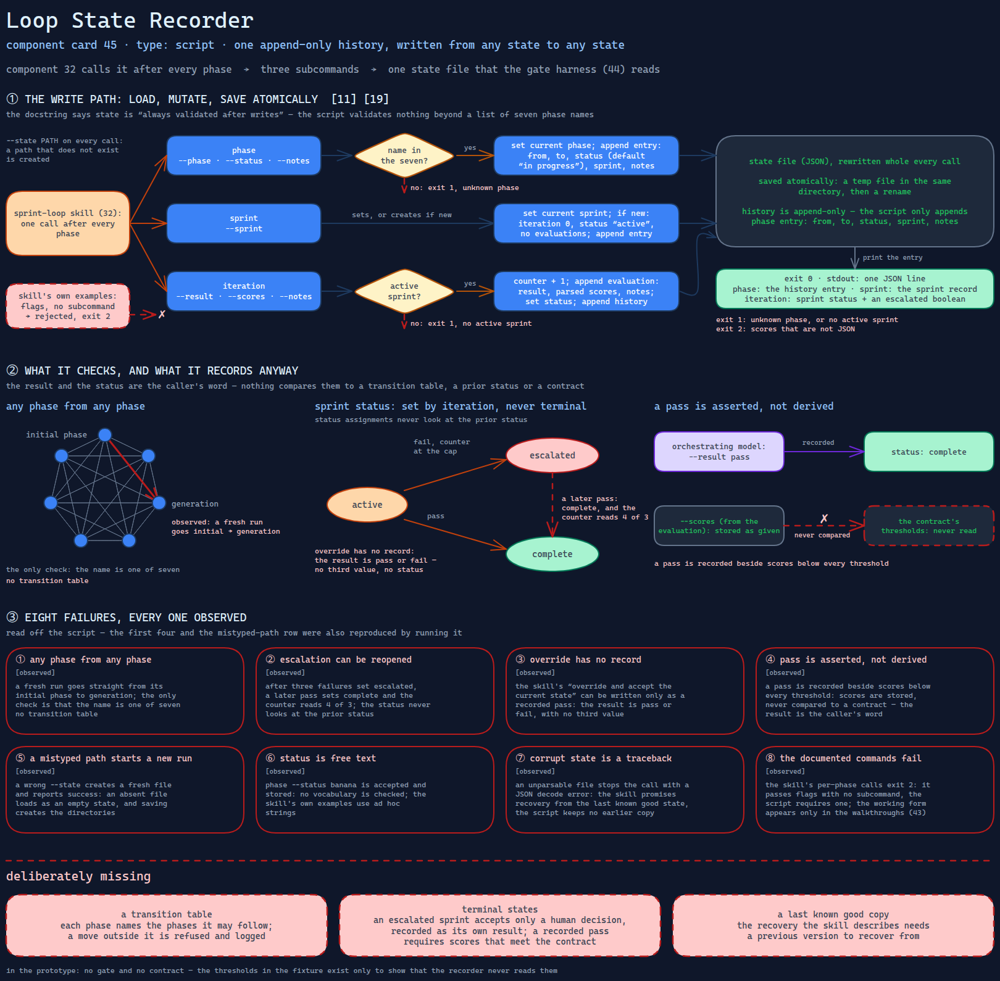

# Loop State Recorder

> The script that writes the loop's phase, sprint and iteration into one append-only history —
> and records whatever it is told, from any state to any state.

Source: [`45-loop-state-recorder.excalidraw`](../../../../diagrams/component-cards/role-separated-sprint-loop-orchestrator/45-loop-state-recorder.excalidraw).

## What it is

A standard-library Python script with three subcommands over the loop's JSON state file:
`phase` sets the current phase and logs the move, `sprint` sets or creates the active sprint,
and `iteration` records one evaluated attempt — a result, optional scores, optional notes —
and moves the sprint to `escalated` or `complete`. It is the writer to the gate harness's
reader ([component 44](44-loop-gate-and-history-harness.md)), and the sprint-loop skill
([component 32](../32-role-separated-sprint-loop-orchestrator.md)) calls it after every
phase. Its docstring says state is "always validated after writes"; the script contains no
validation beyond a list of seven phase names.

## Trigger and routing

Executed, never loaded. The skill's phase text ends each phase with one call to it, and
every example in the skill's entry file passes flags with no subcommand — a form the
script's parser rejects. The working form, with a subcommand first, appears only in the
worked walkthroughs ([component 43](../references/43-worked-loop-walkthroughs.md)). The
outcome report template ([component 35](../assets/35-run-outcome-report-template.md))
reports from the state this script writes.

## Inputs

| Input | Required | Where it comes from |
|---|---|---|
| Subcommand: `phase`, `sprint` or `iteration` | yes | the calling phase |
| `--state` path | yes | the calling phase; a path that does not exist is created |
| `--phase` (`phase`) | yes; one of seven names | the calling phase |
| `--status`, `--notes` | no; the status is free text | the orchestrating model |
| `--sprint` (`sprint`) | yes | the plan |
| `--result` (`iteration`) | yes; `pass` or `fail` | the orchestrating model's reading of the evaluation |
| `--scores` (`iteration`) | no; a JSON object | the evaluation |

## Procedure

1. Load the state file; if it is absent, start from an empty state. An unparsable file
   raises.
2. **`phase`.** Reject a name outside the seven. Set the current phase and append an entry:
   from, to, status (default "in progress"), sprint, notes.
3. **`sprint`.** Set the current sprint. If it is new, create its record: iteration 0,
   status "active", no evaluations. Append an entry.
4. **`iteration`.** Require an active sprint. Add one to its counter and append an
   evaluation entry with the result, the parsed scores and the notes. If the result is
   `fail` and the counter has reached the cap, set the sprint's status to `escalated`; if
   the result is `pass`, set it to `complete`. Append a history entry.
5. Write atomically — a temporary file in the same directory, then a rename — and print the
   entry as JSON.

## Tools and permissions

| Tool or verb | Allowed | Enforced by |
|---|---|---|
| Read and write the state file | any path given | the script; a missing path is created, with its parent directories |
| Network, subprocesses, a shell | not used | the script's code has no path to them |
| Phase transitions | any phase to any phase | nothing; membership in a list of names is the only check |
| Status vocabulary | free text on `phase`; three values set by `iteration` | nothing on the free text |
| Deleting history | not offered | the script only appends; the gate harness's force flag empties it |

## Outputs

The state file, rewritten whole on every call, and one JSON line on stdout: the history
entry for `phase`, the sprint record for `sprint`, a summary with the sprint status and an
`escalated` boolean for `iteration`. Exit 0 on success; 1 for an unknown phase or no active
sprint; 2 for scores that are not JSON.

## Failure modes

Every row is read off the script; the first four and the typo row were also reproduced by
running it.

| Failure | Symptom | Root cause |
|---|---|---|
| Any phase from any phase | A fresh run goes straight from its initial phase to generation | The only check is that the name is one of seven; there is no transition table. Observed |
| Escalation can be reopened | After three failures set `escalated`, a later `pass` sets `complete` and the counter reads 4 of 3 | The status assignments never look at the prior status. Observed |
| Override has no record | The skill's "override and accept the current state" option can be written only as a recorded pass | The result is `pass` or `fail`; there is no third value and no status for it. Observed |
| Pass is asserted, not derived | A pass is recorded beside scores below every threshold | Scores are stored, never compared to a contract; the result is the caller's word. Observed |
| A mistyped path starts a new run | A wrong `--state` creates a fresh file and reports success | Loading returns an empty state when the file is absent, and saving creates directories. Observed |
| Status is free text | `phase --status banana` is accepted and stored | No vocabulary is checked; the skill's own examples use ad hoc strings. Observed |
| Corrupt state is a traceback | An unparsable file stops the call with a JSON decode error | The skill promises recovery from the last known good state; the script has no handler and keeps no earlier copy. Observed |
| The documented commands fail | The skill's per-phase calls exit 2 | The skill passes flags with no subcommand; the script requires one. Observed |

## Patterns it instances

| Card | Where it shows up in this component |
|---|---|
| [11 Adversarial Role Separation](../../../../cards/11-adversarial-role-separation.md) | The iteration cap with escalation: the cap is counted and `escalated` is set — and the state it sets is not terminal |
| [19 Scope Lock and Checkpoint Delivery](../../../../cards/19-scope-lock-and-checkpoint-delivery.md) | A checkpoint record per phase and per iteration — appended faithfully, and trusted without a check of what it asserts |

## Provenance

Instanced in the source system by one standard-library Python script of about 250 lines in
the skill's scripts directory: three subcommands, a load and an atomic save, a fixed set of
seven phase names, and one function per subcommand. It carries inline script metadata for a
script runner, declaring a minimum Python version and no dependencies. Nothing in the
component records a run or a state file it produced; this card claims neither.

## Prototype

Minimal runnable prototype in
[`../../../../skeletons/components/45-loop-state-recorder/`](../../../../skeletons/components/45-loop-state-recorder/).
Standard library, offline. A fresh recorder with the same three subcommands; `--audit`
drives it in a temporary directory and reports eight findings, from the unchecked phase
move to the corrupt file.

## What is deliberately missing

**A transition table.** Each phase would name the phases it may follow, and a move outside
it would be refused and logged.

**Terminal states.** An escalated sprint would accept only a human decision, recorded as its
own result; a recorded pass would require scores that meet the contract.

**A last known good copy.** The recovery the skill describes needs a previous version to
recover from.

**In the prototype:** no gate and no contract; the thresholds in the fixture exist only to
show that the recorder never reads them.
