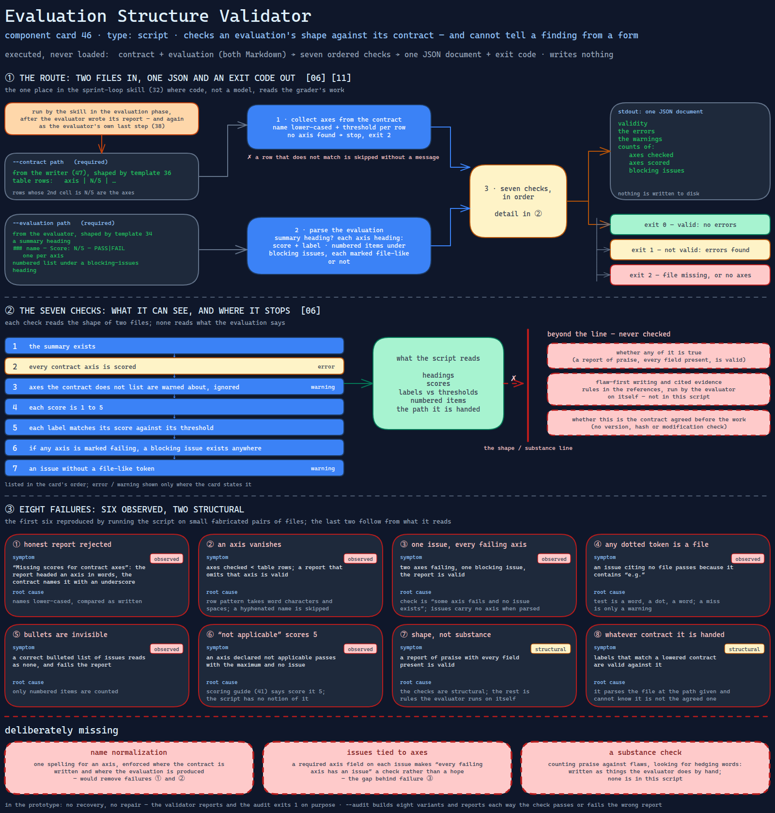

# Evaluation Structure Validator

> The script that checks an evaluation's shape against its contract — every axis scored,
> every label consistent with its threshold — and cannot tell a finding from a form.

Source: [`46-evaluation-structure-validator.excalidraw`](../../../../diagrams/component-cards/role-separated-sprint-loop-orchestrator/46-evaluation-structure-validator.excalidraw).

## What it is

A standard-library Python script that reads a contract and an evaluation, both Markdown, and
reports whether the evaluation is structurally complete. It is the mechanical half of the
pattern's last step — validate the evaluator's output so a malformed or evasive evaluation is
detected rather than accepted
([card 11](../../../../cards/11-adversarial-role-separation.md)) — and the one place in the
sprint-loop skill ([component 32](../32-role-separated-sprint-loop-orchestrator.md)) where
code, not a model, reads the grader's work. It checks that scores line up with thresholds
and that failing axes have issues. It does not check that any of it is true.

## Trigger and routing

Executed, never loaded. The skill runs it in the evaluation phase, after the evaluator has
written its report, and sends the report back for correction if it fails. The evaluator role
reference ([component 38](../references/38-evaluator-role-reference.md)) lists the same run
as the evaluator's own last protocol step — one check with two owners, one of whom is the
party being checked. The walkthroughs
([component 43](../references/43-worked-loop-walkthroughs.md)) show the call and its output.

## Inputs

| Input | Required | Where it comes from |
|---|---|---|
| `--contract` path | yes | the contract the writer produced ([component 47](47-sprint-contract-writer.md)) |
| `--evaluation` path | yes | the evaluator's report, in the shape of the evaluation template ([component 34](../assets/34-axis-scored-evaluation-template.md)) |
| Contract shape | table rows of `axis \| N/5 \| …` | the contract template ([component 36](../assets/36-sprint-contract-template.md)) |
| Evaluation shape | a summary heading, one `### name — Score: N/5 — PASS\|FAIL` heading per axis, a numbered list under a blocking-issues heading | the evaluation template |

## Procedure

1. Read the contract and collect, from every table row whose second cell is `N/5`, the axis
   name (lower-cased) and the threshold. A row that does not match is skipped without a
   message. If no axis is found, stop with exit 2.
2. Parse the evaluation: whether a summary heading exists, each axis heading with its score
   and label, and the numbered items under the blocking-issues heading, noting for each
   whether it contains something shaped like a file reference.
3. Check, in order: the summary exists; every contract axis is scored (an error); axes the
   contract does not list are warned about and ignored; each score is 1 to 5; each label
   matches its score against its threshold; if any axis is marked failing, at least one
   blocking issue exists anywhere in the report; issues without a file-like token produce a
   warning.
4. Print one JSON document. Exit 0 if there are no errors, 1 otherwise.

## Tools and permissions

| Tool or verb | Allowed | Enforced by |
|---|---|---|
| Read the two files | yes | the script; exit 2 if either is missing |
| Write anything | no | the script's code has no write path |
| Network, subprocesses | not used | the script's code has no path to them |
| Which contract it reads | whichever path it is given | nothing; no version, hash or modification check ties it to the one agreed before the work |

## Outputs

One JSON document on stdout: validity, the errors, the warnings, and counts of axes checked,
axes scored and blocking issues. Exit 0 if valid, 1 if not, 2 if a file is missing or the
contract yields no axes. Nothing is written to disk.

## Failure modes

The first six rows were reproduced by running the script on small fabricated pairs of files; the last two follow from what it reads.

| Failure | Symptom | Root cause |
|---|---|---|
| An honest evaluation is rejected | "Missing scores for contract axes" when the report headed an axis in words and the contract names it with an underscore | Names are lower-cased and compared as written; the contract uses identifiers and the evaluation template says to write an axis name. Observed |
| An axis vanishes from the contract | The count of axes checked is lower than the table's rows, and an evaluation that omits that axis is valid | The row pattern accepts word characters and spaces; a hyphenated name does not match and the row is skipped silently. Observed |
| One issue covers every failing axis | Two axes marked failing, one blocking issue, and the report is valid | The check is "some axis fails and no issue exists"; issues carry no axis in what is parsed. Observed |
| Any dotted token is a file reference | An issue citing no file passes because it contains "e.g." | The test is a word, a dot and a word; and a miss is only a warning. Observed |
| Bullets are invisible | A correct list of issues in bullet form reads as no issues and fails the report | Only numbered items are counted. Observed |
| "Not applicable" scores 5 | An axis declared not applicable passes with the maximum score and no issue | The scoring guide ([component 41](../references/41-axis-scoring-guide.md)) says to score such an axis 5; the script has no notion of it. Observed |
| Shape, not substance | A report of praise with every field present is valid | The checks are structural; flaw-first writing and cited evidence are rules in the references, run by the evaluator on itself. Structural |
| Whatever contract it is handed | A report whose labels match a lowered contract is valid against it | The script parses the file at the path it is given and cannot know it is not the agreed one. Structural |

## Patterns it instances

| Card | Where it shows up in this component |
|---|---|
| [06 Calibrated Degrees of Freedom](../../../../cards/06-calibrated-degrees-of-freedom.md) | A fragile, mechanical step given to a script instead of prose — correct for shape, and left to prose for everything the script cannot see |
| [11 Adversarial Role Separation](../../../../cards/11-adversarial-role-separation.md) | The structural validation of the evaluation itself, so a malformed one is detected — with the limit that a well-formed evasive one is not |

## Provenance

Instanced in the source system by one standard-library Python script of about 207 lines in
the skill's scripts directory: a contract parser, an evaluation parser, a validation
function and a small entry point, with inline script metadata for a script runner. Its
header describes the checks as including that blocking issues "reference specific files";
the code treats that as a warning. Nothing in the component records a run of it or what it
accepted; this card claims neither.

## Prototype

Minimal runnable prototype in
[`../../../../skeletons/components/46-evaluation-structure-validator/`](../../../../skeletons/components/46-evaluation-structure-validator/).
Standard library, offline. A fresh validator over a fabricated contract and evaluations for a
small CSV-import sprint; `--audit` builds eight variants and reports each way the check
passes or fails the wrong report.

## What is deliberately missing

**Name normalization.** One spelling for an axis, enforced where the contract is written and
where the evaluation is produced, would remove the first two rows.

**Issues tied to axes.** A required axis field on each issue would make "every failing axis
has an issue" a check rather than a hope.

**A substance check.** Counting praise against flaws and looking for hedging words are
mechanical and are written in the catalogue as things the evaluator does by hand; none is in
this script.

**In the prototype:** no recovery and no repair; the validator reports and the audit
exits 1 on purpose.
