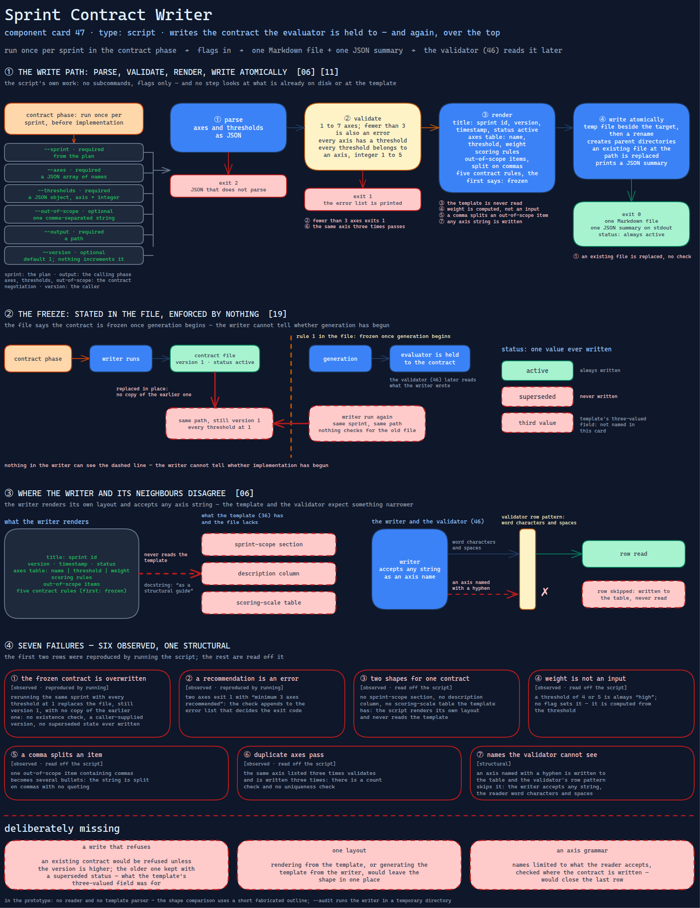

# Sprint Contract Writer

> The script that writes the contract the evaluator will be held to — and will write it
> again, over the top, with any thresholds it is given.

Source: [`47-sprint-contract-writer.excalidraw`](../../../../diagrams/component-cards/role-separated-sprint-loop-orchestrator/47-sprint-contract-writer.excalidraw).

## What it is

A standard-library Python script that turns a sprint id, a list of axes, a threshold for each
and a list of out-of-scope items into a Markdown contract file. It is the executable half of
the pattern's second step — negotiate the bar in advance
([card 11](../../../../cards/11-adversarial-role-separation.md)) — and the only script in
the sprint-loop skill ([component 32](../32-role-separated-sprint-loop-orchestrator.md)) that
writes a document a model will later be graded against. Its docstring says it uses the
contract template ([component 36](../assets/36-sprint-contract-template.md)) "as a
structural guide". It does not read the template; it renders its own shape.

## Trigger and routing

Executed, never loaded. The skill runs it once per sprint in the contract phase, before any
implementation, and states the rule that the result is frozen once generation begins. Unlike
the other scripts it has no subcommands, so the flag-only form the skill documents works. The
walkthroughs ([component 43](../references/43-worked-loop-walkthroughs.md)) show it called
with a three-axis contract. The evaluation validator
([component 46](46-evaluation-structure-validator.md)) later reads what it wrote.

## Inputs

| Input | Required | Where it comes from |
|---|---|---|
| `--sprint` | yes | the plan |
| `--axes` | yes; a JSON array of names | the contract negotiation |
| `--thresholds` | yes; a JSON object, axis to integer | the contract negotiation |
| `--out-of-scope` | no; one comma-separated string | the contract negotiation |
| `--output` | yes; a path | the calling phase |
| `--version` | no; default 1 | the caller; nothing increments it |

## Procedure

1. Parse the axes and thresholds as JSON; on a parse error print an error and exit 2.
2. Validate: at least one axis and no more than seven; fewer than three is also an error,
   worded as a recommendation; every axis has a threshold; every threshold belongs to an
   axis and is an integer from 1 to 5. Any error prints the list and exits 1.
3. Render: a title with the sprint id, a version, a timestamp and a status of active; an axes
   table of name, threshold and a weight; scoring rules; the out-of-scope items, split on
   commas; and five contract rules, the first of which says the contract is frozen.
4. Write atomically — a temporary file beside the target, then a rename — creating parent
   directories, and print a JSON summary. An existing file at the path is replaced.

## Tools and permissions

| Tool or verb | Allowed | Enforced by |
|---|---|---|
| Write the output path | yes, replacing whatever is there | the script; there is no check for an existing contract |
| Create parent directories | yes | the script |
| Read the contract template | no | the script's code never opens it |
| Network, subprocesses | not used | the script's code has no path to them |
| "Frozen once implementation begins" | stated in the file it writes | nothing; the writer cannot tell whether implementation has begun |

## Outputs

One Markdown file and one JSON summary on stdout. Exit 0 on success, 1 for invalid inputs,
2 for JSON that does not parse. The file's status is always `active`; no value for a
superseded contract is ever written.

## Failure modes

The first two rows were reproduced by running the script; the rest are read off it.

| Failure | Symptom | Root cause |
|---|---|---|
| The frozen contract is overwritten | Rerunning for the same sprint with every threshold at 1 replaces the file, still at version 1, with no copy of the earlier one | The write has no existence check, the version is a caller-supplied number, and no superseded state is ever written. Observed |
| A recommendation is an error | Two axes exit 1 with "minimum 3 axes recommended" | The check appends to the error list that decides the exit code. Observed |
| Two shapes for one contract | The file has no sprint-scope section, no description column and no scoring-scale table the template has | The script renders its own layout and never reads the template. Observed |
| Weight is not an input | A threshold of 4 or 5 is always "high"; no flag sets it | It is computed from the threshold. Observed |
| A comma splits an item | One out-of-scope item containing commas becomes several bullets | The string is split on commas with no quoting. Observed |
| Duplicate axes pass | The same axis listed three times validates and is written three times | There is a count check and no uniqueness check. Observed |
| Names the validator cannot see | An axis named with a hyphen is written to the table, and the validator's row pattern skips it | The writer accepts any string; the reader accepts word characters and spaces ([component 46](46-evaluation-structure-validator.md)). Structural |

## Patterns it instances

| Card | Where it shows up in this component |
|---|---|
| [06 Calibrated Degrees of Freedom](../../../../cards/06-calibrated-degrees-of-freedom.md) | A fragile step — the format the validator will parse — put in a script instead of left to a model's drafting |
| [11 Adversarial Role Separation](../../../../cards/11-adversarial-role-separation.md) | The contract written before the work, with an out-of-scope list as a control on evaluation creep |
| [19 Scope Lock and Checkpoint Delivery](../../../../cards/19-scope-lock-and-checkpoint-delivery.md) | The freeze, stated in the document and enforced by nothing that can see the work begin |

## Provenance

Instanced in the source system by one standard-library Python script of about 200 lines in
the skill's scripts directory: an input validator, a Markdown renderer and an atomic write,
with inline script metadata for a script runner. It is the one script in the skill that
takes plain flags and no subcommand. Nothing in the component records a contract it wrote or
a rewrite; this card claims neither.

## Prototype

Minimal runnable prototype in
[`../../../../skeletons/components/47-sprint-contract-writer/`](../../../../skeletons/components/47-sprint-contract-writer/).
Standard library, offline. A fresh writer with the same flags; `--audit` runs it in a
temporary directory and reports seven findings, from the silent overwrite to the axis name
a reader cannot see.

## What is deliberately missing

**A write that refuses.** An existing contract would be refused unless the version is
higher, and the older one kept with a superseded status — which is what the template's
three-valued status field was for.

**One layout.** Rendering from the template, or generating the template from the writer,
would leave the shape in one place.

**An axis grammar.** Names limited to what the reader accepts, checked where the contract is
written, would close the last row.

**In the prototype:** no reader and no template parser; the shape comparison uses a short
fabricated outline.
