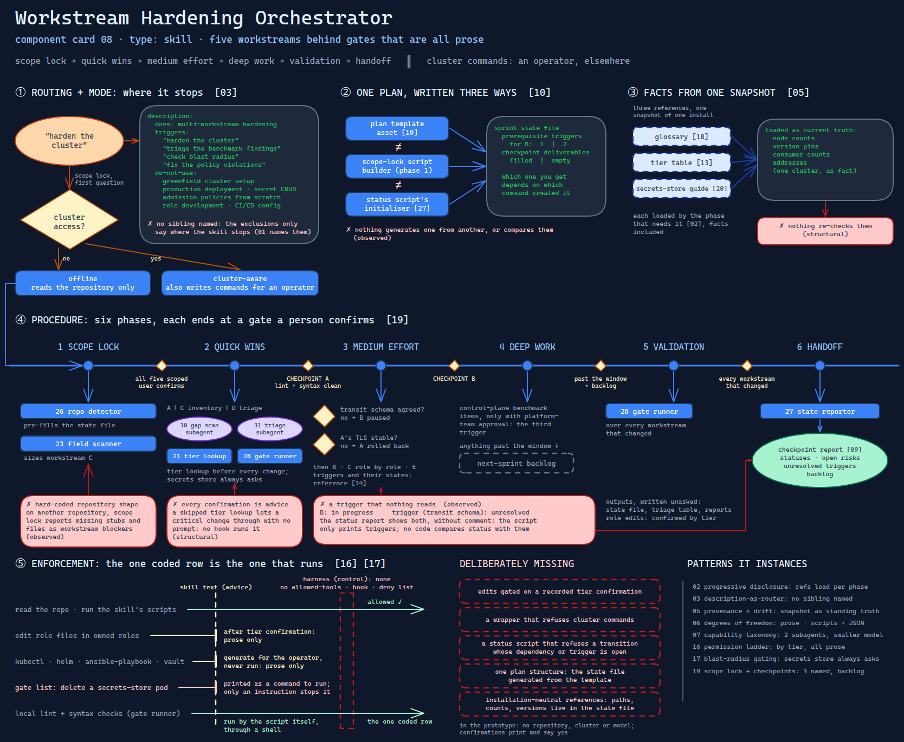

# Workstream Hardening Orchestrator

> A skill that runs a two-day security hardening sprint as five ordered workstreams behind
> blast-radius confirmations, dry-runs and named checkpoints — and hands every cluster
> command to an operator instead of running it.

Source: [`08-workstream-hardening-orchestrator.excalidraw`](../../../diagrams/component-cards/workstream-hardening-orchestrator/08-workstream-hardening-orchestrator.excalidraw).

## What it is

A model-invoked skill for hardening an Ansible-managed Kubernetes cluster from its
infrastructure repository. It locks a sprint scope, splits the work into five workstreams —
secrets-store TLS (A), secrets-store auto-unseal (B), admission-policy remediation on the
team's own roles (C), CIS benchmark triage (D) and cluster hygiene (E) — orders them into
three priority bands, and delivers status at three named checkpoints. It works in one of two
modes: **offline**, reading the repository only, or **cluster-aware**, where it also writes
the cluster commands an operator should run. It never runs them itself.

It is the largest bundle in the kit: four templates, eight reference files, nine scripts and
two subagents, each described by its own card beneath this one.

## Trigger and routing

The description is the routing table ([card 03](../../../cards/03-description-as-router.md)).
It names the job — multi-workstream hardening with dependency ordering, blast-radius gates,
dry-runs and checkpoint delivery — then lists trigger phrases a user types ("harden the
cluster", "triage the benchmark findings", "check blast radius", "fix the policy
violations") and a do-not-use list: greenfield cluster setup, production deployment,
secret CRUD, writing admission policies from scratch, role development and CI/CD
configuration. Unlike component 01's description, the exclusions name no sibling that
fits better; they say only where the skill stops.

Inside the skill there is a second router: the choice between its two subagents and its own
phases is made by a table in the entry file, not by descriptions
([card 07](../../../cards/07-capability-taxonomy.md)).

## Inputs

| Input | Required | Where it comes from |
|---|---|---|
| Cluster access, yes or no | yes | the user, first question of the scope lock; selects the mode |
| The infrastructure repository | yes | a local checkout with roles, inventories and numbered phase playbooks |
| A benchmark report | for D | a saved kube-bench report in the repository's scratch directory |
| The owned-role boundary | for C | the user; which roles the team may change |
| Environment | yes | fixed to development; production is always out of scope |
| The sprint state file | after phase 1 | written by the scope lock ([component 10](assets/10-sprint-state-file.md)) |

## Procedure

Six phases; each ends at a gate a person confirms ([card 19](../../../cards/19-scope-lock-and-checkpoint-delivery.md)).

1. **Scope lock.** Ask for cluster access; confirm repository, report, owned roles and
   environment; run the repository detector ([component 26](scripts/26-repo-scope-detector.md))
   to pre-fill the state file and the field scanner ([component 23](scripts/23-hardening-field-scanner.md))
   to size workstream C. Present the locked plan. *Gate: all five workstreams scoped, the user
   confirms.*
2. **Quick wins → checkpoint A.** A, the start of C (an inventory) and the start of D (a triage
   table) run in parallel, the last two through subagents
   ([component 30](../../subagents/30-parallel-gap-scan-subagent.md),
   [component 31](../../subagents/31-benchmark-triage-subagent.md)). Every change starts with a
   tier lookup ([component 21](scripts/21-tier-lookup-gate.md)); a secrets-store change always
   asks. Each workstream ends with the gate runner ([component 28](scripts/28-workstream-gate-runner.md)).
   *Gate: lint and syntax check clean, every quick-win workstream has a status.*
3. **Medium effort → checkpoint B.** Before B, evaluate two triggers: is the transit schema
   agreed, and is A's TLS stable? Unresolved pauses B; unstable rolls A back. Then B, the rest of
   C role by role, and E. The triggers and their states are a reference
   ([component 14](references/14-conditional-sprint-triggers.md)).
4. **Deep work, if time permits.** Control-plane benchmark items, only with platform-team
   approval — the third trigger. Anything past the window goes to the next-sprint backlog.
5. **Final validation.** The gate runner over every workstream that changed.
6. **Checkpoint handoff.** The state reporter ([component 27](scripts/27-sprint-state-reporter.md))
   renders status into the checkpoint report ([component 09](assets/09-checkpoint-status-report.md)):
   statuses, open risks, unresolved triggers, backlog.

Confirmation follows the component's tier, not the operation: critical and high always ask,
any secrets-store change always asks, medium asks once per workstream, low only notifies.

## Tools and permissions

| Tool or verb | Allowed | Enforced by |
|---|---|---|
| Read the repository, run the skill's scripts | yes | the skill's instructions |
| Edit role files in owned roles | yes, after the tier confirmation | the skill's instructions only |
| `kubectl`, `helm`, `ansible-playbook`, `vault` | generate for the operator, never run | the skill's instructions only |
| Changes to a critical or high component, any secrets-store change | after explicit confirmation | the skill's instructions only |
| Production, third-party chart internals, the unseal-key directory, the encrypted variables file | no | the skill's instructions only |
| Local lint and syntax-check commands | yes | run by the gate runner script itself, through a shell |

Every row but the last is prose. The skill declares no `allowed-tools`, ships no hook and has
no harness deny list, so the "never auto-execute" rule is a sentence the model is trusted to
keep ([card 16](../../../cards/16-the-permission-ladder.md)). The last row is the exception, and
it runs commands rather than forbidding them.

## Outputs

A sprint state file in the repository, a triage table and a checkpoint report under a dated
documentation directory, edits to owned role files, and — in cluster-aware mode — blocks of
commands for the operator. Edits are confirmed by tier; the state file and reports are
written without asking.

## Failure modes

| Failure | Symptom | Root cause |
|---|---|---|
| A trigger that nothing reads | Workstream B marked in progress while its transit-schema trigger is still unresolved, and the status report shows both without comment | The triggers' own reference says the status script reads their states to decide what may proceed; the script only prints them, and no code compares a workstream's status with its dependencies or triggers. Observed |
| Three plans that disagree | The same sprint carries one prerequisite trigger for B or two, and filled or empty checkpoint deliverables, depending on which command created it | The plan structure exists three times — the template, the scope-lock script and the status script's initialiser — and nothing compares them ([component 10](assets/10-sprint-state-file.md)). Observed |
| "Never auto-execute" next to a shell | A validation run executes lint and syntax checks, and its cluster gate list includes deleting a secrets-store pod, printed as a command to run | The gate runner shells out to local commands itself, and the restart test is written as a delete followed by a status check; the only thing between that line and a cluster is the instruction to hand it to an operator. Observed |
| Installation facts go stale | A reference states node counts, version pins, consumer counts and addresses for one cluster as fact | The glossary, the tier table and the secrets-store guide were written from one snapshot of one installation and are loaded as current truth; nothing re-checks them ([card 05](../../../cards/05-instruction-provenance-and-drift.md)). Structural |
| One repository's shape, hard-coded | On another repository the scope lock reports missing stubs and missing files as workstream blockers | The skill and its scripts name fixed role paths, task file names, variable files and phase playbooks of the repository it was written for. Observed |
| Every confirmation is advice | A model that skips the tier lookup changes a critical component with no prompt | Tiers are looked up by a script the model is told to run first; no hook runs it and no harness rule blocks an edit without it. Structural |

## Patterns it instances

| Card | Where it shows up in this component |
|---|---|
| [02 Progressive Disclosure](../../../cards/02-progressive-disclosure.md) | Eight references and four templates, each loaded only by the workstream or phase that needs it |
| [03 Description-as-Router](../../../cards/03-description-as-router.md) | Trigger phrases and a do-not-use list — without sibling names, which is the gap component 01 closes |
| [05 Instruction Provenance and Drift](../../../cards/05-instruction-provenance-and-drift.md) | Generated from a snapshot of one repository's documentation, and carries its facts as standing instructions |
| [06 Calibrated Degrees of Freedom](../../../cards/06-calibrated-degrees-of-freedom.md) | Remediation is prose; tier lookup, triage, validation and status are scripts with JSON output |
| [07 Capability Taxonomy](../../../cards/07-capability-taxonomy.md) | Two narrow parsing jobs are delegated to subagents on a smaller model, in parallel with the skill's own work |
| [16 The Permission Ladder](../../../cards/16-the-permission-ladder.md) | A confirmation ladder by tier, entirely in prose — no rung is enforced |
| [17 Blast-Radius Gating](../../../cards/17-blast-radius-gating.md) | A tier lookup before every change, with the secrets store pinned to "always confirm" |
| [19 Scope Lock and Checkpoint Delivery](../../../cards/19-scope-lock-and-checkpoint-delivery.md) | A locked sprint plan, three named checkpoints, a backlog for whatever misses them |

## Provenance

Instanced in the source system by one skill of roughly three and a half thousand lines: a
340-line entry file, eight reference files, four templates, nine standard-library Python
scripts of 150 to 270 lines each, and two subagent definitions. Beside them sat a set of
Mermaid diagrams of the skill and a thirteen-file intake package — an inventory, a glossary,
a context map, risks, a traceability matrix and a brief — written so that a skill generator
could build the skill without seeing the repository's documentation. The skill's facts come
from that package, which is where its hard-coded installation detail was inherited.

The operated repository's history shows a hardening sprint branch, but nothing records
whether this skill drove that work, how often it ran, or what it produced. This card claims
none of it.

## Prototype

Minimal runnable prototype in
[`../../../skeletons/components/08-workstream-hardening-orchestrator/`](../../../skeletons/components/08-workstream-hardening-orchestrator/).
Standard library, offline, fixture data only. It runs scope lock, tier-gated confirmation,
operator hand-off and a checkpoint summary over a fabricated five-workstream sprint, and with
`--audit` shows a workstream past an unresolved trigger that a print-only reporter accepts.

## What is deliberately missing

**Enforcement.** A mechanical version would gate edits on a recorded tier confirmation, run
cluster commands only through a wrapper that refuses them, and make the status script refuse a
transition whose dependency or trigger is open. The source had none of these.

**One plan structure.** Generating the state file from the template, rather than restating it in
two scripts, would remove a class of disagreement outright.

**Installation-neutral references.** Paths, counts and versions belong in the state file the
scope lock fills, not in references written once.

**In the prototype:** no repository, cluster or model; confirmations are a stub that prints and
says yes; remediation and the subagents are not modelled — their cards have their own
skeletons.
