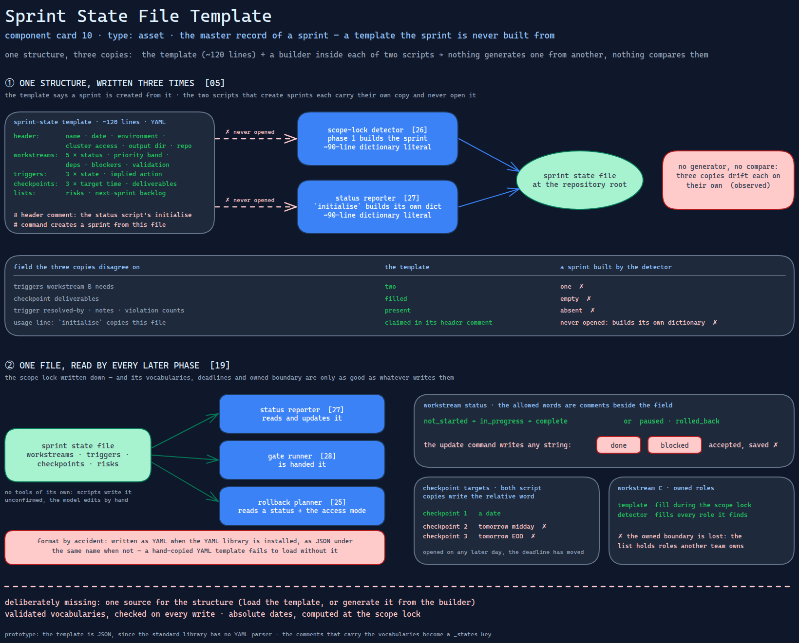

# Sprint State File Template

> The master record of a hardening sprint — workstreams, triggers, checkpoints — as a
> template that says the sprint is built from it, while the two scripts that build sprints
> each carry their own copy and never open it.

Source: [`10-sprint-state-file.excalidraw`](../../../../diagrams/component-cards/workstream-hardening-orchestrator/10-sprint-state-file.excalidraw).

## What it is

A YAML template of about 120 lines in the hardening skill's templates directory
([component 08](../08-workstream-hardening-orchestrator.md)). It defines the one file every
phase reads and several scripts write: the sprint header (name, creation date, environment,
cluster access, output directory, repository), the five workstreams with status, priority
band, dependencies, blockers and validation status, the three triggers with their state and
the action each one implies, the three checkpoints with target times and deliverables, and
two open lists for risks and next-sprint backlog. It is the scope lock of
[card 19](../../../../cards/19-scope-lock-and-checkpoint-delivery.md) written down.

## Trigger and routing

The skill's template table lists it as the master sprint state. Its own header comment says
the status script's initialise command creates a sprint from it. In practice phase 1 creates
the sprint with the repository detector ([component 26](../scripts/26-repo-scope-detector.md)),
and the status script ([component 27](../scripts/27-sprint-state-reporter.md)) can create one
too; neither reads this file. After that, the reporter reads and updates the created file, the
gate runner ([component 28](../scripts/28-workstream-gate-runner.md)) is handed it, and the
rollback planner ([component 25](../scripts/25-static-rollback-planner.md)) reads a status and
the access mode from it.

## Inputs

| Input | Required | Where it comes from |
|---|---|---|
| Sprint name, date, environment | yes | the scope lock; the date is the day it runs |
| Cluster access | yes | the user's answer to the first scope-lock question |
| Owned roles | for C | "fill during scope lock" — in practice the detector's list of every role |
| Benchmark report path | for D | the detector, if a report is found |
| Trigger states | yes | start as unresolved or pending; updated as the sprint learns |

## Procedure

1. Copy the template, or let a script build the equivalent structure.
2. Fill the header and per-workstream fields at the scope lock.
3. Move each workstream through `not_started → in_progress → complete`, or to `paused` or
   `rolled_back`; the allowed words are written in comments beside the field.
4. Move each trigger through the states listed in its comment; the triggers reference
   ([component 14](../references/14-conditional-sprint-triggers.md)) gives the transitions.
5. Mark checkpoints `delivered` or `skipped` as the checkpoint report
   ([component 09](09-checkpoint-status-report.md)) is produced.
6. Append risks and backlog items as they appear.

## Tools and permissions

None of its own. Scripts read and write it without confirmation; the model edits it by hand
when a script has no command for the change.

## Outputs

One state file at the repository root, written as YAML when the YAML library is installed and
as JSON under the same name when it is not.

## Failure modes

| Failure | Symptom | Root cause |
|---|---|---|
| Three copies of one structure | A sprint built by the detector says B needs one trigger; the template says two. Its checkpoints have empty deliverables; the template's are filled. Fields such as who resolved a trigger, notes and violation counts exist only in the template | The structure is written three times — this template and a builder inside each of two scripts — and nothing generates one from another or compares them. Observed |
| The template's usage line is false | Following the header comment, a reader expects the initialise command to copy this file; edits to the template change nothing | The initialise command builds its own dictionary and never opens the template. Observed |
| A deadline that moves | The second and third checkpoints read "tomorrow midday" and "tomorrow EOD" in a file opened on any later day | Both script copies write the relative word, not a date; only the first checkpoint gets one. Observed |
| Vocabularies in comments | A workstream status of `done` or `blocked` is accepted and saved | The allowed words exist only as YAML comments; the reporter's update command writes any string it is given. Observed |
| The owned boundary is lost | Workstream C's owned-role list holds every role in the repository, including ones another team owns | The template says to fill it during the scope lock; the detector fills it with every directory it finds. Observed |
| Format by accident | A hand-copied template fails to load on a machine without the YAML library | Every reader falls back to JSON parsing when the library is missing, and the template is YAML with comments. Observed |

## Patterns it instances

| Card | Where it shows up in this component |
|---|---|
| [05 Instruction Provenance and Drift](../../../../cards/05-instruction-provenance-and-drift.md) | One structure restated in three places, each drifting on its own — and a usage note describing a mechanism that does not exist |
| [19 Scope Lock and Checkpoint Delivery](../../../../cards/19-scope-lock-and-checkpoint-delivery.md) | Scope, dependencies, triggers and checkpoints fixed in a file before work starts, and read by every later phase |

## Provenance

Instanced in the source system by one YAML file of about 120 lines in the hardening skill's
templates directory, with a header comment naming the command that is supposed to use it. The
two script copies sit in the scope-lock and status scripts, each a ninety-line
dictionary literal. Nothing in the component records how many sprints were created from which
copy.

## Prototype

Minimal runnable prototype in
[`../../../../skeletons/components/10-sprint-state-file/`](../../../../skeletons/components/10-sprint-state-file/).
Standard library, offline. It holds a fabricated template and two builder functions in the
source's design, and diffs the three: differing prerequisites, empty deliverables, fields only
the template has, relative deadlines, and a usage claim no builder honours.

## What is deliberately missing

**One source for the structure.** Load the template and fill it; or generate the template from
the builder. Either removes the first three failures.

**Validated vocabularies.** An enumeration checked on every write, not a comment.

**Absolute dates.** Computing each checkpoint's target at the scope lock.

**In the prototype:** the template is JSON rather than YAML, since the standard library has no
YAML parser; the comments that carry the vocabularies in the source are a `_states` key here.
