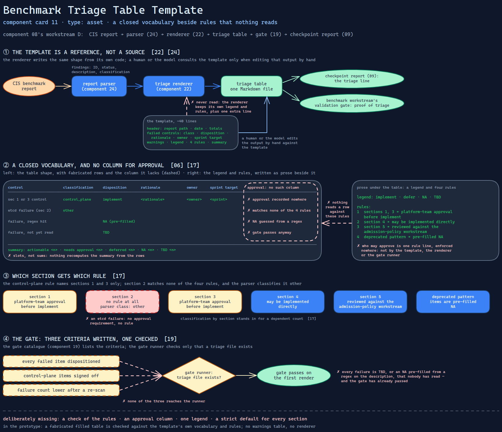

# Benchmark Triage Table Template

> The shape every CIS benchmark finding is triaged into: one disposition per failure,
> a legend and decision rules written beside the table, and nothing that holds a row
> to either.

Source: [`11-benchmark-triage-table.excalidraw`](../../../../diagrams/component-cards/workstream-hardening-orchestrator/11-benchmark-triage-table.excalidraw).

## What it is

A Markdown template the hardening orchestrator
([component 08](../08-workstream-hardening-orchestrator.md)) uses in workstream D,
the CIS benchmark triage. It lays out a header with report path, date and result
totals; a table of failed controls, each with classification, disposition, rationale,
owner and sprint target; a shorter table of warnings; a four-word disposition legend;
four decision rules; and a summary block of counts. About forty lines of fill-in form,
listed among the skill's templates as the shape of the triage deliverable.

## Trigger and routing

Not routed by a description. The skill's template table names it as the triage
deliverable for workstream D in the quick-wins phase, and checkpoint A expects it to
exist. In practice the file is not filled from this template at all: the renderer
([component 22](../scripts/22-triage-table-renderer.md)) writes the same shape from
its own code, after the parser ([component 24](../scripts/24-benchmark-report-parser.md))
has turned the benchmark report into findings. The template is the reference a human
or the model consults when editing that output by hand.

## Inputs

| Input | Required | Where it comes from |
|---|---|---|
| Parsed findings: control ID, status, description, classification | yes | the report parser |
| A disposition per failed control | yes | the operator, or a pre-filled `NA` from the renderer |
| Rationale, owner, sprint target | yes, per failure | the operator |
| Platform-team approval for control-plane items | yes, before `implement` | outside the file — the table has no column for it |
| Summary counts | yes | filled by hand, or by the renderer for the header only |

## Procedure

1. Fill the header: report path, date, total findings and the pass, fail and warn
   counts.
2. One row per failed control: ID, description, classification (`control_plane`,
   `worker_node`, `policy`), and a disposition from the legend — `implement`,
   `defer`, `NA` or `TBD`.
3. Apply the decision rules: controls in sections 1 and 3 need platform-team approval
   before `implement`; section 4 items may be implemented directly; section 5 items are
   reviewed against the admission-policy workstream; deprecated-pattern items are
   pre-filled `NA`.
4. Repeat, without owner and target, for warnings.
5. Fill the summary: actionable failures, control-plane failures needing approval,
   deferred, not applicable, still undetermined.

The gate that consumes it is in the gate catalogue
([component 19](../references/19-workstream-gate-catalogue.md)): every failed item
dispositioned, control-plane items signed off, the failure count lower after a
re-scan.

## Tools and permissions

None. The template is text. Who may approve a control-plane `implement` is stated in
a rule line, not enforced anywhere — not by the template, the renderer or the gate
runner.

## Outputs

One Markdown table in the sprint's output directory. It feeds the checkpoint report
([component 09](09-checkpoint-status-report.md)) as the triage line, and the
benchmark workstream's validation gate as proof the triage happened.

## Failure modes

| Failure | Symptom | Root cause |
|---|---|---|
| Rules on paper only | A control-plane row reads `implement` with no approval anywhere in the file, and the triage passes | The rules are prose under the table; nothing reads a row against them, and approval has no column to be recorded in. Structural |
| Two legends | The file a reader opens carries a legend and rule list worded differently from the template's, with an extra summary line the template lacks | The renderer emits its own copy of the legend and rules and never reads this template. Observed |
| Section 2 is ungoverned | An etcd failure gets no approval requirement and no rule at all | The control-plane rule names sections 1 and 3 only; section 2 matches none of the four rules, and the parser classifies it `other`. Observed |
| "Dispositioned" is met by a guess | The triage gate passes on the first render, when every failure is `TBD` or a pre-filled `NA` nobody has read | The catalogue's criterion is "every failure dispositioned", but the gate runner checks only that a triage file exists, and the renderer pre-fills `NA` from a regex on the description. Observed |
| Summary counts drift from the rows | Edited rows and a summary that no longer adds up | The summary is a block of slots; nothing recomputes it from the table. Structural |

## Patterns it instances

| Card | Where it shows up in this component |
|---|---|
| [06 Calibrated Degrees of Freedom](../../../../cards/06-calibrated-degrees-of-freedom.md) | A closed four-word disposition vocabulary and a fixed table shape, so the judgement is narrow — but the rules that should constrain it are left in prose |
| [17 Blast-Radius Gating](../../../../cards/17-blast-radius-gating.md) | Control-plane items require a higher authority before `implement`; classification by section stands in for a dependent count |
| [19 Scope Lock and Checkpoint Delivery](../../../../cards/19-scope-lock-and-checkpoint-delivery.md) | `defer` and a sprint-target column move work out of scope in writing, and the table is a named checkpoint-A deliverable |

## Provenance

Instanced in the source system by one asset file of about forty lines in the skill's
templates directory: a header, two tables, a legend, four decision rules and a summary
block. A second, diverging copy of its legend and rules lives in the renderer script.
Nothing in the source records how many triage tables were produced or which
dispositions were made; this card claims neither.

## Prototype

Minimal runnable prototype in
[`../../../../skeletons/components/11-benchmark-triage-table/`](../../../../skeletons/components/11-benchmark-triage-table/).
Standard library, offline. It checks a fabricated, filled triage table against the
template's own vocabulary and decision rules, and reports what the rules leave
unchecked.

## What is deliberately missing

**A check of the rules.** Every row above except the second is detectable in a few
lines once the table is parsed — the prototype does exactly that. The source had no
such step.

**An approval column.** Recording who approved a control-plane item, and when, makes
the rule checkable at all; without it, the best a checker can do is look for a word in
the rationale.

**One legend.** Either the renderer reads the template, or the template is generated
from the renderer's constants. Two hand-kept copies will keep diverging.

**A rule for every section.** Classifying by benchmark section is reasonable; the
classification needs a default that is strict, not silent.

**In the prototype:** no warnings table, no renderer; the filled table is a fixture.
