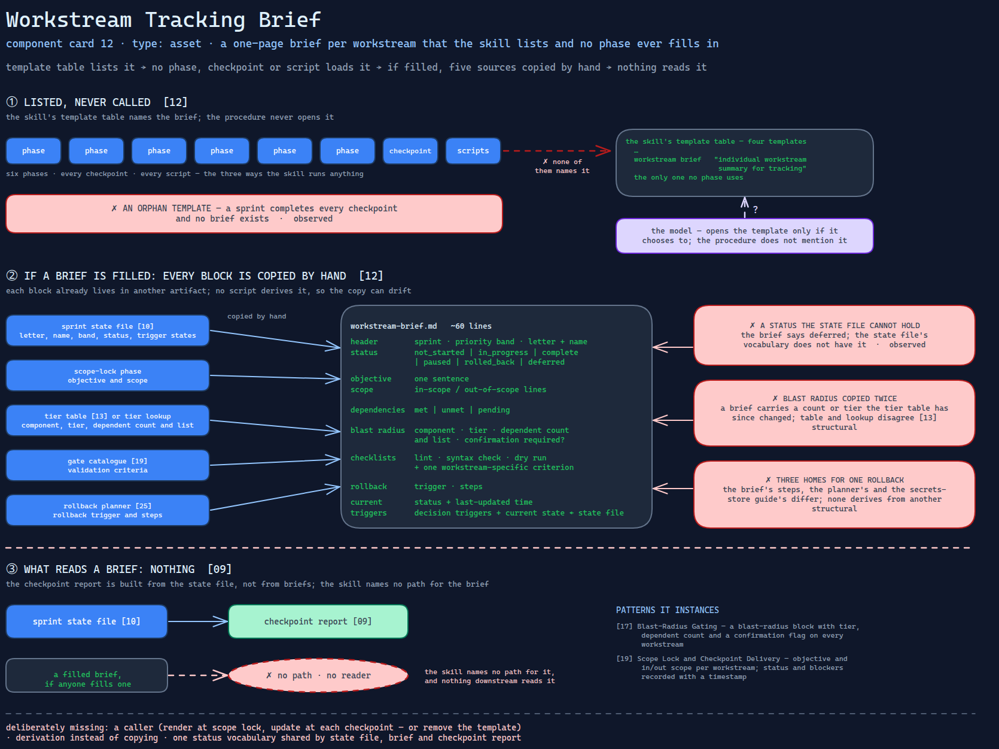

# Workstream Tracking Brief

> A one-page brief per workstream — objective, scope, blast radius, rollback and
> status — that the skill lists among its templates and no phase ever fills in.

Source: [`12-workstream-tracking-brief.excalidraw`](../../../../diagrams/component-cards/workstream-hardening-orchestrator/12-workstream-tracking-brief.excalidraw).

## What it is

A Markdown template in the hardening orchestrator's assets
([component 08](../08-workstream-hardening-orchestrator.md)), meant to summarise one
of the five workstreams for tracking outside the sprint. It has a header with sprint,
priority band and status; a one-sentence objective; in-scope and out-of-scope lines;
a dependency table; a blast-radius block; implementation and validation checklists; a
rollback plan; a current-status block; and a table of the decision triggers that
affect the workstream. About sixty lines.

## Trigger and routing

Not routed by a description, and in practice not routed at all. The skill's template
table lists it as "individual workstream summary for tracking". None of the six
phases names it, no checkpoint expects it, and no script renders it. Whether it is
ever filled depends on the model choosing to open a template the procedure does not
mention.

## Inputs

| Input | Required | Where it comes from |
|---|---|---|
| Workstream letter, name, priority band, status | yes | the sprint state file ([component 10](10-sprint-state-file.md)) — by hand |
| Objective and scope | yes | the scope-lock phase |
| Component, tier, dependent count and list | yes | the tier table ([component 13](../references/13-component-tier-table.md)) or the tier lookup — copied by hand |
| Validation criteria | yes | the gate catalogue ([component 19](../references/19-workstream-gate-catalogue.md)) — copied by hand |
| Rollback trigger and steps | yes | the rollback planner ([component 25](../scripts/25-static-rollback-planner.md)) — copied by hand |
| Trigger states | yes | the sprint state file — by hand |

## Procedure

As the template lays it out; no step in the skill invokes it.

1. Header: workstream letter and name, sprint, priority band, and a status from
   `not_started`, `in_progress`, `complete`, `paused`, `rolled_back`, `deferred`.
2. Objective in one sentence; scope in and out.
3. Dependencies, each `met`, `unmet` or `pending`.
4. Blast radius: component, tier, dependent count and list, whether confirmation is
   required.
5. Implementation steps and validation criteria as checklists — lint, syntax check,
   a dry run, and one workstream-specific criterion.
6. Rollback trigger and steps; current status with a last-updated time; the triggers
   affecting this workstream with their current state.

## Tools and permissions

None. The template is text and the skill has no step that writes it.

## Outputs

A filled brief, if anyone fills one. The skill names no path for it, and nothing
downstream reads it — the checkpoint report
([component 09](09-checkpoint-status-report.md)) is built from the state file, not
from briefs.

## Failure modes

| Failure | Symptom | Root cause |
|---|---|---|
| An orphan template | A sprint completes every checkpoint and no brief exists | The template is listed in the skill's template table and referenced by no phase, checkpoint or script. Observed |
| A status the state file cannot hold | A brief says `deferred`; the state file for the same workstream says something else, or cannot say it | The brief's status vocabulary has `deferred`; the state file template's does not. Observed |
| Blast radius copied twice | A brief carries a dependent count or tier that the tier table has since changed | The block is filled by hand from the tier table or the lookup script, which themselves disagree ([component 13](../references/13-component-tier-table.md)). Structural |
| Three homes for one rollback | The brief's rollback steps, the planner's and the secrets-store guide's differ for the same workstream | Rollback is written per workstream in three artifacts and none derives from another. Structural |

## Patterns it instances

| Card | Where it shows up in this component |
|---|---|
| [17 Blast-Radius Gating](../../../../cards/17-blast-radius-gating.md) | A blast-radius block with tier, dependent count and a confirmation flag on every workstream |
| [19 Scope Lock and Checkpoint Delivery](../../../../cards/19-scope-lock-and-checkpoint-delivery.md) | Objective and in/out scope written down per workstream; status and blockers recorded with a timestamp |

## Provenance

Instanced in the source system by one asset file of about sixty lines in the skill's
templates directory, one of four templates there and the only one no phase uses. Its
fields mirror what the state file, tier table, gate catalogue and rollback planner
already hold. Nothing in the source records a filled brief; this card claims none.

## Prototype

Minimal runnable prototype in
[`../../../../skeletons/components/12-workstream-tracking-brief/`](../../../../skeletons/components/12-workstream-tracking-brief/).
Standard library, offline. It renders a brief per workstream from a fabricated state
file, and with `--audit` finds the orphan template, the vocabulary mismatch and a
stale hand-filled brief.

## What is deliberately missing

**A caller.** Either a phase step that renders the brief at scope lock and updates it
at each checkpoint, or the template's removal. A template nothing loads is
documentation of an intention.

**Derivation instead of copying.** Every block in the brief already exists somewhere
else. A brief rendered from those sources cannot disagree with them; a brief filled by
hand will.

**One status vocabulary.** The state file, the brief and the checkpoint report should
draw from one list.

**In the prototype:** dependencies, checklists and trigger tables are left out of the
rendered brief; the skill text it audits is a fabricated miniature.
