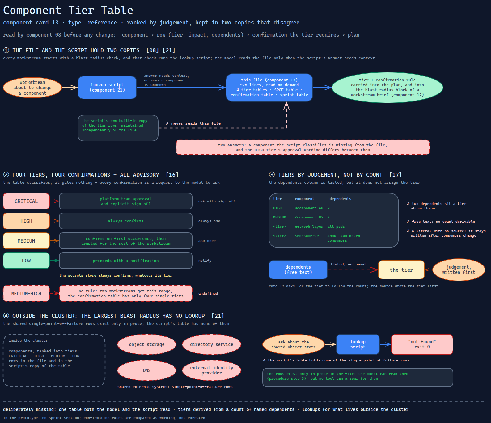

# Component Tier Table

> A hand-written ranking of every platform component into four blast-radius tiers,
> each with a confirmation rule — kept in two copies that disagree, and ranked by
> judgement rather than by the dependent count it lists.

Source: [`13-component-tier-table.excalidraw`](../../../../diagrams/component-cards/workstream-hardening-orchestrator/13-component-tier-table.excalidraw).

## What it is

A reference file the hardening orchestrator
([component 08](../08-workstream-hardening-orchestrator.md)) reads before any change.
It sorts the platform's components into CRITICAL, HIGH, MEDIUM and LOW, each row with
an impact line and a dependents column; lists the shared single points of failure
outside the cluster; maps each tier to the confirmation it requires; and names the
components each of the five workstreams touches, with their tier. About seventy-five
lines. The lookup script ([component 21](../scripts/21-tier-lookup-gate.md)) carries
its own built-in copy of the same table.

## Trigger and routing

Loaded on demand. The skill's reference table lists it as the blast-radius
classification, and its confirmation model restates the tier-to-confirmation rows.
Every workstream begins with a blast-radius check, but that check runs the lookup
script, not this file; the file is what the model reads when the script's answer
needs context, or when it says a component is unknown.

## Inputs

| Input | Required | Where it comes from |
|---|---|---|
| A component name | yes | the workstream about to change it |
| The component's tier, impact and dependents | — | hand-written rows in this file |
| Which workstream is asking | for the sprint section | the skill's current phase |

## Procedure

1. Find the component's row; read its tier, impact and dependents.
2. Read the confirmation the tier requires: CRITICAL needs platform-team approval and
   explicit sign-off; HIGH always confirms; the secrets store always confirms
   whatever its tier; MEDIUM confirms on first occurrence and is then trusted for the
   rest of the workstream; LOW proceeds with a notification.
3. If the change touches a shared external system — object storage, the directory
   service, DNS, an external identity provider — read its single-point-of-failure row.
4. For a sprint workstream, read its row in the sprint section for the tier and any
   special rule.

## Tools and permissions

| Tool or verb | Allowed | Enforced by |
|---|---|---|
| Reading the file | yes | — |
| Proceeding on a CRITICAL or HIGH component | only after confirmation | the skill's instructions only |
| Proceeding on MEDIUM after the first confirmation | yes, within one workstream | the skill's instructions only |

The table classifies; it gates nothing. Every confirmation it lists is a request to the
model to ask ([card 16](../../../../cards/16-the-permission-ladder.md)).

## Outputs

None of its own. Its tier and confirmation rule are carried into the plan the model
proposes, and into the blast-radius block of a workstream brief
([component 12](../assets/12-workstream-tracking-brief.md)) if one is filled.

## Failure modes

| Failure | Symptom | Root cause |
|---|---|---|
| Two tables, two answers | A component the script classifies is missing from the file, and the HIGH tier's approval wording differs between them | The lookup script holds its own copy of the classification and never reads this file. Observed |
| Tiers by judgement, not count | A component with two dependents sits a tier above one with three | The dependents column is listed but not used to assign the tier, which [card 17](../../../../cards/17-blast-radius-gating.md) asks for. Observed |
| Uncountable dependents | The network layer's dependents read "all pods", so no count can be derived or compared | Dependents are free text, sometimes a list, sometimes a phrase, sometimes a number. Observed |
| External SPOFs cannot be looked up | Asking about the shared object store returns "not found" with exit 0 | The single-point-of-failure rows exist only in prose; the script's table has none of them. Observed |
| Tiers the confirmation rules do not define | Two workstreams are assigned a range such as "MEDIUM-HIGH" | The sprint section uses ranges; the confirmation table has only the four single tiers, so the rule to apply is undefined. Observed |
| Counts go stale | "About two dozen consumers" stays written after consumers are added or retired | Dependent counts are literals in prose with no source. Structural |

## Patterns it instances

| Card | Where it shows up in this component |
|---|---|
| [16 The Permission Ladder](../../../../cards/16-the-permission-ladder.md) | Tier-proportional confirmation — notify, ask once, always ask, ask with sign-off — all of it advisory |
| [17 Blast-Radius Gating](../../../../cards/17-blast-radius-gating.md) | The classification written in advance, the lookup before the change, the confirmation by tier — with tiers chosen by hand rather than by count |

## Provenance

Instanced in the source system by one reference file of about seventy-five lines in
the skill's references directory: four tier tables, a shared-failure table, a
confirmation table and a sprint table. The lookup script carries an independently
maintained copy of the tier rows. The component lists an installation's actual
components; this card describes the structure and uses none of them. Nothing in the
source records how often it was consulted.

## Prototype

Minimal runnable prototype in
[`../../../../skeletons/components/13-component-tier-table/`](../../../../skeletons/components/13-component-tier-table/).
Standard library, offline. It parses a fabricated prose table and a fabricated script
copy, reports every disagreement, and derives a tier from dependent counts to show
where the hand-assigned tiers differ.

## What is deliberately missing

**One table.** The prose file and the script's copy should be one data file that both
the model and the script read; [card 17](../../../../cards/17-blast-radius-gating.md)'s
skeleton keeps its matrix as JSON for that reason.

**Tiers from a graph.** Dependents written as component names can be counted, and a
tier derived from the count. The source wrote the tier first.

**Lookups for what lives outside the cluster.** The shared external systems are the
largest blast radius in the file, and the one part no tool can answer for.

**In the prototype:** no sprint section; confirmation rules are compared as wording,
not executed.
