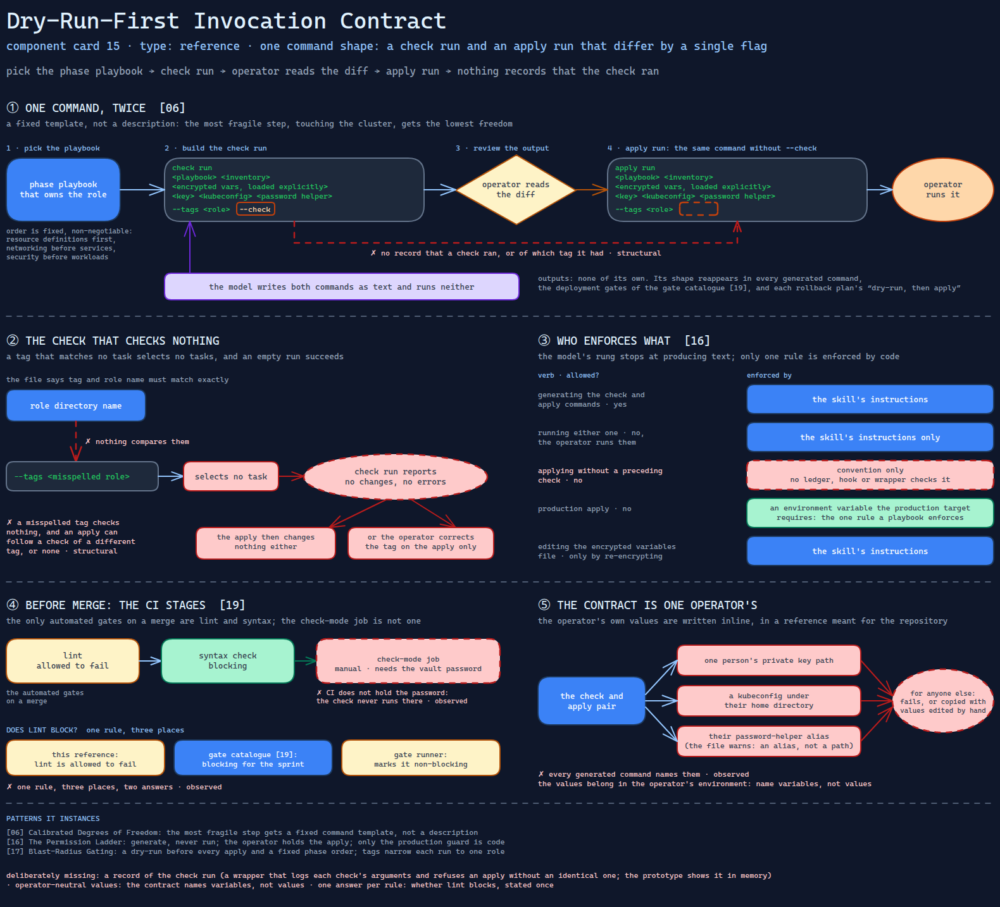

# Dry-Run-First Invocation Contract

> The one command shape every change in the sprint goes through: a check run and an
> apply run that differ by a single flag — and nothing that proves the first ran.

Source: [`15-dry-run-invocation-contract.excalidraw`](../../../../diagrams/component-cards/workstream-hardening-orchestrator/15-dry-run-invocation-contract.excalidraw).

## What it is

A reference file the hardening orchestrator
([component 08](../08-workstream-hardening-orchestrator.md)) carries for the infrastructure
repository it works on. It fixes how a configuration-management run is invoked — the same
command twice, first with the check flag and then without it — and around that pair it lists
the repository's build targets, the CI stages and which of them block a merge, the order the
numbered phase playbooks must run in, the rule that roles take their version pins from one
file, a ten-step checklist for adding a role, and the collections the runs depend on. It is
the skill's model of "how a change reaches the cluster", and the skill itself never runs it:
every apply is generated for an operator.

## Trigger and routing

Listed in the skill's reference table as the invocation template, build targets and CI stages.
No phase links to it by name; the phases quote its shape instead — "dry-run a role" in the
quick-reference table, "always run the check before any apply" in the safety constraints. So
it is loaded when the model decides the shape is needed, not at a fixed point in the
procedure.

## Inputs

| Input | Required | Where it comes from |
|---|---|---|
| The playbook for the change | yes | the phase ordering in this file |
| The role tag | yes | the role directory name; the file says the two must match exactly |
| Inventory and encrypted variables file | yes | the repository's inventory for the one in-scope environment |
| Private key, kubeconfig, password helper | yes | the operator's own machine — and, in the source, written into this file |

## Procedure

1. Pick the phase playbook that owns the role. Phase order is fixed — resource definitions before
   anything that uses them, networking before the services on top of it, security before the
   workloads that need it — and the file calls breaking it non-negotiable.
2. Build the check run: playbook, inventory, the encrypted variables loaded explicitly, the
   operator's key and kubeconfig, the password helper, `--tags <role>`, `--check`.
3. Review the check output. *Gate: the operator reads the diff; nothing records that they did.*
4. Build the apply run: the same command without `--check`.
5. Before merge, the CI stages run: lint (allowed to fail), syntax check (blocking), and a
   check-mode job that is manual and needs the vault password.

## Tools and permissions

| Tool or verb | Allowed | Enforced by |
|---|---|---|
| Generating the check and apply commands | yes | the skill's instructions |
| Running either one | no — the operator runs them | the skill's instructions only |
| Apply without a preceding check | no | convention; no ledger, hook or wrapper checks it |
| Production apply | no | an environment variable the production target requires — the one rule here a playbook enforces |
| Editing the encrypted variables file | only by re-encrypting | the skill's instructions |

## Outputs

None of its own. Its shape appears in every command the skill generates for an operator, in
the workstream gate catalogue's deployment gates
([component 19](19-workstream-gate-catalogue.md)), and in each rollback plan's "dry-run, then
apply" steps.

## Failure modes

| Failure | Symptom | Root cause |
|---|---|---|
| The contract is one operator's | Every generated command names one person's private key path, a kubeconfig under their home directory and their password-helper alias; for anyone else it fails, or is copied with the values edited by hand | The invocation pair is written with the operator's values inline, in a reference meant for the repository. The file even warns that the helper is an alias, not a path. Observed |
| The dry-run is unprovable | An apply follows a check run of a different tag, or no check at all, and nothing notices | "Check first, no exceptions" is a sentence. The two commands differ only by a flag, and nothing records a check run for the apply to be compared with. Structural |
| A misspelled tag checks nothing | The check run reports no changes and no errors; the apply then changes nothing either, or the operator corrects the tag on the apply only | A tag that matches no task selects no tasks, and an empty run succeeds. The file states that tag and role name must match; nothing compares them. Structural |
| Lint blocks or not, depending on the file | One reference says lint is allowed to fail; the gate catalogue says treat it as blocking for the sprint; the gate runner marks it non-blocking | One rule, three places, two answers. Observed |
| Check mode never runs in CI | The only automated gates on a merge are lint and syntax | The check-mode job is manual and needs a password CI does not hold. Observed |

## Patterns it instances

| Card | Where it shows up in this component |
|---|---|
| [06 Calibrated Degrees of Freedom](../../../../cards/06-calibrated-degrees-of-freedom.md) | The most fragile step in the skill — touching the cluster — gets the lowest freedom: a fixed command template, not a description |
| [16 The Permission Ladder](../../../../cards/16-the-permission-ladder.md) | Generate, never run: the model's rung stops at producing text; the operator holds the apply. Only the production guard is enforced by code |
| [17 Blast-Radius Gating](../../../../cards/17-blast-radius-gating.md) | A dry-run before every apply and a fixed phase order are the change-time checks; tags narrow each run to one role |

## Provenance

Instanced in the source system by one reference file of about a hundred lines in the
skill's references directory: the check-and-apply pair with three notes, a build-target table,
the CI stages, the phase-playbook order, a version-pinning rule, a ten-step new-role checklist
and the required collections. Its content was carried over from the infrastructure repository's
own documentation, operator specifics included; this card describes those specifics rather than
reproducing them. Nothing in the file records how many runs followed it.

## Prototype

Minimal runnable prototype in
[`../../../../skeletons/components/15-dry-run-invocation-contract/`](../../../../skeletons/components/15-dry-run-invocation-contract/).
Standard library, offline. It builds the pair from a contract whose operator values are
placeholders filled from the environment, refuses an apply that has no matching check in an
in-memory ledger, and audits a second contract that hard-codes one operator's values.

## What is deliberately missing

**A record of the check run.** The whole contract rests on the order of two commands. A
wrapper that logs each check run's arguments and refuses an apply without an identical one is
the smallest control that makes the rule true; the prototype shows it in memory.

**Operator-neutral values.** Key, kubeconfig and password helper belong in the operator's
environment. The contract should name variables, not values.

**One answer per rule.** Whether lint blocks should be stated once and read by both the gate
catalogue and the gate runner.

**In the prototype:** no playbook runs; the ledger lives for one process; tag checking uses a
fixture role list, not the repository.
