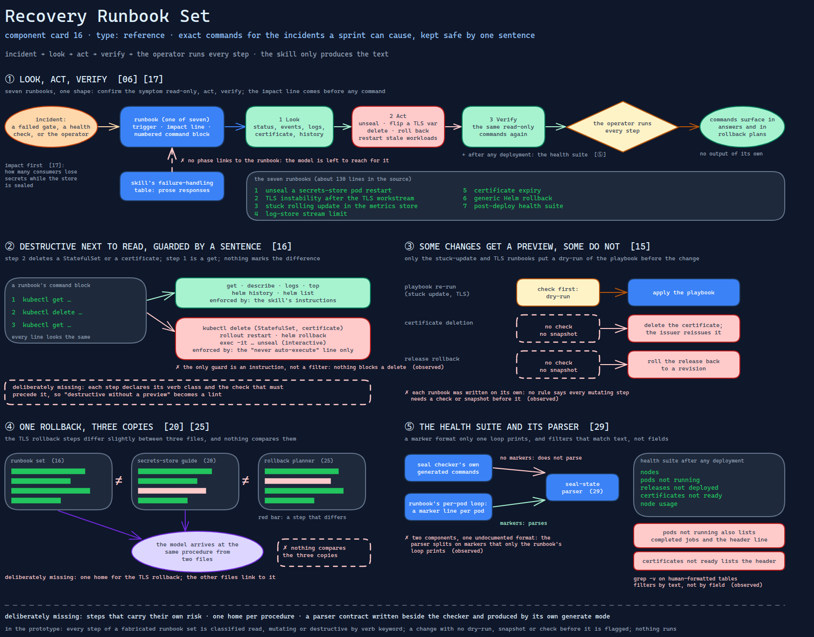

# Recovery Runbook Set

> Exact command sequences for the incidents a hardening sprint can cause — destructive
> verbs included, guarded by nothing but the skill's promise never to run them.

Source: [`16-recovery-runbook-set.excalidraw`](../../../../diagrams/component-cards/workstream-hardening-orchestrator/16-recovery-runbook-set.excalidraw).

## What it is

A reference file of incident runbooks that the hardening orchestrator
([component 08](../08-workstream-hardening-orchestrator.md)) carries for when a change goes
wrong. Seven short sections, each a trigger, an impact line and a numbered command block: a
secrets-store pod restart that needs manual unsealing, TLS instability after the TLS
workstream, a stuck rolling update in the metrics store, a log-store stream limit, certificate
expiry, a generic Helm rollback, and a post-deploy health suite. It is the low-freedom half of
recovery: the rollback planner ([component 25](../scripts/25-static-rollback-planner.md)) says
*what* to undo, and this file says which commands do it.

## Trigger and routing

Listed in the skill's reference table as incident-response templates. No phase links to it;
the failure-handling table in the skill's entry file describes responses in prose and leaves
the model to reach for the runbook. The secrets-store guide
([component 20](20-secrets-store-tls-unseal-guide.md)) repeats the TLS rollback steps, so the
model can arrive at the same procedure from two files.

## Inputs

| Input | Required | Where it comes from |
|---|---|---|
| The incident | yes | a failed validation gate, a health check, or the operator |
| Namespace, release, pod and revision names | yes | placeholders in the commands, filled from the cluster by the operator |
| Unseal keys | for the unseal runbook | the operator; the runbook prompts for them interactively |

## Procedure

Each runbook follows the same shape: confirm the symptom read-only, act, verify.

1. **Look.** Status per pod, events, logs, the certificate's condition, release history.
2. **Act.** Unseal each pod interactively; flip a TLS variable back and re-run the role;
   delete a stuck StatefulSet so Helm recreates it; delete a certificate so the issuer
   reissues it; roll a release back to a revision; restart workloads whose secrets went stale.
3. **Verify.** The same read-only commands again, and after any deployment the health suite:
   nodes, pods not running, releases not deployed, certificates not ready, node usage.

Only the stuck-update and TLS runbooks put a dry-run of the playbook before the change.
*Gate: the operator runs every step; the skill only produces the text.*

## Tools and permissions

| Tool or verb | Allowed | Enforced by |
|---|---|---|
| `kubectl get` / `describe` / `logs` / `top`, `helm history` / `list` | yes, as generated text | the skill's instructions |
| `kubectl delete` (StatefulSet, certificate), `rollout restart` | in the runbook, for the operator | the skill's "never auto-execute" line only |
| `helm rollback` | in the runbook, for the operator | the same line |
| Interactive unseal (`exec -it … unseal`) | in the runbook, for the operator | the same line; it cannot run unattended anyway |
| Playbook re-run after a fix | check first, then apply | convention ([component 15](15-dry-run-invocation-contract.md)) |

## Outputs

None of its own. The commands surface in the model's answers during an incident and in
rollback plans. One loop in the unseal runbook prints a marker line before each pod's status;
the seal-state checker ([component 29](../scripts/29-seal-state-health-check.md)) can parse
saved output only when those markers are present.

## Failure modes

| Failure | Symptom | Root cause |
|---|---|---|
| Destructive steps sit next to read steps | Deleting a StatefulSet or a certificate is step 2 of a runbook whose step 1 is a `get`; nothing marks the difference | The runbooks are plain command blocks. The only guard is the skill's line that it never executes cluster commands — an instruction, not a filter. Observed |
| Some changes have a preview, some do not | The playbook re-runs carry a dry-run; the certificate deletion and the release rollback go straight to the change | Each runbook was written on its own; no rule says every mutating step needs a check or snapshot before it. Observed |
| The health parser depends on one loop | Output saved from the seal checker's own generated commands does not parse; output from the runbook's loop does | Only the runbook's per-pod loop prints the section markers the parser splits on. Two components, one undocumented format. Observed |
| The health suite reports noise | "Pods not running" lists completed jobs and the header line; "certificates not ready" lists the header | `grep -v` on human-formatted tables filters by text, not by field. Observed |
| One rollback, three copies | The TLS rollback steps differ slightly between this file, the secrets-store guide and the rollback planner | The same procedure is written in three places and nothing compares them. Observed |

## Patterns it instances

| Card | Where it shows up in this component |
|---|---|
| [06 Calibrated Degrees of Freedom](../../../../cards/06-calibrated-degrees-of-freedom.md) | Recovery under pressure gets exact commands, not advice — the lowest freedom in the skill after the scripts |
| [16 The Permission Ladder](../../../../cards/16-the-permission-ladder.md) | The rung that matters is "generate for the operator"; the destructive verbs are kept on the operator's side of it by instruction alone |
| [17 Blast-Radius Gating](../../../../cards/17-blast-radius-gating.md) | Each runbook states its impact first — how many consumers lose secrets while the store is sealed — before any command |

## Provenance

Instanced in the source system by one reference file of about 130 lines in the skill's
references directory: seven runbooks, each a trigger, an impact line and a command block. Two
of them concern components no sprint workstream changes; they came with the rest from the
infrastructure repository's own runbooks. The file records procedures, not incidents — nothing
in it says which runbooks were ever used, and this card claims none were.

## Prototype

Minimal runnable prototype in
[`../../../../skeletons/components/16-recovery-runbook-set/`](../../../../skeletons/components/16-recovery-runbook-set/).
Standard library, offline. It classifies every step of a fabricated runbook set as read,
mutating or destructive, and flags each change that has no dry-run, snapshot or check before
it.

## What is deliberately missing

**Steps that carry their own risk.** A runbook step could declare its verb class and the
check that must precede it; then "destructive without a preview" becomes a lint, and the
prototype shows how little code that takes.

**One home per procedure.** The TLS rollback should live in one file the others link to.

**A parser contract.** The marker format the health checker needs should be written next to
the checker and produced by its own generate mode, not by a loop in a runbook.

**In the prototype:** classification is by verb keyword, so a destructive action hidden
behind a script name passes as unknown; nothing runs.
