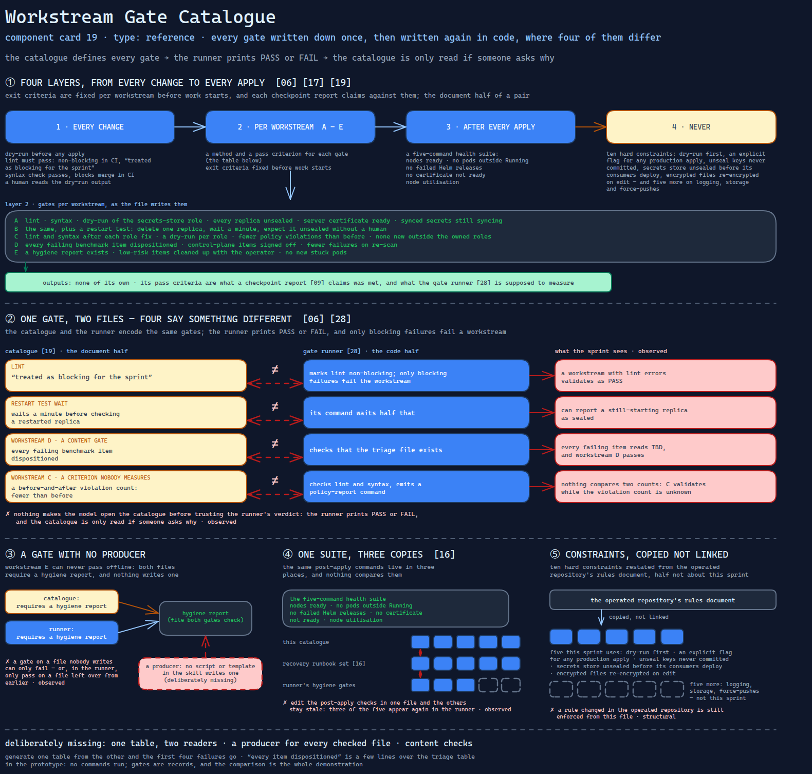

# Workstream Gate Catalogue

> Every gate the hardening sprint must pass, written down once — and then written again
> in code, where four of them say something different.

Source: [`19-workstream-gate-catalogue.excalidraw`](../../../../diagrams/component-cards/workstream-hardening-orchestrator/19-workstream-gate-catalogue.excalidraw).

## What it is

A reference file the hardening orchestrator
([component 08](../08-workstream-hardening-orchestrator.md)) reads when it validates
work. It collects the sprint's exit criteria in one place: the CI pipeline's gates, the
four checks every change must pass, a table of gates per workstream (A to E) with a
method and a pass criterion for each, a post-apply health suite, and a numbered list of
hard constraints restated from the operated repository's own rules document. It is the
document half of a pair; the gate runner
([component 28](../scripts/28-workstream-gate-runner.md)) is the code half.

## Trigger and routing

Not routed by a description. The skill's reference table lists it as the place every
gate is defined, and the final-validation phase runs the gate runner once per
workstream on the strength of it. The invocation contract
([component 15](15-dry-run-invocation-contract.md)) carries the same CI gate table in a
shorter form. Nothing makes the model open this file before trusting the runner's
verdict: the runner prints PASS or FAIL, and the catalogue is only read if someone
asks why.

## Inputs

| Input | Required | Where it comes from |
|---|---|---|
| The workstream being validated | yes | the sprint state file's workstream list |
| Lint, syntax and dry-run results | yes | the repository's make targets and the playbook's check mode |
| Cluster observations (pod, certificate, seal, policy-report state) | cluster-aware mode only | commands generated for the operator, run by hand |
| The benchmark triage table and the hygiene report | for workstreams D and E | files the sprint is meant to produce |

## Procedure

The file prescribes gates in four layers, from every change to every apply:

1. **Every change.** Dry-run before any apply; lint must pass — non-blocking in CI, but
   "treated as blocking for the sprint"; syntax check must pass and blocks merge in CI;
   a human reads the dry-run output before the apply.
2. **Per workstream.** A: lint, syntax, dry-run of the secrets-store role, every replica
   unsealed, the server certificate ready, every synced secret still syncing.
   B: the same, plus a restart test — delete one replica, wait a minute, expect it
   unsealed without a human. C: lint and syntax after each role fix, a dry-run per role,
   fewer policy violations than before, none new outside the owned roles. D: every
   failing benchmark item dispositioned, control-plane items signed off, fewer failures
   on re-scan. E: a hygiene report exists, low-risk items cleaned up with the operator,
   no new stuck pods.
3. **After every apply.** A five-command health suite: nodes ready, no pods outside
   Running, no failed Helm releases, no certificate not ready, node utilisation.
4. **Never.** Ten hard constraints — dry-run first, an explicit flag for any production
   apply, unseal keys never committed, the secrets store unsealed before its consumers
   deploy, encrypted files re-encrypted on edit, and five more that concern logging,
   storage and force-pushes rather than this sprint.

## Tools and permissions

| Tool or verb | Allowed | Enforced by |
|---|---|---|
| Lint, syntax check, dry-run | yes | the gate runner executes the first two; the dry-run is a generated command |
| Read-only cluster queries (`get`, `status`, `logs`) | as methods, run by the operator | the skill's instructions only |
| Deleting a replica for the restart test | listed as a gate method | the skill's instructions only — the method is a write |
| Production applies | no | an environment flag the playbooks check; the catalogue restates it |

## Outputs

None of its own. Its pass criteria are what a checkpoint report
([component 09](../assets/09-checkpoint-status-report.md)) claims was met, and what the
gate runner is supposed to measure.

## Failure modes

| Failure | Symptom | Root cause |
|---|---|---|
| Lint blocks on paper only | A workstream with lint errors validates as PASS | The catalogue treats lint as blocking for the sprint; the gate runner marks it non-blocking, and only blocking failures fail the workstream. Observed |
| Two waits for one restart | The document waits a minute before checking a restarted replica; the runner's command waits half that, and can report a still-starting replica as sealed | The wait is written separately in each file. Observed |
| Content gate, existence check | Every failing benchmark item reads TBD, and workstream D passes | The catalogue requires every failure dispositioned; the runner checks that the triage file exists. Observed |
| A criterion nobody measures | Workstream C validates while the violation count is unknown | The catalogue's pass criterion for C is a before-and-after violation count; the runner checks lint and syntax and emits a policy-report command, and nothing compares two counts. Observed |
| A gate with no producer | Workstream E can never pass offline | The catalogue and the runner both require a hygiene report, and no script or template in the skill writes one. Observed |
| One suite, three copies | Editing the post-apply checks in one file leaves the others stale | The same five commands appear here and in the recovery runbook set ([component 16](16-recovery-runbook-set.md)), three of them again in the runner's hygiene gates, and nothing compares them. Observed |
| Constraints restated from elsewhere | A rule changed in the operated repository is still enforced from this file | The ten constraints are copied from the repository's rules document, with half of them irrelevant to the sprint. Structural |

## Patterns it instances

| Card | Where it shows up in this component |
|---|---|
| [06 Calibrated Degrees of Freedom](../../../../cards/06-calibrated-degrees-of-freedom.md) | Exact commands as methods beside prose criteria ("violation count decreased") — and a code twin whose freedom was spent differently, so the same gate is strict in one file and lenient in the other |
| [17 Blast-Radius Gating](../../../../cards/17-blast-radius-gating.md) | A health suite after every apply, and gates that check the dependents of a change — the synced secrets — rather than only the component changed |
| [19 Scope Lock and Checkpoint Delivery](../../../../cards/19-scope-lock-and-checkpoint-delivery.md) | Exit criteria fixed per workstream before work starts, which each checkpoint report claims against |

## Provenance

Instanced in the source system by one Markdown reference of about a hundred lines in the
skill's references directory: five tables, a five-command health block and a numbered
constraint list. Its CI rows and constraints were copied from the operated repository's
own pipeline and rules documents rather than linked. Nothing in the component records a
gate result, which workstreams passed, or whether the restart test was ever run; this
card claims none of that.

## Prototype

Minimal runnable prototype in
[`../../../../skeletons/components/19-workstream-gate-catalogue/`](../../../../skeletons/components/19-workstream-gate-catalogue/).
Standard library, offline. It holds a fabricated catalogue and a fabricated runner table
side by side and reports every gate whose criterion, wait or blocking flag differs, and
every file a gate checks that nothing produces.

## What is deliberately missing

**One table, two readers.** The catalogue and the runner encode the same gates. Generating
the runner's table from the document, or rendering the document from the runner's table,
removes the first four failures above outright.

**A producer for every checked file.** A gate on a file nobody writes is a gate that can
only fail, or — in the runner — only pass on a file left over from earlier.

**Content checks.** "Every item dispositioned" is a few lines over the triage table; an
existence check proves only that a renderer ran.

**In the prototype:** no commands run; gates are records, and the comparison is the whole
demonstration.
