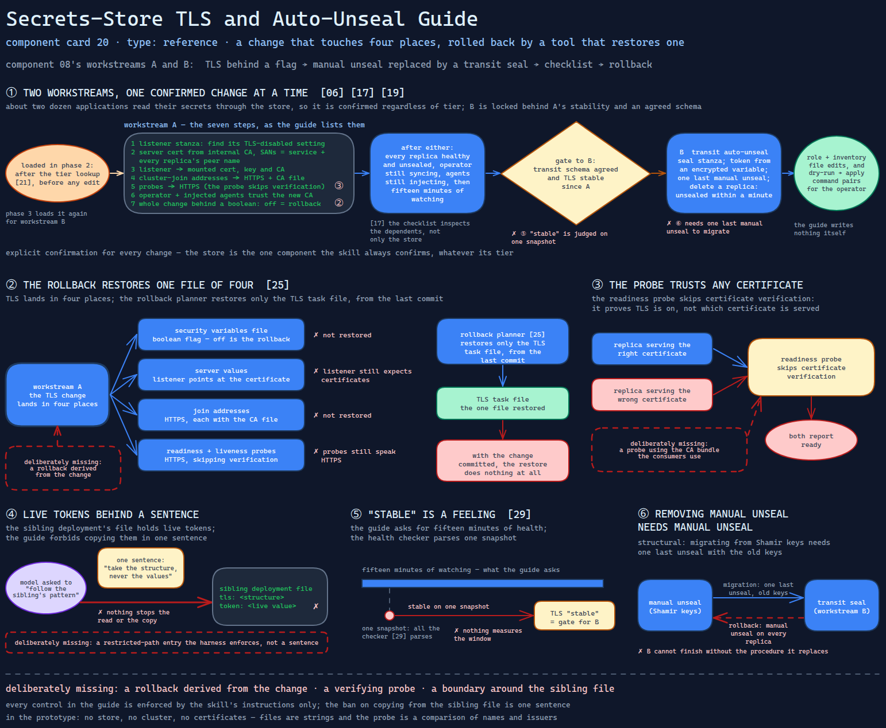

# Secrets-Store TLS and Auto-Unseal Guide

> Step-by-step instructions for turning on TLS and automatic unsealing in the cluster's
> secrets store — a change that touches four places, rolled back by a tool that
> restores one.

Source: [`20-secrets-store-tls-unseal-guide.excalidraw`](../../../../diagrams/component-cards/workstream-hardening-orchestrator/20-secrets-store-tls-unseal-guide.excalidraw).

## What it is

The implementation guide behind workstreams A and B of the hardening orchestrator
([component 08](../08-workstream-hardening-orchestrator.md)): enabling TLS on a
Vault server running as a small HA set inside the cluster, then replacing manual
unsealing with a transit seal. It opens with the current state and a table of the role
and inventory files involved, gives seven TLS steps and the auto-unseal configuration
as configuration fragments, and closes with a blast-radius checklist and a rollback for
each workstream. It is the most prescriptive file in the skill, and the one whose
change has the widest reach: about two dozen applications read their secrets through
the store.

## Trigger and routing

Loaded by the skill in phase 2 when workstream A starts — the skill tells the model to
read it after the tier lookup ([component 21](../scripts/21-tier-lookup-gate.md)) and
before any edit — and again in phase 3 for workstream B. Workstream B is reached only
through two of the sprint's triggers: the transit schema is agreed, and TLS has been
stable since workstream A. The guide restates both as prerequisites.

## Inputs

| Input | Required | Where it comes from |
|---|---|---|
| The role's task files: server values, the empty TLS and auto-unseal task files | yes | the operated infrastructure repository |
| The security variables file and the encrypted variables file | yes | the repository's inventory |
| The cluster's internal CA issuer | yes | cert-manager, already deployed |
| Transit endpoint, key name, mount path, token owner | for workstream B | agreed by the team — trigger one in the sprint state |
| Explicit confirmation | yes, for every change | the user; the store is the one component the skill always confirms |

## Procedure

**Workstream A — TLS, behind a feature flag.**

1. Find the listener stanza in the server values and its TLS-disabled setting.
2. Request a server certificate from the internal CA issuer, with the service name and
   every replica's peer name as subject alternative names.
3. Point the listener at the mounted certificate, key and CA.
4. Switch the replicas' cluster-join addresses to HTTPS, each with the CA file.
5. Change the readiness and liveness probes to HTTPS — the guide's probe skips
   certificate verification.
6. Make the secrets operator's connection and the injected agents trust the new CA,
   through the cluster's trust bundle.
7. Put the whole change behind a boolean in the security variables file, so turning it
   off is the rollback.

A side note says a sibling deployment in another environment has a working TLS and
transit configuration: take the structure, never the values — the file holds live
tokens.

**Workstream B — transit auto-unseal.** Add a transit seal stanza with the token taken
from an encrypted variable; store the transit address and token only in the encrypted
file, edited with the vault-encryption tool; migrate from Shamir keys, which needs one
last manual unseal; validate by deleting a replica and expecting it unsealed within a
minute.

**After either.** Every replica healthy and unsealed, the operator still syncing, the
injected agents still injecting, fifteen minutes of watching before calling it stable.

## Tools and permissions

| Tool or verb | Allowed | Enforced by |
|---|---|---|
| Editing role and inventory files in the repository | yes, after confirmation | the skill's instructions only |
| Editing the encrypted variables file | only through the encryption tool, re-encrypted | the skill's instructions only |
| Playbook apply, `kubectl`, the store's CLI | generated for the operator, never run | the skill's instructions only |
| Deleting a replica to test unsealing | yes, as a validation step, by the operator | the skill's instructions only |
| Copying values from the sibling deployment's file | no | one sentence in this guide |

## Outputs

Edits to the operated repository's role and inventory files, and command pairs —
dry-run, then apply — for the operator. The guide writes nothing itself.

## Failure modes

| Failure | Symptom | Root cause |
|---|---|---|
| The rollback restores one file of four | After rolling workstream A back, the listener still expects certificates and the probes still speak HTTPS; with the change committed, the restore does nothing at all | TLS lands in the variables file, the server values, the join addresses and the probes; the rollback planner ([component 25](../scripts/25-static-rollback-planner.md)) restores only the TLS task file, from the last commit. Observed, across two files of the same skill |
| The probe trusts any certificate | A replica serving the wrong certificate reports ready | The guide's readiness probe skips verification, so it proves TLS is on, not that the right certificate is served. Observed |
| Live tokens behind a sentence | A model asked to "follow the sibling's pattern" has a file with real tokens in reach | The guide points at the file and forbids copying in prose; nothing stops the read or the copy. Observed |
| "Stable" is a feeling | TLS is declared stable — the gate for workstream B — on one snapshot | The guide asks for fifteen minutes of health; the health checker ([component 29](../scripts/29-seal-state-health-check.md)) parses one snapshot, and nothing measures the window. Observed |
| Removing manual unseal needs manual unseal | Workstream B cannot finish without the procedure it replaces; its rollback ends in it on every replica | Seal migration from Shamir keys requires one last unseal with the old keys, and reverting the transit seal restores the old dependency. Structural |

## Patterns it instances

| Card | Where it shows up in this component |
|---|---|
| [06 Calibrated Degrees of Freedom](../../../../cards/06-calibrated-degrees-of-freedom.md) | Exact configuration fragments for a fragile change — the lowest freedom in the skill — beside one high-freedom instruction, "extract the pattern", pointed at the riskiest file |
| [17 Blast-Radius Gating](../../../../cards/17-blast-radius-gating.md) | The store is confirmed regardless of tier because of its dependents, and the post-change checklist inspects those dependents, not only the store |
| [19 Scope Lock and Checkpoint Delivery](../../../../cards/19-scope-lock-and-checkpoint-delivery.md) | B is locked behind A's stability and an agreed schema; the feature flag keeps A reversible at the checkpoint |

## Provenance

Instanced in the source system by one Markdown reference of about two hundred lines in
the skill's references directory: a current-state block, a file table, the seven TLS
steps and the transit configuration as fragments, a blast-radius checklist and two
rollbacks. Its TLS pattern came from a deployment in another environment, which the
guide describes but does not reproduce. Nothing in the component records whether TLS or
auto-unseal was enabled with it; this card claims neither.

## Prototype

Minimal runnable prototype in
[`../../../../skeletons/components/20-secrets-store-tls-unseal-guide/`](../../../../skeletons/components/20-secrets-store-tls-unseal-guide/).
Standard library, offline. It models a fabricated repository as a set of files, applies
the four TLS edits, rolls them back the guide's way and the planner's way, and shows a
probe with and without certificate verification.

## What is deliberately missing

**A rollback derived from the change.** The edits are known when they are made; a
rollback that reverts exactly those files — or simply flips the feature flag and lets
every TLS setting read it — would not depend on someone keeping two lists equal.

**A verifying probe.** Probing with the CA bundle the consumers use tests the
certificate they will actually see.

**A boundary around the sibling file.** A restricted-path entry the harness enforces,
rather than a sentence.

**In the prototype:** no store, no cluster, no certificates — files are strings and the
probe is a comparison of names and issuers.
