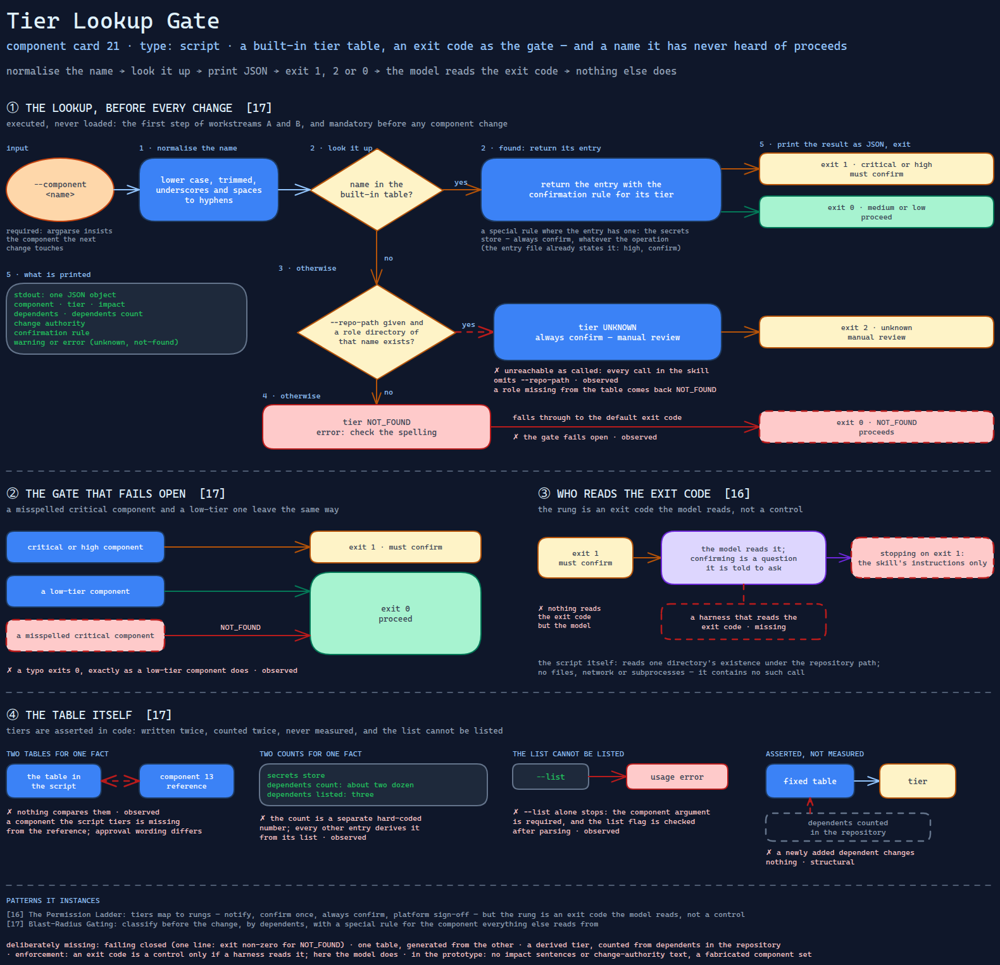

# Tier Lookup Gate

> A script that looks a component up in a built-in tier table before any change and
> signals "confirm" through its exit code — and signals "proceed" for a name it has
> never heard of.

Source: [`21-tier-lookup-gate.excalidraw`](../../../../diagrams/component-cards/workstream-hardening-orchestrator/21-tier-lookup-gate.excalidraw).

## What it is

A standard-library Python script the hardening orchestrator
([component 08](../08-workstream-hardening-orchestrator.md)) runs before every proposed
change. It carries its own table of cluster components — under twenty, each with a tier
(critical, high, medium, low), an impact sentence, a dependents list and a change
authority — looks one name up, prints the entry as JSON, and exits with a code meant to
gate the next step. It is the code twin of the component tier table
([component 13](../references/13-component-tier-table.md)), and the concrete form of
[card 17](../../../../cards/17-blast-radius-gating.md)'s "check before the change".

## Trigger and routing

Executed, never loaded. The skill's entry file calls it as the first step of workstreams
A and B, lists it in its scripts table, and repeats it in a quick-reference row marked
"always run before changes". Its safety section makes the check mandatory before any
component change. The entry file also states the expected result for the secrets store
in advance — high, confirm — so the call confirms what the text already says.

## Inputs

| Input | Required | Where it comes from |
|---|---|---|
| `--component <name>` | yes, always — argparse requires it | the component the next change touches |
| `--repo-path <path>` | no | the operated repository; the skill's own calls never pass it |
| `--list` | no | prints the table; unreachable without `--component` (see below) |

## Procedure

1. Normalise the name: lower case, trimmed, underscores and spaces to hyphens.
2. If the name is in the built-in table, return its entry with the confirmation rule for
   its tier, and a special rule where the entry has one — the secrets store's "always
   confirm, whatever the operation".
3. Otherwise, if a repository path was given and a role directory of that name exists,
   return tier `UNKNOWN` with "always confirm — manual review".
4. Otherwise return tier `NOT_FOUND` with an error asking to check the spelling.
5. Print the result as JSON and exit: **1** for critical or high ("must confirm"),
   **2** for unknown ("manual review"), **0** for everything else.

## Tools and permissions

| Tool or verb | Allowed | Enforced by |
|---|---|---|
| Read one directory's existence under the repository path | yes | the script |
| Files, network, subprocesses | no | the script — it contains no such call |
| Stopping the change on exit 1 | required | the skill's instructions only; nothing reads the exit code but the model |

## Outputs

One JSON object on stdout: component, tier, impact, dependents, a dependents count,
change authority, the confirmation rule, and a warning or error for unknown and
not-found names. The exit code is the signal; the confirmation itself is a question the
model is told to ask.

## Failure modes

| Failure | Symptom | Root cause |
|---|---|---|
| A typo proceeds | Looking up a misspelled critical component exits 0, exactly as a low-tier component does | `NOT_FOUND` falls through to the default exit code. The gate fails open. Observed |
| "Unknown" is unreachable as called | A role missing from the table also comes back `NOT_FOUND`, exit 0 | `UNKNOWN` needs `--repo-path`, and every call in the skill omits it. Observed |
| The list cannot be listed | `--list` alone stops with a usage error | The component argument is declared required, and the list flag is checked after parsing. Observed |
| Two counts for one fact | The secrets store reports about two dozen dependents and lists three | The count is a separate hard-coded number; every other entry derives it from the list. Observed |
| Two tables for one fact | A component the script tiers is missing from the reference, and the approval wording differs between them | The table is written here and again in [component 13](../references/13-component-tier-table.md), and nothing compares them. Observed |
| Tiers are asserted, not measured | A newly added dependent changes nothing | Tier comes from a fixed table, not from counting dependents in the repository. Structural |

## Patterns it instances

| Card | Where it shows up in this component |
|---|---|
| [16 The Permission Ladder](../../../../cards/16-the-permission-ladder.md) | Tiers map to rungs — notify, confirm once, always confirm, platform sign-off — but the rung is an exit code the model reads, not a control |
| [17 Blast-Radius Gating](../../../../cards/17-blast-radius-gating.md) | Classify before the change, by dependents, with a special rule for the component everything else reads from |

## Provenance

Instanced in the source system by one standard-library Python script of about 225 lines
in the skill's scripts directory: a dictionary of under twenty components, a tier-to-rule
mapping, a lookup function and a command-line entry point. Its table was carried over
from the operated repository's own dependency analysis. Nothing in it records how often
it ran or what it returned; this card claims neither.

## Prototype

Minimal runnable prototype in
[`../../../../skeletons/components/21-tier-lookup-gate/`](../../../../skeletons/components/21-tier-lookup-gate/).
Standard library, offline. It reimplements the exit-code contract over a fabricated tier
table and runs a set of lookups — a typo among them — to show which would proceed.

## What is deliberately missing

**Failing closed.** A name the gate does not know should stop the change, not pass it.
One line: exit non-zero for `NOT_FOUND`.

**One table.** The reference and the script describe the same tiers; either one should
be generated from the other.

**A derived tier.** Counting dependents in the repository — the role and chart
references [card 17](../../../../cards/17-blast-radius-gating.md) describes — would keep
tiers true as the platform changes.

**Enforcement.** An exit code is a control only if a harness reads it. Here the model
does.

**In the prototype:** no impact sentences or change-authority text, and a fabricated
component set.
