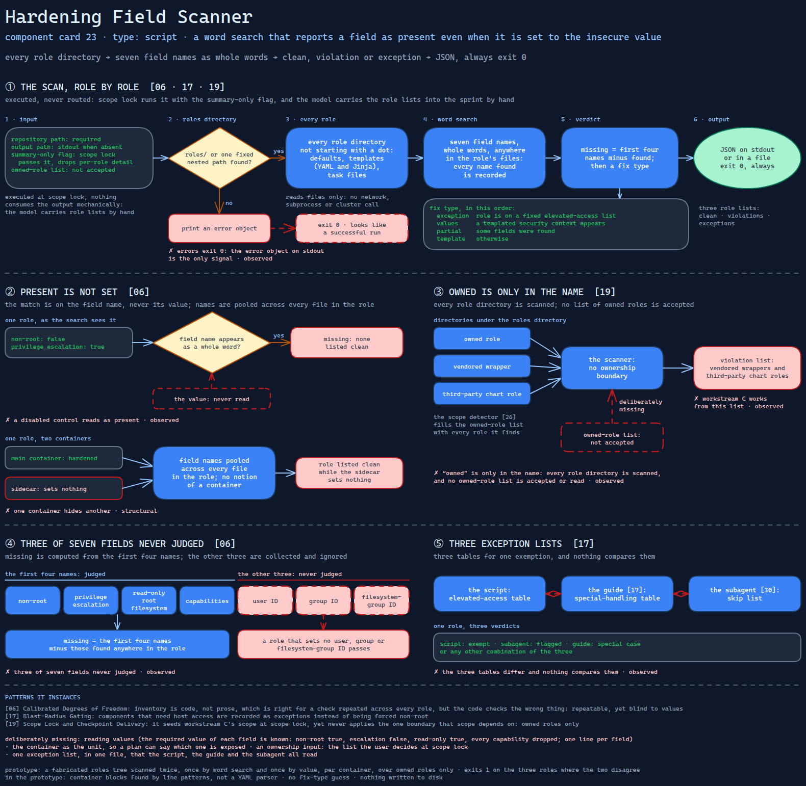

# Hardening Field Scanner

> The orchestrator's inventory of container-hardening gaps: a word search over each
> role's files that reports a field as present even when it is set to the insecure value.

Source: [`23-hardening-field-scanner.excalidraw`](../../../../diagrams/component-cards/workstream-hardening-orchestrator/23-hardening-field-scanner.excalidraw).

## What it is

A standard-library Python script that the orchestrator
([component 08](../08-workstream-hardening-orchestrator.md)) runs at scope lock to seed
workstream C, admission-policy remediation on owned roles. It walks every role
directory in the infrastructure repository and reads each role's defaults, templates
and task files. It records which container security-context field names appear
anywhere in them, then marks each role clean, in violation, or an elevated-access
exception, and guesses whether the fix belongs in Helm values or in a template. It is
the code form of the remediation guide's first step
([component 17](../references/17-owned-scope-policy-remediation.md)). The scan
subagent ([component 30](../../../subagents/30-parallel-gap-scan-subagent.md)) does
the same job a second time, in prose.

## Trigger and routing

It is executed, not routed. In the scope-lock phase the entry file runs it with a
summary-only flag, and the scripts table lists it as workstream C's input. Nothing
consumes its output mechanically: the model carries the role lists into the sprint
by hand. The repository scope detector
([component 26](26-repo-scope-detector.md)) separately fills the owned-role list with
every role it finds.

## Inputs

| Input | Required | Where it comes from |
|---|---|---|
| Repository path | yes | scope lock |
| Output path | no | stdout when absent |
| Summary-only flag | no | the scope-lock phase passes it and drops the per-role detail |
| Owned-role list | — | not accepted; the script has no such input |

## Procedure

1. Find the roles directory: `roles/` at the repository root, else one fixed nested
   path from the source repository's layout. If neither exists, print an error object.
2. For every role directory not starting with a dot, collect the defaults, the
   templates (YAML and Jinja) and the task files.
3. Search each file for seven security-context field names as whole words. Record
   every name found anywhere in the role.
4. Compute *missing* as the first four names minus those found: non-root,
   privilege escalation, read-only root filesystem and capabilities. The other three
   (user, group and filesystem-group IDs) are collected and never judged.
5. Choose a fix type: *exception* if the role is on a fixed elevated-access list,
   *values* if a templated security context appears, *partial* if some fields were
   found, otherwise *template*.
6. Summarise totals and three role lists (clean, violations, exceptions). Print the
   JSON, or write it to the output path.

## Tools and permissions

| Tool or verb | Allowed | Enforced by |
|---|---|---|
| Read files under the roles directory | yes | the script |
| Write one JSON file | only when an output path is given | the script |
| Network, subprocesses, cluster | no | the script — it contains no such call |
| Which roles it judges | every role directory | nothing — the code has no ownership boundary |

## Outputs

JSON on stdout or in a file. It holds summary counts, the clean, violation and
exception lists and, without the summary flag, a per-role record: fields found,
fields missing, files checked and fix type. The script exits 0 in every case,
including when no roles directory exists; the error object on stdout is the only
signal.

## Failure modes

| Failure | Symptom | Root cause |
|---|---|---|
| A disabled control reads as present | A role that sets non-root to `false` and privilege escalation to `true` is listed clean | The match is on the field name, never its value. Observed |
| One container hides another | A role whose main container is hardened and whose sidecar sets nothing is listed clean | Field names are pooled across every file in the role, and the script has no notion of a container. Structural |
| "Owned" is only in the name | Vendored wrappers and third-party chart roles appear in the violation list workstream C works from | Every role directory is scanned, and no list of owned roles is accepted or read. Observed |
| Three of seven fields never judged | A role that sets no user, group or filesystem-group ID passes | *Missing* is computed from the first four names; the other three are collected and ignored. Observed |
| Three exception lists | A role is exempt here, flagged by the subagent and called a special case by the guide, or any other combination | The script's elevated-access table, the guide's special-handling table and the subagent's skip list differ, and nothing compares them. Observed |
| Errors exit 0 | A missing roles directory looks like a successful run to anything checking the exit code | The error is a JSON object on stdout, and the script always exits 0. Observed |

## Patterns it instances

| Card | Where it shows up in this component |
|---|---|
| [06 Calibrated Degrees of Freedom](../../../../cards/06-calibrated-degrees-of-freedom.md) | Inventory is code, not prose. That is the right call for a check repeated across every role, but the code checks the wrong thing: deterministic and repeatable, yet blind to values |
| [17 Blast-Radius Gating](../../../../cards/17-blast-radius-gating.md) | Components that need host access are recorded as exceptions instead of being forced non-root, so the change is fitted to what the component can survive |
| [19 Scope Lock and Checkpoint Delivery](../../../../cards/19-scope-lock-and-checkpoint-delivery.md) | It seeds workstream C's scope at scope lock, yet never applies the one boundary that scope depends on: owned roles only |

## Provenance

The source system held this as one standard-library Python script of about 170
lines in the skill's scripts directory. It contains a four-entry elevated-access
table, a seven-name field list, a per-role scan, a repository summary and a
command-line entry point. Nothing records how many roles it scanned in a real
repository, or whether any violation it reported was fixed; this card claims none
of that.

## Prototype

Minimal runnable prototype in
[`../../../../skeletons/components/23-hardening-field-scanner/`](../../../../skeletons/components/23-hardening-field-scanner/).
Standard library, offline. It scans a fabricated roles tree twice, once with the
component's word search and once by value, per container and over owned roles only.
It exits 1 on the three roles where the two disagree.

## What is deliberately missing

**Reading values.** The required value of each field is known: non-root true,
escalation false, read-only true, every capability dropped. Checking it is a
one-line change per field, and the source did not make it.

**The container as the unit.** A role can hold several containers. A per-role
verdict cannot say which one is exposed, and a remediation plan needs exactly that.

**An ownership input.** Workstream C's boundary is a list the user decides at scope
lock. The script should take that list, not scan every directory.

**One exception list.** The elevated-access exceptions belong in one file that the
script, the guide and the subagent all read.

**In the prototype:** container blocks are found with line patterns rather than a
YAML parser, there is no fix-type guess, and nothing is written to disk.
