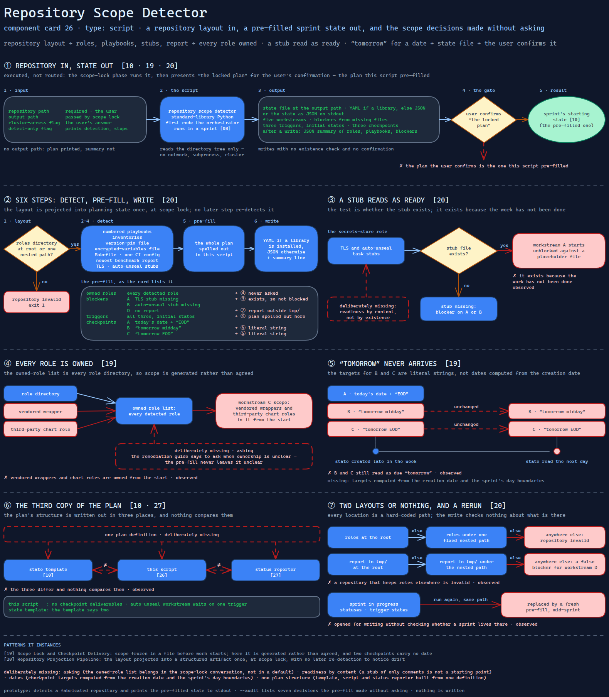

# Repository Scope Detector

> Reads a repository's layout and pre-fills the sprint's state file, marking every
> role as owned, treating a stub file as readiness and writing "tomorrow" in place
> of a date.

Source: [`26-repo-scope-detector.excalidraw`](../../../../diagrams/component-cards/workstream-hardening-orchestrator/26-repo-scope-detector.excalidraw).

## What it is

A standard-library Python script, the first code the orchestrator
([component 08](../08-workstream-hardening-orchestrator.md)) runs in a sprint. It
inspects the infrastructure repository's directory structure: roles, numbered phase
playbooks, inventories, a version-pin file, an encrypted-variables file, a Makefile,
a CI configuration, the newest benchmark report, and two secrets-store task stubs.
From what it finds, it generates the sprint's starting state
([component 10](../assets/10-sprint-state-file.md)): five workstreams with blockers
derived from missing files, three triggers in their initial states and three
checkpoints. It is a projection of a repository into planning state, the shape of
[card 20](../../../../cards/20-repository-projection-pipeline.md) applied at scope lock.

## Trigger and routing

It is executed, not routed. The scope-lock phase runs it with the cluster-access
flag and an output path. The entry file then presents "the locked plan" for the
user's confirmation, which is the phase's gate. The plan the user confirms is the
one this script pre-filled.

## Inputs

| Input | Required | Where it comes from |
|---|---|---|
| Repository path | yes | the user, at scope lock |
| Output path | no | the scope-lock phase passes one; without it the state goes to stdout |
| Cluster-access flag | no | the user's answer to "do you have cluster access?" |
| Detect-only flag | no | prints the detection and stops |

## Procedure

1. Find the roles directory at the root, else under one fixed nested path from the
   source repository's layout. Without one, report the repository invalid and exit 1.
2. List the numbered playbooks: YAML files whose names start with two digits, at the
   root or under that nested path.
3. List the inventories. By fixed glob, find a version-pin file and an
   encrypted-variables file. Note whether a Makefile and one named CI configuration
   file exist. Take the newest benchmark report from a `tmp/` directory in either
   layout.
4. Record whether the TLS and auto-unseal task stubs exist in the secrets-store role.
5. Pre-fill the state:
   - Owned roles: every detected role.
   - Blockers: workstream A if the TLS stub is missing, B if the auto-unseal stub is
     missing, D if there is no report.
   - Triggers: all three in their initial states.
   - Checkpoint targets: A is today's date plus "EOD"; B and C are the strings
     "tomorrow midday" and "tomorrow EOD".
6. Write the state to the output path, as YAML if a library is installed and as JSON
   otherwise. Print a one-line summary of roles, playbooks and blockers.

## Tools and permissions

| Tool or verb | Allowed | Enforced by |
|---|---|---|
| Read the repository's directory tree | yes | the script |
| Write the state file | yes, overwriting whatever is at the path | nothing — no existence check, no confirmation |
| Network, subprocesses, cluster | no | the script — it contains no such call |
| Deciding which roles are in scope | yes, all of them | nothing — the decision is pre-filled |

## Outputs

The sprint state file at the given path, or the state as JSON on stdout. A JSON
summary line follows a write. With the detect-only flag it prints the raw detection
and exits 1 if the repository is invalid. Without an output path the plan is printed
and the summary is not.

## Failure modes

| Failure | Symptom | Root cause |
|---|---|---|
| Everything is owned | Vendored wrappers and third-party chart roles are in workstream C's scope from the start | The owned-role list is pre-filled with every role directory. The remediation guide says to ask the user when a role's ownership is unclear; the pre-fill never leaves it unclear. Observed |
| A stub reads as ready | Workstream A starts unblocked against a placeholder file | The blocker test is whether the stub *exists*, and it exists because the work has not been done. Observed |
| "Tomorrow" never arrives | A state created late in the week, or read the next day, still shows checkpoints B and C as due "tomorrow" | The targets are literal strings, not dates computed from the creation date. Observed |
| The third copy of the plan | The pre-filled state has no checkpoint deliverables, and its auto-unseal workstream waits on one trigger where the template says two | The structure is written out here, in the state template ([component 10](../assets/10-sprint-state-file.md)) and in the status reporter ([component 27](27-sprint-state-reporter.md)). The three differ and nothing compares them. Observed |
| Two layouts or nothing | A repository that keeps roles elsewhere is invalid, and a report outside `tmp/` gives workstream D a false blocker | Every location is a hard-coded path, either at the root or under one nested path copied from the source repository. Observed |
| A rerun overwrites the sprint | Running scope lock again with the same output path replaces the state mid-sprint, statuses and trigger states included | The output is opened for writing without checking whether a sprint already lives there. Observed |

## Patterns it instances

| Card | Where it shows up in this component |
|---|---|
| [19 Scope Lock and Checkpoint Delivery](../../../../cards/19-scope-lock-and-checkpoint-delivery.md) | Scope frozen in a file before work starts, with named checkpoints. Here the scope is generated rather than agreed, and two checkpoints carry no date |
| [20 Repository Projection Pipeline](../../../../cards/20-repository-projection-pipeline.md) | The repository's layout projected into a structured artifact once, at scope lock, with no later re-detection to notice drift |

## Provenance

The source system held this as one standard-library Python script of about 270
lines in the skill's scripts directory. It has a detection function, a pre-fill
function that spells out the whole plan structure, and a command-line entry point.
Its directory names and file globs are the source repository's own, generalized
here. Nothing records which repositories it ran against or what state it produced,
and this card claims neither.

## Prototype

Minimal runnable prototype in
[`../../../../skeletons/components/26-repo-scope-detector/`](../../../../skeletons/components/26-repo-scope-detector/).
Standard library, offline. It detects a fabricated repository and prints the
pre-filled state to stdout. With `--audit` it lists seven decisions the pre-fill
made without asking, against an ownership file and a copy of the state template.

## What is deliberately missing

**Asking.** The owned-role list is the one scope decision workstream C rests on, and
it belongs in the scope-lock conversation, not in a default.

**Readiness by content.** A stub holding only comments is not a starting point.
Judging a file by whether it has tasks, not whether it exists, is a few lines.

**Dates.** The checkpoint targets should be computed from the creation date and the
sprint's day boundaries.

**One plan structure.** The template, this script and the status reporter should
build the state from one definition, so a field added in one place cannot go missing
in the other two.

**In the prototype:** the state goes to stdout and is never written, and the Makefile
and CI checks are left out because they feed no blocker.
