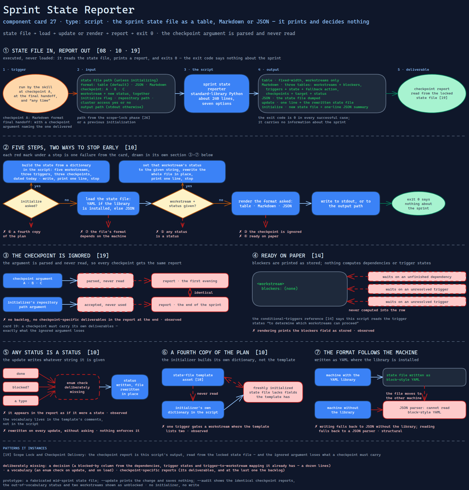

# Sprint State Reporter

> The script behind every checkpoint report: it prints the sprint state file as a table,
> Markdown or JSON — and decides nothing, though the skill's own reference says it does.

Source: [`27-sprint-state-reporter.excalidraw`](../../../../diagrams/component-cards/workstream-hardening-orchestrator/27-sprint-state-reporter.excalidraw).

## What it is

A standard-library Python script the hardening orchestrator
([component 08](../08-workstream-hardening-orchestrator.md)) runs to show where a sprint
stands. It reads the sprint state file ([component 10](../assets/10-sprint-state-file.md)),
renders its workstreams, triggers and checkpoints, and can create a fresh state file or
change one workstream's status. It is the delivery half of
[card 19](../../../../cards/19-scope-lock-and-checkpoint-delivery.md): the scope is locked in
the state file, and this is what turns that file into a report at each checkpoint.

## Trigger and routing

Executed, never loaded. The skill's entry file runs it at checkpoint A with a Markdown
format, at the final handoff with a checkpoint argument naming the checkpoint being
delivered, and lists it in its quick-reference table as usable "any time". The
state-file template names its initializer as the way to create a new file. The
conditional-triggers reference ([component 14](../references/14-conditional-sprint-triggers.md))
says this script reads the trigger states "to determine which workstreams can proceed".

## Inputs

| Input | Required | Where it comes from |
|---|---|---|
| Path to the sprint state file | yes, except when initializing | the scope-lock phase ([component 26](26-repo-scope-detector.md)) or a previous initialization |
| Format: table, JSON or Markdown | no; table by default | the calling phase |
| Checkpoint: A, B or C | no | the final handoff phase |
| Workstream and new status | no; together | the model, after a workstream moves |
| Initialize flag, repository path, cluster access yes or no | no | the scope-lock phase |
| Output path | no | the calling phase; stdout otherwise |

## Procedure

1. **Initialize**, if asked: build a state structure from a dictionary in the script's own
   code — five workstreams, three triggers, three checkpoints, dated today — write it to
   the output path or a default file name in the current directory, print a one-line
   summary, and stop.
2. **Load** the state file: as YAML if the YAML library is installed, otherwise as JSON.
3. **Update**, if a workstream and a status were given: set that workstream's status to the
   given string, rewrite the whole file in place, print one line, and stop.
4. **Render** in the requested format. JSON dumps the file. Markdown prints three tables —
   workstreams with their blockers, triggers with their state and fallback action,
   checkpoints with their target and status. The table format prints the workstreams only.
5. Print to stdout, or write the output path. Exit 0.

## Tools and permissions

| Tool or verb | Allowed | Enforced by |
|---|---|---|
| Read the state file | yes | the script |
| Rewrite the state file in place | yes, on every update, without asking | nothing — the skill's confirmation model covers changes to components, not its own state |
| Write a new state file or a report | yes, to any path given | the script |
| Network, cluster, subprocesses | no | the script — it contains no such call |

## Outputs

A report on stdout or at the output path: a fixed-width table, three Markdown tables, or
the state as JSON. On update, one line and a rewritten state file. On initialization, a
new state file and a one-line JSON summary. The exit code is 0 in every successful case;
it carries no information about the sprint.

## Failure modes

Every row is read directly off the script, or follows from its design.

| Failure | Symptom | Root cause |
|---|---|---|
| The checkpoint is ignored | The report delivered at the end of the sprint is identical to the one delivered on its first evening; no backlog, no checkpoint-specific deliverables | The checkpoint argument is parsed and never read. The initializer's repository-path argument is the same: accepted, never used. Observed |
| Any status is a status | A workstream recorded as `done`, `blocked?` or a typo appears in the report as if it were a state | The update writes whatever string it is given; the documented vocabulary is in the template's comments, not in the script. Observed |
| Ready on paper | The report shows a workstream with no blockers while it waits on an unfinished dependency and on two unresolved triggers | Rendering prints the `blockers` field as stored. Nothing computes dependencies or trigger states, though the triggers reference says this script uses them to decide what may proceed. Observed |
| A fourth copy of the plan | A freshly initialized state file lacks fields the template has, and lists one trigger as gating a workstream where the template lists two | The initializer builds the structure from its own dictionary instead of reading the template asset. [Component 10](../assets/10-sprint-state-file.md) traces the copies. Observed |
| The file's format depends on the machine | A state file written where the YAML library is installed cannot be loaded where it is not | Writing falls back to JSON without YAML; reading falls back to a JSON parser, which cannot read block-style YAML. Structural |

## Patterns it instances

| Card | Where it shows up in this component |
|---|---|
| [19 Scope Lock and Checkpoint Delivery](../../../../cards/19-scope-lock-and-checkpoint-delivery.md) | The checkpoint report is this script's output, read from the locked state file — and the card's point that a checkpoint must carry its own deliverables is exactly what the ignored argument loses |

## Provenance

Instanced in the source system by one standard-library Python script of about 240 lines
in the hardening skill's scripts directory: an initializer with an inline copy of the
state structure, YAML-or-JSON load and save helpers, a formatter with three output
shapes, and a command line with seven options. Nothing in the component records how many
reports it produced or whether one was delivered at a checkpoint; this card claims none
of that.

## Prototype

Minimal runnable prototype in
[`../../../../skeletons/components/27-sprint-state-reporter/`](../../../../skeletons/components/27-sprint-state-reporter/).
Standard library, offline. It renders a fabricated mid-sprint state file, applies an
update in memory only, and with `--audit` shows the identical checkpoint reports, the
accepted out-of-vocabulary status, and two workstreams the report shows as unblocked.

## What is deliberately missing

**A decision.** The reporter has every input it needs to say which workstreams may
proceed — dependencies, trigger states, the trigger-to-workstream mapping — and prints
them side by side instead. Computing a blocked-by column is a dozen lines.

**A vocabulary.** An enum check on update, and on load, would have kept the state file
inside the states the triggers reference describes.

**Checkpoint-specific reports.** Filtering by checkpoint — its deliverables, and at the
last one the backlog — is what the argument promised.

**In the prototype:** no initializer and no write; `--update` prints the change and
saves nothing, so the fixture stays as committed.
