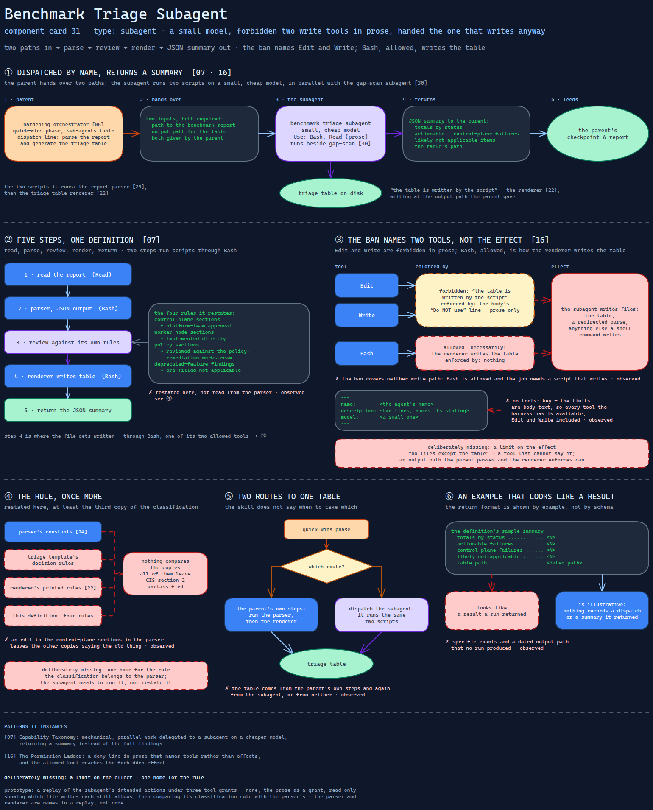

# Benchmark Triage Subagent

> A small-model worker that runs the benchmark parser and the triage renderer for the
> hardening orchestrator — forbidden two write tools, and handed the one that writes anyway.

Source: [`31-benchmark-triage-subagent.excalidraw`](../../diagrams/component-cards/subagents/31-benchmark-triage-subagent.excalidraw).

## What it is

A subagent definition bundled with the hardening orchestrator
([component 08](../skills/workstream-hardening-orchestrator/08-workstream-hardening-orchestrator.md)).
Given a CIS benchmark report, it runs the report parser
([component 24](../skills/workstream-hardening-orchestrator/scripts/24-benchmark-report-parser.md)),
reviews the classification, runs the triage renderer
([component 22](../skills/workstream-hardening-orchestrator/scripts/22-triage-table-renderer.md))
to write the triage table, and returns a summary of counts and the table's path. It runs
on a small, cheap model, in parallel with the gap-scan subagent
([component 30](30-parallel-gap-scan-subagent.md)).

## Trigger and routing

Dispatched by name from the skill's sub-agents table in the quick-wins phase, with an
example dispatch line: parse the report and generate the triage table. The same phase's
own steps for the benchmark workstream run the same two scripts directly, so the skill
describes two routes to one table and does not say when to take which. The description
names its sibling and no triggers, as an agent only its parent calls should.

## Inputs

| Input | Required | Where it comes from |
|---|---|---|
| Path to the benchmark report | yes | the parent |
| Output path for the triage table | yes | the parent |

## Procedure

1. Read the report.
2. Run the parser on it, with JSON output.
3. Review the findings against its own classification rules: control-plane sections need
   platform-team approval, worker-node sections can be implemented directly, policy
   sections are reviewed against the policy-remediation workstream, deprecated-feature
   findings are pre-filled as not applicable.
4. Run the renderer to write the triage table.
5. Return a JSON summary: totals by status, actionable and control-plane failures, likely
   not-applicable items, and the table's path.

## Tools and permissions

| Tool or verb | Allowed | Enforced by |
|---|---|---|
| Bash, Read | yes | the body's "Use" line — prose |
| Edit, Write | no, "the table is written by the script" | the body's "Do NOT use" line — prose only |
| Writing files through Bash | yes, necessarily — the renderer writes the table | nothing |
| Model | a small, cheap one | the frontmatter |

The ban names two tools and leaves the act. The parenthesis that justifies it says the
writing happens elsewhere — through Bash, which is allowed.

## Outputs

A triage table on disk, written by the renderer at the path the parent gave; a JSON
summary returned to the parent, which feeds the checkpoint A report.

## Failure modes

| Failure | Symptom | Root cause |
|---|---|---|
| The ban covers neither write path | The subagent writes files — the table, a redirected parse, anything else a shell command writes | Edit and Write are forbidden in prose; Bash is allowed, and the job requires a script that writes. Observed |
| No grant at all | Every tool the harness has is available, Edit and Write included | No `tools:` key in the frontmatter; the limits are body text. Bundled inside the skill's directory, like [component 30](30-parallel-gap-scan-subagent.md), where a harness does not discover subagents. Observed |
| The rule, once more | A change to the control-plane sections in the parser leaves this definition, the triage template and the renderer's printed rules saying the old thing | The classification rules are restated here — at least the third copy after the parser's constants and the triage template's decision rules — and nothing compares the copies. All of them leave CIS section 2 unclassified. Observed |
| Two routes to one table | The table is produced by the parent's own steps and again by the subagent, or by neither | The quick-wins phase lists the parser and renderer as its own steps and also dispatches this subagent to run them. Observed |
| An example that looks like a result | The definition's sample summary carries specific counts and a dated output path no run produced | The return format is shown by example, not by schema. Observed |

## Patterns it instances

| Card | Where it shows up in this component |
|---|---|
| [07 Capability Taxonomy](../../cards/07-capability-taxonomy.md) | Mechanical, parallel work delegated to a subagent on a cheaper model, returning a summary instead of the full findings |
| [16 The Permission Ladder](../../cards/16-the-permission-ladder.md) | A deny line in prose that names tools rather than effects — and the allowed tool reaches the forbidden effect |

## Provenance

Instanced in the source system by one Markdown subagent definition of about 50 lines:
frontmatter with a name, a two-line description and a small model, then a five-step task
with the two script invocations, a sample summary, four classification rules, and a
two-line tool section. It sat beside the gap-scan definition in an agents directory
inside the hardening skill. Its sample numbers are illustrative; nothing in the component
records a dispatch or a summary it returned, and this card claims none.

## Prototype

Minimal runnable prototype in
[`../../skeletons/components/31-benchmark-triage-subagent/`](../../skeletons/components/31-benchmark-triage-subagent/).
Standard library, offline. It replays a fabricated list of the subagent's intended actions
under three tool grants — none, the prose as a grant, read only — and shows which file
writes each still allows, then compares its classification rule with the parser's.

## What is deliberately missing

**A limit on the effect.** What the ban wants is "no files except the table". A tool list
cannot say that; an output path the parent passes and the renderer enforces can.

**One home for the rule.** The classification belongs to the parser. The subagent needs
to run it, not to restate it.

**In the prototype:** the parser and renderer are names in a replay, not code; their own
skeletons are components 24 and 22.
