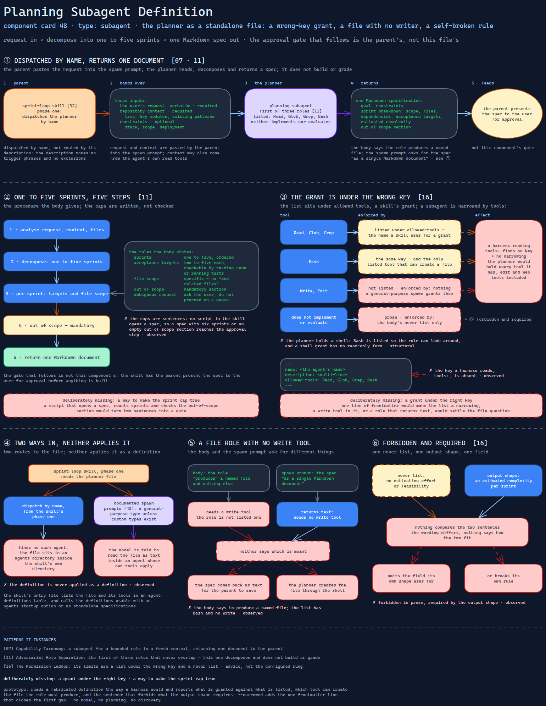

# Planning Subagent Definition

> The planner's role as a standalone subagent file — limited to read tools and a shell by a key no harness reads,
> told to produce a file none of them writes, and forbidden the estimate its own output shape asks for.

Source: [`48-planning-subagent-definition.excalidraw`](../../diagrams/component-cards/subagents/48-planning-subagent-definition.excalidraw).

## What it is

A subagent definition bundled with the sprint-loop skill
([component 32](../skills/role-separated-sprint-loop-orchestrator/32-role-separated-sprint-loop-orchestrator.md)).
It is the first of the loop's three roles: it expands a user request into a specification
of ordered sprints, each with a scope, a file list, dependencies and acceptance targets,
and it does not build or grade anything. It is the short, formal form of the planner role
reference ([component 40](../skills/role-separated-sprint-loop-orchestrator/references/40-planner-role-reference.md)), which carries the
longer rules and the spec template. In [card 07](../../cards/07-capability-taxonomy.md)'s
terms it is a subagent for a bounded role whose output the parent reads, not a step the
parent performs.

## Trigger and routing

Dispatched by name from the skill's phase one, not routed by its description. The
description says what it produces and that it neither implements nor evaluates; it names
no trigger phrases and no exclusions, which suits an agent only its parent calls. The
skill's entry file lists the file and its tools in an agent-definitions table and says the
definitions can be used with an agents startup option or as standalone specifications. The
documented spawn prompts
([component 42](../skills/role-separated-sprint-loop-orchestrator/references/42-role-spawn-prompt-set.md)) take a different route:
they say to use a general-purpose agent type unless the environment has custom types, so
the file is read as text the prompt points at, not applied as a definition. Compare the
same shape in [component 30](30-parallel-gap-scan-subagent.md).

## Inputs

| Input | Required | Where it comes from |
|---|---|---|
| The user's request, verbatim | yes | the parent, pasted into the spawn prompt |
| Repository context: tree, key modules, existing patterns | yes | the parent, or the agent's own read tools |
| Constraints: stack, scope, deployment | no | the parent, from the user |

## Procedure

1. Analyse the request, the repository context and the files it implies.
2. Decompose the work into one to five ordered sprints.
3. For each sprint, write two to five acceptance targets that can be checked by reading
   code or running tests, and a specific file scope — no "and related files".
4. State what is out of scope; the section is mandatory.
5. Return the specification as one Markdown document.

The gate that follows is not this component's: the skill has the parent present the spec to
the user for approval before anything is built. The definition says to ask the user when
the request is ambiguous and not to proceed on a guess.

## Tools and permissions

| Tool or verb | Allowed | Enforced by |
|---|---|---|
| Read, Glob, Grep | listed | an `allowed-tools` key — the name a skill uses for a grant |
| Bash | listed | the same key; and the only listed tool that can create a file |
| Write, Edit | not listed | nothing; a general-purpose spawn grants them |
| "Does not implement or evaluate" | prose | the body's never list only |
| Estimating effort or feasibility | forbidden in prose, required by the output shape | nothing — the two sentences are not compared |

The repository's own subagents rule names `tools:` as the narrowing key and
`allowed-tools` as the skill-side grant, two different mechanisms. This file carries the
second name in a subagent's place. A harness reading `tools:` finds no key and grants the
agent everything it has.

## Outputs

One Markdown specification: goal, constraints, a sprint breakdown with scope, files,
dependencies, acceptance targets and an estimated complexity, and an out-of-scope section.
The body says the role "produces" a named file and nothing else; the spawn prompt asks for
the spec "as a single Markdown document". The first needs a write tool the role is not
listed; the second does not. Neither says which is meant.

## Failure modes

| Failure | Symptom | Root cause |
|---|---|---|
| The grant is under the wrong key | A harness that discovered the file would apply no narrowing, and the planner would hold every tool, edit and web tools included | The tool list sits under `allowed-tools`, not `tools:`. Observed |
| The file is not where a harness looks, and the spawn path never applies it | Dispatch by name finds no such agent, or the model is told to read the file inside a general-purpose agent whose own tools apply | The definition sits in an agents directory inside the skill's own directory, and the documented prompts name a general-purpose type. Observed |
| A file role with no write tool | The spec is returned as text for the parent to save, or the planner creates the file through the shell | The body says to produce a named file; the list has Bash and no Write. Observed |
| The planner holds a shell | A role whose job is reading and writing prose can run any command | Bash is listed so the role can look around, and a shell grant has no read-only form. Structural |
| Forbidden and required | The planner either omits the field its own shape asks for or breaks its own rule | The never list rules out estimating effort; the output shape requires an estimated complexity per sprint. The wording differs and nothing says how. Observed |
| Caps are sentences | A spec with six sprints or an empty out-of-scope section reaches the approval step | The five-sprint cap and the mandatory section are sentences in the body, and no script in the skill opens a spec. Observed |

## Patterns it instances

| Card | Where it shows up in this component |
|---|---|
| [07 Capability Taxonomy](../../cards/07-capability-taxonomy.md) | A subagent for a bounded role in a fresh context, returning one document to the parent |
| [11 Adversarial Role Separation](../../cards/11-adversarial-role-separation.md) | The first of three roles that never overlap: this one decomposes and does not build or grade |
| [16 The Permission Ladder](../../cards/16-the-permission-ladder.md) | Its limits are a list under the wrong key and a never list — advice, not the configured rung |

## Provenance

Instanced in the source system by one Markdown subagent definition of about 50 lines:
frontmatter with a name, a multi-line description and a four-tool list, then sections for
its single responsibility, what it does and does not do, an output shape and a short list
of rules. It sat in an agents directory inside the skill's own directory, and repeats in
brief what a longer role reference in the skill's references directory says. The skill
describes dispatching it; nothing in the component records that it was dispatched, or what
it returned. This card claims neither.

## Prototype

Minimal runnable prototype in
[`../../skeletons/components/48-planning-subagent-definition/`](../../skeletons/components/48-planning-subagent-definition/).
Standard library, offline. It reads a fabricated definition the way a harness would and
reports what is granted against what is listed, which tool can create the file the role
must produce, and the sentence that forbids what the output shape requires;
`--narrowed` adds the one frontmatter line that closes the first gap.

## What is deliberately missing

**A grant under the right key.** One line of frontmatter would make the list a narrowing,
and a write tool in it — or a role that returns text — would settle the file question. The
source had neither.

**A way to make the sprint cap true.** A script that opens a spec and counts sprints and
checks the out-of-scope section would turn two sentences into a gate, which is the
arithmetic [card 11](../../cards/11-adversarial-role-separation.md) wants at the other end
of the loop.

**In the prototype:** no model, no planning and no discovery; the definition is parsed
directly, as if a harness had found it.
