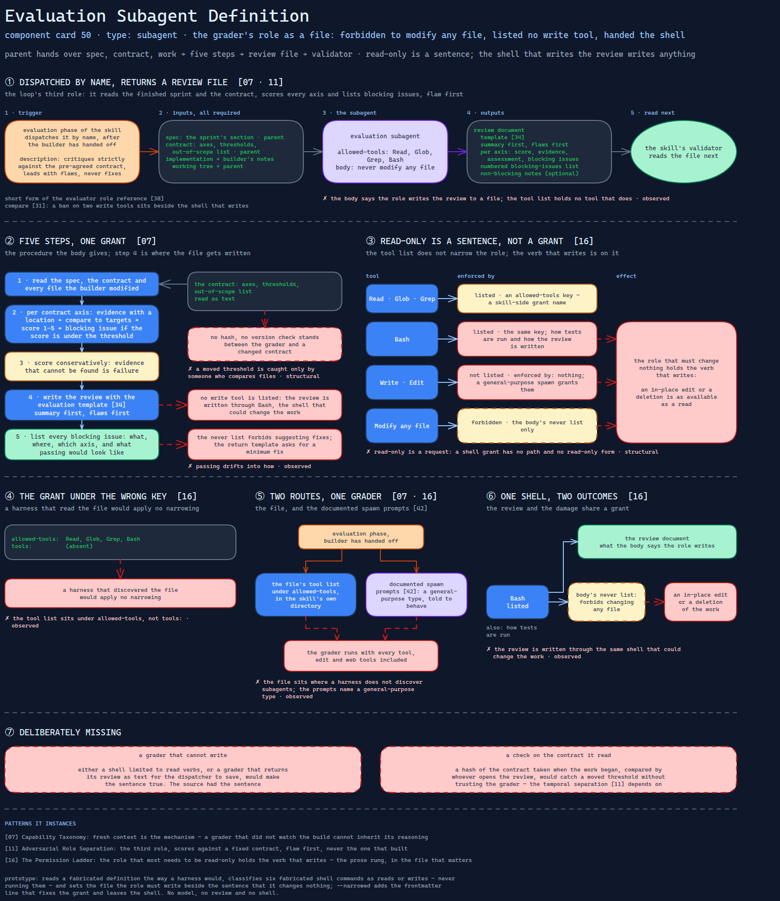

# Evaluation Subagent Definition

> The grader's role as a standalone subagent file — forbidden to modify any file, listed no write
> tool, and so handed the shell to write its review, which writes anything.

Source: [`50-evaluation-subagent-definition.excalidraw`](../../diagrams/component-cards/subagents/50-evaluation-subagent-definition.excalidraw).

## What it is

A subagent definition bundled with the sprint-loop skill
([component 32](../skills/role-separated-sprint-loop-orchestrator/32-role-separated-sprint-loop-orchestrator.md)).
It is the loop's third role and the one the others exist to serve: it reads the finished
sprint and the contract, scores every axis, and lists the blocking issues, flaw first. It
is the short form of the evaluator role reference
([component 38](../skills/role-separated-sprint-loop-orchestrator/references/38-evaluator-role-reference.md)). Its defining property is
a role that may look at everything and change nothing, which is the property its tool list
cannot give it.

## Trigger and routing

Dispatched by name from the skill's evaluation phase, after the builder has handed off. The
description says it critiques strictly against the pre-agreed contract, leads with flaws
and never suggests fixes; it names no trigger phrases and no exclusions. The skill's table
lists the file and its tools, and the documented spawn prompts
([component 42](../skills/role-separated-sprint-loop-orchestrator/references/42-role-spawn-prompt-set.md)) use a general-purpose agent
type, so the read-only role is, on that path, a general agent told to behave. Compare
[component 31](31-benchmark-triage-subagent.md), where a ban on two write tools sits beside
the shell that writes.

## Inputs

| Input | Required | Where it comes from |
|---|---|---|
| The sprint's section of the specification | yes | the parent |
| The contract: axes, thresholds, out-of-scope list | yes | the parent |
| The implementation and the builder's notes | yes | the working tree and the parent |

## Procedure

1. Read the specification, the contract and every file the builder modified.
2. For each contract axis: gather evidence with a location, compare it to the acceptance
   targets, assign a one-to-five score, and name the blocking issue if the score is under
   the threshold.
3. Score conservatively; treat evidence that cannot be found as failure.
4. Write the review with the evaluation template
   ([component 34](../skills/role-separated-sprint-loop-orchestrator/assets/34-axis-scored-evaluation-template.md)), summary first and
   flaws first.
5. List every blocking issue: what, where, which axis, and what passing would look like.

## Tools and permissions

| Tool or verb | Allowed | Enforced by |
|---|---|---|
| Read, Glob, Grep | listed | an `allowed-tools` key — a skill-side grant name |
| Bash | listed | the same key; it is how tests are run and how the review is written |
| Write, Edit | not listed | nothing; a general-purpose spawn grants them |
| Modifying any file in the repository | forbidden | the body's never list only |
| Suggesting code fixes | forbidden | the body only — and the return template asks for a minimum fix |
| Raising or lowering a threshold | forbidden | the body only |

## Outputs

A review document in the evaluation template's shape: a summary, one section per axis with
a score, evidence, assessment and blocking issues, a numbered blocking-issues summary and
optional non-blocking notes. The body says the role writes it to a file; it lists no tool
that does. The skill's validator reads the file next.

## Failure modes

| Failure | Symptom | Root cause |
|---|---|---|
| The grant is under the wrong key | A harness that discovered the file would apply no narrowing | The tool list sits under `allowed-tools`, not `tools:`. Observed |
| The spawn path never applies the file | The grader runs with every tool, edit and web tools included | The documented prompts name a general-purpose type; the file sits in the skill's own directory, where a harness does not discover subagents. Observed |
| Read-only is a request, and the shell writes | An in-place edit or a deletion is as available as a read | The body forbids changing any file; Bash is listed, and a shell grant has no path and no read-only form. Structural |
| The review has no tool of its own | The review is written through the same shell that could change the work | The body says to write the result to a file; the list has no write tool. Observed |
| Fix suggestions forbidden and asked for | A blocking issue says what passing looks like and drifts into how | The never list forbids suggesting fixes; the downstream return template asks for a minimum fix. Observed |
| Thresholds held by a sentence | A grader that moves a threshold is caught only by someone who compares files | The contract is read as text; no hash or version check stands between the grader and a changed file. Structural |

## Patterns it instances

| Card | Where it shows up in this component |
|---|---|
| [07 Capability Taxonomy](../../cards/07-capability-taxonomy.md) | Fresh context is the mechanism: a grader that did not watch the build cannot inherit its reasoning |
| [11 Adversarial Role Separation](../../cards/11-adversarial-role-separation.md) | The third role: scores against a fixed contract, flaw first, never the one that built |
| [16 The Permission Ladder](../../cards/16-the-permission-ladder.md) | The role that most needs to be read-only holds the verb that writes — the prose rung, in the file that matters |

## Provenance

Instanced in the source system by one Markdown subagent definition of about 60 lines:
frontmatter with a name, a multi-line description and a four-tool list, then sections for
its single responsibility, an anti-sycophancy mandate of five rules, an evaluation
protocol, scoring rules, a list of what it does not do, and an output shape. It sat in an
agents directory inside the skill's own directory, and repeats in brief what a longer role
reference says. Nothing in the component records how often it was dispatched or what it
returned. This card claims neither.

## Prototype

Minimal runnable prototype in
[`../../skeletons/components/50-evaluation-subagent-definition/`](../../skeletons/components/50-evaluation-subagent-definition/).
Standard library, offline. It reads a fabricated definition the way a harness would,
classifies six fabricated shell commands as reads or writes — never running them — and
sets the file the role must write beside the sentence that it changes nothing;
`--narrowed` adds the frontmatter line that fixes the grant and leaves the shell.

## What is deliberately missing

**A grader that cannot write.** Either a shell limited to read verbs, or a grader that
returns its review as text for the dispatcher to save, would make the sentence true. The
source had the sentence.

**A check on the contract it read.** A hash of the contract taken when the work began,
compared by whoever opens the review, would catch a moved threshold without trusting the
grader — the temporal separation [card 11](../../cards/11-adversarial-role-separation.md)
depends on.

**In the prototype:** no model, no review and no shell; the commands are classified and
never run.
